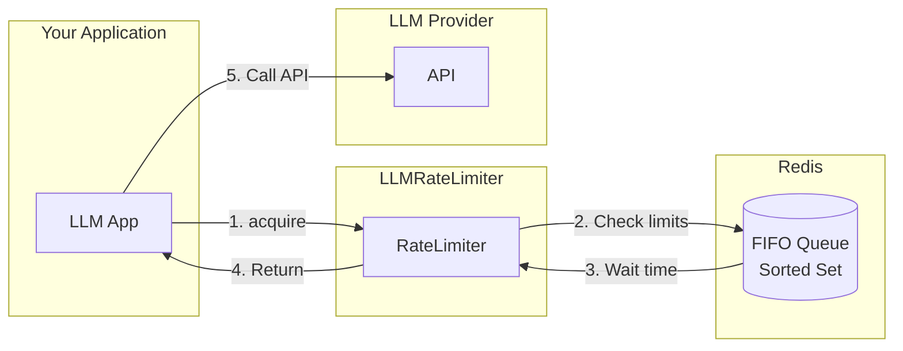

# LLMRateLimiter

[](https://img.shields.io/github/v/release/Ameyanagi/LLMRateLimiter)
[](https://github.com/Ameyanagi/LLMRateLimiter/actions/workflows/main.yml?query=branch%3Amain)
[](https://codecov.io/gh/Ameyanagi/LLMRateLimiter)
[](https://img.shields.io/github/license/Ameyanagi/LLMRateLimiter)

Client-side rate limiting for LLM API calls using Redis-backed FIFO queues.

- **Documentation**: <https://Ameyanagi.github.io/LLMRateLimiter/>
- **Repository**: <https://github.com/Ameyanagi/LLMRateLimiter/>

## Features

- **FIFO Queue-Based**: Fair ordering prevents thundering herd problems
- **Distributed**: Redis-backed for multi-process/multi-server deployments
- **Flexible Limits**: Supports combined TPM, split input/output TPM, or both
- **Automatic Retry**: Exponential backoff with jitter for Redis connection issues
- **Graceful Degradation**: Allows requests through on Redis failure

## How It Works



The rate limiter uses Redis sorted sets to maintain a FIFO queue of requests. Each request records its token consumption, and the Lua script atomically calculates when capacity will be available based on the sliding window.

## Installation

```bash
pip install llmratelimiter
```

Or with uv:

```bash
uv add llmratelimiter
```

## Quick Start

### Combined Mode (OpenAI/Anthropic)

For providers with a single tokens-per-minute limit:

```python
from redis.asyncio import Redis
from llmratelimiter import RateLimiter, RateLimitConfig

redis = Redis(host="localhost", port=6379)
config = RateLimitConfig(tpm=100_000, rpm=100)
limiter = RateLimiter(redis, "gpt-4", config)

# Acquire capacity before making API call
await limiter.acquire(tokens=5000)
response = await openai.chat.completions.create(...)
```

### Split Mode (GCP Vertex AI)

For providers with separate input/output token limits:

```python
config = RateLimitConfig(input_tpm=4_000_000, output_tpm=128_000, rpm=360)
limiter = RateLimiter(redis, "gemini-1.5-pro", config)

# Estimate output tokens upfront
result = await limiter.acquire(input_tokens=5000, output_tokens=2048)
response = await vertex_ai.generate(...)

# Adjust after getting actual output
await limiter.adjust(result.record_id, actual_output=response.output_tokens)
```

### With Connection Manager

For production use with automatic retry:

```python
from llmratelimiter import (
    RateLimiter, RateLimitConfig, RedisConnectionManager, RetryConfig
)

manager = RedisConnectionManager(
    host="localhost",
    port=6379,
    retry_config=RetryConfig(max_retries=3, base_delay=0.1),
)
config = RateLimitConfig(tpm=100_000, rpm=100)
limiter = RateLimiter(manager, "gpt-4", config)

await limiter.acquire(tokens=5000)
```

## Configuration Options

### RateLimitConfig

| Parameter | Description |
|-----------|-------------|
| `tpm` | Combined tokens-per-minute limit |
| `input_tpm` | Input tokens-per-minute limit |
| `output_tpm` | Output tokens-per-minute limit |
| `rpm` | Requests-per-minute limit |
| `window_seconds` | Sliding window size (default: 60) |
| `burst_multiplier` | Allow burst above limits (default: 1.0) |

### RetryConfig

| Parameter | Description |
|-----------|-------------|
| `max_retries` | Maximum retry attempts (default: 3) |
| `base_delay` | Initial delay in seconds (default: 0.1) |
| `max_delay` | Maximum delay cap (default: 5.0) |
| `exponential_base` | Backoff multiplier (default: 2.0) |
| `jitter` | Random variation 0-1 (default: 0.1) |

## License

MIT License - see [LICENSE](LICENSE) for details.
