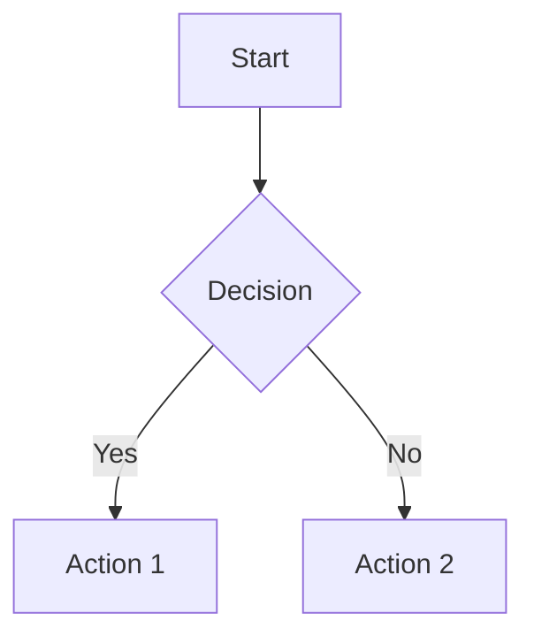

# AI Content Management Guide

This guide covers the AI-generated content detection and storage capabilities in the Agent Framework, including automatic content detection, storage, and management of AI-generated artifacts.

## Overview

The AI Content Management system automatically detects and stores various types of content generated by AI agents, including code blocks, charts, visualizations, HTML content, and structured data. This ensures that no generated content is lost and provides users with easy access to all AI-created artifacts.

## Key Components

### 1. GeneratedContentDetector

Detects various types of generated content in agent responses:

```python
from agent_framework.ai_content_management import GeneratedContentDetector

detector = GeneratedContentDetector()

# Detect content in agent response text
content_items = await detector.detect_generated_content(response_text)

# Extract content from structured output parts
structured_content = await detector.extract_structured_content(agent_output)
```

### 2. AIContentManager

Manages the lifecycle of AI-generated content:

```python
from agent_framework.ai_content_management import AIContentManager

# Initialize with file storage manager
ai_manager = AIContentManager(file_storage_manager)

# Process agent response and automatically store generated content
enhanced_output = await ai_manager.process_agent_response(
    agent_output, 
    session_id="session123", 
    user_id="user456"
)

# Manually store generated content
file_id = await ai_manager.store_generated_content(
    content="Generated code or text",
    content_type="text/plain",
    filename="generated_script.py",
    session_id="session123",
    user_id="user456"
)
```

## Supported Content Types

The system automatically detects and stores the following content types:

### 1. Code Blocks
```python
# Detects code blocks in various languages
"""
```python
def hello_world():
    print("Hello, World!")
```

```javascript
function greet(name) {
    console.log(`Hello, ${name}!`);
}
```
"""
```

### 2. HTML Content
```python
# Detects HTML content blocks
"""
```html
<div class="container">
    <h1>Generated Web Component</h1>
    <p>This is AI-generated HTML content.</p>
</div>
```
"""
```

### 3. Chart.js Configurations
```python
# Detects Chart.js chart configurations
"""
```json
{
    "type": "chartjs",
    "data": {
        "type": "bar",
        "data": {
            "labels": ["A", "B", "C"],
            "datasets": [{
                "data": [10, 20, 30]
            }]
        }
    }
}
```
"""
```

### 4. Mermaid Diagrams
```python
# Detects Mermaid diagram definitions
"""

"""
```

### 5. Structured Output Parts
- Forms and input components
- Data tables and lists
- Configuration files
- API responses and data structures

## Configuration

### Environment Variables

```bash
# AI content storage backends
AI_TEXT_STORAGE_BACKEND=local
AI_IMAGE_STORAGE_BACKEND=s3
AI_CHART_STORAGE_BACKEND=s3
AI_CODE_STORAGE_BACKEND=local

# Content detection settings
ENABLE_AI_CONTENT_DETECTION=true
AUTO_STORE_GENERATED_CONTENT=true

# File routing for generated content
FILE_ROUTING_RULES=ai-generated/text:local,ai-generated/image:s3
```

### Backend Separation

Generated content can be routed to different storage backends:

```python
from agent_framework.file_storages import FileStorageManager

# Configure routing for AI-generated content
def configure_ai_content_routing(manager: FileStorageManager):
    # Route different content types to appropriate backends
    manager.add_routing_rule("ai-generated/text", "local")
    manager.add_routing_rule("ai-generated/image", "s3")
    manager.add_routing_rule("ai-generated/chart", "s3")
    manager.add_routing_rule("ai-generated/code", "local")
```

## Usage Examples

### Automatic Content Detection

```python
import asyncio
from agent_framework.ai_content_management import AIContentManager
from agent_framework.file_storages import FileStorageFactory
from agent_framework.agent_interface import StructuredAgentOutput

async def automatic_content_management():
    # Setup
    storage_manager = await FileStorageFactory.create_storage_manager()
    ai_manager = AIContentManager(storage_manager)
    
    # Simulate agent response with generated content
    agent_output = StructuredAgentOutput(
        response_text="""
        Here's a Python script for you:
        
        ```python
        def calculate_fibonacci(n):
            if n <= 1:
                return n
            return calculate_fibonacci(n-1) + calculate_fibonacci(n-2)
        
        # Example usage
        print(calculate_fibonacci(10))
        ```
        
        And here's a chart configuration:
        
        ```json
        {
            "type": "chartjs",
            "data": {
                "type": "line",
                "data": {
                    "labels": ["Jan", "Feb", "Mar"],
                    "datasets": [{
                        "label": "Sales",
                        "data": [100, 150, 200]
                    }]
                }
            }
        }
        ```
        """
    )
    
    # Process and store generated content automatically
    enhanced_output = await ai_manager.process_agent_response(
        agent_output,
        session_id="demo_session",
        user_id="demo_user"
    )
    
    # The enhanced output now includes file references
    print("Generated content stored:")
    for part in enhanced_output.parts or []:
        if hasattr(part, 'file_id'):
            print(f"- {part.filename}: {part.file_id}")

asyncio.run(automatic_content_management())
```

### Manual Content Storage

```python
async def manual_content_storage():
    storage_manager = await FileStorageFactory.create_storage_manager()
    ai_manager = AIContentManager(storage_manager)
    
    # Store different types of generated content
    
    # Store generated code
    code_content = """
def process_data(data):
    return [item.upper() for item in data if item]
"""
    
    code_file_id = await ai_manager.store_generated_content(
        content=code_content,
        content_type="text/x-python",
        filename="data_processor.py",
        session_id="session123",
        user_id="user456",
        metadata={
            "generation_model": "gpt-4",
            "generation_prompt": "Create a data processing function",
            "content_category": "code"
        }
    )
    
    # Store generated HTML
    html_content = """
<div class="dashboard">
    <h2>Analytics Dashboard</h2>
    <div class="metrics">
        <div class="metric">
            <span class="value">1,234</span>
            <span class="label">Total Users</span>
        </div>
    </div>
</div>
"""
    
    html_file_id = await ai_manager.store_generated_content(
        content=html_content,
        content_type="text/html",
        filename="dashboard.html",
        session_id="session123",
        user_id="user456",
        metadata={
            "generation_model": "gpt-4",
            "content_category": "html_component"
        }
    )
    
    print(f"Code stored: {code_file_id}")
    print(f"HTML stored: {html_file_id}")
```

### Agent Integration

```python
from agent_framework import AgentInterface
from agent_framework.ai_content_management import AIContentManager

class ContentGeneratingAgent(AgentInterface):
    def __init__(self):
        self.ai_content_manager = None
    
    async def initialize(self):
        storage_manager = await FileStorageFactory.create_storage_manager()
        self.ai_content_manager = AIContentManager(storage_manager)
    
    async def handle_message(self, session_id: str, agent_input: StructuredAgentInput):
        # Generate response (this would typically use an LLM)
        response = StructuredAgentOutput(
            response_text="Here's the code you requested:\n\n```python\nprint('Hello, World!')\n```"
        )
        
        # Automatically detect and store generated content
        enhanced_response = await self.ai_content_manager.process_agent_response(
            response,
            session_id=session_id,
            user_id=agent_input.user_id or "anonymous"
        )
        
        return enhanced_response
```

## Content Detection Patterns

The system uses regex patterns to detect different content types:

### Code Block Detection
```python
# Detects code blocks with language specification
r'```(\w+)\s*\n(.*?)\n```'

# Examples:
# ```python\ncode here\n```
# ```javascript\ncode here\n```
# ```sql\ncode here\n```
```

### HTML Content Detection
```python
# Detects HTML code blocks
r'```html\s*\n(.*?)\n```'

# Example:
# ```html\n<div>content</div>\n```
```

### Chart.js Detection
```python
# Detects Chart.js configurations
r'```json\s*\n(.*?"type":\s*"chartjs".*?)\n```'

# Example:
# ```json\n{"type": "chartjs", "data": {...}}\n```
```

### Mermaid Diagram Detection
```python
# Detects Mermaid diagrams
r'```mermaid\s*\n(.*?)\n```'

# Example:
# ```mermaid\ngraph TD\nA --> B\n```
```

## Content Metadata

All stored AI-generated content includes comprehensive metadata:

```python
{
    # Basic file information
    "file_id": "uuid-generated-file",
    "filename": "generated_script.py",
    "mime_type": "text/x-python",
    "size_bytes": 1024,
    
    # AI generation tracking
    "is_generated": True,
    "generation_model": "gpt-4",
    "generation_prompt": "Create a data processing function",
    "generation_parameters": {
        "temperature": 0.7,
        "max_tokens": 1000
    },
    
    # Content classification
    "tags": ["ai-generated", "code", "python", "auto-stored"],
    "content_category": "code",
    "content_type": "function_definition",
    
    # Session and user tracking
    "user_id": "user123",
    "session_id": "session456",
    "created_at": "2024-01-15T10:30:00Z",
    
    # Storage information
    "storage_backend": "local",
    "storage_path": "/ai-generated/code/generated_script.py"
}
```

## Retrieval and Management

### Listing Generated Content

```python
async def list_generated_content(session_id: str, user_id: str):
    storage_manager = await FileStorageFactory.create_storage_manager()
    
    # Get all files for user/session
    files = await storage_manager.list_files(
        user_id=user_id,
        session_id=session_id
    )
    
    # Filter for AI-generated content
    generated_files = [
        file for file in files 
        if file.is_generated and "ai-generated" in file.tags
    ]
    
    # Group by content type
    by_type = {}
    for file in generated_files:
        content_type = file.custom_metadata.get("content_category", "unknown")
        if content_type not in by_type:
            by_type[content_type] = []
        by_type[content_type].append(file)
    
    return by_type
```

### Content Search

```python
async def search_generated_content(query: str, content_type: str = None):
    storage_manager = await FileStorageFactory.create_storage_manager()
    
    # Search by tags and metadata
    search_criteria = {
        "tags": ["ai-generated"],
        "is_generated": True
    }
    
    if content_type:
        search_criteria["content_category"] = content_type
    
    # This would be implemented in the storage manager
    results = await storage_manager.search_files(
        query=query,
        criteria=search_criteria
    )
    
    return results
```

## Performance Considerations

### Optimization Strategies

1. **Lazy Detection**: Only detect content when processing responses
2. **Batch Storage**: Store multiple content items in batches
3. **Caching**: Cache detection patterns and results
4. **Async Processing**: Process content detection asynchronously

### Resource Management

```python
from agent_framework.resource_manager import ResourceManager

# Configure limits for content processing
resource_manager = ResourceManager(
    max_concurrent_operations=10,
    max_memory_usage_mb=100
)

async def managed_content_processing(agent_output):
    async with resource_manager.acquire_processing_slot():
        return await ai_manager.process_agent_response(agent_output)
```

## Error Handling

### Common Error Scenarios

```python
async def robust_content_processing(agent_output, session_id, user_id):
    try:
        # Attempt full content processing
        return await ai_manager.process_agent_response(
            agent_output, session_id, user_id
        )
    except StorageError as e:
        # Handle storage failures gracefully
        logger.warning(f"Content storage failed: {e}")
        # Return original output without stored content
        return agent_output
    except Exception as e:
        # Handle unexpected errors
        logger.error(f"Content processing failed: {e}")
        return agent_output
```

### Graceful Degradation

```python
class RobustAIContentManager(AIContentManager):
    async def process_agent_response(self, agent_output, session_id, user_id):
        try:
            return await super().process_agent_response(
                agent_output, session_id, user_id
            )
        except Exception as e:
            # Log error but don't fail the response
            logger.warning(f"AI content management failed: {e}")
            
            # Add warning to response
            if agent_output.response_text:
                agent_output.response_text += "\n\n⚠️ Note: Generated content could not be automatically stored."
            
            return agent_output
```

## Integration with File Processing

AI content management integrates with the enhanced file processing system:

```python
from agent_framework.file_system_management import process_file_inputs

# The AI content manager is automatically used during file processing
# when agents generate responses that include content

async def enhanced_agent_workflow(agent_input, session_id, user_id):
    # Process input files
    processed_input, uploaded_files = await process_file_inputs(
        agent_input,
        file_storage_manager,
        user_id=user_id,
        session_id=session_id
    )
    
    # Generate agent response (would use LLM)
    agent_response = generate_response(processed_input)
    
    # AI content is automatically detected and stored
    # This happens transparently in the agent framework
    
    return agent_response
```

## Monitoring and Analytics

### Content Generation Statistics

```python
async def get_content_generation_stats(user_id: str, session_id: str = None):
    storage_manager = await FileStorageFactory.create_storage_manager()
    
    # Get all generated content
    criteria = {
        "user_id": user_id,
        "is_generated": True,
        "tags": ["ai-generated"]
    }
    
    if session_id:
        criteria["session_id"] = session_id
    
    files = await storage_manager.list_files(**criteria)
    
    # Calculate statistics
    stats = {
        "total_files": len(files),
        "total_size_bytes": sum(f.size_bytes for f in files),
        "by_type": {},
        "by_model": {},
        "creation_timeline": {}
    }
    
    for file in files:
        # Group by content type
        content_type = file.custom_metadata.get("content_category", "unknown")
        stats["by_type"][content_type] = stats["by_type"].get(content_type, 0) + 1
        
        # Group by model
        model = file.custom_metadata.get("generation_model", "unknown")
        stats["by_model"][model] = stats["by_model"].get(model, 0) + 1
        
        # Timeline
        date = file.created_at.date().isoformat()
        stats["creation_timeline"][date] = stats["creation_timeline"].get(date, 0) + 1
    
    return stats
```

## Best Practices

1. **Enable automatic detection** for comprehensive content capture
2. **Use appropriate storage backends** for different content types
3. **Include rich metadata** for better content organization
4. **Implement error handling** for graceful degradation
5. **Monitor storage usage** to manage costs and performance
6. **Tag content appropriately** for easy retrieval
7. **Consider privacy** when storing generated content
8. **Implement cleanup policies** for old or unused content

## Troubleshooting

### Common Issues

1. **Content not being detected**
   - Check that `ENABLE_AI_CONTENT_DETECTION=true`
   - Verify content matches detection patterns
   - Check agent response format

2. **Storage failures**
   - Verify storage backend configuration
   - Check file permissions and storage paths
   - Monitor storage space and limits

3. **Performance issues**
   - Implement resource limits
   - Use async processing
   - Consider batch operations

### Debug Mode

```python
import logging
logging.getLogger('agent_framework.ai_content_management').setLevel(logging.DEBUG)
```

## See Also

- [Multimodal Tools Guide](./MULTIMODAL_TOOLS_GUIDE.md)
- [Creating Agents Guide](./CREATING_AGENTS.md)
- [API Reference](./api-reference.md)
- [Agent Integration Examples](../examples/)