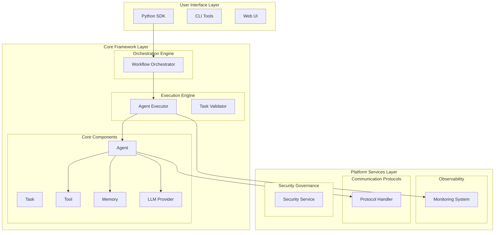

# AgenticX: Unified Multi-Agent Framework

<div align="center">
<!--  -->


<!-- [](https://www.python.org/downloads/) -->
[](https://opensource.org/licenses/Apache-2.0)
[](https://pypi.org/project/agenticx/)
[](https://pypi.org/project/agenticx/)
[](https://deepwiki.com/DemonDamon/AgenticX)

[Features](#-core-features) • [Quick Start](#-quick-start) • [Examples](#-complete-examples) • [Architecture](#️-technical-architecture) • [Progress](#-development-progress)

</div>

---

**🌍 Language / 语言**: [English](README.md) | [中文](README_ZN.md)

---

## 🎯 Vision

**AgenticX** aims to create a unified, scalable, production-ready multi-agent application development framework, empowering developers to build everything from simple automation assistants to complex collaborative intelligent agent systems.

## ✨ Core Features

### 🔧 Core Framework (Completed)
- **🤖 Agent Core**: Agent execution engine based on 12-Factor Agents methodology
- **🔗 Orchestration Engine**: Graph-based orchestration engine supporting complex workflows, conditional routing, and parallel execution
- **🛠️ Tool System**: Unified tool interface supporting function decorators, remote tools (MCP), and built-in toolsets
- **🧠 Memory System**: Deep integration with Mem0 for long-term memory, supporting arbitrary LLM models
- **💬 Communication Protocol**: A2A inter-agent communication, MCP resource access protocol
- **✅ Task Validation**: Pydantic-based output parsing and auto-repair

### 🔍 Enterprise-Grade Monitoring (Completed)
- **📊 Observability**: Complete callback system, real-time monitoring, trajectory analysis
- **📈 Performance Monitoring**: Real-time metrics collection, Prometheus integration, system monitoring
- **🔍 Trajectory Analysis**: Execution path tracing, failure analysis, performance bottleneck identification
- **📁 Data Export**: Multi-format export (JSON/CSV/Prometheus), time series analysis

### 🎛️ Developer Experience (Planned)
- **🖥️ CLI Tools**: Command-line tools for project creation, deployment, and monitoring
- **📱 Web UI**: Visual agent management and monitoring interface
- **🔌 IDE Integration**: VS Code extension, Jupyter kernel support

### 🔒 Enterprise Security (Planned)
- **🔐 Security Sandbox**: Secure code execution environment and resource isolation
- **👥 Multi-tenancy**: RBAC permission control, data isolation
- **✋ Human Approval**: Human-in-the-loop workflows, risk control

## 🚀 Quick Start

### Basic Installation

```bash
# Clone repository
git clone https://github.com/DemonDamon/AgenticX.git
cd AgenticX

# Install dependencies
pip install -r requirements.txt

# Set environment variables
export OPENAI_API_KEY="your-api-key"
```

> 📋 **Complete Installation Guide**: For system dependencies (antiword, tesseract) and advanced document processing features, see [INSTALL.md](INSTALL.md)

### Create Your First Agent

```python
from agenticx import Agent, Task, AgentExecutor
from agenticx.llms import OpenAIProvider

# Create agent
agent = Agent(
    id="data-analyst",
    name="Data Analyst",
    role="Data Analysis Expert", 
    goal="Help users analyze and understand data",
    organization_id="my-org"
)

# Create task
task = Task(
    id="analysis-task",
    description="Analyze sales data trends",
    expected_output="Detailed analysis report"
)

# Configure LLM
llm = OpenAIProvider(model="gpt-4")

# Execute task
executor = AgentExecutor(agent=agent, llm=llm)
result = executor.run(task)
print(result)
```

### Tool Usage Example

```python
from agenticx.tools import tool

@tool
def calculate_sum(x: int, y: int) -> int:
    """Calculate the sum of two numbers"""
    return x + y

@tool  
def search_web(query: str) -> str:
    """Search web information"""
    return f"Search results: {query}"

# Agents will automatically invoke these tools
```

## 📚 Complete Examples

We provide rich examples demonstrating various framework capabilities:

### 🤖 Agent Core (M5)

**Single Agent Example**
```bash
# Basic agent usage
python examples/m5_agent_demo.py
```
- Demonstrates basic agent creation and execution
- Tool invocation and error handling
- Event-driven execution flow

**Multi-Agent Collaboration**
```bash
# Multi-agent collaboration example
python examples/m5_multi_agent_demo.py
```
- Multi-agent collaboration patterns
- Task distribution and result aggregation
- Inter-agent communication

### 🔗 Orchestration & Validation (M6 & M7)

**Simple Workflow**
```bash
# Basic workflow orchestration
python examples/m6_m7_simple_demo.py
```
- Workflow creation and execution
- Task output parsing and validation
- Conditional routing and error handling

**Complex Workflow**
```bash
# Complex workflow orchestration
python examples/m6_m7_comprehensive_demo.py
```
- Complex workflow graph structures
- Parallel execution and conditional branching
- Complete lifecycle management

### 💬 Agent Communication (M8)

**A2A Protocol Demo**
```bash
# Inter-agent communication protocol
python examples/m8_a2a_demo.py
```
- Agent-to-Agent communication protocol
- Distributed agent systems
- Service discovery and skill invocation

### 📊 Observability Monitoring (M9)

**Complete Monitoring Demo**
```bash
# Observability module demo
python examples/m9_observability_demo.py
```
- Real-time performance monitoring
- Execution trajectory analysis
- Failure analysis and recovery recommendations
- Data export and report generation

### 🧠 Memory System

**Basic Memory Usage**
```bash
# Memory system example
python examples/memory_example.py
```
- Long-term memory storage and retrieval
- Context memory management

**Healthcare Scenario**
```bash
# Healthcare memory scenario
python examples/mem0_healthcare_example.py  
```
- Medical knowledge memory and application
- Personalized patient information management

### 👤 Human-in-the-Loop

**Human Intervention Flow**
```bash
# Human-in-the-loop example
python examples/human_in_the_loop_example.py
```
- Human approval workflows
- Human-machine collaboration patterns
- Risk control mechanisms

Detailed documentation: [examples/README_HITL.md](examples/README_HITL.md)

### 💬 LLM Integration

**Chatbot**
```bash
# LLM chat example
python examples/llm_chat_example.py
```
- Multi-model support demonstration
- Streaming response handling
- Cost control and monitoring

### 🔒 Security Sandbox

**Code Execution Sandbox**
```bash
# Micro-sandbox example
python examples/microsandbox_example.py
```
- Secure code execution environment
- Resource limits and isolation

Technical blog: [examples/microsandbox_blog.md](examples/microsandbox_blog.md)

## 🏗️ Technical Architecture



## 📈 Development Progress

### ✅ Completed Modules (M1-M9)

| Module | Status | Description |
|---------|--------|-------------|
| **M1** | ✅ | Core Abstraction Layer - Basic data structures like Agent, Task, Tool, Workflow |
| **M2** | ✅ | LLM Service Layer - Unified LLM interface based on LiteLLM, supporting 100+ models |
| **M3** | ✅ | Tool System - Function decorators, MCP remote tools, built-in toolsets |
| **M4** | ✅ | Memory System - Deep integration with Mem0, supporting custom LLM |
| **M5** | ✅ | Agent Core - Complete think-act loop, event-driven architecture |
| **M6** | ✅ | Task Validation - Pydantic-based output parsing and auto-repair |
| **M7** | ✅ | Orchestration Engine - Graph-based workflows, conditional routing, parallel execution |
| **M8** | ✅ | Communication Protocols - A2A agent communication, MCP resource access |
| **M9** | ✅ | Observability - Complete monitoring, trajectory analysis, performance metrics |

### 🔄 Planned Modules (M10-M13)

| Module | Status | Description |
|---------|--------|-------------|
| **M10** | 🚧 | Developer Experience - CLI, Web UI, IDE integration |
| **M11** | 🚧 | Enterprise Security - Multi-tenancy, RBAC, security sandbox |
| **M12** | 🚧 | Agent Evolution - Architecture search, knowledge distillation |
| **M13** | 🚧 | Knowledge Hub - Enterprise data connection, unified search |

## 🌟 Core Advantages

- **🎯 Unified Abstraction**: Clear and consistent core abstractions, avoiding conceptual confusion
- **🔌 Pluggable Architecture**: All components are replaceable, avoiding vendor lock-in
- **📊 Enterprise-Grade Monitoring**: Complete observability, production-ready
- **🛡️ Security First**: Built-in security mechanisms and multi-tenant support
- **🚀 High Performance**: Optimized execution engine and concurrent processing
- **📚 Rich Ecosystem**: Complete toolset and example library

## 🛠️ System Requirements

- **Python**: 3.10+
- **Memory**: 4GB+ RAM recommended
- **System**: Windows / Linux / macOS
- **Dependencies**: See `requirements.txt`

## 🤝 Contributing

We welcome community contributions! Please refer to:

1. Submit Issues to report bugs or request features
2. Fork the project and create feature branches
3. Submit Pull Requests, ensuring all tests pass
4. Participate in code reviews and discussions

## 📄 License

This project is licensed under the Apache License 2.0 - see [LICENSE](LICENSE) file for details

## ⭐ Star History

[](https://star-history.com/#DemonDamon/AgenticX&Date)

---

<div align="center">

**🌟 If AgenticX helps you, please give us a Star!**

[GitHub](https://github.com/DemonDamon/AgenticX) • [Documentation](coming-soon) • [Examples](examples/) • [Discussions](https://github.com/DemonDamon/AgenticX/discussions)

</div>