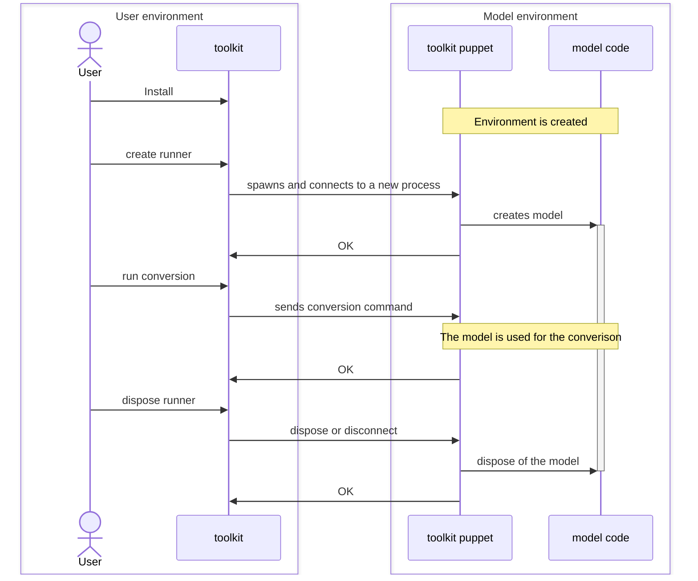

# Contribution guides

Install dev dependencies:

```sh
uv sync --group dev
```

This will install dependencies for:

- tests
- generating docs

## Build Documentation

Generate the docs:

```sh
mkdocs serve
```

## Architecture


