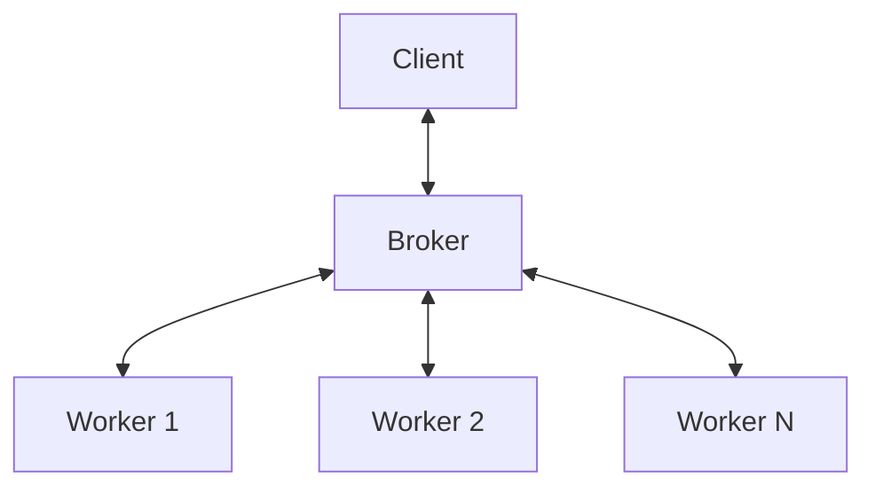

# ASE - Remote Procedure Call

A lightweight RPC framework for serving ASE (Atomic Simulation Environment) calculators over ZeroMQ.

This package is primarily designed to run MLIP calculators in dedicated python environments to handle dependency conflicts or for multi-GPU distribution.

## Quick Start

1. Start the broker:
```bash
aserpc broker
```

2. Check available calculators:
```bash
aserpc list
# or
aserpc list --registry tmp/registry.py:CALCULATORS
```

A registry file (or module via `pck.registry:CALCULATORS`) example:
```python
# tmp/registry.py
from ase.calculators.lj import LennardJones

# Registry: name -> calculator factory
CALCULATORS = {
    "LJ": LennardJones,
}
```

2. Start a worker:
```bash
aserpc worker LJ # optional --registry tmp/registry.py:CALCULATORS
```

3. Use the remote calculator:
```python
from aserpc import RemoteCalculator
from ase.build import molecule

water = molecule("H2O")
water.calc = RemoteCalculator("LJ")
energy = water.get_potential_energy()
```

## Calculator Discovery

Workers discover calculators through Python entry point providers. This allows packages to register calculators that `aserpc` can automatically find.

### Provider Functions

Register a provider function that returns calculator metadata:

```toml
# pyproject.toml
[project.entry-points."aserpc.calculators"]
mypackage = "mypackage.aserpc:get_calculators"
```

```python
# mypackage/aserpc.py
import importlib.util

def get_calculators() -> dict[str, dict]:
    """Return metadata for available calculators.

    Each entry is: {"factory": "module:class", "args": [...], "kwargs": {...}}
    Use importlib.util.find_spec() to check availability without importing.
    """
    calcs = {}

    # Simple calculators (always available with ASE)
    calcs["LJ"] = {"factory": "ase.calculators.lj:LennardJones"}
    calcs["EMT"] = {"factory": "ase.calculators.emt:EMT"}

    # Check if mace is installed (without importing torch!)
    if importlib.util.find_spec("mace") is not None:
        calcs["mace_mp"] = {
            "factory": "mace.calculators:mace_mp",
            "kwargs": {"model": "medium"},
        }

    # Check if chgnet is installed
    if importlib.util.find_spec("chgnet") is not None:
        calcs["chgnet"] = {"factory": "chgnet.model:CHGNetCalculator"}

    return calcs
```

After installing the package, the new calculators should show up on `aserpc list` and can be started as workers:

```bash
aserpc worker LJ
aserpc worker mace_mp
```

### Using a Registry File

Alternatively, specify a registry file with calculator factories:

```python
# registry.py
from ase.calculators.lj import LennardJones

CALCULATORS = {
    "LJ": LennardJones,
}
```

```bash
aserpc worker LJ --registry registry.py:CALCULATORS
```

### Listing Available Calculators

List all discoverable calculators:

```bash
# From entry points
aserpc list

# From a registry file
aserpc list --registry registry.py:CALCULATORS

# From a running broker
aserpc list --broker ipc:///tmp/aserpc/frontend.ipc
```

## Architecture



- **Broker**: Routes requests to available workers, handles load balancing
- **Worker**: Runs calculator computations, sends heartbeats
- **Client**: `RemoteCalculator` acts as a drop-in ASE calculator

## Configuration

Configuration can be set via environment variables or `pyproject.toml`. Environment variables take precedence.

### Environment Variables

| Variable | Default | Description |
|----------|---------|-------------|
| `ASERPC_IPC_DIR` | `.aserpc` (cwd) | Directory for IPC sockets |
| `ASERPC_IPC_FRONTEND` | `ipc://{IPC_DIR}/frontend.ipc` | Client socket address |
| `ASERPC_IPC_BACKEND` | `ipc://{IPC_DIR}/backend.ipc` | Worker socket address |
| `ASERPC_WORKER_TIMEOUT` | 30.0 | Seconds before broker considers worker dead |
| `ASERPC_HEARTBEAT_INTERVAL` | 5.0 | Seconds between heartbeats |
| `ASERPC_IDLE_TIMEOUT` | 300.0 | Seconds before idle worker shuts down |
| `ASERPC_REQUEST_QUEUE_TIMEOUT` | 60.0 | Seconds before queued request expires |
| `ASERPC_CLIENT_TIMEOUT_MS` | 60000 | Client timeout in milliseconds |

### pyproject.toml

```toml
[tool.aserpc]
ipc_dir = "/tmp/aserpc"
worker_timeout = 30.0
heartbeat_interval = 5.0
idle_timeout = 300.0
request_queue_timeout = 60.0
client_timeout_ms = 60000
```
