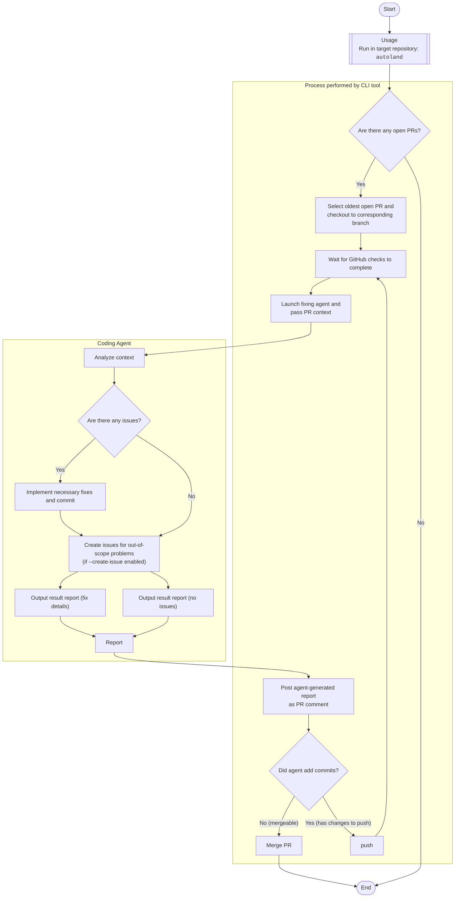

English | [日本語](./README.ja.md)

# Autoland

A CLI tool that automates the fix and merge workflow after creating PRs with Vibe Coding.

## Overview

AI Autoland fully automates the post-review workflow for pull requests. When you integrate AI review tools like CodeRabbit or Claude Code Review into your CI, it automatically fixes the review feedback and executes the merge.

## Key Features

- Automatic Fixes: Automatically fixes review feedback using Codex or Claude Code
- Automatic Merge: Automatically merges after fixes are completed
- Automatic detection and processing of open PRs
- Waiting for GitHub checks completion
- Automatic commit and push of fixes
- Automatic merge decision and execution
- Two Operation Modes:
  - Single Mode: Processes only one PR
  - Watch Mode: Continuously monitors and processes new PRs

## Prerequisites

- An AI code review tool (CodeRabbit, Claude Code Review, etc.) must be running in your CI
- Designed for use with Vibe Coding
- `gh` (GitHub CLI)
- `claude` or `codex` command
- Execution in a Git repository

## Notes

- This tool does not include code review functionality. It must be used in combination with external CI review tools
- The free public version does not include code quality improvement features
- If you need code quality improvement features, please use the commercial version that will be released in the future

## Installation

```bash
pipx install autoland
```

Please refer to <https://pipx.pypa.io/latest/installation/> for pipx installation.


## Usage

Run in the target repository directory:

```bash
autoland
```

## Repository-specific instructions

Place an `AUTOLAND.md` file in the target repository to share project-specific guidance (coding standards, edge cases, required checks, etc.). Its content is passed to the coding agent together with the review context when requesting fixes.

## Workflow

1. **PR Detection**: Selects the oldest open PR and checks out to the corresponding branch
2. **Checks Waiting**: Waits for GitHub checks to complete
3. **Auto-fix**: AI agent analyzes review comments and executes necessary fixes
4. **Push Changes**: Commits fixes and posts a processing report as a comment
5. **Re-check**: Checks for new comments and determines merge eligibility
6. **Execute Merge**: Automatically merges if there are no issues



## Design Principles

- CLI does not manage authentication credentials, leverages existing tools
- Complex decisions are delegated to AI, only mechanical decisions are implemented on the CLI side
- Timestamped log output for long-running operations
