# Binary Semantic Cache


**Cut LLM costs by 50-90% with sub-millisecond latency.**

A high-performance, enterprise-grade semantic cache for OpenAI and local LLMs. Powered by a **Rust core** for maximum speed, memory efficiency, and fast startup.

---

## ⚡ Why Use This?

Most semantic caches are slow (Python-only), heavy (require VectorDB), or complex (require Redis).

| Feature | **Binary Semantic Cache** | Redis / VectorDB | Python (NumPy) |
| :--- | :--- | :--- | :--- |
| **Latency (100k)** | **0.16 ms** ⚡ | ~2-5 ms | ~1.14 ms |
| **Memory / Entry** | **~52 bytes** 🪶 | ~1-2 KB | ~120 bytes |
| **Infrastructure** | **None (Local Lib)** | External Service | None |
| **Persistence** | **Fast Binary I/O** | Snapshots | Slow (Pickle) |
| **Cost** | **Free** | $$$ | Free |

> **Benchmark Source:** `benchmarks/results/cache_e2e_bench.json` (Intel i7, 100k entries).

---

## 🚀 Quick Start

### 1. Installation

**Prerequisites:** Python 3.10+. Rust is only needed for source builds.

```bash
# Option A: From PyPI (Recommended)
pip install "binary-semantic-cache[openai]"

# Option B: From Source (Development)
git clone https://github.com/matte1782/binary_semantic_cache.git
cd binary_semantic_cache
pip install maturin
maturin develop --release --extras openai
```

### 2. Choose Your Backend

#### A. OpenAI (Production)

Best for production apps. Includes automatic rate limiting and cost tracking.

```python
import os
from binary_semantic_cache import BinarySemanticCache, BinaryEncoder
from binary_semantic_cache.embeddings.openai_backend import OpenAIEmbeddingBackend

# 1. Setup Backend (Tier 1 rate limits default)
os.environ["OPENAI_API_KEY"] = "sk-..."
backend = OpenAIEmbeddingBackend(model="text-embedding-3-small")

# 2. Initialize Cache (1536 dimensions for OpenAI)
encoder = BinaryEncoder(embedding_dim=1536, code_bits=256)
cache = BinarySemanticCache(encoder=encoder, max_entries=10000)

# 3. Use
query = "What is the capital of France?"
embedding = backend.embed_text(query)

# Check Cache
if hit := cache.get(embedding):
    print(f"✅ HIT: {hit.response}")
else:
    # Call LLM (Simulated)
    response = "Paris"
    cache.put(embedding, response)
    print(f"❌ MISS: Cached '{response}'")
```

#### B. Ollama / Local (Development)

Best for offline development. Zero API costs.

```python
from binary_semantic_cache import BinarySemanticCache, BinaryEncoder
from binary_semantic_cache.embeddings import OllamaEmbedder

# 1. Setup Local Backend (Requires Ollama running with nomic-embed-text)
embedder = OllamaEmbedder(model_name="nomic-embed-text")

# 2. Initialize Cache (768 dimensions for Nomic)
encoder = BinaryEncoder(embedding_dim=768)
cache = BinarySemanticCache(encoder=encoder)

# 3. Use
vec = embedder.embed_text("Hello Local World")
cache.put(vec, "Stored Locally")
```

---

## 📊 Performance

Phase 2.5 introduces a native **Rust** storage engine, delivering massive gains over the Phase 1 Python baseline.

### Latency & Throughput (100k entries)

| Metric | Phase 1 (Python) | **Phase 2 (Rust)** | Speedup |
| :--- | :--- | :--- | :--- |
| **Mean Latency** | 1.14 ms | **0.16 ms** | **7.0x** 🚀 |
| **Hit Latency** | ~0.10 ms | **0.05 ms** | 2.0x |
| **Miss Latency** | ~1.20 ms | **0.30 ms** | 4.0x |

### Memory Efficiency

| Component | Size | Notes |
| :--- | :--- | :--- |
| **Rust Index** | 44 bytes | Fixed (Code + Metadata) |
| **Python Response** | ~8 bytes | Pointer to stored object |
| **Total / Entry** | **~52 bytes** | **vs ~120 bytes (Python)** |

> **Note:** Actual memory usage depends on the size of your response strings. The cache overhead itself is minimal.

---

## 🏗️ Architecture

The cache uses a hybrid Python/Rust architecture to combine ease of use with systems-level performance.

```mermaid
graph LR
    A[User App] -->|Python API| B(BinarySemanticCache)
    B -->|Embed| C{Backend}
    C -->|OpenAI/Ollama| D[Embeddings]
    B -->|Search| E[Rust Core 🦀]
    E -->|SIMD Hamming| F[Binary Index]
    E -->|Results| B
```



### Persistence V3 (Dual-File Format)

Persistence is handled by a split-file strategy ensuring fast loading regardless of cache size:

1.  **`entries.bin`**: A memory-mappable binary file containing compressed codes, timestamps, and access counts.
    *   *Index Load Time:* < 10ms for 1M entries (search-ready).
    *   *Full Load Time:* ~300ms for 1M entries (includes response hydration).
2.  **`responses.pkl`**: A standard Python pickle file for storing arbitrary response objects (strings, dicts, JSON).
    *   *Integrity:* Secured with SHA-256 checksums.

---

## ⚙️ Configuration

`BinarySemanticCache(encoder, max_entries=..., ...)`

| Parameter | Default | Description |
| :--- | :--- | :--- |
| `max_entries` | `1000` | Maximum items before LRU eviction. |
| `similarity_threshold` | `0.80` | Cosine similarity threshold (0.0-1.0). Lower = more hits, higher = precise. |
| `code_bits` | `256` | Size of binary hash. Fixed at 256 for v1.0.0. |
| `storage_mode` | `"memory"` | Currently memory-only (with disk persistence). |

---

## ⚠️ Limitations & Constraints

For a detailed breakdown, see [Known Limitations (v1.0)](docs/KNOWN_LIMITATIONS_V1.md).

*   **Linear Scan (O(N)):** This is *not* an Approximate Nearest Neighbor (ANN) index (like FAISS/HNSW). It performs a full linear scan.
    *   *Implication:* Extremely fast for N < 1M (Rust SIMD), but scales linearly.
*   **Full Load Time:** While the index loads instantly, full hydration of 1M+ response objects takes ~300ms due to Python pickle overhead.
*   **Memory Resident:** The entire index lives in RAM.
    *   *Implication:* 1M entries requires ~50MB RAM + Response Data.
*   **Global Lock:** Uses a global `RLock` for thread safety.
    *   *Implication:* Concurrent writes are serialized.
*   **Rust Dependency:** You *must* be able to build Rust extensions to install this library from source (no pre-built wheels yet).

---

## 🗺️ Roadmap (Phase 3)

*   **Cloud Persistence:** S3 / GCS adapters for serverless deployments.
*   **Distributed Cache:** Redis-backed shared state for multi-instance setups.
*   **Approximate Search:** Evaluation of HNSW for >1M entry scaling.

---

## 🤝 Contributing

We welcome contributions! Please ensure you run the full benchmark suite before submitting PRs.

**License:** [MIT](LICENSE)

*Maintained by [Matteo Panzeri](https://github.com/matte1782).*
