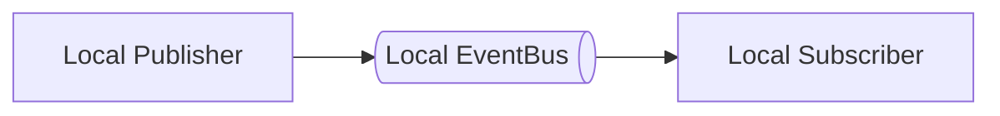
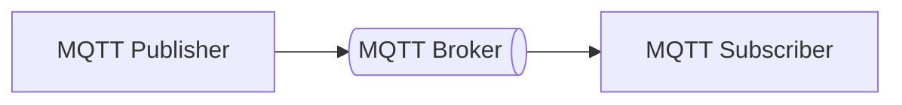
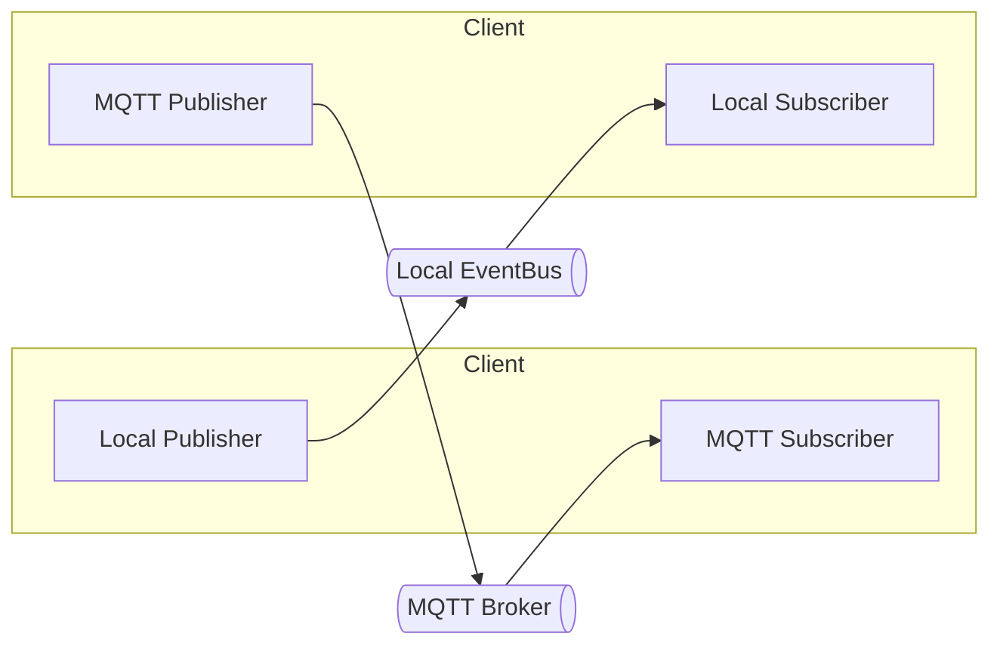
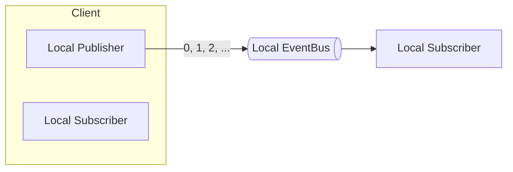
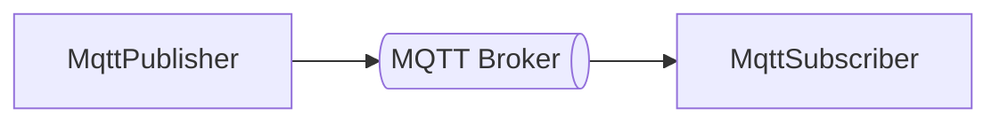
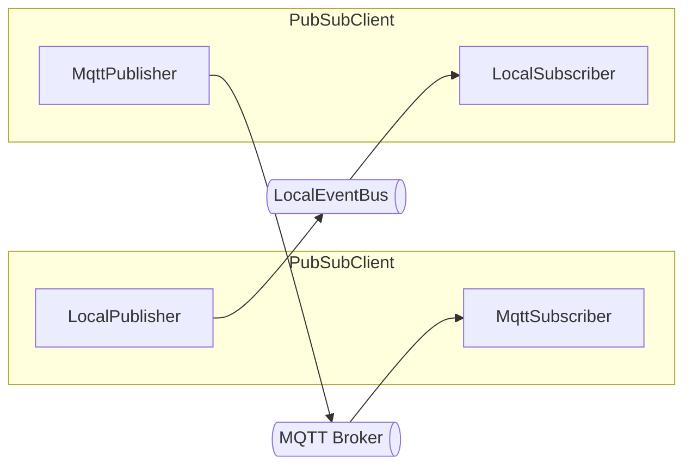
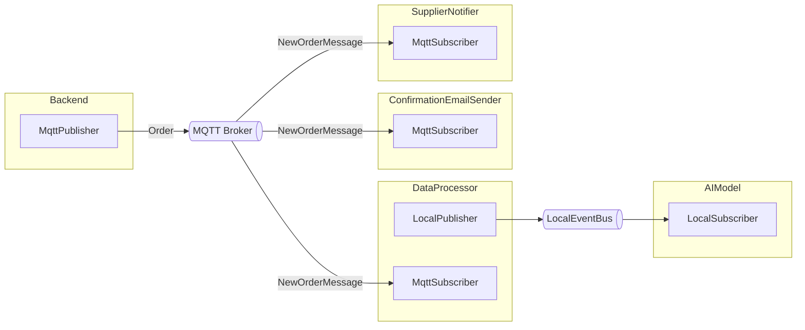

# Busline

> [!IMPORTANT]
> Guideline, basic documentation and overview are described in [Busline](https://github.com/orbitalis-framework/busline) repository!

Busline is an agnostic asynchronous **pub/sub library** for Python.

This library is fully based on `asyncio` and provides out-of-the-box a [local](#local-implementation) and [MQTT](#mqtt-implementation) implementation.

You can choose between a pair [Publisher](#publisher)/[Subscriber](#subscriber) or a [Client](#client), i.e. a set of publishers and subscribers.





Client allows you to use a _heterogeneous combination_ of pubs/subs (e.g., local + MQTT). 



Thanks to Busline, you can choose your favorite programming pattern between **callback** and **iterator** (or both!).


## Install

```
pip install busline
```


## Quick start

1. Choose your context: [Local](#local-implementation), [MQTT](#mqtt-implementation) or both
2. Choose what you need: [Publisher](#publisher), [Subscriber](#subscriber) or both (i.e., [Client](#client))
3. Choose your events handling style: [handler](#handler-style) or [iterator](#iterator-style)

We provide you an example in which a [Client](#client) initialized with [Local](#local-implementation) pub/sub is used to share messages with a standalone [Local](#local-implementation) [Subscriber](#subscriber):



```python
# Create a new client using builder pattern
client: PubSubClient = (PubSubClientBuilder()
            .with_publisher(    # add publisher
                LocalPublisher(eventbus=LocalEventBus())
            )
            .with_subscriber(   # add subscriber
                LocalSubscriber(eventbus=LocalEventBus())
            )
            .build())   # return the client

# Regular initialization of a LocalSubscriber,
# specifying the local eventbus  
standalone_subscriber = LocalSubscriber(eventbus=LocalEventBus())
```

Then, a simple message-passing between them using the [handler](#handler-style) approach:

```python
# Connect them to eventbus
await asyncio.gather(
    client.connect(),
    standalone_subscriber.connect()
)

# Subscribe to topic "numbers" 
# and process new events using provided lambda
await standalone_subscriber.subscribe(
    topic="numbers",
    handler=lambda topic, event: print(f"{topic} -> {event}")
)

for n in range(10):
    # Publish on topic "numbers" values: 0, 1, 2, ... 
    await client.publish(
        topic="numbers"
        message=n
    )

# Now you will see prints thanks to pre-defined handler

# Disconnect them from eventbus
await asyncio.gather(
    client.disconnect(),
    standalone_subscriber.disconnect()
)
```

## User Guide

In this section you will see how to use Busline, if you want to know more or if you need custom implementation, please see [Advance Guide](#advance-guide).

### Event

We have 2 different concepts related to events in Busline:

- `Message`: actual information that you publish
- `Event`: inbound envelope of messages, providing useful information (such as _who_ and _when_)

#### Message

`Message` is the class which contains data which can be **published using publishers**.

We must provide `serialize` and `deserialize` methods, in order to be able to publish the message.

Fortunately, Busline provides out-of-the-box a set of mixins to avoid custom serde implementations:

- `AvroMessageMixin` based on Avro, it uses `dataclasses_avroschema` library to work with dataclasses
- `JsonMessageMixin` based on JSON, given that `json` library is not able to serialize some types of data (e.g., `set`), you will have to implement `to_json/from_json` methods
- `StringMessage`, `Int64Message`, `Int32Message`, `Float32Message`, `Float64Message` to wrap primitive data

Primitive wraps already support Avro and JSON serialization.
You can instantiate them as following:

```python
# Create a new message with string value "hello"
StringMessage("hello")

# Create a new message with integer value 42
Int64Message(42)

# Create a new message with integer value 42
Int32Message(42)

# Create a new message with floating value 3.14
Float32Message(3.14)

# Create a new message with floating value 3.14
Float64Message(3.14)
```

Primitive wraps allow you to access wrapped value thanks to `value` attribute:

```python
message = StringMessage("hello")    # create string message with "hello" value

assert message.value == "hello"     # access its inner value
```

Following an example in which you can see how to make sendable your custom dataclasses using **JSON** or **Avro**:


```python
# JSON
@dataclass
class MockUserCreationMessage(JsonMessageMixin):
    # Public fields:
    email: str
    password: str


    # You must provide JSON serialize/deserialize methods 
    @classmethod
    @override
    def from_json(cls, json_str: str) -> Self:
        data = json.loads(json_str)

        return cls(data["email"], data["password"])     # return a class instance

    @override
    def to_json(self) -> str:
        # use dataclasses.asdict to generate a dict version
        # of the instance, but you could also provide it manually
        # e.g.: { "email": self.email, "password": self.password }
        return json.dumps(asdict(self))     
```


```python
# Avro
@dataclass
class MockUserCreationMessage(AvroMessageMixin):
    email: str
    password: str
```

> [!TIP]
> If you use `AvroMessageMixin` you should not use dataclass default values which are time-variant (e.g. `datetime.now()`),
> because this produces different schemas for the same dataclass.

> [!TIP]
> If you have nested dataclasses in Avro, they must inherit `AvroModel` of `dataclasses_avroschema` library.


#### Event

`Event` is the envelope for messages. It is **what you will receive** from subscribers.

Events can be sent also without a payload, for example if you want to notify only.

Generally, you must not care about its creation, because it is performed in subscribers logic.

Following information provided:

- `identifier`: unique event identifier
- `publisher_identifier`: identifier of publisher
- `payload`: message data
- `timestamp`: event generation datetime


### Publisher

`Publisher` is the abstract class which can be implemented to create publishers.

The main method is `publish`, used to publish a message in only one topic. 
If you want to publish a message in more topics at the same time: `multi_publish`.

`publish` method takes two parameters: `topic` and `message`. 
`topic` is a string and represent the topic in which message must be published.
`message` can be `None` if you want to send a payload-empty event, otherwise you can provide:

- Implementation of `Message`
- `str` which is wrapped into `StringMessage` automatically
- `int` which is wrapped into `Int64Message` automatically
- `float` which is wrapped into `Float64Message` automatically

```python
# Firstly, connect to eventbus...
await publisher.connect()


# Publish on topic "my_topic" the StringMessage with value: "hello"
await publisher.publish("my_topic", "hello")

# Publish on topic "my_topic" the Int64Message with value: 42
await publisher.publish("my_topic", 42)

# Publish on topic "my_topic" the Float64Message with value: 3.14
await publisher.publish("my_topic", 3.14)

# Publish on topic "my_topic" YourCustomMessage
await publisher.publish("my_topic", YourCustomMessage(...))


# ...Finally, disconnect from eventbus
await publisher.disconnect()
```

In addiction to `topic` and `message`, `publish` can be fed using more parameters, but they depend on actual publisher implementation.

If you want to use **hooks** or create a **custom implementation** see more in [how create a custom publisher](#custom-publisher) section.

### Subscriber

`Subscriber` is the abstract class which provides the base implementation for a subscriber. 
It has some similarities with `Publisher`.

You can subscribe to a topic using `subscribe` method and unsubscribe thanks to `unsubscribe`. 
If no topic is specified during unsubscription, subscriber unsubscribes itself from **all** topics.

Also `multi_subscribe` and `multi_unsubscribe` are provided.

If you want to manually notify a subscriber on a given topic (e.g., `"my_topic"`): `notify` method. We advise you to avoid this during regular uses.

```python
subscriber.notify(
    "my_topic",     # topic's name on which subscriber will be notified
    Event(...)      # event which will be handled by subscriber
)
```

There are two main ways to consume messages:

- **Handler**
- **Iterator**

You can also use both!


#### Handler-style

`EventHandler` represents an object which is able to handle a new event.
Busline provides two handler implementations:

- `CallbackEventHandler` to wrap a _synchronous_ or an _asynchronous_ function

```python
# Sync version
def sync_handler_callback(topic: str, event: Event):
    print(f"{topic} -> {event}")    # elaborate the inbound event

# Create new handler based on above sync callback
handler = CallbackEventHandler(sync_handler_callback)
```

```python
# Async version
async def async_handler_callback(topic: str, event: Event):
    print(f"{topic} -> {event}")    # elaborate the inbound event

# Create new handler based on above async callback
handler = CallbackEventHandler(async_handler_callback)
```


- `MultiEventHandler` to wrap more than one handler (order of execution is strict if `strict_order=True`, otherwise they are executed in parallel)

```python
handler = MultiEventHandler([handler1, handler2])
```

If you don't want to wrap every time your functions or _if you have a method_ instead, you can use our decorator: `@event_handler`.
It transforms every function and method into a `CallbackEventHandler`, so you can refer to it using simply function/method reference.
If you use a method, `self` context is _preserved_.

```python
@event_handler
async def my_function(topic: str, event: Event):
    print(f"{topic} -> {event}")

# Now `my_function` is an instance of CallbackEventHandler
```

> [!WARNING]
> You must import event_handler decorator explicitly: 
> 
> `from busline.client.subscriber.event_handler import event_handler`
> 
> This will _not work_:
> 
> `import busline.client.subscriber.event_handler`


`Subscriber` has `default_handler` attribute, which represents the default handler which will be used if there is not a handler related to a topic.

```python
subscriber = MockSubscriber(default_handler=...)
# fill ... with your handler, e.g. a CallbackEventHandler
```

In addiction, when you subscribe to a topic, you can (or not) specify a handler. In case, that handler will be used to handle new events.
You can specify a `EventHandler` or a function/method (which will be wrapped into a `CallbackHandler`):

```python
# Subscriber will receive events from topic `"my_topic"`
# and they will be processed by a CallbackEventHandler based on
# in-place specified lambda function
await subscriber.subscribe("my_topic", CallbackEventHandler(lambda t, e: ...))

# Subscriber will receive events from topic `"my_topic"`
# and they will be processed by a CallbackEventHandler based on
# in-place specified lambda function.
# Provided lambda is wrapped into a CallbackEventHandler automatically.
await subscriber.subscribe("my_topic", lambda t, e: ...)

# Subscriber will receive events from topic `"my_topic"`
# and they will be processed by default event handler (if set)
await subscriber.subscribe("my_topic")
```

Every new inbound event is handled using the related pre-defined handler or default (_if it was defined_).

If you want to ensure to use a handler for every topic, you must set `handler_always_required=True` attribute in subscriber.

> [!NOTE]
> If you use wildcard, you must specify a `topic_names_matcher` function in order to provide wildcards logic.
> By default, a handler handles an event if its related topic and the inbound topic are _exactly_ equal (i.e., `==`).

#### Iterator-style

If you don't like callbacks, you can use asynchronous iterators (i.e., `async for`).

Every subscriber provides you two properties:

- `inbound_events`: generator which provides you _all_ inbound events

```python
async for (topic, event) in subscriber.inbound_events:
    print(f"{topic} -> {event}")
```

- `inbound_unhandled_events`: generator which provides you inbound events which are _not handled_ by a handler

```python
async for (topic, event) in subscriber.inbound_unhandled_events:
    print(f"{topic} -> {event}")
```

Obviously, some events can arrive **both** to `inbound_events` and `inbound_unhandled_events`.


### Local implementation


#### LocalEventBus

`LocalEventBus` is a singleton eventbus provided by the Busline as default (based on our `AsyncLocalEventBus` implementation), but you can provide yours.

```python
publisher = LocalPublisher(eventbus=LocalEventBus())
subscriber = LocalSubscriber(eventbus=LocalEventBus())
```

#### LocalPublisher

```python
publisher = LocalPublisher(eventbus=LocalEventBus())
```

You must only provide an eventbus implementation which works locally.
Busline provides `LocalEventBus`.

#### LocalSubscriber

```python
LocalSubscriber(eventbus=LocalEventBus())
```

`LocalSubscriber` is the implementation to use a local eventbus, which must be fed during definition.


### MQTT implementation



#### MqttPublisher

```python
MqttPublisher(hostname="127.0.0.1")
```

`MqttPublisher` uses `aiomqtt` MQTT client to publish messages. The mandatory parameter is `hostname`, but you can provide also:

- `port`: (int) default `1883`
- `other_client_parameters`: key-value dictionary which is provided during `aiomqtt` MQTT client creation
- `serializer`: function to serialize events, by default JSON is used (see `RegistryPassthroughEvent` explanation)

> [!WARNING]
> You _must_ instantiate it into an `async` context (e.g., async function), otherwise an error will be raised.


#### MqttSubscriber

```python
MqttSubscriber(hostname="127.0.0.1")
```

`MqttSubscriber` is a MQTT subscriber implementation provided by Busline, based on `aiomqtt` library.

You must provide `hostname` of your MQTT broker and may provide `port` and `other_client_parameters`.

`MqttSubscriber` uses a `deserializer`, i.e. function to deserialize events, by default JSON is used (see `RegistryPassthroughEvent` explanation).

> [!WARNING]
> You _must_ instantiate it into an `async` context (e.g., async function), otherwise an error will be raised.


### Client

`PubSubClient` is a class which wraps a **list** of publishers and subscribers in order to provide both methods in an all-in-one object.

`PubSubClient` allows you to use _different kinds of publishers and subscribers_! 
Therefore, you can **publish a message in more eventbus at the same time**.

To simplify its creation, `PubSubClientBuilder` is provided.

For example, if you want to create a client able to share messages both in `LocalEventBus` and to a MQTT broker:

```python
# Create a new client using the builder
client = (PubSubClientBuilder()
            .with_publishers([  
                # add a MQTT publisher (broker on localhost) and a local publisher 
                MqttPublisher(hostname="127.0.0.1"),
                LocalPublisher(eventbus=LocalEventBus())
            ])
            .with_subscribers([
                # add a MQTT subscriber (broker on localhost) and a local subscriber 
                MqttSubscriber(hostname="127.0.0.1"),
                LocalSubscriber(eventbus=LocalEventBus())
            ])
            .build())
```




### Full Example

In this example we create an *E-Commerce Backend* (MQTT Publisher) application which publish new messages when new orders arrive using Mqtt. Then, 3 different services are employed to process new events:

- `ConfirmationEmailSender`: send the order's confirmation mail to user
- `SupplierNotifier`: notify product supplier to erogate new order
- `DataProcessor`: cleans order data to train an AI model

We suppose that AI model is trained locally and for this reason we send to it data thanks to a local eventbus.



You can found the full code in the [examples directory](examples/ecommerce).


## Advance Guide

Read this section to know more about Busline implementation details or to create your custom implementations.

### Registry

Given serialized data, we know neither serialization format nor message type.

In Busline there are **two serializations**: messages serialization and events serialization. 
During events serialization, message serialization methods provided by you (or by us) are used. 

`EventRegistry` is a _singleton_ which helps system to retrieve right class type to instantiate message objects during deserialization.
In particular, it stores associations `message_type => Type[Message]`.

`RegistryPassthroughEvent` represents a low-level class to manage events communication. It is the utility data model which should be serialized by publishers based on related eventbus and deserialized by subscribers. In addiction, it works together with `EventRegistry` to restore message class based on bytes.

Following class fields:

- `identifier: str`
- `publisher_identifier: str`
- `serialized_payload: Optional[bytes]` contains bytes produced by message (`payload` of `Event`) serialization.
- `payload_format_type: Optional[str]` states serialization format (e.g., JSON, Avro, ...)
- `message_type: Optional[str]` states "which" message is stored in bytes
- `timestamp: datetime`

`RegistryPassthroughEvent` is equipped with `from_event`/`to_event` methods 
and with `from_dict`/`to_dict` to provide its serializable data in a fancy way (they exploit `serialize`/`deserialize` methods of message payload).

`from_event` adds event message to registry _automatically_, in order to make it available in a second time.

`to_event` retrieves from registry right message class, then construct `Event`.

> [!NOTE]
> Without this process we are not able to provide you the right instance of message class.

Therefore, the common steps executed during event sending are:

1. Create a `Message`
2. Wrap the `Message` in an `Event`
3. Generate `RegistryPassthroughEvent` from `Event` (this adds `Message` to registry) using `from_event`
4. Serialize `RegistryPassthroughEvent`, for example using already implemented `registry_passthrough_event_json_serializer` function
5. Send serialized `RegistryPassthroughEvent` into eventbus
6. Deserialize bytes of `RegistryPassthroughEvent` (e.g., you could use `registry_passthrough_event_json_deserializer` function)
7. Reconstruct `Event` using `to_event` of `RegistryPassthroughEvent`
8. Finally, you can retrieve the message thanks to `event.payload`

```python
message = MyMessage()   # create new message

event = Event(payload=message, ...)     # create new event with above message as payload

rp_event = RegistryPassthroughEvent.from_event(event)   # new association in the registry is created

# Then, serialize the event, e.g. using JSON
serialized_rp_event = registry_passthrough_event_json_serializer(rp_event)

# send serialized_event

# Deserialize inbound event
rp_event = registry_passthrough_event_json_deserializer(serialized_rp_event)

event = rp_event.to_event()     # transform RegistryPassthroughEvent into Event

message = event.payload     # retrieve message within payload
```

##### Add to registry manually

If you want to add an association into registry manually you can:

- Decorate a class using `@add_to_registry`
- Use `add` method of registry

```python
# Create a new custom message, Avro serializable
# and it will be added to EventRegistry
# thanks to @add_to_registry

@dataclass
@add_to_registry
class MyMessage(AvroMessageMixin):
    pass
```

```python
event_registry = EventRegistry()    # singleton

message_type = event_registry.add(MyMessage)    # add MyMessage to EventRegistry

# or if you want to explicit define the message type:
message_type = event_registry.add(MyMessage, message_type="my_message")
assert message_type == "my_message"
```


### Custom Publisher

If you want to implement your publishers you must implement only `_internal_publish`, 
in which you must insert logic to send messages.

There are two additional hooks: `_on_publishing` and `_on_published`, called before and after `_internal_publish` when `publish` method is called.

Other hooks:

- `_on_publishing`: called before publish
- `_on_published`: called after publish

### Custom Subscriber

The main methods which you should implement if you want to create your custom subscriber are `_internal_subscribe` and `_internal_unsubscribe`,
in which must be inserted logic of subscription and unsubscription.

Remember `notify` method, this already processes every needed operations in a subscriber, therefore you should only collect remote message (from eventbus)
and call it.

Other hooks:

- `_on_subscribing`: called before subscribe
- `_on_subscribed`: called after subscribe
- `_on_unsubscribing`: called before unsubscribe
- `_on_unsubscribed`: called after unsubscribe


### Custom LocalEventBus

You can implement your eventbus thanks to `EventBus` abstract class.
By default, no wildcards are supported, but you can override `_topic_names_match` `EventBus` method to change the logic.


## Contribute

In order to coordinate the work, please open an issue or a pull request.

**Thank you** for your contributions! 

## Authors

### Nicola Ricciardi

Architectural designer and developer of code base. Documentation referent.

University of Modena and Reggio Emilia.


### Marco Picone

Co-Designer of main components. Documentation reviewer.

Associate Professor at University of Modena and Reggio Emilia.


