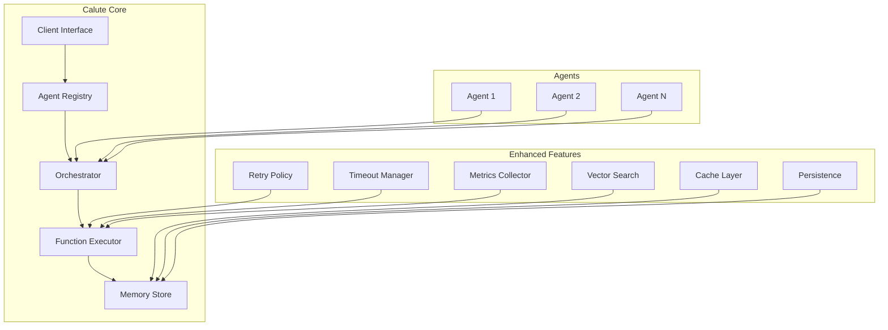

# Calute 🤖

**Calute** is a powerful, production-ready framework for building and orchestrating AI agents with advanced function calling, memory systems, and multi-agent collaboration capabilities. Designed for both researchers and developers, Calute provides enterprise-grade features for creating sophisticated AI systems.

## 🚀 Key Features

### Core Capabilities

- **🎭 Multi-Agent Orchestration**: Seamlessly manage and coordinate multiple specialized agents with dynamic switching based on context, capabilities, or custom triggers
- **⚡ Enhanced Function Execution**: Advanced function calling with timeout management, retry policies, parallel/sequential execution strategies, and comprehensive error handling
- **🧠 Advanced Memory Systems**: Sophisticated memory management with multiple types (short-term, long-term, episodic, semantic, working, procedural), vector search, caching, and persistence
- **🔄 Workflow Engine**: Define and execute complex multi-step workflows with conditional logic and state management
- **🌊 Streaming Support**: Real-time streaming responses with function execution tracking
- **🔌 LLM Flexibility**: Unified interface supporting OpenAI, Gemini, Anthropic, and custom models

### Enhanced Features

- **Memory Store with Indexing**: Fast retrieval with tag-based indexing and importance scoring
- **Function Registry**: Centralized function management with metrics and validation
- **Error Recovery**: Robust error handling with customizable retry policies and fallback strategies
- **Performance Monitoring**: Built-in metrics collection for execution times, success rates, and resource usage
- **Context Management**: Sophisticated context passing between agents and functions
- **Security Features**: Function validation, safe execution environments, and access control

## 📦 Installation

### Core Installation (Lightweight)

```bash
# Minimal installation with only essential dependencies
pip install calute
```

### Feature-Specific Installations

```bash
# For web search capabilities
pip install "calute[search]"

# For image/vision processing
pip install "calute[vision]"

# For additional LLM providers (Gemini, Anthropic, Cohere)
pip install "calute[providers]"

# For database support (PostgreSQL, MongoDB, etc.)
pip install "calute[database]"

# For Redis caching/queuing
pip install "calute[redis]"

# For monitoring and observability
pip install "calute[monitoring]"

# For vector search and embeddings
pip install "calute[vectors]"
```

### Preset Configurations

```bash
# Research-focused installation (search, vision, vectors)
pip install "calute[research]"

# Enterprise installation (database, redis, monitoring, providers)
pip install "calute[enterprise]"

# Full installation with all features
pip install "calute[full]"
```

### Development Installation

```bash
git clone https://github.com/erfanzar/calute.git
cd calute
pip install -e ".[dev]"
```

## 🎯 Quick Start

### Basic Agent Setup

```python
import openai
from calute import Agent, Calute

# Initialize your LLM client
client = openai.OpenAI(api_key="your-key")

# Create an agent with functions
def search_web(query: str) -> str:
    """Search the web for information."""
    return f"Results for: {query}"

def analyze_data(data: str) -> dict:
    """Analyze provided data."""
    return {"summary": data, "insights": ["insight1", "insight2"]}

agent = Agent(
    id="research_agent",
    name="Research Assistant",
    model="gpt-4",
    instructions="You are a helpful research assistant.",
    functions=[search_web, analyze_data],
    temperature=0.7
)

# Initialize Calute and register agent
calute = Calute(client)
calute.register_agent(agent)

# Use the agent
response = await calute.create_response(
    prompt="Find information about quantum computing",
    agent_id="research_agent"
)
```

### Advanced Memory-Enhanced Agent

```python
from calute.memory import MemoryStore, MemoryType

# Create memory store with persistence
memory = MemoryStore(
    max_short_term=100,
    max_long_term=1000,
    enable_persistence=True,
    persistence_path="./agent_memory"
)

# Add memories
memory.add_memory(
    content="User prefers technical explanations",
    memory_type=MemoryType.LONG_TERM,
    agent_id="assistant",
    tags=["preference", "user_profile"],
    importance_score=0.9
)

# Attach to Calute
calute.memory = memory
```

### Multi-Agent Collaboration

```python
from calute.executors import EnhancedAgentOrchestrator, EnhancedFunctionExecutor

# Create specialized agents
research_agent = Agent(id="researcher", name="Researcher", ...)
analyst_agent = Agent(id="analyst", name="Data Analyst", ...)
writer_agent = Agent(id="writer", name="Content Writer", ...)

# Set up orchestrator
orchestrator = EnhancedAgentOrchestrator(enable_metrics=True)
await orchestrator.register_agent(research_agent)
await orchestrator.register_agent(analyst_agent)
await orchestrator.register_agent(writer_agent)

# Enhanced executor with parallel execution
executor = EnhancedFunctionExecutor(
    orchestrator=orchestrator,
    default_timeout=30.0,
    max_concurrent_executions=5
)

# Execute functions across agents
from calute.types import RequestFunctionCall, FunctionCallStrategy

calls = [
    RequestFunctionCall(name="research_topic", arguments={"topic": "AI"}, id="1"),
    RequestFunctionCall(name="analyze_findings", arguments={"data": "..."}, id="2"),
    RequestFunctionCall(name="write_report", arguments={"content": "..."}, id="3")
]

results = await executor.execute_function_calls(
    calls=calls,
    strategy=FunctionCallStrategy.PARALLEL
)
```

## 📚 Example Scenarios

The `examples/` directory contains comprehensive scenarios demonstrating Calute's capabilities:

1. **Conversational Assistant** (`scenario_1_conversational_assistant.py`)
   - Memory-enhanced chatbot with user preference learning
   - Sentiment analysis and context retention

2. **Code Analyzer** (`scenario_2_code_analyzer.py`)
   - Python code analysis with security scanning
   - Refactoring suggestions and test generation
   - Parallel analysis execution

3. **Multi-Agent Collaboration** (`scenario_3_multi_agent_collaboration.py`)
   - Coordinated task execution across specialized agents
   - Dynamic agent switching based on context
   - Shared memory and progress tracking

4. **Streaming Research Assistant** (`scenario_4_streaming_research_assistant.py`)
   - Real-time streaming responses
   - Knowledge graph building
   - Research synthesis and progress tracking

## 🏗️ Architecture



## 🛠️ Core Components

### Memory System

- **MemoryStore**: Advanced memory management with indexing and caching
- **MemoryType**: SHORT_TERM, LONG_TERM, EPISODIC, SEMANTIC, WORKING, PROCEDURAL
- **Features**: Vector search, similarity matching, consolidation, pattern analysis

### Executors

- **EnhancedAgentOrchestrator**: Multi-agent coordination with metrics
- **EnhancedFunctionExecutor**: Parallel/sequential execution with timeout and retry
- **FunctionRegistry**: Centralized function management and validation

### Configuration

- **CaluteConfig**: Centralized configuration management
- **Environment-based settings**: Development, staging, production profiles
- **Logging configuration**: Structured logging with customizable levels

## 📊 Performance & Monitoring

```python
# Access execution metrics
metrics = orchestrator.function_registry.get_metrics("function_name")
print(f"Total calls: {metrics.total_calls}")
print(f"Success rate: {metrics.successful_calls / metrics.total_calls:.0%}")
print(f"Avg duration: {metrics.average_duration:.2f}s")

# Memory statistics
stats = memory.get_statistics()
print(f"Cache hit rate: {stats['cache_hit_rate']:.1%}")
print(f"Total memories: {stats['total_memories']}")
```

## 🔒 Security & Best Practices

- Function validation before execution
- Timeout protection against hanging operations
- Secure memory persistence with encryption support
- Rate limiting and resource management
- Comprehensive error handling and logging

## 🔌 MCP Integration

Calute now supports **Model Context Protocol (MCP)** for connecting agents to external data sources, tools, and APIs!

### Quick Start with MCP

```python
import asyncio
from calute.cortex import CortexAgent
from calute.llms import OpenAILLM
from calute.mcp import MCPManager, MCPServerConfig
from calute.mcp.integration import add_mcp_tools_to_agent
from calute.mcp.types import MCPTransportType

async def main():
    # Setup MCP manager
    mcp_manager = MCPManager()

    # Configure MCP server (e.g., filesystem access)
    config = MCPServerConfig(
        name="filesystem",
        command="npx",
        args=["-y", "@modelcontextprotocol/server-filesystem", "/data"],
        transport=MCPTransportType.STDIO,
    )

    # Connect to MCP server
    await mcp_manager.add_server(config)

    # Create agent with MCP tools
    agent = CortexAgent(
        role="Data Assistant",
        goal="Help with file operations",
        backstory="Expert with filesystem access",
        model="gpt-4",
        llm=OpenAILLM(api_key="your-key"),
    )

    # Add MCP tools to agent
    await add_mcp_tools_to_agent(agent, mcp_manager)

    # Use the agent with MCP capabilities
    result = agent.execute("List and analyze files in the directory")
    print(result)

    await mcp_manager.disconnect_all()

asyncio.run(main())
```

### Supported MCP Servers

- **Filesystem**: Local file operations
- **SQLite**: Database queries
- **GitHub**: Repository management
- **Brave Search**: Web search capabilities
- **Custom**: Build your own MCP servers

See the [MCP Integration Guide](docs/mcp_integration.md) for detailed documentation and examples.

## 📖 Documentation

- [API Reference](docs/api.md)
- [Configuration Guide](docs/configuration.md)
- [Memory System](docs/memory.md)
- [Multi-Agent Patterns](docs/patterns.md)
- [Performance Tuning](docs/performance.md)
- [MCP Integration Guide](docs/mcp_integration.md) ⭐ NEW

## 🤝 Contributing

We welcome contributions! Please see our [Contributing Guidelines](CONTRIBUTING.md) for details.

### Development Setup

```bash
# Install with dev dependencies
poetry install --with dev

# Run tests
pytest

# Run linting
ruff check .

# Format code
black .
```

## 📄 License

This project is licensed under the Apache License 2.0 - see the [LICENSE](LICENSE) file for details.

## 🙏 Acknowledgments

Built with ❤️ by [erfanzar](https://github.com/erfanzar) and contributors.

## 📬 Contact

- GitHub: [@erfanzar](https://github.com/erfanzar)
- Issues: [GitHub Issues](https://github.com/erfanzar/calute/issues)

---

**Note**: This is an active research project. APIs may change between versions. Please pin your dependencies for production use.
