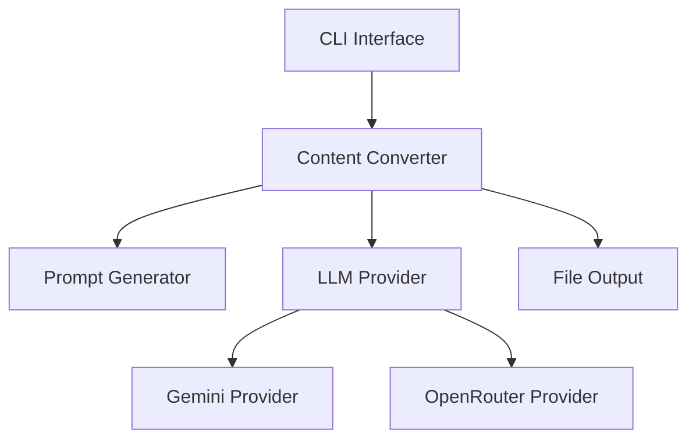

# Content-Converter アーキテクチャー設計書

## システム概要

Content-Converterは、テキストファイルを指定されたプロンプトとテンプレートに基づいて変換するツールです。LLMを活用して、入力テキストを変換し、指定されたテンプレートに従って出力を生成します。

## システム構成

### コンポーネント図



### 主要コンポーネント

1. **CLI Interface**
   - コマンドライン引数の解析
   - 設定の読み込み
   - エラーハンドリング

2. **Content Converter**
   - 変換処理のオーケストレーション
   - 各コンポーネント間の連携
   - エラーハンドリング

3. **Prompt Generator**
   - 入力ファイルの読み込み
   - テンプレートファイルの読み込み
   - プロンプトファイルの読み込み
   - プロンプトの生成と検証

4. **LLM Provider**
   - LLMとの通信
   - プロンプトの送信
   - レスポンスの処理
   - エラーハンドリング

5. **File Output**
   - 出力ファイルの生成
   - エンコーディングの処理
   - エラーハンドリング
   - 出力形式の検証

## データフロー

1. **入力処理**
   ```
   CLI引数 → 設定読み込み → 入力ファイル読み込み
   ```

2. **プロンプト生成**
   ```
   入力ファイル + テンプレートファイル + プロンプトファイル → プロンプト生成
   ```

3. **LLM処理**
   ```
   プロンプト → LLM処理 → 変換テキスト生成
   ```

4. **出力処理**
   ```
   変換テキスト → ファイル出力
   ```

## 拡張ポイント

### 1. LLMプロバイダーの追加
- `LLMProvider`基底クラスを継承
- 必要なメソッドの実装
- 設定の追加

### 2. プロンプトのカスタマイズ
- デフォルトプロンプトの変更
- カスタムプロンプトの追加
- プロンプトの検証

## セキュリティ考慮事項

1. **APIキー管理**
   - 環境変数による安全な管理
   - コマンドライン引数での指定（開発時のみ）

2. **入力検証**
   - ファイルパスの検証
   - テンプレートの検証
   - プロンプトの検証

3. **エラーハンドリング**
   - 適切なエラーメッセージ
   - 機密情報の保護
   - ログ出力の制御 