<p align="center">
  
</p>

<h1 align="center">DockAI</h1>

<p align="center">
  <strong>AI-Powered Dockerfile Generation Framework</strong>
</p>

<p align="center">
  <em>Generate production-ready Dockerfiles from first principles using AI agents</em>
</p>

<p align="center">
  <a href="https://pypi.org/project/dockai-cli/"></a>
  <a href="https://pypi.org/project/dockai-cli/"></a>
  <a href="https://opensource.org/licenses/MIT"></a>
</p>

<p align="center">
  <a href="#-quick-start">Quick Start</a> •
  <a href="#-features">Features</a> •
  <a href="#-documentation">Docs</a> •
  <a href="#-github-actions">CI/CD</a> •
  <a href="#-contributing">Contributing</a>
</p>

---

## 🎯 What is DockAI?

DockAI is an **agentic AI framework** that analyzes your codebase and generates optimized, production-ready Dockerfiles. Unlike template-based tools, DockAI uses **first-principles reasoning** to understand your application and create Dockerfiles from scratch—handling everything from standard stacks to legacy systems.

```bash
pip install dockai-cli
dockai build /path/to/project
```

That's it. DockAI handles the rest.

---

## ✨ Features

<table>
  <tr>
    <td width="50%">
      <h3>🧠 First-Principles AI</h3>
      <p>No templates. Analyzes file structures, dependencies, and code patterns to deduce the optimal containerization strategy.</p>
    </td>
    <td width="50%">
      <h3>🔄 Self-Correcting Workflow</h3>
      <p>Builds and tests Dockerfiles in a sandbox. If something fails, AI reflects, learns, and retries with a new approach.</p>
    </td>
  </tr>
  <tr>
    <td width="50%">
      <h3>🛡️ Security-First</h3>
      <p>Built-in Trivy CVE scanning and Hadolint linting. Enforces non-root users, minimal base images, and hardened configs.</p>
    </td>
    <td width="50%">
      <h3>🤖 10 Specialized Agents</h3>
      <p>Each agent handles a specific task: analysis, planning, generation, review, and more. All fully customizable.</p>
    </td>
  </tr>
  <tr>
    <td width="50%">
      <h3>⚡ Multi-Provider LLMs</h3>
      <p>Supports OpenAI, Azure, Gemini, Anthropic, and Ollama. <strong>Mix and match providers</strong> per agent (e.g., OpenAI for analysis, Ollama for generation).</p>
    </td>
    <td width="50%">
      <h3>🔧 Fully Customizable</h3>
      <p>Override prompts, instructions, and model selection per agent. Use <code>.dockai</code> files for repo-specific configs.</p>
    </td>
  </tr>
  <tr>
    <td width="50%">
      <h3>📦 Smart Registry Integration</h3>
      <p>Automatically validates base images against <strong>Docker Hub, GCR, Quay, and GHCR</strong>. Prioritizes small, secure variants like <code>alpine</code> and <code>slim</code>.</p>
    </td>
    <td width="50%">
      <h3>📊 Full Observability</h3>
      <p>Built-in <strong>OpenTelemetry tracing</strong> and <strong>LangSmith</strong> support for distributed observability and LLM debugging. Export traces to console, OTLP backends, or LangSmith.</p>
    </td>
  </tr>
</table>

---

## 🚀 Three Ways to Use DockAI

DockAI is designed to fit into any workflow, whether you are a developer, a DevOps engineer, or an AI user.

### 1. The CLI (For Developers)
Perfect for running locally on your machine.

```bash
# Install
pip install dockai-cli

# Run
dockai build .
```

### 2. GitHub Actions (For CI/CD)
Automate Dockerfile generation in your pipelines.

```yaml
steps:
  - uses: actions/checkout@v3
  - uses: itzzjb/dockai@v3
    with:
      openai_api_key: ${{ secrets.OPENAI_API_KEY }}
```

### 3. MCP Server (For AI Agents)
Use DockAI directly inside **Claude Desktop**, **Cursor**, or any MCP-compliant tool.

1.  Install `dockai-cli`.
2.  Configure your MCP client:

```json
{
  "mcpServers": {
    "dockai": {
      "command": "python",
      "args": ["-m", "dockai.core.mcp_server"]
    }
  }
}
```
3.  Ask your AI: *"Analyze this project and generate a Dockerfile for it."*

---

### Configuration

Create a `.env` file:

```bash
# Required: Choose your LLM provider and add the API key
OPENAI_API_KEY=sk-your-api-key

# Optional: Use a different provider (openai, azure, gemini, anthropic, ollama)
# DOCKAI_LLM_PROVIDER=openai
```

### Usage

```bash
# Generate Dockerfile for your project
dockai build /path/to/project

# With verbose output
dockai build /path/to/project --verbose
```

---

## 🏗️ How It Works

```mermaid
flowchart TB
    subgraph Discovery["📊 Discovery Phase"]
        scan["📂 scan_node<br/>Scan directory tree"]
        analyze["🧠 analyze_node<br/>AI: Detect stack & requirements"]
        read["📖 read_files_node<br/>Read critical files"]
        health["🏥 detect_health_node<br/>AI: Find health endpoints"]
        ready["⏱️ detect_readiness_node<br/>AI: Find startup patterns"]
    end
    
    subgraph Generation["⚙️ Generation Phase"]
        plan["📝 plan_node<br/>AI: Create build strategy"]
        generate["⚙️ generate_node<br/>AI: Write Dockerfile"]
    end
    
    subgraph Validation["✅ Validation Phase"]
        review["🔒 review_node<br/>AI: Security audit"]
        validate["✅ validate_node<br/>Build, test & scan"]
    end
    
    subgraph Feedback["🔄 Self-Correction Loop"]
        reflect["🤔 reflect_node<br/>AI: Analyze failure"]
        increment["🔄 increment_retry<br/>Update retry count"]
    end
    
    Start([▶ Start]) --> scan
    scan --> analyze --> read --> health --> ready --> plan
    plan --> generate --> review
    
    review -->|"check_security: pass"| validate
    review -->|"check_security: fail"| reflect
    
    validate -->|"should_retry: end"| End([🏁 Done])
    validate -->|"should_retry: reflect"| reflect
    
    reflect --> increment
    increment -->|"check_reanalysis: generate"| generate
    increment -->|"check_reanalysis: plan"| plan
    increment -->|"check_reanalysis: analyze"| analyze
```



---

## 🤖 The 10 AI Agents

| Agent | Role | Model Type |
|-------|------|------------|
| **Analyzer** | Project discovery & stack detection | Fast |
| **Planner** | Strategic build planning | Fast |
| **Generator** | Dockerfile creation | Powerful |
| **Generator (Iterative)** | Debugging failed Dockerfiles | Powerful |
| **Reviewer** | Security audit & hardening | Fast |
| **Reflector** | Failure analysis & learning | Powerful |
| **Health Detector** | Health endpoint discovery | Fast |
| **Readiness Detector** | Startup pattern analysis | Fast |
| **Error Analyzer** | Error classification | Fast |
| **Iterative Improver** | Targeted fix application | Powerful |

---

## ⚙️ Configuration

### Environment Variables

#### LLM Provider Configuration

| Variable | Description | Default |
|----------|-------------|---------|
| `DOCKAI_LLM_PROVIDER` | Provider (`openai`, `azure`, `gemini`, `anthropic`, `ollama`) | `openai` |
| `OPENAI_API_KEY` | OpenAI API key | Required* |
| `GOOGLE_API_KEY` | Google Gemini API key | Required* |
| `ANTHROPIC_API_KEY` | Anthropic Claude API key | Required* |
| `AZURE_OPENAI_API_KEY` | Azure OpenAI API key | Required* |
| `AZURE_OPENAI_ENDPOINT` | Azure OpenAI endpoint URL | - |
| `AZURE_OPENAI_API_VERSION` | Azure OpenAI API version | `2024-02-15-preview` |
| `OLLAMA_BASE_URL` | Ollama base URL | `http://localhost:11434` |

*Only one API key required for your chosen provider.

#### Per-Agent Model Configuration

| Variable | Description | Default |
|----------|-------------|---------|
| `DOCKAI_MODEL_ANALYZER` | Model for project analyzer | `gpt-4o-mini` |
| `DOCKAI_MODEL_PLANNER` | Model for build planner | `gpt-4o-mini` |
| `DOCKAI_MODEL_GENERATOR` | Model for Dockerfile generator | `gpt-4o` |
| `DOCKAI_MODEL_GENERATOR_ITERATIVE` | Model for iterative generator | `gpt-4o` |
| `DOCKAI_MODEL_REVIEWER` | Model for security reviewer | `gpt-4o-mini` |
| `DOCKAI_MODEL_REFLECTOR` | Model for failure reflector | `gpt-4o` |
| `DOCKAI_MODEL_HEALTH_DETECTOR` | Model for health detector | `gpt-4o-mini` |
| `DOCKAI_MODEL_READINESS_DETECTOR` | Model for readiness detector | `gpt-4o-mini` |
| `DOCKAI_MODEL_ERROR_ANALYZER` | Model for error analyzer | `gpt-4o-mini` |
| `DOCKAI_MODEL_ITERATIVE_IMPROVER` | Model for iterative improver | `gpt-4o` |

> **Tip:** Mix providers by prefixing with `provider/`, e.g., `DOCKAI_MODEL_ANALYZER=openai/gpt-4o-mini`

#### Generation Settings

| Variable | Description | Default |
|----------|-------------|---------|
| `MAX_RETRIES` | Maximum retry attempts if Dockerfile validation fails | `3` |

#### Validation Settings

| Variable | Description | Default |
|----------|-------------|---------|
| `DOCKAI_VALIDATION_MEMORY` | Memory limit for container sandbox | `512m` |
| `DOCKAI_VALIDATION_CPUS` | CPU limit for container validation | `1.0` |
| `DOCKAI_VALIDATION_PIDS` | Maximum processes for validation | `100` |
| `DOCKAI_MAX_IMAGE_SIZE_MB` | Maximum image size in MB (0 to disable) | `500` |
| `DOCKAI_SKIP_HEALTH_CHECK` | Skip health check during validation | `false` |

#### File Analysis Settings

| Variable | Description | Default |
|----------|-------------|---------|
| `DOCKAI_TRUNCATION_ENABLED` | Enable smart truncation of large files | `false` |
| `DOCKAI_TOKEN_LIMIT` | Token limit for auto-truncation | `100000` |
| `DOCKAI_MAX_FILE_CHARS` | Max chars per file (when truncating) | `200000` |
| `DOCKAI_MAX_FILE_LINES` | Max lines per file (when truncating) | `5000` |

#### Security Settings

| Variable | Description | Default |
|----------|-------------|---------|
| `DOCKAI_SKIP_HADOLINT` | Skip Hadolint Dockerfile linting | `false` |
| `DOCKAI_SKIP_SECURITY_SCAN` | Skip Trivy security scan | `false` |
| `DOCKAI_STRICT_SECURITY` | Fail on ANY HIGH/CRITICAL vulnerabilities | `false` |

#### Observability & Tracing

| Variable | Description | Default |
|----------|-------------|---------|
| `DOCKAI_ENABLE_TRACING` | Enable OpenTelemetry tracing | `false` |
| `DOCKAI_TRACING_EXPORTER` | Tracing exporter (`console`, `otlp`) | `console` |
| `OTEL_EXPORTER_OTLP_ENDPOINT` | OTLP endpoint URL (for Jaeger/Tempo/Datadog) | `http://localhost:4317` |
| `OTEL_SERVICE_NAME` | Service name for traces | `dockai` |
| `LANGCHAIN_TRACING_V2` | Enable LangSmith tracing | `false` |
| `LANGCHAIN_API_KEY` | LangSmith API Key | - |
| `LANGCHAIN_PROJECT` | LangSmith Project Name | `dockai` |

#### Custom Instructions (Per-Agent)

| Variable | Description |
|----------|-------------|
| `DOCKAI_ANALYZER_INSTRUCTIONS` | Appended to analyzer prompt |
| `DOCKAI_PLANNER_INSTRUCTIONS` | Appended to planner prompt |
| `DOCKAI_GENERATOR_INSTRUCTIONS` | Appended to generator prompt |
| `DOCKAI_GENERATOR_ITERATIVE_INSTRUCTIONS` | Appended to iterative generator prompt |
| `DOCKAI_REVIEWER_INSTRUCTIONS` | Appended to reviewer prompt |
| `DOCKAI_REFLECTOR_INSTRUCTIONS` | Appended to reflector prompt |
| `DOCKAI_HEALTH_DETECTOR_INSTRUCTIONS` | Appended to health detector prompt |
| `DOCKAI_READINESS_DETECTOR_INSTRUCTIONS` | Appended to readiness detector prompt |
| `DOCKAI_ERROR_ANALYZER_INSTRUCTIONS` | Appended to error analyzer prompt |
| `DOCKAI_ITERATIVE_IMPROVER_INSTRUCTIONS` | Appended to iterative improver prompt |

#### Custom Prompts (Advanced)

| Variable | Description |
|----------|-------------|
| `DOCKAI_PROMPT_ANALYZER` | Completely replaces analyzer prompt |
| `DOCKAI_PROMPT_PLANNER` | Completely replaces planner prompt |
| `DOCKAI_PROMPT_GENERATOR` | Completely replaces generator prompt |
| `DOCKAI_PROMPT_GENERATOR_ITERATIVE` | Completely replaces iterative generator prompt |
| `DOCKAI_PROMPT_REVIEWER` | Completely replaces reviewer prompt |
| `DOCKAI_PROMPT_REFLECTOR` | Completely replaces reflector prompt |
| `DOCKAI_PROMPT_HEALTH_DETECTOR` | Completely replaces health detector prompt |
| `DOCKAI_PROMPT_READINESS_DETECTOR` | Completely replaces readiness detector prompt |
| `DOCKAI_PROMPT_ERROR_ANALYZER` | Completely replaces error analyzer prompt |
| `DOCKAI_PROMPT_ITERATIVE_IMPROVER` | Completely replaces iterative improver prompt |

> **Note:** Instructions are appended to defaults; prompts completely replace them. Use `.dockai` file for repo-specific configs.

### Repository-Level Configuration

Create a `.dockai` file in your project root:

```ini
[instructions_analyzer]
This is a Django application with Celery workers.

[instructions_generator]
Use gunicorn as the WSGI server.
Run database migrations at container start.

[instructions_reviewer]
All containers must run as non-root (UID >= 10000).
```

---

## 🔗 GitHub Actions

```yaml
name: Auto-Dockerize

on:
  push:
    branches: [main]

jobs:
  dockai:
    runs-on: ubuntu-latest
    steps:
      - uses: actions/checkout@v4
      - uses: itzzjb/dockai@v3
        with:
          openai_api_key: ${{ secrets.OPENAI_API_KEY }}
```

> 💡 **Tip**: By default, the Dockerfile is generated at runtime and not committed. If you want to save it to your repository, see the [Committing Generated Dockerfile](./docs/github-actions.md#committing-generated-dockerfile) guide.

### Multi-Provider Example

```yaml
- uses: itzzjb/dockai@v3
  with:
    llm_provider: gemini
    google_api_key: ${{ secrets.GOOGLE_API_KEY }}
    max_retries: 5
    strict_security: true
```

### Mixed Provider Example

Use **Ollama** locally for most tasks, but **OpenAI** for complex analysis:

```bash
# .env
DOCKAI_LLM_PROVIDER=ollama
DOCKAI_MODEL_ANALYZER=openai/gpt-4o-mini
```

See [GitHub Actions Guide](./docs/github-actions.md) for all options.

---

## 📖 Documentation

| Document | Description |
|----------|-------------|
| [**Getting Started**](./docs/getting-started.md) | Installation, configuration, first run |
| [**Architecture**](./docs/architecture.md) | Deep dive into the internal design |
| [**Configuration**](./docs/configuration.md) | Full reference for env vars and inputs |
| [**Customization**](./docs/customization.md) | Tuning agents for your organization |
| [**API Reference**](./docs/api-reference.md) | Module and function documentation |
| [**GitHub Actions**](./docs/github-actions.md) | CI/CD integration guide |
| [**MCP Server**](./docs/mcp-server.md) | AI Agent integration guide |
| [**Releases**](./docs/releases.md) | Release process and version management |
| [**FAQ**](./docs/faq.md) | Frequently asked questions |

> 💡 **MCP Support**: Expose DockAI as a [Model Context Protocol](https://modelcontextprotocol.io/) server for use in any MCP client.

---

## 🛠️ Tech Stack

| Technology | Purpose |
|------------|----------|
| **Python 3.10+** | Core runtime |
| **LangGraph** | Stateful agent workflow orchestration |
| **LangChain** | LLM provider integration |
| **Pydantic** | Structured output validation |
| **Rich + Typer** | Beautiful CLI interface |
| **Trivy** | Security vulnerability scanning |
| **Hadolint** | Dockerfile linting and best practices |
| **OpenTelemetry** | Distributed tracing and observability |

---

## 🤝 Contributing

Contributions are welcome! Feel free to open issues and pull requests.

---

## 📄 License

MIT License - see [LICENSE](./LICENSE) for details.

---

<p align="center">
  <sub>Built with ❤️ by <a href="https://github.com/itzzjb">Januda Bethmin</a></sub>
</p>
