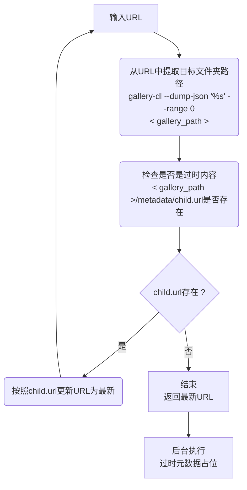
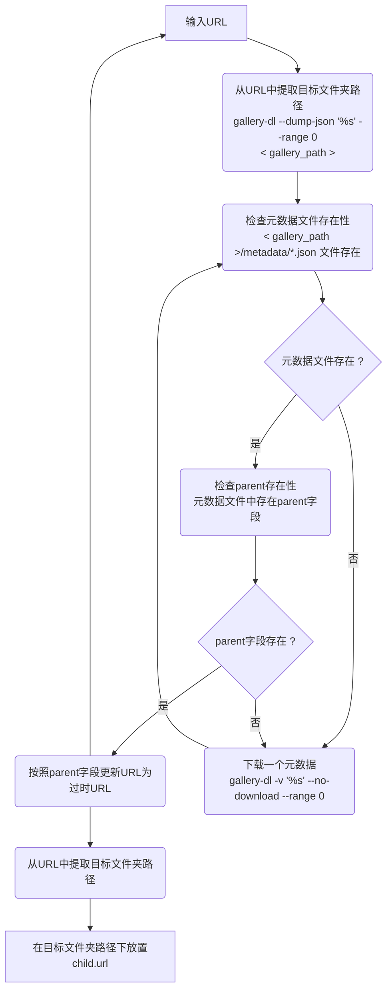
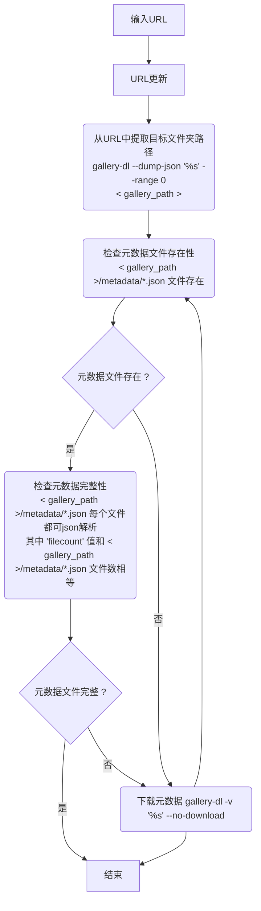
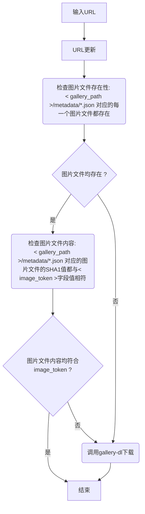

# ex-cd

高效下载E站gallery的所有历史数据

* 尽量避免集中数据库，能放进文件夹的数据尽量放进文件夹
* 尽量减少请求操作，能只用读文件的尽量只读文件
* 尽量减少文件读写操作，能只用读文件列表的尽量只读文件列表

## Usage

```sh
python -m ex_cd -c .vscode/config.json https://exhentai.org/g/2635845/ecbc9d9681/
```

```sh
python -m ex_cd -c <a json string> https://exhentai.org/g/2635845/ecbc9d9681/
```

You can see the example config file: `.vscode/config.json`

You can also set an `EXCD_CONFIG_FILE` env to specify a file, and the config in this file will be overridden by the config specified by `-c`:

```sh
export EXCD_CONFIG_FILE=".vscode/config.json"
python -m ex_cd -c <a json string> https://exhentai.org/g/2635845/ecbc9d9681/
```

You can see the example command line: `.vscode/launch.json`

## How does it work?

### URL更新



### 过时元数据占位



### 元数据下载



### 图片下载

!!!!!!!!! TODO: 确定是最新之后，元数据下载和图片下载同时进行 !!!!!!!!!

