# Extrai

<p align="center">
  
</p>

[](https://github.com/Telsho/Extrai/actions/workflows/main.yml)
[](https://codecov.io/gh/Telsho/Extrai)
[](https://www.python.org/downloads/release/python-3120/)
[](https://opensource.org/licenses/MIT)

[](https://docs.extrai.xyz)

## 📖 Description

With `extrai`, you can extract data from text documents with LLMs, which will be formatted into a given `SQLModel` and registered in your database.

The core of the library is its [Consensus Mechanism](https://docs.extrai.xyz/concepts/consensus_mechanism.html). We make the same request multiple times, using the same or different providers, and then select the values that meet a certain threshold.

`extrai` also has other features, like [generating `SQLModel`s](https://docs.extrai.xyz/how_to/generate_sql_model.html) from a prompt and documents, and [generating few-shot examples](https://docs.extrai.xyz/how_to/generate_example_json.html). For complex, nested data, the library offers [Hierarchical Extraction](https://docs.extrai.xyz/how_to/handle_complex_data_with_hierarchical_extraction.html), breaking down the extraction into manageable, hierarchical steps. It also includes [built-in analytics](https://docs.extrai.xyz/analytics_collector.html) to monitor performance and output quality.

## ✨ Key Features

- **[Consensus Mechanism](https://docs.extrai.xyz/concepts/consensus_mechanism.html)**: Improves extraction accuracy by consolidating multiple LLM outputs.
- **[Dynamic SQLModel Generation](https://docs.extrai.xyz/sqlmodel_generator.html)**: Generate `SQLModel` schemas from natural language descriptions.
- **[Hierarchical Extraction](https://docs.extrai.xyz/how_to/handle_complex_data_with_hierarchical_extraction.html)**: Handles complex, nested data by breaking down the extraction into manageable, hierarchical steps.
- **[Extensible LLM Support](https://docs.extrai.xyz/llm_providers.html)**: Integrates with various LLM providers through a client interface.
- **[Built-in Analytics](https://docs.extrai.xyz/analytics_collector.html)**: Collects metrics on LLM performance and output quality to refine prompts and monitor errors.
- **[Workflow Orchestration](https://docs.extrai.xyz/workflow_orchestrator.html)**: A central orchestrator to manage the extraction pipeline.
- **[Example JSON Generation](https://docs.extrai.xyz/example_json_generator.html)**: Automatically generate few-shot examples to improve extraction quality.
- **[Customizable Prompts](https://docs.extrai.xyz/how_to/customize_extraction_prompts.html)**: Customize prompts at runtime to tailor the extraction process to specific needs.
- **[Rotating LLMs providers](https://docs.extrai.xyz/how_to/using_multiple_llm_providers.html)**: Create the JSON revisions from multiple LLM providers.

## 📚 Documentation

For a complete guide, please see the full documentation. Here are the key sections:

- **Getting Started**
  - [Introduction](https://docs.extrai.xyz/introduction.html)
  - [Installation](https://docs.extrai.xyz/installation.html)
  - [Step-by-Step Tutorial](https://docs.extrai.xyz/getting_started.html)
- **How-to Guides**
  - [Generate SQLModel Dynamically](https://docs.extrai.xyz/how_to/generate_sql_model.html)
  - [Generate Few-shot Examples](https://docs.extrai.xyz/how_to/generate_example_json.html)
  - [Customize Prompts](https://docs.extrai.xyz/how_to/customize_extraction_prompts.html)
  - [Handle Complex Data with Hierarchical Extraction](https://docs.extrai.xyz/how_to/handle_complex_data_with_hierarchical_extraction.html)
  - [Using Multiple LLM Providers](https://docs.extrai.xyz/how_to/using_multiple_llm_providers.html)
- **Core Concepts**
  - [Architecture Overview](https://docs.extrai.xyz/concepts/architecture_overview.html)
  - [Consensus Mechanism](https://docs.extrai.xyz/concepts/consensus_mechanism.html)
- **Reference**
  - [Workflow Orchestrator](https://docs.extrai.xyz/workflow_orchestrator.html)
  - [SQLModel Generator](https://docs.extrai.xyz/sqlmodel_generator.html)
  - [Example JSON Generator](https://docs.extrai.xyz/example_json_generator.html)
  - [Analytics Collector](https://docs.extrai.xyz/analytics_collector.html)
  - [LLM Providers](https://docs.extrai.xyz/llm_providers.html)
- **API Reference**
  - [API Documentation](https://docs.extrai.xyz/api/modules.html)
- **Community**
  - [Contributing Guide](https://docs.extrai.xyz/contributing.html)

## ⚙️ Worflow Overview

The library is built around a few key components that work together to manage the extraction workflow. The following diagram illustrates the high-level workflow (see [Architecture Overview](https://docs.extrai.xyz/concepts/architecture_overview.html)):

```mermaid
graph TD
    %% Define styles for different stages for better colors
    classDef inputStyle fill:#f0f9ff,stroke:#0ea5e9,stroke-width:2px,color:#0c4a6e
    classDef processStyle fill:#eef2ff,stroke:#6366f1,stroke-width:2px,color:#3730a3
    classDef consensusStyle fill:#fffbeb,stroke:#f59e0b,stroke-width:2px,color:#78350f
    classDef outputStyle fill:#f0fdf4,stroke:#22c55e,stroke-width:2px,color:#14532d
    classDef modelGenStyle fill:#fdf4ff,stroke:#a855f7,stroke-width:2px,color:#581c87

    subgraph "Inputs (Static Mode)"
        A["📄<br/>Documents"]
        B["🏛️<br/>SQLAlchemy Models"]
        L1["🤖<br/>LLM"]
    end

    subgraph "Inputs (Dynamic Mode)"
        C["📋<br/>Task Description<br/>(User Prompt)"]
        D["📚<br/>Example Documents"]
        L2["🤖<br/>LLM"]
    end

    subgraph "Model Generation<br/>(Optional)"
        MG("🔧<br/>Generate SQLModels<br/>via LLM")
    end

    subgraph "Data Extraction"
        EG("📝<br/>Example Generation<br/>(Optional)")
        P("✍️<br/>Prompt Generation")
        
        subgraph "LLM Extraction Revisions"
            direction LR
            E1("🤖<br/>Revision 1")
            H1("💧<br/>SQLAlchemy Hydration 1")
            E2("🤖<br/>Revision 2")
            H2("💧<br/>SQLAlchemy Hydration 2")
            E3("🤖<br/>...")
            H3("💧<br/>...")
        end
        
        F("🤝<br/>JSON Consensus")
        H("💧<br/>SQLAlchemy Hydration")
    end

    subgraph Outputs
        SM["🏛️<br/>Generated SQLModels<br/>(Optional)"]
        O["✅<br/>Hydrated Objects"]
        DB("💾<br/>Database Persistence<br/>(Optional)")
    end

    %% Connections for Static Mode
    L1 --> P
    A --> P
    B --> EG
    EG --> P
    P --> E1
    P --> E2
    P --> E3
    E1 --> H1
    E2 --> H2
    E3 --> H3
    H1 --> F
    H2 --> F
    H3 --> F
    F --> H
    H --> O
    H --> DB

    %% Connections for Dynamic Mode
    L2 --> MG
    C --> MG
    D --> MG
    MG --> EG
    EG --> P

    MG --> SM

    %% Apply styles
    class A,B,C,D,L1,L2 inputStyle;
    class P,E1,E2,E3,H,EG processStyle;
    class F consensusStyle;
    class O,DB,SM outputStyle;
    class MG modelGenStyle;
```



## ▶️ Getting Started

### 📦 Installation

Install the library from PyPI:

```bash
pip install extrai-workflow
```

### ✨ Usage Example

For a more detailed guide, please see the **[Getting Started Tutorial](https://docs.extrai.xyz/getting_started.html)**.

Here is a minimal example:

```python
import asyncio
from typing import Optional
from sqlmodel import Field, SQLModel, create_engine, Session
from extrai.core import WorkflowOrchestrator
from extrai.llm_providers.huggingface_client import HuggingFaceClient

# 1. Define your data model
class Product(SQLModel, table=True):
    id: Optional[int] = Field(default=None, primary_key=True)
    name: str
    price: float

# 2. Set up the orchestrator
llm_client = HuggingFaceClient(api_key="YOUR_HF_API_KEY")
engine = create_engine("sqlite:///:memory:")
orchestrator = WorkflowOrchestrator(
    llm_client=llm_client,
    db_engine=engine,
    root_model=Product,
)

# 3. Run the extraction and verify
text = "The new SuperWidget costs $99.99."
with Session(engine) as session:
    asyncio.run(orchestrator.synthesize_and_save([text], db_session=session))
    product = session.query(Product).first()
    print(product)
    # Expected: name='SuperWidget' price=99.99 id=1
```

### 🚀 More Examples

For more in-depth examples, see the [`/examples`](https://github.com/Telsho/Extrai/tree/main/examples) directory in the repository.

## 🙌 Contributing

We welcome contributions! Please see the **[Contributing Guide](https://docs.extrai.xyz/contributing.html)** for details on how to set up your development environment, run tests, and submit a pull request.

## 📜 License

This project is licensed under the MIT License - see the [LICENSE](LICENSE) file for details.
