# Core Concepts

Welcome to Flock! This page introduces the fundamental concepts that make Flock different from traditional AI agent frameworks.

**If you're coming from other frameworks:** Flock takes a different architectural approach—blackboard-first with declarative type contracts. The mental shift takes 10 minutes, but it's worth it.

---

## What is Flock?

**Flock is a production-focused framework for orchestrating AI agents through declarative type contracts and blackboard architecture.**

Instead of writing prompts and defining workflow graphs, you:
1. **Define typed artifacts** (Pydantic models that describe your data)
2. **Declare agent subscriptions** (what agents consume and produce)
3. **Let workflows emerge** from type-based subscriptions

**Think of it like publish-subscribe for AI agents:** Agents watch the blackboard for data they care about, process it, and publish results back. No hardcoded edges. No prompt engineering. Just clean, composable contracts.

---

## The Four Core Concepts

### 1. Flock (The Orchestrator)

**The `Flock` is your system's coordinator.** It manages the blackboard, tracks agents, handles execution, and provides observability.

```python
from flock import Flock

flock = Flock("openai/gpt-4.1")  # Create with your LLM
```

**What the Flock does:**
- Maintains the shared blackboard (artifact store)
- Tracks all registered agents
- Resolves subscriptions (which agents consume which artifacts)
- Coordinates parallel execution
- Provides dashboard and tracing

**You create one `Flock` instance per application.**

#### How the Orchestrator Works

Here's how the Flock orchestrates everything:

```mermaid
graph TD
    subgraph "📥 Input"
        User[👤 User Code] -->|1. publish artifact| Orchestrator
    end

    subgraph "🎯 Orchestrator Flock"
        Orchestrator[🎯 Flock Orchestrator]
        Registry[📋 Agent Registry]
        Subscriptions[🔗 Subscription Matcher]
        Blackboard[(🗂️ Blackboard<br/>Artifact Store)]

        Orchestrator -->|manages| Registry
        Orchestrator -->|maintains| Blackboard
        Orchestrator -->|uses| Subscriptions

        Subscriptions -->|reads| Registry
        Subscriptions -->|queries| Blackboard
    end

    subgraph "🤖 Agent Pool"
        A1[Agent A<br/>consumes: X<br/>publishes: Y]
        A2[Agent B<br/>consumes: X<br/>publishes: Z]
        A3[Agent C<br/>consumes: Y,Z<br/>publishes: W]
    end

    Orchestrator -->|2. find matching agents| Subscriptions
    Subscriptions -->|3. return matches| Orchestrator
    Orchestrator -->|4. trigger in parallel| A1
    Orchestrator -->|4. trigger in parallel| A2

    A1 -->|5a. read input| Blackboard
    A2 -->|5b. read input| Blackboard

    A1 -->|6a. write output Y| Blackboard
    A2 -->|6b. write output Z| Blackboard

    Blackboard -->|7. notify new artifacts| Orchestrator
    Orchestrator -->|8. find next matches| Subscriptions
    Subscriptions -->|9. Agent C matches Y+Z| Orchestrator
    Orchestrator -->|10. trigger Agent C| A3

    A3 -->|11. read Y+Z| Blackboard
    A3 -->|12. write W| Blackboard

    Blackboard -->|13. all agents idle| Orchestrator
    Orchestrator -->|14. return results| User

    style Orchestrator fill:#4f46e5,stroke:#333,stroke-width:3px,color:#fff
    style Blackboard fill:#10b981,stroke:#333,stroke-width:2px,color:#fff
    style A1 fill:#f59e0b,stroke:#333,stroke-width:2px,color:#000
    style A2 fill:#f59e0b,stroke:#333,stroke-width:2px,color:#000
    style A3 fill:#f59e0b,stroke:#333,stroke-width:2px,color:#000
```



**Orchestration Flow:**

1. **Artifact Published** - User publishes artifact to blackboard
2. **Subscription Matching** - Orchestrator finds agents subscribed to that type
3. **Parallel Execution** - All matching agents triggered simultaneously (A1 + A2)
4. **Agents Process** - Agents read inputs, transform data, write outputs
5. **Cascade Trigger** - New artifacts (Y, Z) trigger next wave of agents
6. **Dependency Resolution** - Agent C waits until both Y and Z are available
7. **Completion** - When no more work remains, orchestrator returns results

**Key Insight:** The orchestrator doesn't know the workflow structure upfront. It emerges from type subscriptions!

### 2. Agent (The Worker)

**Agents are autonomous workers that transform data.** Each agent subscribes to input types and publishes output types.

```python
analyzer = (
    flock.agent("sentiment_analyzer")
    .description("Analyzes customer sentiment from reviews")
    .consumes(CustomerReview)
    .publishes(SentimentAnalysis)
)
```

**What defines an agent:**
- **Name** - Unique identifier (e.g., `sentiment_analyzer`)
- **Description** - Optional, improves coordination and debugging
- **Consumes** - Input artifact type(s) it watches for
- **Publishes** - Output artifact type(s) it produces

**Key principle:** Agents don't call each other directly. They subscribe to data types on the blackboard.

### 3. Artifact (The Data)

**Artifacts are validated Pydantic models published to the blackboard.** Every piece of data in the system is an artifact.

```python
from pydantic import BaseModel, Field
from flock import flock_type

@flock_type
class SentimentAnalysis(BaseModel):
    sentiment: str = Field(pattern="^(Positive|Neutral|Negative)$")
    confidence: float = Field(ge=0.0, le=1.0)
    key_themes: list[str]
```

**Why Pydantic models:**
- ✅ **Runtime validation** - Ensures data quality
- ✅ **Type safety** - Catch errors at artifact creation, not in production
- ✅ **Self-documenting** - Schema shows exactly what data looks like
- ✅ **Future-proof** - Survives model upgrades (GPT-6 will still understand schemas)

**The `@flock_type` decorator** registers your model so agents can subscribe to it.

### 4. Blackboard (The Shared Workspace)

**The blackboard is a shared data store where agents publish and consume artifacts.** Think of it as a bulletin board in a newsroom—agents post their work, others read and respond.

```python
# Publish artifact to blackboard
await flock.publish(CustomerReview(text="Great product!", rating=5))

# Run until all agents finish processing
await flock.run_until_idle()

# Retrieve results from blackboard
analyses = await flock.store.get_by_type(SentimentAnalysis)
```

**How the blackboard works:**
1. **Artifact published** → Appears on blackboard
2. **Matching agents triggered** → All agents subscribed to that type activate
3. **Parallel execution** → Multiple agents process concurrently
4. **Results published** → Output artifacts appear on blackboard
5. **Cascade continues** → Downstream agents trigger automatically

**Why this matters:** Workflows emerge from subscriptions. Add a new agent? Just subscribe it to relevant types. No graph rewiring needed.

---

## Mental Model: Blackboard vs Traditional Workflows

### Traditional Approach (Graph-Based)

```python
# Explicit workflow with hardcoded edges
workflow.add_node("bug_detector")
workflow.add_node("security_auditor")
workflow.add_node("final_reviewer")

# Manually wire edges
workflow.add_edge("bug_detector", "final_reviewer")
workflow.add_edge("security_auditor", "final_reviewer")

# Want to add performance_analyzer? Rewrite the graph
workflow.add_node("performance_analyzer")
workflow.add_edge("performance_analyzer", "final_reviewer")  # Must update final_reviewer
```

**Problems:**
- ❌ **Tight coupling** - Agents explicitly reference each other
- ❌ **Rigid topology** - Add new agent? Rewrite edges
- ❌ **No parallelism** - Sequential execution unless manually configured
- ❌ **Orchestrator knows all** - God object anti-pattern

### Flock Approach (Blackboard-Based)

```python
# Agents subscribe to types (no edges!)
bug_detector = flock.agent("bugs").consumes(CodeSubmission).publishes(BugAnalysis)
security_auditor = flock.agent("security").consumes(CodeSubmission).publishes(SecurityAnalysis)
final_reviewer = flock.agent("reviewer").consumes(BugAnalysis, SecurityAnalysis).publishes(FinalReview)

# Want to add performance_analyzer? Just subscribe it
performance_analyzer = flock.agent("perf").consumes(CodeSubmission).publishes(PerfAnalysis)
# Done! No graph rewiring. final_reviewer can optionally consume PerfAnalysis if updated.
```

**Benefits:**
- ✅ **Loose coupling** - Agents only know about data types, not each other
- ✅ **Flexible topology** - Add agents without rewiring
- ✅ **Automatic parallelism** - bug_detector + security_auditor run concurrently
- ✅ **Automatic dependencies** - final_reviewer waits for both inputs
- ✅ **Scalable** - O(n) complexity, not O(n²) edges

---

## When to Use Flock

### ✅ Flock is Great For

**Multi-agent orchestration with:**
- Multiple agents processing same data type (parallel analysis)
- Complex dependency chains (A → B+C → D)
- Conditional routing based on data content
- Multi-tenant systems requiring data isolation
- Production systems needing observability and safety

**Example use cases:**
- Code review (parallel: bugs, security, style → aggregate)
- Content moderation (detect → review → decide)
- Medical diagnosis (xray + labs → diagnosis)
- Document processing (extract → analyze → summarize)
- Trading systems (signals + sentiment → decision)

### ❌ When to Use Something Else

**Not ideal for:**
- Single-agent tasks (use LiteLLM or OpenAI SDK directly)
- Simple sequential chains (A → B → C with no branching)
- Stateful conversations requiring memory across turns
- Real-time streaming responses (Flock is batch-oriented)

**If you need:**
- Conversational memory → Use LangChain/LangGraph
- Streaming responses → Use OpenAI SDK directly
- Single LLM call → Use LiteLLM

---

## Architecture Comparison

### Flock (Blackboard)

<p align="center">
  
</p>

**Key characteristics:**
- Agents subscribe to artifact types
- Workflows emerge from subscriptions
- Parallel execution by default
- Loose coupling (agents independent)

### Traditional Frameworks (Graph)

**Key characteristics:**
- Nodes and edges explicitly defined
- Workflows hardcoded in graph structure
- Sequential execution by default
- Tight coupling (nodes reference each other)

---

## Declarative Type Contracts (No Prompts!)

**Traditional approach:**
```python
prompt = """You are an expert bug analyst. When you receive code, analyze it for bugs.

OUTPUT FORMAT:
You MUST return valid JSON with this exact structure:
{
  "bugs_found": ["array of bug descriptions"],
  "severity": "Critical|High|Medium|Low|None",
  "confidence": "number between 0.0 and 1.0"
}

VALIDATION RULES:
- bugs_found: Must be an array of strings
- severity: Must be exactly one of: Critical, High, Medium, Low, None
- confidence: Must be between 0.0 and 1.0

[300 more lines explaining format...]
"""

result = llm.invoke(prompt)  # Hope for valid JSON
data = json.loads(result.content)  # Crashes in production 🔥
```

**The Flock way:**
```python
@flock_type
class BugAnalysis(BaseModel):
    bugs_found: list[str]
    severity: str = Field(pattern="^(Critical|High|Medium|Low|None)$")
    confidence: float = Field(ge=0.0, le=1.0)

# The schema IS the instruction. No prompt needed.
agent = flock.agent("bugs").consumes(CodeSubmission).publishes(BugAnalysis)
```

**Why this is better:**
- ✅ **Survives model upgrades** - GPT-6 will still understand Pydantic schemas
- ✅ **Runtime validation** - Errors caught at parse time, not production
- ✅ **Testable** - Mock inputs/outputs with concrete types
- ✅ **Self-documenting** - Code shows exactly what agent does
- ✅ **No prompt drift** - Can't accidentally break a 500-line prompt

---

## The Batching Pattern: Parallel Execution

**A key differentiator:** The separation of `publish()` and `run_until_idle()` enables batch processing with parallel execution.

```python
# ✅ EFFICIENT: Batch publish, then run in parallel
for review in customer_reviews:
    await flock.publish(review)  # Fast: just scheduling work

await flock.run_until_idle()  # All sentiment_analyzer agents run concurrently!

# Get all results
analyses = await flock.store.get_by_type(SentimentAnalysis)
# 100 analyses completed in ~1x single review processing time!
```

**Why this separation matters:**
- ⚡ **Parallel execution** - Process 100 reviews concurrently
- 🎯 **Batch control** - Publish multiple artifacts, execute once
- 🔄 **Multi-type workflows** - Publish different types, trigger different agents in parallel
- 📊 **Better performance** - Process 1000 items in time it takes to process 1

**Comparison:**
```python
# ❌ If run_until_idle() was automatic:
for review in customer_reviews:
    await flock.publish(review)  # Would wait for completion each time!
# Total time: 100x single execution (sequential)

# ✅ With explicit batching:
for review in customer_reviews:
    await flock.publish(review)  # Fast: just queuing
await flock.run_until_idle()
# Total time: ~1x single execution (parallel)
```

---

## Production Safety Features

Flock includes built-in safeguards to prevent common production failures:

### Circuit Breakers

**Prevent runaway costs from infinite loops:**

```python
flock = Flock("openai/gpt-4.1", max_agent_iterations=1000)
# After 1000 agent executions, system stops and raises error
```

**Why this matters:** An infinite feedback loop could cost thousands in API calls. Circuit breakers catch bugs before production damage.

### Feedback Loop Protection

**Prevent agents from triggering themselves infinitely:**

```python
critic = (
    flock.agent("critic")
    .consumes(Essay)
    .publishes(Critique)  # If Critique is also an Essay...
    .prevent_self_trigger(True)  # Won't consume its own output!
)
```

### Best-of-N Execution

**Run agent multiple times, pick best result:**

```python
analyzer = (
    flock.agent("analyzer")
    .consumes(DataPoint)
    .publishes(Analysis)
    .best_of(5, score=lambda result: result.confidence)
)
# Executes 5 times, publishes only highest-confidence result
```

**Use cases:**
- Quality assurance (run 3x, pick most confident)
- Consensus building (majority vote)
- Reliability (retry until good result)

---

## Logic Operations (AND/OR Gates)

**Control how agents wait for multiple artifacts with declarative logic gates.**

Flock supports three coordination patterns for multi-artifact subscriptions:

### AND Gates: Wait for ALL Types

**Syntax:** `.consumes(TypeA, TypeB)` in a single call

```python
# Diagnostician waits for BOTH X-ray AND lab results
diagnostician = (
    flock.agent("diagnostician")
    .consumes(XRayAnalysis, LabResults)  # AND gate: waits for both
    .publishes(Diagnosis)
)
```

**Timeline:**
```
t0: XRayAnalysis published → diagnostician WAITS (needs LabResults too)
t1: LabResults published → diagnostician TRIGGERS with both artifacts
```

### OR Gates: Trigger on ANY Type

**Syntax:** Chain multiple `.consumes()` calls

```python
# Alert handler triggers on EITHER system OR user alert
alert_handler = (
    flock.agent("alert_handler")
    .consumes(SystemAlert)      # OR
    .consumes(UserAlert)        # OR
    .publishes(AlertResponse)
)
```

**Timeline:**
```
t0: SystemAlert published → alert_handler TRIGGERS (doesn't need UserAlert)
t1: UserAlert published → alert_handler TRIGGERS AGAIN (independent subscription)
```

### Count-Based AND Gates: Wait for MULTIPLE Instances

**Syntax:** `.consumes(TypeA, TypeA, TypeA)` (repeat type N times)

```python
# Batch processor waits for THREE orders
batch_processor = (
    flock.agent("batch_processor")
    .consumes(Order, Order, Order)  # AND gate: waits for 3 Orders
    .publishes(BatchSummary)
)
```

**Timeline:**
```
t0: Order #1 published → batch_processor WAITS (needs 2 more)
t1: Order #2 published → batch_processor WAITS (needs 1 more)
t2: Order #3 published → batch_processor TRIGGERS with all 3 Orders
```

**Mixed Counts:**
```python
# Wait for 2 images AND 1 metadata document
validator = (
    flock.agent("validator")
    .consumes(Image, Image, Metadata)  # 2 Images + 1 Metadata
    .publishes(ValidationResult)
)
```

### Combining AND/OR Logic

**AND + OR Pattern:**
```python
# Trigger on (TypeA AND TypeB) OR TypeC
agent = (
    flock.agent("flexible_agent")
    .consumes(TypeA, TypeB)    # AND gate (waits for both)
    .consumes(TypeC)           # OR (independent trigger)
    .publishes(Result)
)
```

**Timeline:**
```
Scenario 1: TypeA + TypeB published → agent TRIGGERS
Scenario 2: TypeC published alone → agent TRIGGERS
Scenario 3: TypeA alone → agent WAITS (needs TypeB for AND gate)
```

**Key Principle:** Each `.consumes()` call creates a separate subscription (OR). Multiple types in one call create an AND gate.

[**👉 See complete AND/OR gate examples**](../guides/agents.md#logic-operations-andor-gates)

---

## Visibility Controls (Zero-Trust Security)

**Unlike other frameworks, Flock has zero-trust security built-in.** Control who sees what on the blackboard.

### Public (Default)

```python
agent.publishes(Article, visibility=PublicVisibility())
# Everyone can consume this
```

### Private (Explicit Allowlist)

```python
agent.publishes(MedicalRecord, visibility=PrivateVisibility(agents={"physician", "nurse"}))
# Only physician and nurse agents can consume
```

### Tenant (Multi-Tenancy)

```python
agent.publishes(CustomerData, visibility=TenantVisibility(tenant_id="customer_123"))
# Only agents with matching tenant_id can consume
```

### Labelled (RBAC)

```python
analyst = flock.agent("analyst").identity(AgentIdentity(
    name="analyst",
    labels={"clearance:secret", "role:intelligence"}
))
agent.publishes(IntelReport, visibility=LabelledVisibility(
    required_labels={"clearance:secret"}
))
# Only agents with "clearance:secret" label can consume
```

### After (Time-Delayed)

```python
agent.publishes(PressRelease, visibility=AfterVisibility(
    ttl=timedelta(hours=24),
    then=PublicVisibility()
))
# Invisible for 24 hours, then becomes public
```

**Why built-in security matters:** Financial services, healthcare, defense, SaaS platforms all need this for compliance. Other frameworks make you build it yourself.

[**👉 Learn more about visibility controls**](../guides/visibility.md)

---

## Execution Patterns

### invoke() vs run_until_idle()

**Two ways to execute agents:**

#### Direct Invocation (Unit Testing)

```python
# Execute agent directly with input (no cascade)
result = await flock.invoke(agent, input_artifact, publish_outputs=False)
```

**Use when:**
- Testing specific agent in isolation
- Debugging single agent behavior
- No need for downstream cascade

#### Full Cascade (Production)

```python
# Publish and run entire workflow
await flock.publish(input_artifact)
await flock.run_until_idle()
```

**Use when:**
- Running multi-agent workflows
- Production execution
- Need complete cascade of agent reactions

---

## Observability: Dashboard & Tracing

### Real-Time Dashboard

```python
await flock.serve(dashboard=True)
# Opens browser to http://localhost:8344
```

**Dual visualization modes:**
- **Agent View** - See agent communication patterns
- **Blackboard View** - Track data lineage and transformations

**Key features:**
- WebSocket streaming (live updates)
- Publish artifacts from UI (no code needed)
- Filter by correlation ID, time range
- Auto-layout for complex graphs
- Keyboard shortcuts (`Ctrl+M`, `Ctrl+F`, `Ctrl+P`)

[**👉 Learn more about the dashboard**](../guides/dashboard.md)

### Distributed Tracing (OpenTelemetry + DuckDB)

```python
# Enable tracing
export FLOCK_AUTO_TRACE=true
export FLOCK_TRACE_FILE=true

# Wrap workflows
async with flock.traced_run("workflow_name"):
    await flock.publish(data)
    await flock.run_until_idle()
```

**7 trace viewer modes:**
- Timeline (waterfall view)
- Statistics (sortable table)
- RED Metrics (rate, errors, duration)
- Dependencies (service communication)
- DuckDB SQL (interactive queries)
- Configuration (filtering)
- Guide (built-in docs)

[**👉 Learn more about tracing**](../guides/tracing/index.md)

---

## Quick Reference

### Basic Workflow

```python
from pydantic import BaseModel, Field
from flock import Flock, flock_type

# 1. Define artifacts
@flock_type
class Input(BaseModel):
    data: str

@flock_type
class Output(BaseModel):
    result: str = Field(min_length=10)

# 2. Create orchestrator
flock = Flock("openai/gpt-4.1")

# 3. Define agents
processor = flock.agent("processor").consumes(Input).publishes(Output)

# 4. Execute
async def main():
    await flock.publish(Input(data="process this"))
    await flock.run_until_idle()

    results = await flock.store.get_by_type(Output)
    print(results)

asyncio.run(main())
```

### Common Patterns

**Sequential Pipeline (A → B → C):**
```python
writer = flock.agent("writer").consumes(Topic).publishes(Draft)
editor = flock.agent("editor").consumes(Draft).publishes(EditedDraft)
publisher = flock.agent("publisher").consumes(EditedDraft).publishes(Article)
```

**Parallel-Then-Join with AND Gate (A+B → C):**
```python
bugs = flock.agent("bugs").consumes(Code).publishes(BugReport)
security = flock.agent("security").consumes(Code).publishes(SecurityReport)
# AND gate: reviewer waits for BOTH BugReport AND SecurityReport
reviewer = flock.agent("reviewer").consumes(BugReport, SecurityReport).publishes(FinalReview)
```

**OR Gate via Chaining (A OR B → C):**
```python
# OR gate: handler triggers on EITHER SystemAlert OR UserAlert
alert_handler = (
    flock.agent("alert_handler")
    .consumes(SystemAlert)      # Triggers on SystemAlert
    .consumes(UserAlert)        # OR triggers on UserAlert
    .publishes(AlertResponse)
)
```

**Count-Based AND Gate (3× A → B):**
```python
# Wait for THREE Order artifacts before triggering
batch_processor = (
    flock.agent("batch_processor")
    .consumes(Order, Order, Order)  # AND gate: waits for 3 Orders
    .publishes(BatchSummary)
)
```

**Fan-Out (A → B1, B2, ..., Bn):**
```python
editor = flock.agent("editor").consumes(Topic).publishes(StoryIdea)
# 8 journalists process StoryIdeas in parallel
for i in range(8):
    journalist = flock.agent(f"journalist_{i}").consumes(StoryIdea).publishes(Article)
```

**Conditional Routing:**
```python
urgent = flock.agent("urgent").consumes(
    BugReport,
    where=lambda bug: bug.severity in ["Critical", "High"]
).publishes(UrgentResponse)
```

---

## Historical Context: Why Blackboard?

**Blackboard architecture powered groundbreaking AI systems since the 1970s:**
- **Hearsay-II (1970s)** - Speech recognition system, proved blackboard viability
- **HASP/SIAP (1970s-80s)** - Submarine tracking, real-time distributed reasoning
- **BB1 (1980s)** - Control architecture for blackboard systems

**Why it worked then, and works now:**
- ✅ Multiple specialized agents with different expertise
- ✅ Agents work independently without knowing about each other
- ✅ Opportunistic problem-solving (act when data available)
- ✅ Graceful degradation (one agent fails, others continue)

**Modern twist:** Replace handcrafted rules with LLMs. The architecture remains sound.

---

## Next Steps

Now that you understand the core concepts, explore these guides:

- **[Quick Start](quick-start.md)** - Build your first agent in 5 minutes
- **[Agents Guide](../guides/agents.md)** - Deep dive into agent features
- **[Blackboard Guide](../guides/blackboard.md)** - Understand artifact flow patterns
- **[Visibility Guide](../guides/visibility.md)** - Secure multi-agent systems
- **[Dashboard Guide](../guides/dashboard.md)** - Real-time visualization
- **[Examples](https://github.com/whiteducksoftware/flock/tree/main/examples)** - Working code to learn from

---

## Summary

**The Four Core Concepts:**
1. **Flock** - The orchestrator (manages blackboard, tracks agents, coordinates execution)
2. **Agent** - Autonomous worker (subscribes to input types, publishes output types)
3. **Artifact** - Validated Pydantic model (all data on blackboard)
4. **Blackboard** - Shared data store (agents publish/consume artifacts)

**Key Principles:**
- Workflows emerge from type-based subscriptions
- Agents are loosely coupled (don't know about each other)
- Schemas replace prompts (declarative > imperative)
- Parallel execution by default
- Zero-trust security built-in

**When to Use Flock:**
- Multi-agent orchestration with parallel processing
- Complex dependency chains
- Production systems needing safety and observability
- Multi-tenant systems requiring data isolation

**Ready to build?** Head to the [Quick Start Guide](quick-start.md) to create your first agent!
