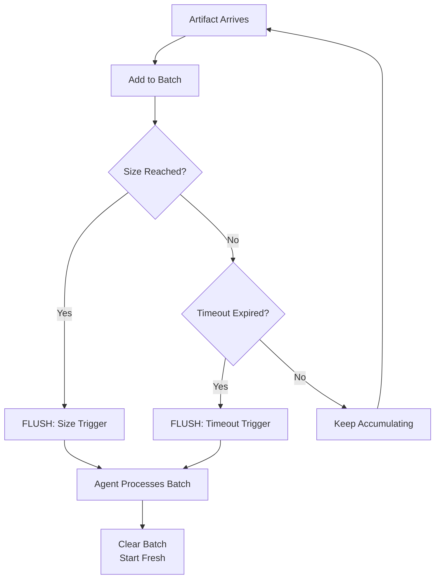

# Batch Processing: Efficient Bulk Operations with BatchSpec

**BatchSpec** enables agents to accumulate multiple artifacts before processing them together. This dramatically improves efficiency for operations that benefit from bulk processing.

**Common use cases:**
- **Cost optimization** - Batch 25 payment transactions = 1 API call instead of 25 ($5 savings per batch!)
- **Performance** - Analyze 100 customer reviews in one LLM call (100x faster)
- **Rate limiting** - Stay within API limits (100 requests/minute → 10 batches/minute)
- **Bulk operations** - Database batch inserts, bulk email sending, mass notifications
- **Trend analysis** - Aggregate data points for statistical analysis

---

## Quick Start

```python
from datetime import timedelta
from flock import Flock, flock_type
from flock.subscription import BatchSpec
from pydantic import BaseModel, Field

@flock_type
class Transaction(BaseModel):
    transaction_id: str
    customer_id: str
    amount: float
    payment_method: str

@flock_type
class PaymentBatchReport(BaseModel):
    batch_id: str
    transaction_count: int
    total_amount: float
    batch_fee: float
    savings: float

flock = Flock()

# 💰 Process payments in batches of 25 OR every 30 seconds
payment_processor = (
    flock.agent("payment_processor")
    .consumes(
        Transaction,
        batch=BatchSpec(
            size=25,  # 🔥 Flush when 25 transactions collected
            timeout=timedelta(seconds=30)  # 🔥 OR flush every 30 seconds
        )
    )
    .publishes(PaymentBatchReport)
)
```

**What happens:**
1. Transactions arrive and accumulate in batch
2. **Either** 25 transactions collected → **Flush!** ✅
3. **Or** 30 seconds pass → **Flush!** ✅ (even if only 10 transactions)
4. Agent processes entire batch together

**Result:** Process 25 transactions in 1 LLM call = 96% cost reduction!

---

## Reference Implementation: SimpleBatchEngine

Need a concrete starting point? The repository bundles [`SimpleBatchEngine`](../../src/flock/engines/examples/simple_batch_engine.py), a lightweight batch-aware engine that:

- Collects `BatchItem` artifacts via `BatchSpec(size=3)`
- Publishes a `BatchSummary` artifact describing batch size and values
- Demonstrates both `evaluate()` (single item) and `evaluate_batch()` (flush)

```python
from flock.engines.examples import SimpleBatchEngine
from flock.subscription import BatchSpec

(
    flock.agent("simple_batch")
    .consumes(BatchItem, batch=BatchSpec(size=3))
    .publishes(BatchSummary)
    .with_engines(SimpleBatchEngine())
)
```

Run the example end-to-end:

```bash
uv run python examples/05-engines/potion_batch_engine.py
```

And explore the associated tests for deeper validation:

```bash
uv run pytest tests/test_orchestrator_batchspec.py -k simple_batch_engine -v
```

---

## How BatchSpec Works

### Dual-Trigger System

BatchSpec uses **two flush triggers** (whichever happens first):

1. **Size Trigger** - Batch reaches configured size
2. **Timeout Trigger** - Time limit expires



### Example Timeline

```python
batch=BatchSpec(size=10, timeout=timedelta(seconds=30))

# Time = 0s: 5 transactions arrive → accumulating... (need 10)
# Time = 10s: 3 more transactions → 8 total, accumulating... (need 2 more)
# Time = 20s: 2 more transactions → 10 total → FLUSH! (size trigger)

# Time = 25s: 3 transactions arrive → accumulating... (need 7)
# Time = 55s: 30-second timeout expires → FLUSH! (timeout trigger, only 3 transactions)
```

**💡 Key insight:** Timeout ensures NO artifacts are lost! Partial batches always flush.

---

## BatchSpec Parameters

### `size=` - Batch Size Threshold

**Purpose:** Number of artifacts to collect before flushing

**Type:** `int` (positive integer)

**Examples:**

```python
# Small batch: Quick processing
batch=BatchSpec(size=5)

# Medium batch: Balance cost and latency
batch=BatchSpec(size=25)

# Large batch: Maximum cost optimization
batch=BatchSpec(size=100)
```

**Choosing batch size:**

| Use Case | Typical Size | Reasoning |
|----------|--------------|-----------|
| **Payment processing** | 25-50 | Transaction fee discounts kick in |
| **Customer reviews** | 10-20 | LLM context window limits |
| **IoT sensors** | 100-1000 | High-frequency data, efficiency matters |
| **Email notifications** | 50-100 | Bulk email API limits |
| **Database writes** | 100-500 | Minimize database round-trips |

**⚠️ Trade-offs:**
- **Larger size** = Better efficiency, higher latency
- **Smaller size** = Lower latency, less efficient

### `timeout=` - Maximum Wait Time

**Purpose:** Flush partial batches after time limit

**Type:** `timedelta` from Python's `datetime` module

**Examples:**

```python
from datetime import timedelta

# Quick flush: 5-second timeout
batch=BatchSpec(size=100, timeout=timedelta(seconds=5))

# Balanced: 30-second timeout
batch=BatchSpec(size=25, timeout=timedelta(seconds=30))

# Patient: 5-minute timeout
batch=BatchSpec(size=100, timeout=timedelta(minutes=5))

# Very patient: 1-hour timeout
batch=BatchSpec(size=1000, timeout=timedelta(hours=1))
```

**Choosing timeout:**

| Priority | Timeout | Use Case |
|----------|---------|----------|
| **Latency-critical** | 5-30 seconds | Real-time notifications |
| **Balanced** | 1-5 minutes | General batch processing |
| **Cost-optimized** | 10-60 minutes | Background analytics |

**⚠️ Important:** Timeout is **per batch**, not global! Timer resets after each flush.

---

## Common Patterns

### Pattern 1: Cost-Optimized Payment Processing

**Scenario:** Reduce transaction fees by batching

```python
@flock_type
class Transaction(BaseModel):
    txn_id: str
    amount: float
    merchant_id: str

# Individual: $0.30 per transaction
# Batch (25+): $0.10 per transaction
# Savings: $0.20 × 25 = $5.00 per batch!

payment_processor = (
    flock.agent("payments")
    .consumes(
        Transaction,
        batch=BatchSpec(
            size=25,  # Minimum for bulk discount
            timeout=timedelta(seconds=30)  # Don't wait too long
        )
    )
    .publishes(BatchReceipt)
)
```

### Pattern 2: Sentiment Analysis at Scale

**Scenario:** Analyze 100 customer reviews in one LLM call

```python
@flock_type
class CustomerReview(BaseModel):
    review_id: str
    rating: int
    text: str

sentiment_analyzer = (
    flock.agent("sentiment")
    .consumes(
        CustomerReview,
        batch=BatchSpec(
            size=100,  # Analyze 100 reviews together
            timeout=timedelta(minutes=5)  # Flush every 5 min
        )
    )
    .publishes(SentimentTrendReport)
)
```

**Cost comparison:**
- **Without batching:** 100 reviews × 1 API call = 100 LLM calls
- **With batching:** 100 reviews ÷ 1 batch = 1 LLM call
- **Savings:** 99% cost reduction!

### Pattern 3: Database Bulk Insert

**Scenario:** Batch database writes for performance

```python
@flock_type
class LogEntry(BaseModel):
    timestamp: str
    level: str
    message: str
    source: str

log_writer = (
    flock.agent("log_writer")
    .consumes(
        LogEntry,
        batch=BatchSpec(
            size=500,  # Bulk insert 500 rows
            timeout=timedelta(seconds=10)  # Flush every 10 sec
        )
    )
    .publishes(WriteConfirmation)
)
```

**Performance gain:**
- **Without batching:** 500 INSERT statements = 500 round-trips
- **With batching:** 1 bulk INSERT = 1 round-trip
- **Speedup:** 50-100x faster!

### Pattern 4: Rate Limit Management

**Scenario:** Stay within API limits (100 requests/minute)

```python
# API limit: 100 requests/minute
# Solution: Batch 10 items per request = 10 requests/minute

api_client = (
    flock.agent("api_client")
    .consumes(
        APIRequest,
        batch=BatchSpec(
            size=10,  # 10 items per API call
            timeout=timedelta(seconds=6)  # 6 sec × 10 batches = 60 sec
        )
    )
    .publishes(APIResponse)
)

# Result: 10 requests/minute (10x under limit!)
```

### Pattern 5: IoT Sensor Aggregation

**Scenario:** Aggregate 1000 sensor readings for statistics

```python
@flock_type
class SensorReading(BaseModel):
    device_id: str
    temperature: float
    humidity: float
    timestamp: str

stats_calculator = (
    flock.agent("stats")
    .consumes(
        SensorReading,
        batch=BatchSpec(
            size=1000,  # Statistical significance
            timeout=timedelta(minutes=10)  # Report every 10 min
        )
    )
    .publishes(StatisticsReport)
)
```

---

## Combining with Other Features

### BatchSpec + Predicates

**Filter before batching:**

```python
# Only batch high-value orders
vip_batcher = (
    flock.agent("vip_batch")
    .consumes(
        Order,
        where=lambda o: o.amount > 1000,  # 🎯 Filter first!
        batch=BatchSpec(size=10, timeout=timedelta(minutes=5))  # 📦 Then batch!
    )
    .publishes(VIPBatchReport)
)
```

**How it works:**
1. Predicate filters orders (only `amount > 1000`)
2. Filtered orders accumulate in batch
3. Batch flushes when 10 high-value orders collected
4. Agent processes batch of VIP orders

### BatchSpec + JoinSpec (Combined Features!)

**Correlate, then batch:**

```python
# Smart factory: Correlate sensors, then batch for analysis
quality_control = (
    flock.agent("qc")
    .consumes(
        TemperatureSensor,
        PressureSensor,
        join=JoinSpec(
            by=lambda x: x.device_id,
            within=timedelta(seconds=30)
        ),  # 🔗 Correlate first!
        batch=BatchSpec(
            size=5,  # 📦 Then batch 5 correlated pairs!
            timeout=timedelta(seconds=45)
        )
    )
    .publishes(QualityReport)
)
```

**How it works:**
1. JoinSpec correlates temp + pressure by `device_id`
2. Each correlated pair = ONE batch item
3. BatchSpec accumulates 5 pairs
4. Agent processes 5 devices (10 sensors) together

**💡 Key insight:** `BatchSpec(size=5)` counts **correlation groups**, not individual artifacts!

### BatchSpec + Visibility

**Batch with access control:**

```python
from flock.core.visibility import TenantVisibility

# Multi-tenant batch processing
tenant_batcher = (
    flock.agent("tenant_batch")
    .consumes(
        Event,
        batch=BatchSpec(size=50, timeout=timedelta(minutes=5))
    )
    .publishes(
        BatchReport,
        visibility=TenantVisibility(tenant_id_extractor=lambda r: r.tenant_id)
    )
)
```

---

## Best Practices

### ✅ Do

**1. Choose appropriate batch sizes**

```python
# ✅ Good: Size matches business constraint
batch=BatchSpec(
    size=25,  # Transaction fee discount at 25
    timeout=timedelta(seconds=30)
)

# ❌ Bad: Arbitrary size
batch=BatchSpec(
    size=17,  # Why 17? No business justification
    timeout=timedelta(seconds=42)  # Random timeout
)
```

**2. Always set timeout**

```python
# ✅ Good: Timeout prevents indefinite waiting
batch=BatchSpec(size=100, timeout=timedelta(minutes=5))

# ❌ Bad: No timeout (what if only 99 items arrive?)
batch=BatchSpec(size=100)  # Missing timeout!
```

**3. Monitor batch efficiency**

```python
@flock_type
class BatchMetrics(BaseModel):
    batch_size: int  # Actual items in batch
    flush_reason: str  # "size" or "timeout"
    efficiency: float  # batch_size / configured_size

# Track efficiency to tune batch parameters
```

**4. Document cost savings**

```python
# ✅ Good: Clear business value
payment_processor = (
    flock.agent("payments")
    .description(
        "Batches 25 transactions to save $5.00 per batch "
        "in transaction fees (bulk discount from $0.30 to $0.10 per txn)"
    )
    .consumes(Transaction, batch=BatchSpec(size=25, timeout=timedelta(seconds=30)))
    .publishes(PaymentBatch)
)
```

### ❌ Don't

**1. Don't batch if order matters**

```python
# ❌ Bad: Batching breaks strict ordering
message_sender = (
    flock.agent("messenger")
    .consumes(ChatMessage, batch=BatchSpec(size=10))  # Messages out of order!
    .publishes(DeliveryReceipt)
)

# ✅ Good: Process sequentially
message_sender = (
    flock.agent("messenger")
    .consumes(ChatMessage)  # No batching, strict order preserved
    .publishes(DeliveryReceipt)
)
```

**2. Don't use huge batches for latency-critical work**

```python
# ❌ Bad: 5-minute latency for fraud detection
fraud_detector = (
    flock.agent("fraud")
    .consumes(Transaction, batch=BatchSpec(size=1000, timeout=timedelta(minutes=5)))
    .publishes(FraudAlert)
)

# ✅ Good: Fast fraud detection (no batching!)
fraud_detector = (
    flock.agent("fraud")
    .consumes(Transaction)  # Process immediately!
    .publishes(FraudAlert)
)
```

**3. Don't batch if individual processing is faster**

```python
# ❌ Bad: Batching overhead > individual processing
simple_transformer = (
    flock.agent("transform")
    .consumes(Data, batch=BatchSpec(size=10))  # Overhead for simple task
    .publishes(TransformedData)
)

# ✅ Good: Individual processing for simple tasks
simple_transformer = (
    flock.agent("transform")
    .consumes(Data)  # Direct transform, no batching
    .publishes(TransformedData)
)
```

**4. Don't forget timeout for low-volume data**

```python
# ❌ Bad: Batch might never flush (low volume)
batch=BatchSpec(size=1000)  # What if only 100 items/day arrive?

# ✅ Good: Timeout ensures flush
batch=BatchSpec(size=1000, timeout=timedelta(hours=1))  # Flush hourly
```

---

## Performance Considerations

### Latency vs. Efficiency Trade-off

**Batching introduces latency:**

```python
# Scenario: batch=BatchSpec(size=25, timeout=timedelta(seconds=30))

# Case 1: High volume (25 txns arrive in 5 seconds)
# Latency: 5 seconds (size trigger)
# Efficiency: 100% (full batch)

# Case 2: Low volume (10 txns in 30 seconds)
# Latency: 30 seconds (timeout trigger)
# Efficiency: 40% (partial batch: 10/25)
```

**Optimization strategies:**

```python
# High volume: Prioritize efficiency
batch=BatchSpec(size=100, timeout=timedelta(minutes=5))

# Low volume: Prioritize latency
batch=BatchSpec(size=10, timeout=timedelta(seconds=10))

# Balanced: Dynamic trade-off
batch=BatchSpec(size=50, timeout=timedelta(seconds=30))
```

### Memory Usage

**Batch accumulation uses memory:**

```python
# Example: 1000 sensor readings × 1KB each = 1MB per batch
batch=BatchSpec(size=1000)

# If timeout is 1 hour and readings arrive every second:
# Peak memory: 3600 readings × 1KB = 3.6MB
batch=BatchSpec(size=1000, timeout=timedelta(hours=1))
```

**Memory optimization:**

```python
# ✅ Good: Reasonable batch size and timeout
batch=BatchSpec(size=100, timeout=timedelta(minutes=5))

# ❌ Bad: Huge batches + long timeout
batch=BatchSpec(size=100000, timeout=timedelta(days=1))  # GBs of memory!
```

### Timeout Checking

Flock periodically checks for batch timeouts:

```python
# Manual timeout check (for testing)
await flock._check_batch_timeouts()

# In production, this happens automatically
```

**Performance impact:**
- O(n) scan of active batches
- Runs asynchronously (doesn't block agents)
- Minimal overhead (< 1ms typical)

---

## Debugging BatchSpec

### Monitor Batch Efficiency

```python
# Track flush reasons
@flock_type
class BatchReport(BaseModel):
    items_processed: int
    configured_size: int
    flush_trigger: str  # "size" or "timeout"
    efficiency_pct: float  # items / configured_size

# Calculate efficiency
def calculate_efficiency(items: int, size: int, trigger: str) -> dict:
    return {
        "items_processed": items,
        "configured_size": size,
        "flush_trigger": trigger,
        "efficiency_pct": (items / size) * 100
    }
```

### Query Batch State

```python
# Check active batches
active_batches = flock._batch_engine.batches

for (agent_name, sub_index), accumulator in active_batches.items():
    print(f"{agent_name}: {len(accumulator.artifacts)} items waiting")
    print(f"  Created: {accumulator.created_at}")
    print(f"  Timeout: {accumulator.batch_spec.timeout}")
```

### Trace with DuckDB

```bash
export FLOCK_AUTO_TRACE=true
export FLOCK_TRACE_FILE=true
```

```python
import duckdb
conn = duckdb.connect('.flock/traces.duckdb', read_only=True)

# Find batch flush events
batches = conn.execute("""
    SELECT
        name,
        attributes->'$.batch_size' as size,
        attributes->'$.flush_reason' as reason,
        duration_ms
    FROM spans
    WHERE name LIKE '%batch%'
    ORDER BY start_time DESC
    LIMIT 20
""").fetchall()

for name, size, reason, duration in batches:
    print(f"{name}: {size} items, {reason} trigger, {duration}ms")
```

---

## Real-World Examples

### Example 1: E-Commerce Transaction Batching

**Scenario:** Reduce payment processing fees by 80%

```python
@flock_type
class Transaction(BaseModel):
    txn_id: str
    customer_id: str
    amount: float
    payment_method: str

@flock_type
class PaymentBatch(BaseModel):
    batch_id: str
    transaction_count: int
    total_amount: float
    transaction_fee: float
    savings: float
    processing_time: str

# Pricing:
# - Individual: $0.30 per transaction
# - Batch (25+): $0.10 per transaction
# - Savings: $0.20 × 25 = $5.00 per batch

payment_processor = (
    flock.agent("payment_processor")
    .description(
        "Processes payment batches to minimize transaction fees. "
        "Batches up to 25 orders or flushes every 30 seconds. "
        "Saves $5.00 per batch!"
    )
    .consumes(
        Transaction,
        batch=BatchSpec(
            size=25,  # Minimum for bulk discount
            timeout=timedelta(seconds=30)  # Maximum 30s latency
        )
    )
    .publishes(PaymentBatch)
)

# Agent implementation calculates savings:
def calculate_savings(batch: list[Transaction]) -> float:
    individual_cost = len(batch) * 0.30
    batch_cost = len(batch) * 0.10
    return individual_cost - batch_cost

# Result: $5.00 saved per full batch!
```

### Example 2: Customer Support Ticket Batching

**Scenario:** Analyze 20 support tickets together for trends

```python
@flock_type
class SupportTicket(BaseModel):
    ticket_id: str
    category: str
    priority: str
    description: str

@flock_type
class TrendAnalysis(BaseModel):
    common_issues: list[str]
    sentiment_trend: str
    recommended_actions: list[str]
    ticket_count: int

trend_analyzer = (
    flock.agent("trend_analyzer")
    .consumes(
        SupportTicket,
        batch=BatchSpec(
            size=20,  # Statistical significance
            timeout=timedelta(minutes=10)  # Report every 10 min
        )
    )
    .publishes(TrendAnalysis)
)
```

---

## Next Steps

- **[Join Operations](join-operations.md)** - Combine with JoinSpec for correlation + batching
- **[Predicates](predicates.md)** - Filter before batching
- **[Agent Guide](agents.md)** - Complete agent patterns
- **[Examples: Payment Batching](../../examples/01-cli/14_ecommerce_batch_processing.py)** - Full working example

---

## Quick Reference

| Parameter | Type | Purpose | Example |
|-----------|------|---------|---------|
| **`size=`** | `int` | Batch size threshold | `size=25` |
| **`timeout=`** | `timedelta` | Maximum wait time | `timeout=timedelta(seconds=30)` |

**Common configurations:**

| Use Case | Size | Timeout | Reasoning |
|----------|------|---------|-----------|
| **Payment processing** | 25-50 | 30 sec | Transaction fee discounts |
| **Customer reviews** | 10-20 | 5 min | LLM context limits |
| **IoT sensors** | 100-1000 | 10-60 sec | High frequency, efficiency |
| **Database writes** | 100-500 | 10 sec | Minimize round-trips |
| **Email notifications** | 50-100 | 5 min | Bulk email API |

**Remember:** **Size OR Timeout** - whichever happens **first** triggers the flush!
