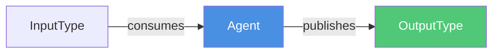
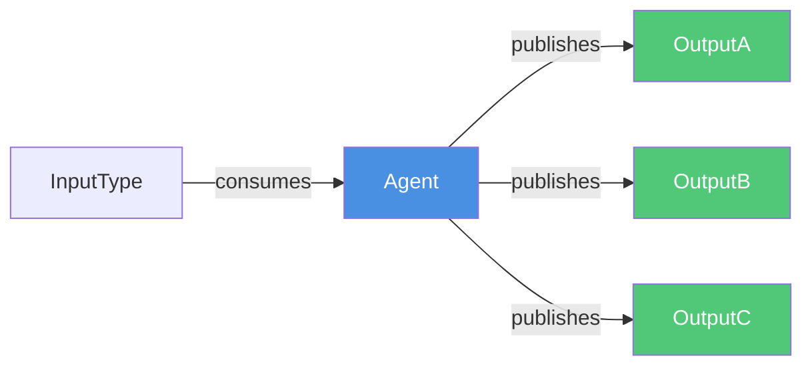
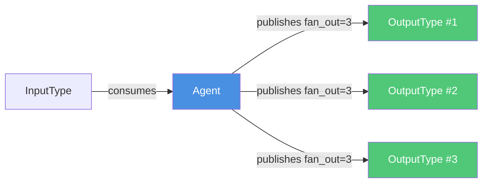
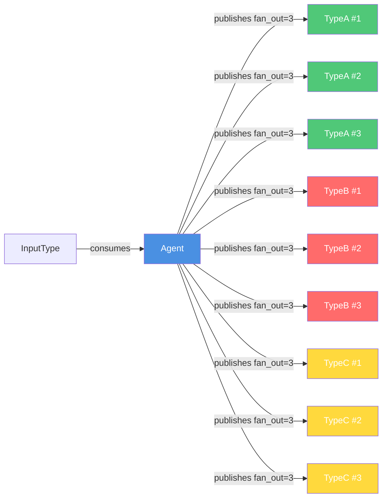
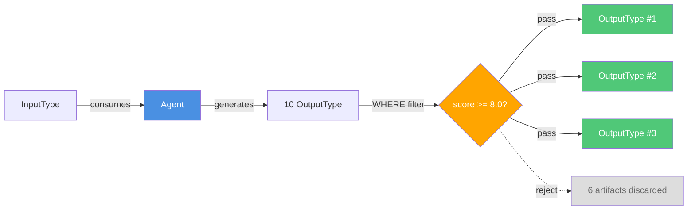
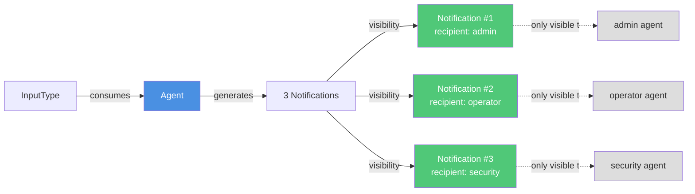
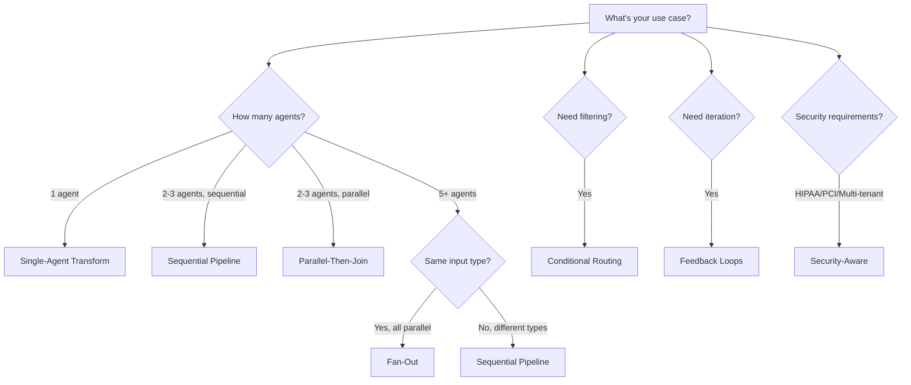

```mermaid
graph LR
    Input[InputType] -->|consumes| Agent[Agent]
    Agent -->|generates| Gen[5 OutputType]
    Gen -->|VALIDATE checks| Validator{All valid?}
    Validator -->|✅ all pass| Publish[Publish 5 artifacts]
    Validator -.❌ any fail.-> Error[ValueError raised]

    style Agent fill:#4A90E2,color:#fff
    style Validator fill:#FF6B6B,color:#fff
    style Publish fill:#50C878,color:#fff
    style Error fill:#ff0000,color:#fff
```

```mermaid
graph LR
    Input[InputType] -->|consumes| Agent[Agent]
    Agent -->|generates| Gen[20 candidates]

    Gen -->|WHERE| Filter{score >= 8.0?}
    Filter -->|pass ~5| Candidates[5 candidates]

    Candidates -->|VALIDATE| Validator{len >= 100?}
    Validator -->|✅ all pass| Visibility[Apply visibility]
    Validator -.❌ any fail.-> Error[ValueError]

    Visibility -->|publish| O1[Artifact #1<br/>visible to: alice]
    Visibility -->|publish| O2[Artifact #2<br/>visible to: bob]
    Visibility -->|publish| O3[Artifact #3<br/>visible to: carol]

    style Agent fill:#4A90E2,color:#fff
    style Filter fill:#FFA500,color:#fff
    style Validator fill:#FF6B6B,color:#fff
    style Visibility fill:#9B59B6,color:#fff
    style O1 fill:#50C878,color:#fff
    style O2 fill:#50C878,color:#fff
    style O3 fill:#50C878,color:#fff
```

# Architectural Patterns

This guide documents the 8 major architectural patterns in Flock, extracted from production examples and battle-tested use cases.

## Pattern Overview

| Pattern | Complexity | Use Cases | Example |
|---------|------------|-----------|---------|
| [Single-Agent Transform](#1-single-agent-transform) | ⭐ Simple | Data enrichment, validation, format conversion | Pizza generator |
| [Sequential Pipeline](#2-sequential-pipeline) | ⭐⭐ Moderate | Multi-step workflows, content pipelines | Band formation |
| [Parallel-Then-Join](#3-parallel-then-join) | ⭐⭐ Moderate | Multi-perspective analysis, parallel validation | Bug detection |
| [Logic Gates (AND/OR)](#4-logic-gates-andor) | ⭐⭐ Moderate | Multi-artifact coordination, count-based triggers | Batch processing |
| [Conditional Routing](#5-conditional-routing) | ⭐⭐⭐ Advanced | Smart filtering, quality gates, threshold processing | Content moderation |
| [Feedback Loops](#6-feedback-loops) | ⭐⭐⭐ Advanced | Iterative refinement, debate systems, quality improvement | Debate club |
| [Fan-Out](#7-fan-out) | ⭐⭐⭐ Advanced | Broadcast processing, parallel analysis at scale | News agency |
| [Security-Aware](#8-security-aware-routing) | ⭐⭐⭐⭐ Expert | Multi-tenant systems, HIPAA compliance, role-based access | Healthcare |

---

## Publishing Patterns Overview

Before diving into orchestration patterns, let's understand **all the ways agents can publish artifacts** with `.publishes()`.

### 1. Single Output (Default)

**Pattern:** Agent produces one artifact per execution.

```python
agent.consumes(InputType).publishes(OutputType)
```



**Example:**
```python
bug_detector = flock.agent("detector").consumes(BugReport).publishes(BugDiagnosis)
# 1 BugReport → 1 BugDiagnosis
```

---

### 2. Multiple Outputs (Multiple Types)

**Pattern:** Agent produces multiple artifact types per execution.

```python
agent.consumes(InputType).publishes(OutputA, OutputB, OutputC)
```



**Example:**
```python
code_analyzer = (
    flock.agent("analyzer")
    .consumes(CodeSubmission)
    .publishes(BugAnalysis, SecurityAudit, PerformanceReport)
)
# 1 CodeSubmission → 1 BugAnalysis + 1 SecurityAudit + 1 PerformanceReport = 3 artifacts
```

---

### 3. Fan-Out (Single Type, Multiple Artifacts)

**Pattern:** Agent produces N artifacts of the same type per execution.

```python
agent.consumes(InputType).publishes(OutputType, fan_out=N)
```



**Example:**
```python
idea_generator = (
    flock.agent("generator")
    .consumes(ProductBrief)
    .publishes(ProductIdea, fan_out=10)
)
# 1 ProductBrief → 10 ProductIdea artifacts in ONE execution
```

**Dynamic Fan-Out Variant (Recommended for variable complexity):**

Instead of a fixed count, you can let the engine decide how many artifacts to generate within a range:

```python
from flock.core import FanOutRange

adaptive_generator = (
    flock.agent("adaptive_generator")
    .consumes(ProductBrief)
    .publishes(
        ProductIdea,
        fan_out=(5, 20),              # or FanOutRange(min=5, max=20)
        where=lambda i: i.score >= 8,  # filter AFTER range checks
    )
)
```

**Semantics:**
- `min` / `max` apply to the **raw list** returned by the engine.
- If the engine returns fewer than `min` items, a warning is logged but all items are kept.
- If the engine returns more than `max` items, the list is truncated to `max`.
- `where` / `validate` run afterwards; the final published count may be less than `min`.

---

### 4. Multi-Output Fan-Out (Multiple Types, Multiple Artifacts Each)

**Pattern:** Agent produces N artifacts of EACH type per execution.

```python
agent.consumes(InputType).publishes(TypeA, TypeB, TypeC, fan_out=N)
```



**Example:**
```python
multi_master = (
    flock.agent("multi_master")
    .consumes(Idea)
    .publishes(Movie, MovieScript, MovieCampaign, fan_out=3)
)
# 1 Idea → 3 Movies + 3 Scripts + 3 Campaigns = 9 artifacts in ONE LLM call!
```

---

### 5. With Filtering (WHERE)

**Pattern:** Filter outputs before publishing.

```python
agent.publishes(OutputType, fan_out=N, where=lambda o: o.score >= 8.0)
```



**Example:**
```python
quality_generator = (
    flock.agent("generator")
    .consumes(Brief)
    .publishes(
        Idea,
        fan_out=20,  # Generate 20 candidates
        where=lambda i: i.score >= 8.0  # Only publish high-quality (maybe 5 pass)
    )
)
# 1 Brief → 20 generated → 5 published (high quality only)
```

---

### 6. With Validation (VALIDATE)

**Pattern:** Enforce quality standards (fail-fast).

```python
agent.publishes(
    OutputType,
    fan_out=N,
    validate=lambda o: o.field in ["valid", "values"]
)
```



**Example:**
```python
strict_generator = (
    flock.agent("generator")
    .consumes(Brief)
    .publishes(
        BugReport,
        fan_out=5,
        validate=lambda r: r.severity in ["Critical", "High", "Medium", "Low"]
    )
)
# If ANY of the 5 BugReports has invalid severity → ValueError, nothing published
```

---

### 7. With Dynamic Visibility

**Pattern:** Control access per artifact based on content.

```python
agent.publishes(
    OutputType,
    fan_out=N,
    visibility=lambda o: PrivateVisibility(agents=[o.recipient])
)
```



**Example:**
```python
notifier = (
    flock.agent("notifier")
    .consumes(Alert)
    .publishes(
        Notification,
        fan_out=3,
        visibility=lambda n: PrivateVisibility(agents=[n.recipient])
    )
)
# Each notification only visible to its target agent
```

---

### 8. Combined: WHERE + VALIDATE + Visibility

**Pattern:** Filter, enforce standards, and control access.

```python
agent.publishes(
    OutputType,
    fan_out=20,
    where=lambda o: o.score >= 8.0,
    validate=lambda o: len(o.content) >= 100,
    visibility=lambda o: PrivateVisibility(agents=[o.owner])
)
```



**Example:**
```python
sophisticated_agent = (
    flock.agent("sophisticated")
    .consumes(Request)
    .publishes(
        Response,
        fan_out=20,  # Generate 20 candidates
        where=lambda r: r.quality_score >= 8.5,  # Filter to ~5 high-quality
        validate=[  # Enforce standards on remaining 5
            (lambda r: len(r.content) >= 100, "Content too short"),
            (lambda r: r.tone in ["professional", "friendly"], "Invalid tone"),
        ],
        visibility=lambda r: PrivateVisibility(agents=[r.assigned_to])  # Target recipient
    )
)
# 1 Request → 20 generated → 5 filtered → validated → published with access control
```

---

### Consumes Patterns Quick Reference

| Pattern | Syntax | Behavior |
|---------|--------|----------|
| **Single input** | `.consumes(TypeA)` | Wait for 1 TypeA artifact |
| **AND gate** | `.consumes(TypeA, TypeB)` | Wait for TypeA AND TypeB (both required) |
| **OR gate** | `.consumes(TypeA).consumes(TypeB)` | Trigger on TypeA OR TypeB (independent) |
| **Count-based AND** | `.consumes(TypeA, TypeA, TypeA)` | Wait for 3 TypeA artifacts |
| **Mixed count** | `.consumes(TypeA, TypeA, TypeB)` | Wait for 2 TypeA AND 1 TypeB |
| **With predicate** | `.consumes(TypeA, where=lambda a: a.score > 5)` | Only consume if predicate matches |
| **With time window** | `.consumes(TypeA, TypeB, join=JoinSpec(within=timedelta(...)))` | Both must arrive within time window |
| **With batch** | `.consumes(TypeA, batch=BatchSpec(size=10))` | Collect 10 TypeA artifacts before triggering |

### Publishes Patterns Quick Reference

| Pattern | Syntax | Artifacts Published |
|---------|--------|---------------------|
| **Single output** | `.publishes(TypeA)` | 1 TypeA |
| **Multiple outputs** | `.publishes(TypeA, TypeB, TypeC)` | 1 TypeA + 1 TypeB + 1 TypeC = 3 total |
| **Fan-out** | `.publishes(TypeA, fan_out=10)` | 10 TypeA |
| **Multi-output fan-out** | `.publishes(TypeA, TypeB, fan_out=5)` | 5 TypeA + 5 TypeB = 10 total |
| **With filtering** | `.publishes(TypeA, fan_out=20, where=...)` | Up to 20 TypeA (filtered) |
| **With validation** | `.publishes(TypeA, fan_out=5, validate=...)` | 5 TypeA (or error if invalid) |
| **With visibility** | `.publishes(TypeA, visibility=PrivateVisibility(...))` | 1 TypeA (access controlled) |
| **Combined** | `.publishes(TypeA, fan_out=20, where=..., validate=..., visibility=...)` | Up to 20 TypeA (filtered, validated, access controlled) |

---

## 1. Single-Agent Transform

**Pattern:** Input Type → Agent → Output Type

**When to Use:**

- Data enrichment
- Validation
- Format conversion
- Schema transformations

**Example:**

```python
from pydantic import BaseModel
from flock import Flock
from flock.registry import flock_type

@flock_type
class BugReport(BaseModel):
    title: str
    description: str
    stack_trace: str

@flock_type
class BugDiagnosis(BaseModel):
    severity: str
    root_cause: str
    recommended_fix: str
    related_issues: list[str]

flock = Flock("openai/gpt-4.1")

code_detective = (
    flock.agent("code_detective")
    .consumes(BugReport)
    .publishes(BugDiagnosis)
)

# Usage
bug = BugReport(title="...", description="...", stack_trace="...")
await flock.publish(bug)
await flock.run_until_idle()
```

**Key Characteristics:**

- Simplest pattern
- One input, one output
- No dependencies on other agents
- Perfect for getting started

**Tutorial Value:** ⭐⭐⭐⭐⭐ Must-have for onboarding

---

## 2. Sequential Pipeline

**Pattern:** Type A → Agent 1 → Type B → Agent 2 → Type C → Agent 3 → Type D

**When to Use:**

- Multi-step workflows
- Sequential processing requirements
- Content production pipelines
- Progressive refinement

**Example:**

```python
@flock_type
class BandConcept(BaseModel):
    genre: str
    vibe: str
    target_audience: str

@flock_type
class BandLineup(BaseModel):
    band_name: str
    members: list[dict]
    origin_story: str

@flock_type
class Album(BaseModel):
    title: str
    tracklist: list[dict]
    genre_fusion: str

@flock_type
class MarketingCopy(BaseModel):
    press_release: str
    social_media_hook: str
    billboard_tagline: str

# Agent chain (no graph edges!)
talent_scout = flock.agent("talent_scout").consumes(BandConcept).publishes(BandLineup)
music_producer = flock.agent("music_producer").consumes(BandLineup).publishes(Album)
marketing_guru = flock.agent("marketing_guru").consumes(Album).publishes(MarketingCopy)

# Execution: talent_scout → music_producer → marketing_guru
await flock.publish(BandConcept(...))
await flock.run_until_idle()
```

**Key Characteristics:**

- Auto-chaining through type subscriptions
- No explicit workflow graph
- Each agent produces input for next
- "Zero graph edges. Pure blackboard magic."

**vs Graph-Based:**

```python
# ❌ Graph way: explicit edges
graph.add_edge("talent_scout", "music_producer")
graph.add_edge("music_producer", "marketing_guru")

# ✅ Flock way: implicit via types
# No edges needed - chain emerges from subscriptions!
```

**Tutorial Value:** ⭐⭐⭐⭐⭐ Shows blackboard advantage

---

## 3. Parallel-Then-Join

**Pattern:** Input → [Agent A, Agent B, Agent C] → Agent D (waits for all)

**When to Use:**

- Multiple perspectives on same data
- Parallel analysis
- Consensus building
- Quality assurance gates

**Example:**

```python
@flock_type
class CodeSubmission(BaseModel):
    code: str
    author: str

@flock_type
class BugAnalysis(BaseModel):
    bugs_found: list[str]
    severity: str

@flock_type
class SecurityAudit(BaseModel):
    vulnerabilities: list[str]
    risk_level: str

@flock_type
class FinalReview(BaseModel):
    approved: bool
    combined_feedback: str
    action_items: list[str]

# Parallel analyzers (all consume CodeSubmission)
bug_detector = flock.agent("bug_detector").consumes(CodeSubmission).publishes(BugAnalysis)
security_auditor = flock.agent("security_auditor").consumes(CodeSubmission).publishes(SecurityAudit)

# Final reviewer (waits for both analyses)
final_reviewer = (
    flock.agent("final_reviewer")
    .consumes(BugAnalysis, SecurityAudit)  # Multi-type consumption!
    .publishes(FinalReview)
)

# Execution: bug_detector + security_auditor run in parallel → final_reviewer
await flock.publish(CodeSubmission(...))
await flock.run_until_idle()
```

**Key Characteristics:**

- Automatic parallelism
- Natural synchronization
- No manual thread management
- Join happens automatically when all inputs available

**Tutorial Value:** ⭐⭐⭐⭐ Demonstrates automatic parallelism

---

## 4. Logic Gates (AND/OR)

**Pattern:** Declarative multi-artifact coordination with AND/OR semantics

**When to Use:**

- Wait for multiple artifact types before triggering
- Trigger on any one of several types (OR logic)
- Collect multiple instances of the same type (count-based)
- Flexible coordination without manual synchronization

**AND Gate Example:**

```python
@flock_type
class XRayAnalysis(BaseModel):
    findings: list[str]
    abnormalities: list[str]

@flock_type
class LabResults(BaseModel):
    markers: dict[str, float]
    flagged_values: list[str]

@flock_type
class Diagnosis(BaseModel):
    condition: str
    confidence: float
    reasoning: str

# AND gate: Wait for BOTH X-ray AND lab results
diagnostician = (
    flock.agent("diagnostician")
    .consumes(XRayAnalysis, LabResults)  # Waits for both types
    .publishes(Diagnosis)
)
```

**Timeline:**
```
t0: XRayAnalysis published → diagnostician WAITS (needs LabResults)
t1: LabResults published → diagnostician TRIGGERS with both artifacts
```

**OR Gate Example:**

```python
@flock_type
class SystemAlert(BaseModel):
    severity: str
    message: str

@flock_type
class UserAlert(BaseModel):
    user_id: str
    notification: str

@flock_type
class AlertResponse(BaseModel):
    action_taken: str
    timestamp: datetime

# OR gate: Trigger on EITHER alert type
alert_handler = (
    flock.agent("alert_handler")
    .consumes(SystemAlert)      # First subscription (OR)
    .consumes(UserAlert)        # Second subscription (OR)
    .publishes(AlertResponse)
)
```

**Timeline:**
```
t0: SystemAlert published → alert_handler TRIGGERS
t1: UserAlert published → alert_handler TRIGGERS AGAIN (independent)
```

**Count-Based AND Gate Example:**

```python
@flock_type
class Order(BaseModel):
    order_id: str
    amount: float
    customer_id: str

@flock_type
class BatchSummary(BaseModel):
    total_orders: int
    total_amount: float
    customer_ids: list[str]

# Count-based AND gate: Wait for THREE orders
batch_processor = (
    flock.agent("batch_processor")
    .consumes(Order, Order, Order)  # Waits for 3 Orders
    .publishes(BatchSummary)
)
```

**Timeline:**
```
t0: Order #1 published → batch_processor WAITS (needs 2 more)
t1: Order #2 published → batch_processor WAITS (needs 1 more)
t2: Order #3 published → batch_processor TRIGGERS with all 3 Orders
```

**Mixed Count Example:**

```python
@flock_type
class Image(BaseModel):
    url: str
    dimensions: tuple[int, int]

@flock_type
class Metadata(BaseModel):
    title: str
    description: str
    tags: list[str]

@flock_type
class ValidationResult(BaseModel):
    approved: bool
    issues: list[str]

# Mixed count: 2 Images + 1 Metadata
validator = (
    flock.agent("validator")
    .consumes(Image, Image, Metadata)  # 2 Images AND 1 Metadata
    .publishes(ValidationResult)
)
```

**Key Characteristics:**

- **AND semantics:** Multiple types in single `.consumes()` → waits for all
- **OR semantics:** Multiple `.consumes()` calls → independent triggers
- **Count support:** Repeat type N times → waits for N instances
- **Automatic synchronization:** No manual locks or coordination needed
- **Type-safe:** Pydantic validation ensures correct artifact types

**vs Manual Synchronization:**

```python
# ❌ Manual way (graph-based frameworks)
class SyncNode:
    def __init__(self):
        self.xray = None
        self.labs = None
        self.lock = Lock()

    async def receive_xray(self, xray):
        async with self.lock:
            self.xray = xray
            if self.labs:  # Both ready?
                await self.trigger_diagnostician()

    async def receive_labs(self, labs):
        async with self.lock:
            self.labs = labs
            if self.xray:  # Both ready?
                await self.trigger_diagnostician()

# ✅ Flock way: declarative, no locks
diagnostician.consumes(XRayAnalysis, LabResults)  # That's it!
```

**Tutorial Value:** ⭐⭐⭐⭐ Essential coordination pattern

---

## 5. Conditional Routing

**Pattern:** Agent consumes only when predicate matches

**When to Use:**

- Smart filtering
- Quality gates
- Threshold processing
- Selective processing

**Example:**

```python
from datetime import timedelta

@flock_type
class Review(BaseModel):
    content: str
    score: float
    author: str

@flock_type
class HighQualityAnalysis(BaseModel):
    deep_insights: list[str]
    actionable_items: list[str]

@flock_type
class FlaggedContent(BaseModel):
    reason: str
    severity: str

# High-quality reviews get deep analysis
analyst = (
    flock.agent("analyst")
    .consumes(Review, where=lambda r: r.score >= 9.0)  # Only high scores!
    .publishes(HighQualityAnalysis)
)

# Low-quality reviews get flagged
moderator = (
    flock.agent("moderator")
    .consumes(Review, where=lambda r: r.score < 3.0)  # Only low scores!
    .publishes(FlaggedContent)
)

# Execution: Only matching agents fire based on score
```

**Advanced: Time-Based Routing**

```python
from flock.subscription import JoinSpec

# Wait for correlated signals within time window
trader = (
    flock.agent("trader")
    .consumes(
        VolatilityAlert,
        SentimentAlert,
        join=JoinSpec(within=timedelta(minutes=5))  # Both within 5min!
    )
    .publishes(TradeOrder)
)
```

**Key Characteristics:**

- Lambda predicates for filtering
- No need for routing nodes
- Supports complex conditions
- Time-window correlation

**Tutorial Value:** ⭐⭐⭐⭐ Common production need

---

## 6. Feedback Loops

**Pattern:** Agent A → Type X → Agent B → Type Y → Agent A (if condition)

**When to Use:**

- Iterative refinement
- Debate systems
- Quality improvement loops
- Progressive enhancement

**Example:**

```python
@flock_type
class Argument(BaseModel):
    position: str
    evidence: list[str]
    iteration: int

@flock_type
class Critique(BaseModel):
    weaknesses: list[str]
    suggested_improvements: list[str]

# Arguer produces arguments
arguer = (
    flock.agent("arguer")
    .consumes(Argument)  # Can consume its own output type!
    .publishes(Argument)
    .prevent_self_trigger()  # Safety: don't trigger on own output
)

# Critic provides feedback
critic = (
    flock.agent("critic")
    .consumes(Argument, where=lambda a: a.iteration < 3)  # Max 3 iterations
    .publishes(Critique)
)

# Arguer refines based on critique
arguer_refiner = (
    flock.agent("arguer_refiner")
    .consumes(Critique)
    .publishes(Argument)  # Loops back!
)

# Execution: argument → critique → refined argument → critique → ...
```

**Safety Mechanisms:**

- `.prevent_self_trigger()` - Avoid infinite loops
- `where=lambda a: a.iteration < N` - Iteration limits
- Timeout constraints

**Key Characteristics:**

- Circular data flow
- Requires safety guards
- Powerful for refinement
- Use with caution

**Tutorial Value:** ⭐⭐⭐⭐ Powerful but needs careful teaching

---

## 7. Fan-Out & Multi-Output Publishing

**Pattern:** 1 execution → N artifacts (single or multiple types)

**When to Use:**

- Generate multiple variations from single execution
- Produce coherent multi-type outputs
- Broadcast processing
- Scalable parallel architectures

### Basic Fan-Out (Single Type)

```python
@flock_type
class ProductBrief(BaseModel):
    market: str
    audience: str

@flock_type
class ProductIdea(BaseModel):
    name: str
    description: str
    score: float

# Generate 10 ideas from one brief
idea_generator = (
    flock.agent("generator")
    .consumes(ProductBrief)
    .publishes(ProductIdea, fan_out=10)  # 10 artifacts in ONE execution!
)

await flock.publish(ProductBrief(...))
await flock.run_until_idle()

# Result: 10 ProductIdea artifacts published to blackboard
ideas = await flock.store.get_by_type(ProductIdea)  # 10 ideas
```

### Multi-Output Fan-Out (Multiple Types) 🤯

**The game-changer:** Generate N artifacts of **EACH** type in a single execution!

```python
@flock_type
class Idea(BaseModel):
    story_idea: str

@flock_type
class Movie(BaseModel):
    title: str
    genre: str
    cast: list[str]
    plot_summary: str

@flock_type
class MovieScript(BaseModel):
    characters: list[str]
    scenes: list[str]
    pages: int

@flock_type
class MovieCampaign(BaseModel):
    taglines: list[str]
    poster_descriptions: list[str]

# Generate 3 of EACH type = 9 total artifacts in ONE LLM call!
multi_master = (
    flock.agent("multi_master")
    .consumes(Idea)
    .publishes(Movie, MovieScript, MovieCampaign, fan_out=3)
)

await flock.publish(Idea(...))
await flock.run_until_idle()

# Result: 9 artifacts (3 movies + 3 scripts + 3 campaigns)
movies = await flock.store.get_by_type(Movie)  # 3 movies
scripts = await flock.store.get_by_type(MovieScript)  # 3 scripts
campaigns = await flock.store.get_by_type(MovieCampaign)  # 3 campaigns
```

**What just happened:**
- ✅ ONE LLM call generated **9 production-ready artifacts**
- ✅ **~100+ fields** across all artifacts with full Pydantic validation
- ✅ **Coherent outputs**: All 3 movie/script/campaign sets thematically aligned
- ✅ **Cost optimized**: 89% cost savings vs 9 separate calls
- ✅ **9x speedup**: One 5-second call instead of nine

### Performance Comparison

| Approach | LLM Calls | Cost | Time | Context Coherence |
|----------|-----------|------|------|-------------------|
| Manual loops (9 calls) | 9 | $$$$ | 45s | ❌ Separate contexts |
| Single-type fan-out (3 calls) | 3 | $$$ | 15s | ⚠️ Types not aligned |
| **Multi-output fan-out** | **1** | **$** | **5s** | ✅ **Fully coherent** |

### Multi-Agent Parallel Fan-Out

```python
@flock_type
class BreakingNews(BaseModel):
    headline: str
    raw_story: str
    source: str

@flock_type
class NewsAnalysis(BaseModel):
    category: str
    key_takeaways: list[str]

# Create 8 parallel analysts (all consume same type)
categories = ["world", "tech", "business", "sports", "entertainment", "science", "politics", "health"]

for category in categories:
    flock.agent(f"{category}_analyst") \
        .consumes(BreakingNews) \
        .publishes(NewsAnalysis)

# Aggregator collects all analyses
editor = (
    flock.agent("editor")
    .consumes(NewsAnalysis)
    .publishes(NewsDigest)
)

# Execution: 8 analysts run in parallel when BreakingNews published
```

**Performance:**
- Sequential: `8 × 5s = 40 seconds`
- Parallel (Flock): `MAX(5s) = 5 seconds` ⚡
- **Speedup: 8x**

**Scalability:**
- 8 agents? 80 agents? Same pattern!
- O(n) complexity, not O(n²)
- No split/join nodes needed

**Key Insights:**
- **Single-agent fan-out**: 1 agent generates N artifacts of 1+ types
- **Multi-agent fan-out**: N agents each generate 1 artifact from same input
- **Multi-output fan-out**: 1 agent generates N artifacts of M types (N×M total)

**Tutorial Value:** ⭐⭐⭐⭐⭐ Shows scalability + efficiency advantages

---

## 8. Security-Aware Routing

**Pattern:** Visibility-controlled flow with access restrictions

**When to Use:**

- Multi-tenant systems
- HIPAA/PCI compliance
- Role-based access control
- Sensitive data handling

**Example:**

```python
from flock.core.visibility import PrivateVisibility, LabelledVisibility, TenantVisibility
from flock.runtime import AgentIdentity

@flock_type
class PatientScan(BaseModel):
    patient_id: str
    scan_type: str
    image_url: str

@flock_type
class XRayAnalysis(BaseModel):
    findings: list[str]
    abnormalities: list[str]

@flock_type
class Diagnosis(BaseModel):
    condition: str
    confidence: float
    recommended_treatment: list[str]

flock = Flock("openai/gpt-4.1")

# Radiologist with private visibility (HIPAA!)
radiologist = (
    flock.agent("radiologist")
    .consumes(PatientScan)
    .publishes(
        XRayAnalysis,
        visibility=PrivateVisibility(agents={"diagnostician"})  # Explicit allowlist!
    )
)

# Diagnostician with role-based access
diagnostician = (
    flock.agent("diagnostician")
    .identity(AgentIdentity(name="diagnostician", labels={"role:physician"}))
    .consumes(XRayAnalysis)  # Can only see because explicitly allowed
    .publishes(
        Diagnosis,
        visibility=LabelledVisibility(required_labels={"role:physician"})
    )
)

# Multi-tenancy: per-patient isolation
lab_tech = (
    flock.agent("lab_tech")
    .consumes(PatientScan)
    .publishes(
        LabResults,
        visibility=TenantVisibility(tenant_id="patient_123")  # Isolated!
    )
)
```

**Visibility Types:**

| Type | Use Case | Example |
|------|----------|---------|
| `PublicVisibility` | Default, everyone sees | Public announcements |
| `PrivateVisibility` | Explicit allowlist | HIPAA data |
| `LabelledVisibility` | Role-based access | Physician-only |
| `TenantVisibility` | Multi-tenant isolation | Per-customer data |
| `AfterVisibility` | Time-delayed release | Embargo periods |

**Key Characteristics:**

- Built-in access control
- Zero-trust by default
- Compile-time enforcement
- No bolted-on security

**Unique to Flock:** No other framework has this built-in

**Tutorial Value:** ⭐⭐⭐ Advanced but critical for production

---

## Pattern Selection Guide



## Combining Patterns

Real-world systems often combine multiple patterns:

```python
# Financial Trading System: Conditional + Parallel + Sequential

# Stage 1: Conditional parallel signal analyzers
for signal_type in signal_types:
    flock.agent(f"{signal_type}_analyzer") \
        .consumes(MarketData, where=lambda m: m.matches(signal_type)) \  # Conditional!
        .publishes(Signal)

# Stage 2: Parallel correlation detectors
for detector_id in range(3):
    flock.agent(f"detector_{detector_id}") \
        .consumes(Signal) \  # Parallel!
        .publishes(CorrelatedSignal)

# Stage 3: Sequential trade execution
risk_manager = flock.agent("risk").consumes(CorrelatedSignal).publishes(ApprovedSignal)
trader = flock.agent("trader").consumes(ApprovedSignal).publishes(TradeOrder)
```

## Best Practices

### 1. Start Simple

Begin with Single-Agent Transform, then progress to pipelines.

### 2. Use Types to Express Intent

Let artifact types drive the workflow, not explicit graphs.

### 3. Add Conditional Routing When Needed

Don't over-engineer—add `where` clauses only when business logic requires it.

### 4. Enable Tracing Early

Use `FLOCK_AUTO_TRACE=true` to visualize execution patterns.

### 5. Consider Security from Day One

If handling sensitive data, use visibility controls from the start.

## Anti-Patterns to Avoid

### ❌ Over-Chaining

```python
# Too many sequential steps
a → b → c → d → e → f → g → h
# Consider: Can some run in parallel?
```

### ❌ Circular Dependencies Without Guards

```python
# Missing iteration limit or prevent_self_trigger
agent.consumes(Type).publishes(Type)  # Infinite loop risk!
```

### ❌ God Agents

```python
# One agent doing everything
mega_agent.consumes(A, B, C, D).publishes(X, Y, Z)
# Split into specialized agents instead
```

## Next Steps

- **[Tutorials](../tutorials/index.md)** - Learn patterns hands-on
- **[Use Cases](use-cases.md)** - See patterns in production
- **[API Reference](../reference/api.md)** - Complete API documentation
- **[Examples](https://github.com/whiteducksoftware/flock/tree/main/examples)** - Working code

---

**Last Updated:** October 8, 2025
**Version:** Patterns v1.0
