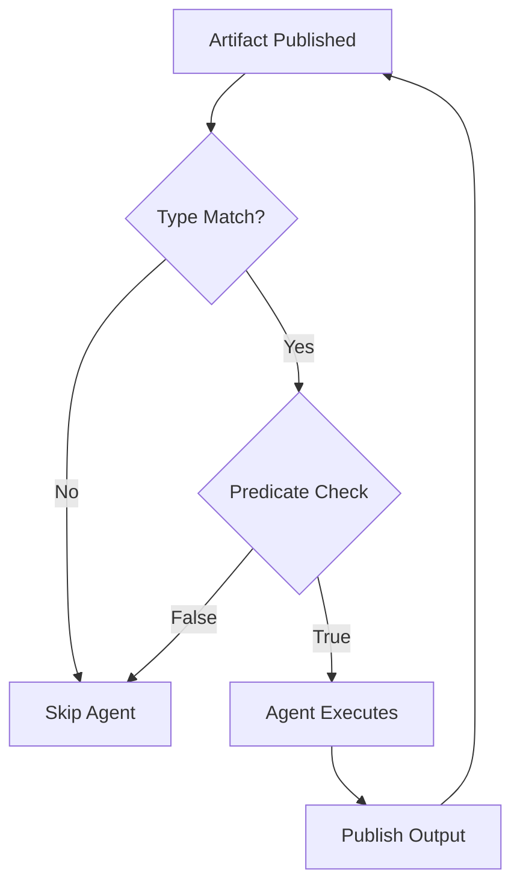

# Predicates: Conditional Consumption

**Predicates** enable agents to consume only artifacts that match specific conditions. Think of them as **intelligent routing rules** that filter the blackboard based on business logic.

**Common use cases:**
- Priority routing ("only handle critical severity bugs")
- Confidence thresholds ("only publish if confidence > 0.9")
- Geographic routing ("process orders from US region only")
- Content moderation ("flag posts with toxicity > 0.7")
- Performance optimization ("skip low-value work")

---

## Quick Start

```python
from flock import Flock, flock_type
from pydantic import BaseModel, Field

@flock_type
class BugReport(BaseModel):
    severity: str  # "Critical", "High", "Medium", "Low"
    description: str
    reported_by: str

@flock_type
class UrgentResponse(BaseModel):
    action_plan: str
    escalated_to: str

flock = Flock()

# 🎯 Only process critical and high-severity bugs
urgent_handler = (
    flock.agent("urgent_handler")
    .consumes(
        BugReport,
        where=lambda bug: bug.severity in ["Critical", "High"]  # 🔥 Predicate!
    )
    .publishes(UrgentResponse)
)
```

**What happens:**
- ✅ `BugReport(severity="Critical")` → Agent triggers
- ✅ `BugReport(severity="High")` → Agent triggers
- ❌ `BugReport(severity="Medium")` → Agent **skips** (filtered out)
- ❌ `BugReport(severity="Low")` → Agent **skips** (filtered out)

---

## How Predicates Work

### Execution Flow

When an artifact is published to the blackboard:

1. **Publish** - Artifact arrives on blackboard
2. **Subscription Match** - Orchestrator finds agents subscribed to that type
3. **Predicate Evaluation** - For each agent with `where=` clause:
   - Predicate function receives the artifact
   - Returns `True` (agent consumes) or `False` (agent skips)
4. **Agent Trigger** - Only agents with `True` predicates execute
5. **Cascade** - Output artifacts trigger downstream agents (repeat)



### Predicate Function Signature

```python
def predicate(artifact: YourType) -> bool:
    """
    Args:
        artifact: The artifact being evaluated (fully typed!)

    Returns:
        True: Agent should consume this artifact
        False: Agent should skip this artifact
    """
    return artifact.meets_condition
```

**Key characteristics:**
- ✅ **Type-safe** - Receives fully typed Pydantic model (not dict/Artifact wrapper)
- ✅ **Pure function** - Should not have side effects
- ✅ **Fast** - Evaluated synchronously before agent execution
- ✅ **Composable** - Can call helper functions

---

## Common Patterns

### Pattern 1: Threshold Filtering

**Use case:** Only process high-confidence results

```python
@flock_type
class Analysis(BaseModel):
    confidence: float = Field(ge=0.0, le=1.0)
    findings: list[str]

# Only publish analysis with confidence > 90%
publisher = (
    flock.agent("publisher")
    .consumes(
        Analysis,
        where=lambda a: a.confidence >= 0.9  # High confidence only
    )
    .publishes(PublishedReport)
)
```

### Pattern 2: Categorical Routing

**Use case:** Different agents handle different categories

```python
@flock_type
class CustomerTicket(BaseModel):
    category: str  # "billing", "technical", "sales"
    priority: str

# Billing specialist
billing_agent = (
    flock.agent("billing")
    .consumes(
        CustomerTicket,
        where=lambda t: t.category == "billing"
    )
    .publishes(BillingResponse)
)

# Technical support
tech_support = (
    flock.agent("tech_support")
    .consumes(
        CustomerTicket,
        where=lambda t: t.category == "technical"
    )
    .publishes(TechSupportResponse)
)

# Sales team
sales = (
    flock.agent("sales")
    .consumes(
        CustomerTicket,
        where=lambda t: t.category == "sales"
    )
    .publishes(SalesResponse)
)
```

### Pattern 3: Multi-Condition Logic

**Use case:** Complex business rules

```python
# Only escalate urgent tickets from premium customers in the US
escalation_handler = (
    flock.agent("escalation")
    .consumes(
        Ticket,
        where=lambda t: (
            t.priority == "urgent" and
            t.customer_tier == "premium" and
            t.region == "US"
        )
    )
    .publishes(EscalationAlert)
)
```

### Pattern 4: Helper Function

**Use case:** Reusable complex logic

```python
def is_high_risk_transaction(txn: Transaction) -> bool:
    """Business logic for fraud detection"""
    return (
        txn.amount > 10000 or
        txn.location != txn.user.home_country or
        txn.velocity > 5  # 5 transactions in 1 hour
    )

# Use helper function as predicate
fraud_detector = (
    flock.agent("fraud_detector")
    .consumes(
        Transaction,
        where=is_high_risk_transaction  # 🎯 Reusable!
    )
    .publishes(FraudAlert)
)
```

### Pattern 5: Time-Based Filtering

**Use case:** Business hours routing

```python
from datetime import datetime, time

def is_business_hours(order: Order) -> bool:
    """Only process during 9 AM - 5 PM"""
    now = datetime.now()
    return time(9, 0) <= now.time() <= time(17, 0)

daytime_processor = (
    flock.agent("day_shift")
    .consumes(Order, where=is_business_hours)
    .publishes(ProcessedOrder)
)
```

### Pattern 6: List Membership

**Use case:** Allowlist/blocklist

```python
APPROVED_REGIONS = {"US", "CA", "UK", "DE", "FR"}

regional_processor = (
    flock.agent("regional")
    .consumes(
        Order,
        where=lambda o: o.shipping_region in APPROVED_REGIONS
    )
    .publishes(ShippedOrder)
)
```

---

## Combining with Other Features

### Predicates + AND Gates

```python
# Wait for BOTH inputs, but only if diagnosis is severe
surgeon = (
    flock.agent("surgeon")
    .consumes(
        XRayAnalysis,
        LabResults,
        where=lambda x, l: x.severity == "severe" and l.markers["risk"] > 0.8
    )
    .publishes(SurgeryPlan)
)
```

**How it works:**
- Orchestrator waits for BOTH `XRayAnalysis` AND `LabResults`
- Predicate receives **both artifacts** (order matches `.consumes()` signature)
- If predicate returns `True`, agent executes with both
- If predicate returns `False`, artifacts are skipped (pool clears)

### Predicates + BatchSpec

```python
# Batch high-value orders for priority processing
vip_processor = (
    flock.agent("vip_batch")
    .consumes(
        Order,
        where=lambda o: o.amount > 1000,  # High-value only
        batch=BatchSpec(size=10, timeout=timedelta(minutes=5))
    )
    .publishes(VIPBatchReport)
)
```

**How it works:**
1. Predicate filters incoming orders (only `amount > 1000`)
2. Filtered orders accumulate in batch
3. Batch flushes when 10 high-value orders collected OR 5-minute timeout
4. Agent processes batch of 10 high-value orders

### Predicates + JoinSpec

```python
# Correlate orders + shipments, but only for express shipping
express_tracker = (
    flock.agent("express_tracker")
    .consumes(
        Order,
        Shipment,
        where=lambda o, s: o.shipping_method == "express",
        join=JoinSpec(by=lambda x: x.order_id, within=timedelta(hours=24))
    )
    .publishes(ExpressTracking)
)
```

**How it works:**
1. JoinSpec correlates `Order` + `Shipment` by `order_id`
2. Predicate evaluates **correlated pair**
3. Only express shipping orders trigger agent
4. Agent receives correlated `Order` + `Shipment` for express orders only

---

## Best Practices

### ✅ Do

**1. Keep predicates pure and fast**
```python
# ✅ Good: Pure function, fast evaluation
where=lambda bug: bug.severity in CRITICAL_LEVELS

# ❌ Bad: Network call in predicate (blocks orchestrator!)
where=lambda bug: requests.get(f"api.com/severity/{bug.id}").json()["is_critical"]
```

**2. Use helper functions for complex logic**
```python
# ✅ Good: Testable, reusable, clear
def requires_manual_review(claim: InsuranceClaim) -> bool:
    """Complex business rule extracted"""
    return (
        claim.amount > 50000 or
        claim.claimant_age < 18 or
        claim.prior_claims > 3
    )

manual_reviewer = agent.consumes(InsuranceClaim, where=requires_manual_review)

# ❌ Bad: Unreadable inline logic
manual_reviewer = agent.consumes(
    InsuranceClaim,
    where=lambda c: c.amount > 50000 or c.claimant_age < 18 or c.prior_claims > 3
)
```

**3. Leverage type safety**
```python
@flock_type
class Order(BaseModel):
    priority: Literal["low", "normal", "high", "urgent"]  # Type-safe enum!

# ✅ Good: IDE autocomplete + type checking
where=lambda o: o.priority in ["high", "urgent"]

# ❌ Bad: Typos won't be caught
where=lambda o: o.priority in ["hihg", "urgnet"]  # Oops!
```

**4. Test predicates in isolation**
```python
def test_high_risk_predicate():
    # ✅ Good: Unit test the predicate function
    high_risk = Transaction(amount=15000, location="Nigeria", velocity=7)
    assert is_high_risk_transaction(high_risk) == True

    low_risk = Transaction(amount=50, location="US", velocity=1)
    assert is_high_risk_transaction(low_risk) == False
```

### ❌ Don't

**1. Don't mutate artifacts in predicates**
```python
# ❌ Bad: Mutating state in predicate
def bad_predicate(order: Order) -> bool:
    order.processed = True  # Don't do this!
    return order.amount > 100

# ✅ Good: Pure evaluation
def good_predicate(order: Order) -> bool:
    return order.amount > 100
```

**2. Don't make network calls**
```python
# ❌ Bad: Blocking network call
where=lambda user: api_client.check_permissions(user.id)

# ✅ Good: Use artifact fields
where=lambda user: user.permission_level >= 5
```

**3. Don't use predicates for complex coordination**
```python
# ❌ Bad: Trying to coordinate between artifacts
where=lambda order: len(flock.store.get_by_type(Order)) > 10

# ✅ Good: Use BatchSpec for accumulation
batch=BatchSpec(size=10)
```

**4. Don't forget null safety**
```python
# ❌ Bad: Can crash if shipping_address is None
where=lambda order: order.shipping_address.country == "US"

# ✅ Good: Null-safe check
where=lambda order: order.shipping_address and order.shipping_address.country == "US"

# ✅ Better: Make field required in schema
@flock_type
class Order(BaseModel):
    shipping_address: Address  # Required field!
```

---

## Performance Considerations

### Predicate Execution Cost

**Predicates are evaluated synchronously:**
- Runs on orchestrator thread (not in agent worker pool)
- Must be fast (< 1ms typical)
- Blocks other artifact processing while evaluating

**Optimization tips:**

```python
# ✅ Good: O(1) lookup
ALLOWED_IDS = {"abc", "def", "xyz"}  # Set lookup is O(1)
where=lambda x: x.id in ALLOWED_IDS

# ❌ Bad: O(n) lookup
ALLOWED_IDS = ["abc", "def", "xyz"]  # List lookup is O(n)
where=lambda x: x.id in ALLOWED_IDS

# ✅ Good: Early return
def complex_check(order: Order) -> bool:
    if order.amount < 100:  # Quick rejection
        return False
    # Expensive checks only for high-value orders
    return expensive_validation(order)

# ❌ Bad: Always runs expensive check
def complex_check(order: Order) -> bool:
    return expensive_validation(order) and order.amount >= 100
```

### Filtering vs. Agent Logic

**When to use predicates vs. agent logic:**

```python
# ✅ Good: Filter at subscription (saves agent execution cost)
where=lambda bug: bug.severity == "Critical"
# Critical bugs trigger agent, Medium/Low bugs are skipped entirely

# ❌ Bad: Filter in agent logic (agent always executes)
# Agent runs for ALL bugs, then filters internally
# Wastes LLM calls on bugs that will be ignored
```

**Rule of thumb:** If the condition can be evaluated from the artifact payload alone (no LLM needed), use a predicate!

---

## Debugging Predicates

### Enable Trace Logging

```bash
export FLOCK_AUTO_TRACE=true
export FLOCK_TRACE_FILE=true
```

```python
import duckdb

conn = duckdb.connect('.flock/traces.duckdb', read_only=True)

# Find predicate evaluations
predicates = conn.execute("""
    SELECT
        name,
        attributes->'$.predicate_result' as result,
        attributes->'$.artifact_type' as type
    FROM spans
    WHERE name LIKE '%predicate%'
""").fetchall()

for name, result, artifact_type in predicates:
    print(f"{artifact_type}: {result}")
```

### Add Logging to Predicates

```python
import logging
logger = logging.getLogger(__name__)

def logged_predicate(order: Order) -> bool:
    result = order.amount > 1000
    logger.debug(f"Predicate eval: Order {order.id} = {result} (amount: {order.amount})")
    return result

agent.consumes(Order, where=logged_predicate)
```

---

## Real-World Examples

### Example 1: Content Moderation Pipeline

```python
@flock_type
class UserPost(BaseModel):
    content: str
    user_id: str
    toxicity_score: float = Field(ge=0.0, le=1.0)

@flock_type
class ModerationFlag(BaseModel):
    post_id: str
    reason: str
    action: str  # "remove", "warn", "review"

# Stage 1: Toxicity detector (runs on all posts)
detector = (
    flock.agent("toxicity_detector")
    .consumes(UserPost)
    .publishes(ModerationFlag)
)

# Stage 2: Human review (only for borderline cases)
human_reviewer = (
    flock.agent("human_reviewer")
    .consumes(
        ModerationFlag,
        where=lambda f: 0.6 <= f.toxicity_score < 0.8  # Borderline only
    )
    .publishes(ReviewDecision)
)

# Stage 3: Auto-remove (high toxicity)
auto_remover = (
    flock.agent("auto_remover")
    .consumes(
        ModerationFlag,
        where=lambda f: f.toxicity_score >= 0.8  # Clear violations
    )
    .publishes(RemovalNotice)
)
```

### Example 2: Smart Order Routing

```python
# Route orders to different fulfillment centers based on rules
west_coast_fc = (
    flock.agent("west_coast_fc")
    .consumes(
        Order,
        where=lambda o: o.shipping_state in ["CA", "OR", "WA", "NV", "AZ"]
    )
    .publishes(ShipmentPlan)
)

east_coast_fc = (
    flock.agent("east_coast_fc")
    .consumes(
        Order,
        where=lambda o: o.shipping_state in ["NY", "MA", "PA", "NJ", "VA"]
    )
    .publishes(ShipmentPlan)
)

# Special handling for international
international_fc = (
    flock.agent("international_fc")
    .consumes(
        Order,
        where=lambda o: o.shipping_country != "US"
    )
    .publishes(InternationalShipment)
)
```

---

## Next Steps

- **[Join Operations](join-operations.md)** - Correlate related artifacts
- **[Batch Processing](batch-processing.md)** - Efficient bulk operations
- **[Agent Guide](agents.md)** - Complete agent patterns
- **[Visibility Controls](visibility.md)** - Security and access control

---

## Quick Reference

| Pattern | Example | Use Case |
|---------|---------|----------|
| **Threshold** | `where=lambda x: x.score > 0.9` | Confidence filtering |
| **Category** | `where=lambda x: x.type == "urgent"` | Categorical routing |
| **Multi-condition** | `where=lambda x: x.a and x.b` | Complex business rules |
| **Helper function** | `where=is_valid_order` | Reusable logic |
| **List membership** | `where=lambda x: x.id in ALLOW_LIST` | Allowlist/blocklist |
| **Time-based** | `where=is_business_hours` | Temporal routing |
| **AND gate** | `where=lambda a, b: a.x and b.y` | Multi-input filtering |

**Remember:** Predicates are for **filtering**, not **transformation**. Use agents for data transformation!
