# Visibility Controls

Flock's **visibility system** provides zero-trust security for multi-agent systems—controlling which agents can see which artifacts on the [blackboard](blackboard.md).

**Think of it like classified documents:** not everyone in an organization can see every document. Field agents see different data than executives, and customer data stays isolated between tenants.

**Unlike other frameworks**, Flock has security **built-in** from day one.

---

## What is Visibility?

**Visibility** determines which [agents](agents.md) can consume an artifact from the blackboard.

- **Producer-controlled** - The agent publishing data decides who can see it
- **Enforced automatically** - Flock checks visibility before scheduling agents
- **Zero-trust architecture** - Explicit access control, not "hope-based security"
- **No agent ever sees unauthorized data** - Security violations are impossible

**Key principle:** The agent **producing** the artifact controls who can **consume** it.

---

## The Five Visibility Types

Here's how visibility controls work:

```mermaid
graph TB
    subgraph "📤 Artifact Published"
        Artifact[📋 Artifact<br/>with Visibility Control]
    end

    subgraph "🔐 Visibility Check"
        Check{Visibility Type?}
    end

    subgraph "🟢 Public Visibility"
        Public[✅ All agents can access]
        A1[Agent 1] & A2[Agent 2] & A3[Agent 3]
    end

    subgraph "🔵 Private Visibility"
        Private[✅ Only allowlist agents]
        A4[Agent X ✅<br/>in allowlist]
        A5[Agent Y ❌<br/>blocked]
    end

    subgraph "🟡 Tenant Visibility"
        Tenant[✅ Only same tenant]
        A6[Agent A<br/>tenant: customer-1 ✅]
        A7[Agent B<br/>tenant: customer-2 ❌]
    end

    subgraph "🟣 Labelled Visibility"
        Labels[✅ Must have required labels]
        A8[Agent with<br/>role:admin ✅]
        A9[Agent without<br/>labels ❌]
    end

    subgraph "🔴 Time Visibility"
        Time[✅ Only within time window]
        A10[Agent<br/>within window ✅]
        A11[Agent<br/>window expired ❌]
    end

    Artifact --> Check

    Check -->|PublicVisibility| Public
    Public --> A1 & A2 & A3

    Check -->|PrivateVisibility| Private
    Private --> A4
    Private -.blocks.-> A5

    Check -->|TenantVisibility| Tenant
    Tenant --> A6
    Tenant -.blocks.-> A7

    Check -->|LabelledVisibility| Labels
    Labels --> A8
    Labels -.blocks.-> A9

    Check -->|TimeVisibility| Time
    Time --> A10
    Time -.blocks.-> A11

    style Artifact fill:#60a5fa,stroke:#333,stroke-width:3px,color:#000
    style Check fill:#4f46e5,stroke:#333,stroke-width:2px,color:#fff
    style Public fill:#10b981,stroke:#333,stroke-width:2px,color:#000
    style Private fill:#3b82f6,stroke:#333,stroke-width:2px,color:#fff
    style Tenant fill:#eab308,stroke:#333,stroke-width:2px,color:#000
    style Labels fill:#8b5cf6,stroke:#333,stroke-width:2px,color:#fff
    style Time fill:#ef4444,stroke:#333,stroke-width:2px,color:#fff
```



**Access Control Flow:**

1. **Artifact Published** - Producer sets visibility type
2. **Visibility Check** - Orchestrator validates access for each potential consumer
3. **Allowed Agents** - Only authorized agents receive the artifact
4. **Blocked Agents** - Unauthorized agents never see the artifact (zero-trust)

**Key Security Properties:**
- ✅ **Producer-Controlled** - Publishing agent sets access rules
- ✅ **Automatic Enforcement** - No manual checks needed
- ✅ **Zero-Trust** - Explicit allow, not implicit deny
- ✅ **Audit Trail** - All access checks logged in traces

### 1. PublicVisibility (Default)

**Everyone can see the artifact.**

```python
from flock.core.visibility import PublicVisibility

agent = (
    flock.agent("reporter")
    .consumes(Draft)
    .publishes(Article, visibility=PublicVisibility())
)
```

**Use when:**
- Shared data across all agents
- Public announcements
- Non-sensitive information
- Default behavior (no visibility specified)

**Example:** Blog posts, public reports, shared metrics

---

### 2. PrivateVisibility (Allowlist)

**Only specified agents can see the artifact.**

```python
from flock.core.visibility import PrivateVisibility

field_agent = (
    flock.agent("field_agent")
    .consumes(Mission)
    .publishes(
        RawIntelligence,
        visibility=PrivateVisibility(agents={"intelligence_analyst"})
    )
)
```

**Use when:**
- Sensitive data for specific processors
- Explicit allowlist access control
- HIPAA compliance (patient data → treating physician)
- One-to-one data handoff

**Example:** Medical records, financial transactions, classified intelligence

---

### 3. TenantVisibility (Multi-Tenancy)

**Only agents belonging to the same tenant can see the artifact.**

```python
from flock.core.visibility import TenantVisibility

analyzer = (
    flock.agent("analyzer")
    .consumes(CustomerEvent)
    .publishes(
        Analysis,
        visibility=TenantVisibility(tenant_id="customer_123")
    )
)
```

**Use when:**
- SaaS platforms with multiple customers
- Complete data isolation between tenants
- Customer A can't see Customer B's data
- Multi-organization systems

**Example:** SaaS customer data, multi-tenant analytics, isolated workspaces

---

### 4. LabelledVisibility (RBAC)

**Only agents with required labels can see the artifact.**

```python
from flock.core.visibility import LabelledVisibility, AgentIdentity

# Agent with security clearance
analyst = (
    flock.agent("analyst")
    .identity(AgentIdentity(
        name="analyst",
        labels={"clearance:secret", "role:intelligence"}
    ))
    .consumes(RawIntelligence)
    .publishes(
        AnalysisReport,
        visibility=LabelledVisibility(required_labels={"clearance:secret"})
    )
)
```

**Use when:**
- Role-Based Access Control (RBAC)
- Multi-level security clearances
- Tiered access (free vs pro users)
- Organizational hierarchies

**Example:** Security clearances, subscription tiers, organizational roles

---

### 5. AfterVisibility (Time-Delayed)

**Artifact becomes visible after a time delay.**

```python
from datetime import timedelta
from flock.core.visibility import AfterVisibility, PublicVisibility

pr_team = (
    flock.agent("pr_team")
    .consumes(NewsStory)
    .publishes(
        PressRelease,
        visibility=AfterVisibility(
            ttl=timedelta(hours=24),
            then=PublicVisibility()
        )
    )
)
```

**Use when:**
- Press embargoes
- Scheduled releases
- Quarterly report delays
- Time-sensitive disclosures

**Example:** Earnings reports, press releases, clinical trial results

---

## Agent Identity

Agents need **identities** to interact with visibility controls:

```python
from flock.core.visibility import AgentIdentity

agent = (
    flock.agent("analyst")
    .identity(AgentIdentity(
        name="analyst",
        labels={"clearance:secret", "role:analyst", "tier:pro"}
    ))
    .consumes(SensitiveData)
    .publishes(Report)
)
```

**Identity components:**
- `name` - Unique agent identifier
- `labels` - Set of access control labels

**Label format convention:** `category:value`
- `clearance:secret` - Security clearance level
- `role:analyst` - Organizational role
- `tier:pro` - Subscription tier
- `region:us-east` - Geographic scope

---

## How Visibility Enforcement Works

### Understanding Visibility's Dual Role

**Visibility serves two purposes in Flock's security architecture:**

1. **Controls Triggering** - Determines which agents can be triggered by an artifact
2. **Controls Context Access** - Determines what historical artifacts agents can see

This dual-purpose design ensures consistent security across the entire system.

### The Three-Layer Model

Flock uses three filtering layers that work together:

| Layer | Purpose | When Applied | Configuration |
|-------|---------|--------------|---------------|
| **Visibility** | Security boundary (who can see what) | Triggering + Context Access | `.publish(..., visibility=...)` |
| **Subscription Filters** | Routing logic (which types/tags) | Triggering Only | `.consumes(Task, tags={"urgent"})` |
| **Context Providers** | Context shaping (what history to show) | Context Access Only | `Flock(context_provider=...)` |

**Example showing all three layers:**

```python
# LAYER 1: Visibility (security - triggers + context)
await flock.publish(
    ClassifiedDoc(...),
    visibility=PrivateVisibility(agents={"analyst"})
)
# Only "analyst" can be triggered AND see it in context

# LAYER 2: Subscription (routing - triggers only)
analyst.consumes(ClassifiedDoc, tags={"urgent"})
# Triggers ONLY for urgent docs

# LAYER 3: Context Provider (context filtering - context only)
flock = Flock(context_provider=FilteredContextProvider(
    FilterConfig(tags={"recent"})
))
# When triggered, analyst sees only recent artifacts in context
```

### When Each Layer Applies

#### 1. Visibility Controls Triggering (Phase 1)

When an artifact is published, visibility filtering happens **before** subscription matching:

```python
# Only agent_a triggers
flock.publish(
    SecretReport(...),
    visibility=PrivateVisibility(agents={"agent_a"})
)

# agent_a.consumes(SecretReport)  ✅ Triggers (can see it)
# agent_b.consumes(SecretReport)  ❌ Does NOT trigger (can't see it)
```

**Why it works this way:**
- **Security**: Prevents information leakage (agent_b doesn't know artifact exists)
- **Efficiency**: Don't waste compute running agents that can't access data
- **Consistency**: If you can't see it, you shouldn't be triggered by it

#### 2. Visibility Controls Context Access (Phase 2)

When an agent runs and requests historical context, visibility filtering happens **again**:

```python
# Agent triggered by Task
# Requests context during execution
context = await engine.fetch_conversation_context(ctx)

# Context Provider filters by visibility AGAIN
# Agent only sees artifacts it's allowed to see
```

**Why it works this way:**
- **Defense in depth**: Even if triggering bypassed (shouldn't happen), context is filtered
- **Historical access**: Agent may request artifacts from before it existed
- **Cross-correlation**: Agent may query artifacts outside its correlation

### Publish-Time Assignment

When an agent publishes an artifact, visibility is set:

```python
# Producer controls visibility
await flock.publish(
    SensitiveData(value="secret"),
    visibility=PrivateVisibility(agents={"trusted_agent"})
)
```

### Scheduling-Time Check (Triggering)

Before scheduling an agent, Flock checks visibility:

```python
# Flock's internal logic (you don't write this)
for agent in potential_consumers:
    if artifact.visibility.allows(agent.identity):
        schedule_agent(agent, artifact)  # ✅ Allowed
    else:
        skip_agent(agent)  # 🔒 Blocked
```

### Execution-Time Check (Context Access)

When an agent requests context, visibility is checked again:

```python
# Agent execution (you don't write this)
visible_artifacts = [
    artifact for artifact in all_artifacts
    if artifact.visibility.allows(agent.identity)
]
# Agent only sees artifacts it's allowed to see
```

**Result:** No agent ever sees data it shouldn't access—not during triggering, not in context.

---

## Real-World Use Cases

### Healthcare (HIPAA Compliance)

**Challenge:** Patient data must only be accessible to treating physicians.

```python
from flock.core.visibility import PrivateVisibility, LabelledVisibility

# Patient record only for treating physician
doctor = (
    flock.agent("doctor")
    .consumes(PatientVisit)
    .publishes(
        PatientRecord,
        visibility=PrivateVisibility(agents={"treating_physician"})
    )
)

# Lab results for anyone with medical clearance
lab_tech = (
    flock.agent("lab_tech")
    .identity(AgentIdentity(name="lab_tech", labels={"role:medical"}))
    .consumes(LabOrder)
    .publishes(
        LabResults,
        visibility=LabelledVisibility(required_labels={"role:medical"})
    )
)
```

### Financial Services (Multi-Tenancy)

**Challenge:** Complete data isolation between customers.

```python
from flock.core.visibility import TenantVisibility

# Each customer's portfolio is isolated
trading_agent = (
    flock.agent("trader")
    .consumes(MarketData)
    .publishes(
        CustomerPortfolio,
        visibility=TenantVisibility(tenant_id=customer.id)
    )
)

# Customer A's agent can't see Customer B's data
```

### Enterprise SaaS (Tiered Access)

**Challenge:** Free users see basic features, pro users see advanced analytics.

```python
from flock.core.visibility import LabelledVisibility

# Basic reports for free and pro users
analyzer = (
    flock.agent("analyzer")
    .consumes(UserActivity)
    .publishes(
        BasicReport,
        visibility=LabelledVisibility(
            required_labels={"tier:free", "tier:pro"}  # Either label works
        )
    )
)

# Advanced analytics only for pro users
advanced_analyzer = (
    flock.agent("advanced")
    .identity(AgentIdentity(labels={"tier:pro"}))
    .consumes(UserActivity)
    .publishes(
        AdvancedAnalytics,
        visibility=LabelledVisibility(required_labels={"tier:pro"})
    )
)
```

### Government/Intelligence (Security Clearances)

**Challenge:** Multi-level security clearances (Unclassified → Secret → Top Secret).

```python
from flock.core.visibility import LabelledVisibility, AgentIdentity

# Field agent collects classified intel
field_ops = (
    flock.agent("field_ops")
    .identity(AgentIdentity(labels={"clearance:field_ops"}))
    .consumes(Mission)
    .publishes(
        ClassifiedIntel,
        visibility=LabelledVisibility(required_labels={"clearance:secret"})
    )
)

# Only analysts with secret clearance can see it
analyst = (
    flock.agent("analyst")
    .identity(AgentIdentity(labels={"clearance:secret"}))
    .consumes(ClassifiedIntel)
    .publishes(ThreatAssessment)
)
```

[**👉 See complete intelligence example**](https://github.com/whiteducksoftware/flock/blob/main/examples/05-claudes-workshop/lesson_06_secret_agents.py)

### Press & Media (Embargoes)

**Challenge:** Press releases visible only after embargo period.

```python
from datetime import timedelta
from flock.core.visibility import AfterVisibility, PublicVisibility

# Embargo for 7 days, then public
pr_team = (
    flock.agent("pr_team")
    .consumes(NewsStory)
    .publishes(
        PressRelease,
        visibility=AfterVisibility(
            ttl=timedelta(days=7),
            then=PublicVisibility()
        )
    )
)
```

---

## Comparison to Other Frameworks

### Traditional Frameworks

```python
# ❌ NO built-in security
# Every agent sees everything on the blackboard
agent1.publishes(SensitiveData(...))
# Any agent can consume it - hope they don't!

# ❌ "Bring your own" security
# You implement access control yourself
if user.has_permission("read_sensitive"):
    process(data)  # Manual checks everywhere
```

### Flock

```python
# ✅ Producer-controlled access
agent1.publishes(
    SensitiveData(...),
    visibility=PrivateVisibility(agents={"trusted_agent"})
)
# Only trusted_agent can consume - enforced automatically!

# ✅ Zero-trust by default
# No agent sees unauthorized data - impossible to bypass
```

---

## Advanced Patterns

### Multi-Level Security

Create hierarchical clearance levels:

```python
# Unclassified → Confidential → Secret → Top Secret
junior_analyst = flock.agent("junior").identity(AgentIdentity(
    labels={"clearance:confidential"}
))

senior_analyst = flock.agent("senior").identity(AgentIdentity(
    labels={"clearance:secret"}
))

# Junior can't see secret data
.publishes(SecretReport, visibility=LabelledVisibility(
    required_labels={"clearance:secret"}
))
```

### Organizational Hierarchy

Implement reporting structures:

```python
# Junior analysts can't see senior work
junior = flock.agent("junior").identity(AgentIdentity(
    labels={"level:junior"}
))

# Senior work requires senior label
senior = flock.agent("senior").identity(AgentIdentity(
    labels={"level:senior"}
)).publishes(
    SeniorAnalysis,
    visibility=LabelledVisibility(required_labels={"level:senior"})
)
```

### Time-Based Access Expiry

Data becomes more restricted over time:

```python
# Public for 1 hour, then private archival
.publishes(
    TemporaryData,
    visibility=AfterVisibility(
        ttl=timedelta(hours=1),
        then=PrivateVisibility(agents={"archiver"})
    )
)
```

### Combined Patterns

Mix visibility types for complex requirements:

```python
# Tenant-specific + role-based
.publishes(
    CustomerReport,
    visibility=TenantVisibility(tenant_id="customer_123")
    # AND agent needs role:analyst label (custom logic)
)
```

---

## Security Best Practices

### ✅ Do

- **Principle of Least Privilege** - Give minimum necessary access
- **Use PrivateVisibility for sensitive data** - Explicit allowlists
- **Enable audit logging** - Track who accessed what (via tracing)
- **Review access regularly** - Periodically audit agent permissions
- **Test security boundaries** - Verify agents can't bypass visibility
- **Document security model** - Explain why each visibility choice was made

### ❌ Don't

- **Don't make everything public** - Default to restricted
- **Don't rely on single layer** - Defense in depth (visibility + identity + audit)
- **Don't skip identity assignment** - Agents need identities for RBAC
- **Don't forget to test** - Verify access control works
- **Don't set-and-forget** - Access needs regular review
- **Don't ignore audit logs** - Monitor for security violations

---

## Debugging Visibility Issues

### Agent Not Triggering?

**Check visibility match:**

```python
# Enable tracing to see if agent was blocked
export FLOCK_AUTO_TRACE=true
export FLOCK_TRACE_FILE=true

# Run and check agent scheduling
await flock.publish(artifact)
await flock.run_until_idle()

# Query DuckDB for visibility blocks
import duckdb
conn = duckdb.connect('.flock/traces.duckdb')
# Check if agent was considered but blocked
```

**Common issues:**
- Agent missing required labels
- Agent not in private allowlist
- Tenant ID mismatch
- Time delay not elapsed

### Verify Agent Identity

```python
# Print agent identity
print(agent.identity)
# AgentIdentity(name='analyst', labels={'clearance:secret'})

# Check if identity matches visibility
artifact_visibility = PrivateVisibility(agents={"analyst"})
can_access = artifact_visibility.allows(agent.identity)
print(f"Can access: {can_access}")
```

### Check Artifact Visibility

```python
# Retrieve artifact and check visibility
artifacts = await flock.store.get_artifacts_by_type("SensitiveData")
for artifact in artifacts:
    print(f"Visibility: {artifact.visibility}")
    print(f"Type: {type(artifact.visibility).__name__}")
```

---

## Common Patterns

### Public by Default, Private Exceptions

```python
# Most data is public
reporter = flock.agent("reporter").publishes(Article)  # PublicVisibility (default)

# Sensitive data is private
auditor = flock.agent("auditor").publishes(
    AuditReport,
    visibility=PrivateVisibility(agents={"compliance_officer"})
)
```

### Progressive Disclosure

```python
# Start private, become public later
.publishes(
    QuarterlyReport,
    visibility=AfterVisibility(
        ttl=timedelta(days=90),  # 90-day embargo
        then=PublicVisibility()
    )
)
```

### Multi-Tenant Isolation

```python
# Complete isolation between tenants
for tenant in tenants:
    tenant_agent = flock.agent(f"agent_{tenant.id}").publishes(
        TenantData,
        visibility=TenantVisibility(tenant_id=tenant.id)
    )
```

### Clearance Hierarchy

```python
# Confidential < Secret < Top Secret
clearance_levels = ["confidential", "secret", "top_secret"]

for level in clearance_levels:
    agent = flock.agent(f"agent_{level}").identity(
        AgentIdentity(labels={f"clearance:{level}"})
    ).publishes(
        ClassifiedData,
        visibility=LabelledVisibility(required_labels={f"clearance:{level}"})
    )
```

---

## Next Steps

- **[Agents Guide](agents.md)** - Learn how agents interact with visibility
- **[Blackboard Architecture](blackboard.md)** - Understand artifact flow
- **[Dashboard](dashboard.md)** - Visualize visibility controls
- **[Complete Example](https://github.com/whiteducksoftware/flock/blob/main/examples/05-claudes-workshop/lesson_06_secret_agents.py)** - Intelligence agency with all 5 visibility types

---

## Complete Example

Here's everything together—a secure multi-agent system:

```python
import asyncio
from datetime import timedelta
from pydantic import BaseModel, Field
from flock import Flock, flock_type
from flock.core.visibility import (
    PublicVisibility,
    PrivateVisibility,
    TenantVisibility,
    LabelledVisibility,
    AfterVisibility,
    AgentIdentity
)

# Define artifacts
@flock_type
class Mission(BaseModel):
    mission_id: str
    objective: str

@flock_type
class RawIntelligence(BaseModel):
    mission_id: str
    observations: list[str]
    sensitivity: str

@flock_type
class AnalysisReport(BaseModel):
    mission_id: str
    threat_assessment: str
    confidence: float

@flock_type
class ExecutiveBrief(BaseModel):
    mission_id: str
    summary: str
    next_steps: list[str]

# Create orchestrator
flock = Flock("openai/gpt-4.1")

# Field agent - collects classified intel
field_agent = (
    flock.agent("field_agent")
    .identity(AgentIdentity(name="field_agent", labels={"clearance:field_ops"}))
    .consumes(Mission)
    .publishes(
        RawIntelligence,
        visibility=PrivateVisibility(agents={"analyst"})  # 🔒 Only analyst sees
    )
)

# Analyst - requires secret clearance
analyst = (
    flock.agent("analyst")
    .identity(AgentIdentity(name="analyst", labels={"clearance:secret"}))
    .consumes(RawIntelligence)
    .publishes(
        AnalysisReport,
        visibility=LabelledVisibility(required_labels={"clearance:secret"})  # 🏷️ Need clearance
    )
)

# Director - creates public brief
director = (
    flock.agent("director")
    .identity(AgentIdentity(name="director", labels={"clearance:secret", "role:leadership"}))
    .consumes(AnalysisReport)
    .publishes(ExecutiveBrief, visibility=PublicVisibility())  # 🌍 Everyone sees
)

# Use it
async def main():
    # Start mission
    await flock.publish(Mission(
        mission_id="OP-BLACKBIRD-2025",
        objective="Investigate cyber threats"
    ))

    # Cascade through security layers
    await flock.run_until_idle()

    # Get public brief
    briefs = await flock.store.get_by_type(ExecutiveBrief)
    print(f"Executive Brief: {briefs[0].summary}")

asyncio.run(main())
```

**What happened:**
1. ✅ Mission published (public)
2. ✅ field_agent produces RawIntelligence (private to analyst)
3. ✅ analyst produces AnalysisReport (requires secret clearance)
4. ✅ director produces ExecutiveBrief (public to leadership)
5. ✅ All visibility controls enforced automatically

**Security guarantees:**
- 🔒 Only analyst sees RawIntelligence
- 🏷️ Only agents with secret clearance see AnalysisReport
- 🌍 Everyone sees ExecutiveBrief
- ✅ No agent can bypass visibility

---

**Ready to secure your agents?** Start with the [Quick Start Guide](../getting-started/quick-start.md) or explore the [complete intelligence example](https://github.com/whiteducksoftware/flock/blob/main/examples/05-claudes-workshop/lesson_06_secret_agents.py).
