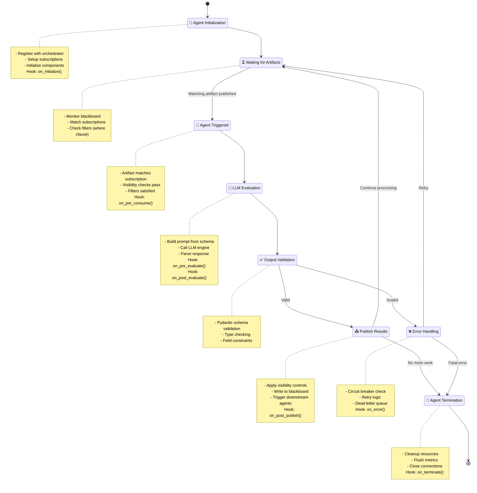

# Agents

Agents are the **autonomous workers** in Flock. They consume data from the [blackboard](blackboard.md), transform it, and publish results back—all without knowing about each other.

**Think of agents like skilled craftspeople in a workshop:** each specialist watches the shared workspace (blackboard) for materials they can work with, processes them independently, and places finished work back on the table for others.

---

## What is an Agent?

An agent is defined by three things:

1. **What it consumes** - The input data types it watches for
2. **What it publishes** - The output data types it produces
3. **How it transforms data** - The logic (usually LLM-powered) that converts input to output

**Key principle:** Agents are **loosely coupled**. They don't call each other directly—they just subscribe to data types on the blackboard.

---

## Your First Agent (60 Seconds)

Here's a complete working example:

```python
from pydantic import BaseModel, Field
from flock import Flock, flock_type

# 1. Define input and output types
@flock_type
class PizzaIdea(BaseModel):
    description: str

@flock_type
class Pizza(BaseModel):
    ingredients: list[str]
    size: str
    crust_type: str
    instructions: list[str]

# 2. Create orchestrator and agent
flock = Flock("openai/gpt-4.1")

pizza_master = (
    flock.agent("pizza_master")
    .consumes(PizzaIdea)
    .publishes(Pizza)
)

# 3. Use it
await flock.publish(PizzaIdea(description="truffle pizza"))
await flock.run_until_idle()
```

**What just happened:**
- ✅ **No prompts written** - The `Pizza` schema defines the output structure
- ✅ **Type-safe execution** - Pydantic validates the LLM output
- ✅ **Self-documenting** - The code shows exactly what the agent does
- ✅ **Future-proof** - Works with GPT-4, GPT-5, Claude, any model

[**👉 Try this example**](https://github.com/whiteducksoftware/flock/blob/main/examples/01-the-declarative-way/01_declarative_pizza.py)

---

## Agent Builder API

### Basic Agent Creation

```python
agent = flock.agent("agent_name")
```

Every agent needs a unique name within the flock instance.

### Adding a Description

```python
agent = (
    flock.agent("analyzer")
    .description("Analyzes customer sentiment from reviews")
)
```

**Why add descriptions?**
- Improves multi-agent coordination (agents understand each other's roles)
- Helps debugging (clear purpose in traces)
- Self-documents your system

### Declaring Consumption

```python
agent = flock.agent("analyzer").consumes(CustomerReview)
```

**Consume multiple types:**
```python
# Agent waits for BOTH types before executing
diagnostician = (
    flock.agent("diagnostician")
    .consumes(XRayAnalysis, LabResults)
    .publishes(Diagnosis)
)
```

**How it works:**
- Agent subscribes to specific data types
- Automatically triggered when matching artifact published to blackboard
- Can wait for multiple inputs (automatic dependency resolution)

### Declaring Publication

```python
agent = (
    flock.agent("reviewer")
    .consumes(CodeSubmission)
    .publishes(CodeReview)
)
```

**Publish multiple types:**
```python
# Agent can produce different outputs
analyzer = (
    flock.agent("analyzer")
    .consumes(BugReport)
    .publishes(BugAnalysis, SecurityAlert)  # Produces both types
)
```

### Complete Agent Definition

```python
code_reviewer = (
    flock.agent("code_reviewer")
    .description("Reviews code for bugs and security issues")
    .consumes(CodeSubmission)
    .publishes(CodeReview)
)
```

---

## Logic Operations (AND/OR Gates)

Flock provides intuitive syntax for coordinating multiple input types through **AND gates**, **OR gates**, and **count-based logic**. This enables powerful coordination patterns without manual wiring.

### AND Gates: Wait for ALL types

**Use `.consumes(A, B)` to wait for multiple types before triggering:**

```python
# Diagnostician waits for BOTH inputs
diagnostician = (
    flock.agent("diagnostician")
    .consumes(XRayAnalysis, LabResults)  # AND gate: waits for both
    .publishes(Diagnosis)
)
```

**How it works:**
- Agent collects artifacts as they arrive
- Triggers only when **ALL required types** are present
- Order-independent: `XRay → Lab` or `Lab → XRay` both work
- After triggering, the waiting pool clears for next cycle

**Example timeline:**
```
Time 0: XRayAnalysis published → diagnostician waits...
Time 1: LabResults published   → diagnostician triggers! ✅
Time 2: Agent executes with BOTH artifacts
```

**Use cases:**
- Multi-modal fusion (images + text + metadata)
- Parallel analysis aggregation (multiple perspectives → final decision)
- Dependency coordination (wait for prerequisites)

### OR Gates: Trigger on ANY type

**Use chained `.consumes()` to trigger on multiple types independently:**

```python
# Alert handler triggers on EITHER alert type
alert_handler = (
    flock.agent("alert_handler")
    .consumes(SystemAlert)      # OR
    .consumes(UserAlert)        # OR
    .consumes(SecurityAlert)    # OR
    .publishes(AlertResponse)
)
```

**How it works:**
- Each `.consumes()` creates a **separate subscription**
- Agent triggers independently for each type
- Single artifact per trigger (not accumulated)

**Example timeline:**
```
Time 0: SystemAlert published   → alert_handler triggers ✅
Time 1: UserAlert published     → alert_handler triggers AGAIN ✅
Time 2: SystemAlert published   → alert_handler triggers AGAIN ✅
```

**Use cases:**
- Polymorphic handling (multiple input types, same logic)
- Event routing (different triggers, same response)
- Flexible inputs (accept various formats)

### Count-Based AND Gates: Wait for MULTIPLE instances

**Use duplicate types to wait for multiple instances:**

```python
# Wait for THREE orders before processing
batch_processor = (
    flock.agent("batch_processor")
    .consumes(Order, Order, Order)  # Waits for 3 Orders
    .publishes(BatchSummary)
)

# Mixed counts: 2 Images + 1 Metadata
validator = (
    flock.agent("validator")
    .consumes(Image, Image, Metadata)  # Waits for 2 Images AND 1 Metadata
    .publishes(ValidationResult)
)
```

**How it works:**
- Flock counts required instances per type
- Artifacts collected until counts satisfied
- Order-independent (any arrival sequence works)
- **Latest wins**: If 4 Orders arrive but need 3, uses 3 most recent

**Example timeline:**
```
Time 0: Order #1 published → batch_processor waits... (need 3)
Time 1: Order #2 published → batch_processor waits... (need 1 more)
Time 2: Order #3 published → batch_processor triggers! ✅
Time 3: Agent executes with all 3 Orders
```

**Use cases:**
- Batch aggregation ("wait for 10 reviews before analyzing")
- Quorum logic ("need 3 validator approvals")
- Data fusion ("need 5 sensor readings before prediction")

### Combining Logic Operations

**Mix AND, OR, and count-based logic:**

```python
# Complex: (2 Images AND 1 Metadata) OR (3 Scans)
processor = (
    flock.agent("processor")
    .consumes(Image, Image, Metadata)  # AND gate with counts
    .consumes(Scan, Scan, Scan)        # OR gate: separate trigger path
    .publishes(ProcessedData)
)
```

**How it works:**
- First `.consumes()` creates AND gate waiting for 2 Images + 1 Metadata
- Second `.consumes()` creates OR gate waiting for 3 Scans
- Agent triggers when **either condition** satisfied

### Best Practices

**✅ Do:**
- Use AND gates for multi-modal fusion
- Use OR gates for polymorphic inputs
- Use count-based logic for batch operations
- Choose syntax that matches your intent

**❌ Don't:**
- Mix AND/OR without understanding separate subscriptions
- Forget that OR gates create independent triggers
- Assume specific artifact ordering

[**👉 See AND/OR gates in action: Debate Club**](https://github.com/whiteducksoftware/flock/blob/main/examples/02-dashboard/09_debate_club.py)

---

## Advanced Subscriptions

### Conditional Consumption (Filtering)

Only consume artifacts that match a condition:

```python
# Only process high-severity bugs
urgent_handler = (
    flock.agent("urgent_handler")
    .consumes(BugReport, where=lambda bug: bug.severity in ["Critical", "High"])
    .publishes(UrgentResponse)
)

# Only process high-scoring reviews
publisher = (
    flock.agent("publisher")
    .consumes(Review, where=lambda r: r.score >= 9)
    .publishes(Chapter)
)
```

**Use cases:**
- Priority routing (high-severity items first)
- Filtering by confidence score
- Content moderation (flagged items only)
- Geographic routing (region-specific processing)

[**👉 See conditional consumption in action**](https://github.com/whiteducksoftware/flock/blob/main/examples/05-claudes-workshop/03_code_review.py)

### Batch Processing

Wait for multiple artifacts before executing:

```python
from datetime import timedelta
from flock.specs import BatchSpec

# Process 10 customer reviews at once
batch_analyzer = (
    flock.agent("batch_analyzer")
    .consumes(
        CustomerReview,
        batch=BatchSpec(size=10, timeout=timedelta(seconds=30))
    )
    .publishes(TrendAnalysis)
)
```

**Parameters:**
- `size` - Number of artifacts to collect
- `timeout` - Maximum wait time before processing partial batch

**Use cases:**
- Efficient LLM calls (analyze 10 reviews in one prompt)
- Cost optimization (fewer API calls)
- Trend analysis (aggregating data)
- Bulk operations

### Join Operations

Wait for multiple artifact types within a time window:

```python
from flock.specs import JoinSpec

# Correlate market signals within 5-minute window
trader = (
    flock.agent("trader")
    .consumes(
        VolatilityAlert,
        SentimentAlert,
        join=JoinSpec(within=timedelta(minutes=5))
    )
    .publishes(TradeDecision)
)
```

**Use cases:**
- Multi-signal trading (correlate market indicators)
- Sensor fusion (correlate IoT readings)
- Event correlation (security incident detection)
- Multi-modal analysis (image + text + metadata)

---

## Execution Model

### How Agents Execute

1. **Artifact published** to blackboard
2. **Matching agents triggered** (all agents subscribed to that type)
3. **Parallel execution** - Multiple agents process concurrently
4. **Output validation** - Pydantic validates LLM output
5. **Results published** - Output artifacts appear on blackboard
6. **Cascade continues** - Downstream agents trigger automatically

```python
# These run in PARALLEL (both consume CodeSubmission)
bug_detector = flock.agent("bugs").consumes(CodeSubmission).publishes(BugAnalysis)
security_auditor = flock.agent("security").consumes(CodeSubmission).publishes(SecurityAnalysis)

# This waits for BOTH results (automatic dependency)
reviewer = flock.agent("reviewer").consumes(BugAnalysis, SecurityAnalysis).publishes(FinalReview)
```

**Execution timeline:**
```
Time 0: Publish(CodeSubmission)
Time 1: bug_detector + security_auditor execute in parallel ⚡
Time 2: reviewer waits for both...
Time 3: reviewer executes when both complete ✅
```

### Agent Lifecycle

Here's what happens inside an agent from start to finish:



**Key Lifecycle Stages:**

1. **Initialization** - Agent registers with orchestrator, sets up subscriptions
2. **Waiting** - Agent monitors blackboard for matching artifacts
3. **Triggered** - Matching artifact found, visibility checks pass
4. **Evaluation** - LLM processes input and generates output
5. **Validation** - Pydantic validates output against schema
6. **Publishing** - Valid output published to blackboard
7. **Error Handling** - Handles validation failures or execution errors
8. **Termination** - Agent cleanup when workflow completes

**Component Hooks:** Each stage can have custom components (see [Agent Components Guide](components.md))

### invoke() vs run_until_idle()

**Two ways to execute agents:**

#### Direct Invocation (Unit Testing)
```python
# Execute agent directly with input (no cascade)
await flock.invoke(agent, input_artifact, publish_outputs=False)
```

**Use when:**
- Testing specific agent in isolation
- Debugging single agent behavior
- No need for downstream cascade

#### Full Cascade (Production)
```python
# Publish and run entire workflow
await flock.publish(input_artifact)
await flock.run_until_idle()
```

**Use when:**
- Running multi-agent workflows
- Production execution
- Need complete cascade of agent reactions

[**👉 Learn more about execution patterns**](../getting-started/concepts.md#execution-patterns)

---

## Production Features

### Preventing Feedback Loops

Agents can accidentally trigger themselves:

```python
# ❌ DANGER: Infinite loop!
critic = (
    flock.agent("critic")
    .consumes(Essay)
    .publishes(Critique)
)
# If Critique is also an Essay, this triggers itself forever!

# ✅ SAFE: Prevent self-triggering
critic = (
    flock.agent("critic")
    .consumes(Essay)
    .publishes(Critique)
    .prevent_self_trigger(True)  # Won't consume its own output
)
```

### Circuit Breakers

Prevent runaway execution costs:

```python
# Limit total agent executions globally
flock = Flock("openai/gpt-4.1", max_agent_iterations=1000)

# After 1000 executions, Flock stops and raises error
```

**Why this matters:**
- Prevents infinite loops from costing thousands in API calls
- Catches bugs before production damage
- Essential for production safety

### Best-of-N Execution

Run agent multiple times, pick best result:

```python
agent = (
    flock.agent("analyzer")
    .consumes(DataPoint)
    .publishes(Analysis)
    .best_of(5, score=lambda result: result.confidence)
)
```

**How it works:**
- Executes agent 5 times with same input
- Scores each result using provided function
- Publishes only the highest-scoring result

**Use cases:**
- Quality assurance (run 3x, pick most confident)
- Consensus building (majority vote)
- Reliability (retry until good result)

---

## Agent Patterns

### Single-Agent Transform

**Pattern:** One input type → one output type

```python
translator = (
    flock.agent("translator")
    .consumes(EnglishText)
    .publishes(SpanishText)
)
```

**Use when:** Simple data transformation

[**👉 Example: Pizza Master**](https://github.com/whiteducksoftware/flock/blob/main/examples/01-the-declarative-way/01_declarative_pizza.py)

### Parallel-Then-Join

**Pattern:** Multiple agents process in parallel, one aggregates

```python
# Parallel analysis
bug_detector = flock.agent("bugs").consumes(Code).publishes(BugReport)
security = flock.agent("security").consumes(Code).publishes(SecurityReport)

# Aggregator waits for both
reviewer = flock.agent("reviewer").consumes(BugReport, SecurityReport).publishes(FinalReview)
```

**Use when:** Multi-perspective analysis needed

[**👉 Example: Code Review**](https://github.com/whiteducksoftware/flock/blob/main/examples/showcase/02_blog_review.py)

### Sequential Pipeline

**Pattern:** Chain of transformations A → B → C

```python
writer = flock.agent("writer").consumes(Topic).publishes(Draft)
editor = flock.agent("editor").consumes(Draft).publishes(EditedDraft)
publisher = flock.agent("publisher").consumes(EditedDraft).publishes(Article)
```

**Use when:** Step-by-step refinement needed

[**👉 Example: Band Formation**](https://github.com/whiteducksoftware/flock/blob/main/examples/05-claudes-workshop/02_band_formation.py)

### Fan-Out

**Pattern:** One agent produces many artifacts processed in parallel

```python
# One agent creates 8 story ideas
editor = flock.agent("editor").consumes(Topic).publishes(StoryIdea)

# 8 journalists work in parallel
for i in range(8):
    journalist = flock.agent(f"journalist_{i}").consumes(StoryIdea).publishes(Article)
```

**Use when:** Parallel processing of generated work

[**👉 Example: News Agency (8 parallel agents)**](https://github.com/whiteducksoftware/flock/blob/main/examples/05-claudes-workshop/07_news_agency.py)

### Feedback Loop

**Pattern:** Agent output can trigger earlier stages

```python
writer = flock.agent("writer").consumes(Idea, Feedback).publishes(Draft)
reviewer = flock.agent("reviewer").consumes(Draft).publishes(Feedback)
# Low-scoring drafts loop back to writer
```

**Use when:** Iterative refinement needed

[**👉 Example: Debate Club**](https://github.com/whiteducksoftware/flock/blob/main/examples/05-claudes-workshop/04_debate_club.py)

---

## Best Practices

### ✅ Do

- **Name agents descriptively** - `sentiment_analyzer`, not `agent_1`
- **Add descriptions** - Helps debugging and multi-agent coordination
- **Start simple** - One input → one output, then add complexity
- **Use prevent_self_trigger** - Avoid accidental infinite loops
- **Set circuit breakers** - Prevent runaway costs in production
- **Test in isolation** - Use `invoke(..., publish_outputs=False)` for unit tests

### ❌ Don't

- **Don't write prompts** - Let schemas define behavior
- **Don't hardcode agent references** - Use type subscriptions, not direct calls
- **Don't skip validation** - Trust Pydantic to catch bad outputs
- **Don't forget timeouts** - Batch/join operations need timeout values
- **Don't create God agents** - Break complex logic into smaller agents

---

## Common Use Cases

### Code Analysis
```python
bug_detector = flock.agent("bugs").consumes(CodeSubmission).publishes(BugAnalysis)
security = flock.agent("security").consumes(CodeSubmission).publishes(SecurityAnalysis)
reviewer = flock.agent("reviewer").consumes(BugAnalysis, SecurityAnalysis).publishes(CodeReview)
```

### Content Moderation
```python
detector = flock.agent("detector").consumes(UserPost).publishes(ModerationFlag)
reviewer = flock.agent("reviewer").consumes(
    ModerationFlag,
    where=lambda f: f.severity == "High"
).publishes(ModerationDecision)
```

### Multi-Modal Diagnostics
```python
radiology = flock.agent("radiology").consumes(Scan).publishes(XRayAnalysis)
lab = flock.agent("lab").consumes(Scan).publishes(LabResults)
diagnostician = flock.agent("diagnostician").consumes(XRayAnalysis, LabResults).publishes(Diagnosis)
```

### Customer Sentiment Analysis
```python
analyzer = flock.agent("analyzer").consumes(
    CustomerReview,
    batch=BatchSpec(size=10, timeout=timedelta(seconds=30))
).publishes(SentimentTrend)
```

---

## MCP Tools Integration {#mcp-tools}

**Model Context Protocol (MCP)** extends agents with external tool capabilities—web browsing, file systems, databases, and more.

### What is MCP?

MCP is a standardized protocol for giving LLMs access to external tools and data. Think of it as **"function calling on steroids"**—instead of defining functions manually, you connect to MCP servers that provide pre-built tool suites.

### Adding MCP to Agents

```python
from flock import Flock
from flock.mcp import StdioServerParameters

# Register MCP server
flock = Flock("openai/gpt-4.1")

flock.add_mcp(
    name="browse_web",
    connection_params=StdioServerParameters(
        command="npx", args=["-y", "@playwright/mcp@latest"]
    ),
)

# Agent with MCP tools
researcher = (
    flock.agent("researcher")
    .description("Research agent with web browsing")
    .consumes(ResearchQuery)
    .publishes(ResearchReport)
    .with_mcps(["browse_web"])  # Grant access to Playwright tools
)
```

### How It Works

1. **MCP server** - External process providing tools (Playwright, Filesystem, etc.)
2. **Flock integration** - Manages server lifecycle and tool exposure
3. **Agent access** - `.with_mcps()` grants specific agents access to specific servers
4. **LLM uses tools** - The LLM can invoke tools as needed during execution

### Available MCP Servers

**Popular MCP servers:**

- **@playwright/mcp** - Web browsing, screenshots, form filling
- **@modelcontextprotocol/server-filesystem** - File operations
- **@modelcontextprotocol/server-postgres** - Database queries
- **@modelcontextprotocol/server-github** - GitHub API access
- **@modelcontextprotocol/server-slack** - Slack integration

See the [MCP Registry](https://github.com/modelcontextprotocol) for more servers.

### Security Model

**MCP access is explicit:**

```python
# ❌ Default: No tools
agent1 = flock.agent("agent1").consumes(Input).publishes(Output)

# ✅ Explicit: Specific tools only
agent2 = (
    flock.agent("agent2")
    .consumes(Input)
    .publishes(Output)
    .with_mcps(["browse_web"])  # Only Playwright
)

agent3 = (
    flock.agent("agent3")
    .consumes(Input)
    .publishes(Output)
    .with_mcps(["browse_web", "filesystem"])  # Multiple servers
)
```

**Why explicit?** Security. You control exactly which agents can access which external systems.

### Complete Example

```python
import asyncio
from pydantic import BaseModel
from flock import Flock, flock_type

@flock_type
class ResearchQuery(BaseModel):
    topic: str
    urls: list[str]

@flock_type
class ResearchReport(BaseModel):
    summary: str
    key_findings: list[str]
    sources: list[str]

# Setup with Playwright MCP
flock = Flock("openai/gpt-4.1")

flock.add_mcp(
    name="browse_web",
    connection_params=StdioServerParameters(
        command="npx", args=["-y", "@playwright/mcp@latest"]
    ),
)

# Researcher agent with web browsing
researcher = (
    flock.agent("researcher")
    .description("Gathers information from websites")
    .consumes(ResearchQuery)
    .publishes(ResearchReport)
    .with_mcps(["browse_web"])
)

async def main():
    await flock.publish(ResearchQuery(
        topic="AI agent frameworks",
        urls=["https://example.com/ai-agents"]
    ))
    await flock.run_until_idle()

    reports = await flock.store.get_by_type(ResearchReport)
    print(reports[0].summary)

asyncio.run(main())
```

### Best Practices

**✅ Do:**
- Use MCP for capabilities beyond LLM knowledge (web, databases, files)
- Grant minimal required access (principle of least privilege)
- Test MCP agents thoroughly (tools can fail)
- Handle tool errors gracefully

**❌ Don't:**
- Give all agents access to all tools
- Assume tool calls always succeed
- Use MCP for simple tasks (type contracts are often better)

### Learn More

- **[Conditional Routing Tutorial](../tutorials/conditional-routing.md)** - Complete MCP walkthrough
- **[Advanced Patterns](../tutorials/advanced-patterns.md)** - MCP in production
- **[MCP Documentation](https://modelcontextprotocol.io)** - Official MCP docs

---

## Next Steps

- **[Blackboard Architecture](blackboard.md)** - Understand the shared workspace
- **[Visibility Controls](visibility.md)** - Secure agent communication
- **[Quick Start](../getting-started/quick-start.md)** - Build your first agent
- **[Examples](https://github.com/whiteducksoftware/flock/tree/main/examples)** - Working code to learn from

---

## Complete Example

Here's everything together:

```python
import asyncio
from pydantic import BaseModel, Field
from flock import Flock, flock_type
from flock.specs import BatchSpec
from datetime import timedelta

# Define artifacts
@flock_type
class CustomerReview(BaseModel):
    text: str
    rating: int = Field(ge=1, le=5)

@flock_type
class Sentiment(BaseModel):
    score: float = Field(ge=0.0, le=1.0)
    classification: str = Field(pattern="^(Positive|Neutral|Negative)$")

@flock_type
class TrendReport(BaseModel):
    overall_sentiment: float
    positive_count: int
    negative_count: int
    recommendations: list[str]

# Create orchestrator
flock = Flock("openai/gpt-4.1", max_agent_iterations=1000)

# Individual sentiment analysis
sentiment_analyzer = (
    flock.agent("sentiment_analyzer")
    .description("Analyzes sentiment of customer reviews")
    .consumes(CustomerReview)
    .publishes(Sentiment)
)

# Batch trend analysis
trend_analyzer = (
    flock.agent("trend_analyzer")
    .description("Analyzes sentiment trends across reviews")
    .consumes(
        Sentiment,
        batch=BatchSpec(size=10, timeout=timedelta(seconds=30))
    )
    .publishes(TrendReport)
)

# Use it
async def main():
    # Publish 20 reviews
    for i in range(20):
        review = CustomerReview(
            text=f"Review {i} text...",
            rating=(i % 5) + 1
        )
        await flock.publish(review)

    # Process all reviews
    await flock.run_until_idle()

    # Get results
    trends = await flock.store.get_by_type(TrendReport)
    print(f"Generated {len(trends)} trend reports")

asyncio.run(main())
```

This example demonstrates:
- ✅ Type-safe artifacts with Pydantic validation
- ✅ Parallel execution (20 sentiment_analyzer instances)
- ✅ Batch processing (trend_analyzer waits for 10 sentiments)
- ✅ Automatic cascade (reviews → sentiments → trends)
- ✅ Production safety (circuit breaker set)
- ✅ Type-safe retrieval (no casting needed)

---

**Ready to build agents?** Start with the [Quick Start Guide](../getting-started/quick-start.md) or explore [working examples](https://github.com/whiteducksoftware/flock/tree/main/examples).
