# Blackboard Architecture

The **blackboard** is Flock's central coordination mechanism—a shared workspace where [agents](agents.md) publish and consume typed data artifacts without directly knowing about each other.

**Think of it like a busy bulletin board:** experts post their findings on sticky notes, others see relevant notes and add their own contributions, and gradually the collective intelligence emerges—all without anyone orchestrating who does what.

---

## What is a Blackboard?

A **blackboard** is a shared memory space where:

- **Agents publish artifacts** (typed data) when they complete work
- **Agents subscribe to artifact types** they want to process
- **Workflows emerge** from type-based subscriptions (no explicit wiring needed)
- **Execution is automatic** (matching agents trigger when their data appears)

**Key principle:** Agents never call each other—they only interact through typed data on the blackboard.

---

## Historical Context

Blackboard architecture isn't new—it's been solving complex AI problems since the 1970s:

**Hearsay-II (1970s):**
- Speech recognition system at Carnegie Mellon
- Multiple specialist agents collaborating on shared workspace
- Each expert contributed partial solutions
- Collective intelligence emerged without central controller

**Other classic systems:**
- **HASP/SIAP** - Sonar signal interpretation
- **BB1** - Blackboard control architecture
- **PROTEAN** - Protein structure prediction

**Why revive this pattern?** Modern LLMs are perfect for blackboard orchestration:
- Each agent is an LLM specialist
- Type-safe data contracts (Pydantic schemas)
- Distributed tracing shows complete execution history
- Scales better than rigid graph topologies

**Flock applies 50+ years of proven patterns to modern AI.**

---

## How It Works

Here's a visual representation of the blackboard pattern:


**Key Points:**
- **Decoupled Communication** - Publishers don't know about subscribers
- **Type-Based Matching** - Agents trigger based on artifact types, not explicit edges
- **Multi-Consumer** - Multiple agents can consume the same artifact (Agent 4 and 5 both read A)
- **Multi-Input** - Agents can wait for multiple artifacts (Agent 5 needs both A and B)
- **No Central Orchestration** - The blackboard doesn't decide who does what

### 1. Publish Artifacts

Agents publish typed artifacts to the blackboard:

```python
from pydantic import BaseModel
from flock import Flock, flock_type

@flock_type
class CodeSubmission(BaseModel):
    code: str
    language: str

# Publish to blackboard
await flock.publish(CodeSubmission(
    code="def hello(): print('hi')",
    language="python"
))
```

### 2. Agents Subscribe to Types

Agents declare what types they consume:

```python
bug_detector = (
    flock.agent("bug_detector")
    .consumes(CodeSubmission)  # Subscribe to this type
    .publishes(BugAnalysis)
)
```

### 3. Automatic Triggering

When a matching artifact appears, subscribed agents execute:

```python
# 1. CodeSubmission published
await flock.publish(code)

# 2. Matching agents trigger automatically
await flock.run_until_idle()

# 3. bug_detector executed (consumed CodeSubmission)
# 4. BugAnalysis published back to blackboard
```

### 4. Cascading Workflows

Output artifacts can trigger more agents:

```python
# Agent 1: Consumes CodeSubmission → Publishes BugAnalysis
bug_detector = flock.agent("bugs").consumes(CodeSubmission).publishes(BugAnalysis)

# Agent 2: Consumes BugAnalysis → Publishes Report
reporter = flock.agent("reporter").consumes(BugAnalysis).publishes(Report)

# Cascade: CodeSubmission → bug_detector → BugAnalysis → reporter → Report
```

**The workflow emerges from type subscriptions—no graph edges needed!**

### Type-Driven Auto-Chaining

Here's how agents automatically chain through type matching:

```mermaid
graph LR
    subgraph "Type Definitions"
        Input[📋 CodeSubmission<br/>code: str<br/>language: str]
        Middle1[📋 BugAnalysis<br/>bugs: list<br/>severity: str]
        Middle2[📋 SecurityAnalysis<br/>vulnerabilities: list<br/>risk_score: float]
        Output[📋 FinalReport<br/>summary: str<br/>recommendations: list]
    end

    subgraph "Agent Declarations"
        A1[🤖 bug_detector<br/>.consumes CodeSubmission<br/>.publishes BugAnalysis]
        A2[🤖 security_auditor<br/>.consumes CodeSubmission<br/>.publishes SecurityAnalysis]
        A3[🤖 report_generator<br/>.consumes BugAnalysis, SecurityAnalysis<br/>.publishes FinalReport]
    end

    subgraph "Execution Flow ⚡"
        E1[1️⃣ Publish CodeSubmission]
        E2[2️⃣ Triggers bug_detector + security_auditor<br/>parallel execution]
        E3[3️⃣ Both publish analyses]
        E4[4️⃣ Triggers report_generator<br/>waits for both inputs]
        E5[5️⃣ Publishes FinalReport]
    end

    Input -->|type match| A1
    Input -->|type match| A2
    A1 -->|publishes| Middle1
    A2 -->|publishes| Middle2
    Middle1 -->|type match| A3
    Middle2 -->|type match| A3
    A3 -->|publishes| Output

    E1 --> E2
    E2 --> E3
    E3 --> E4
    E4 --> E5

    style Input fill:#60a5fa,stroke:#333,stroke-width:2px,color:#000
    style Middle1 fill:#60a5fa,stroke:#333,stroke-width:2px,color:#000
    style Middle2 fill:#60a5fa,stroke:#333,stroke-width:2px,color:#000
    style Output fill:#60a5fa,stroke:#333,stroke-width:2px,color:#000
    style A1 fill:#f59e0b,stroke:#333,stroke-width:2px,color:#000
    style A2 fill:#f59e0b,stroke:#333,stroke-width:2px,color:#000
    style A3 fill:#8b5cf6,stroke:#333,stroke-width:2px,color:#fff
```



**Key Insights:**

1. **No Explicit Edges** - Agents don't reference each other
2. **Type-Based Routing** - CodeSubmission automatically routes to bug_detector and security_auditor
3. **Automatic Parallelization** - Multiple consumers execute concurrently
4. **Dependency Resolution** - report_generator waits for both analyses automatically
5. **O(n) Complexity** - Adding new agents doesn't require rewiring (vs O(n²) in graphs)

**This is what makes Flock scalable:** Add a 4th analyzer? Just `.consumes(CodeSubmission)`. No graph updates needed!

---

## Blackboard vs Graph-Based Orchestration

### Graph-Based Approach

```python
# Explicit workflow with hardcoded edges
workflow = StateGraph()

workflow.add_node("bug_detector", bug_detector_func)
workflow.add_node("security", security_func)
workflow.add_node("reporter", reporter_func)

# Manual wiring (tight coupling)
workflow.add_edge("bug_detector", "reporter")
workflow.add_edge("security", "reporter")

# Want to add performance_analyzer? Rewrite the graph!
```

**Problems:**
- ❌ Tight coupling (agents know about successors)
- ❌ O(n²) edge complexity
- ❌ Hard to modify (rewrite edges)
- ❌ No automatic parallelism
- ❌ Testing requires full graph

### Blackboard Approach

```python
# Agents subscribe to types (loose coupling)
bug_detector = flock.agent("bugs").consumes(Code).publishes(BugReport)
security = flock.agent("security").consumes(Code).publishes(SecurityReport)
reporter = flock.agent("reporter").consumes(BugReport, SecurityReport).publishes(Report)

# Want to add performance_analyzer? Just subscribe it:
perf_analyzer = flock.agent("perf").consumes(Code).publishes(PerfReport)
# Done! No graph rewiring. Reporter can optionally consume it.
```

**Benefits:**
- ✅ Loose coupling (agents only know types)
- ✅ O(n) subscription complexity
- ✅ Easy to extend (add new subscribers)
- ✅ Automatic parallelism (concurrent consumers)
- ✅ Test agents in isolation

---

## publish() + run_until_idle() Separation

**A key design decision:** Publishing and execution are separate operations.

### Why Separate?

**If `run_until_idle()` was automatic (like most frameworks):**
```python
# ❌ Sequential execution (slow!)
for review in customer_reviews:
    await flock.publish(review)  # Publishes AND waits for completion
    # 100 reviews = 100x single execution time
```

**With explicit separation:**
```python
# ✅ Parallel execution (fast!)
for review in customer_reviews:
    await flock.publish(review)  # Just schedules work

await flock.run_until_idle()  # All agents run in parallel!
# 100 reviews processed in ~1x single execution time
```

### Usage Patterns

**Batch Processing:**
```python
# Queue up 100 items
for item in items:
    await flock.publish(item)

# Process all in parallel
await flock.run_until_idle()
```

**Multi-Type Workflows:**
```python
# Publish different types, trigger different agents
await flock.publish(XRayImage(...))
await flock.publish(LabResults(...))
await flock.publish(PatientHistory(...))

# Radiologist, lab_tech, historian all run concurrently
await flock.run_until_idle()
```

**Workflow Boundaries:**
```python
# Separate workflows explicitly
async with flock.traced_run("workflow_1"):
    await flock.publish(data1)
    await flock.run_until_idle()

async with flock.traced_run("workflow_2"):
    await flock.publish(data2)
    await flock.run_until_idle()
```

[**👉 Learn more about batching patterns**](../getting-started/concepts.md#the-batching-pattern-parallel-execution)

---

## Artifact Flow Patterns

### Sequential Pipeline

**Pattern:** A → B → C (one after another)

```python
@flock_type
class BandConcept(BaseModel):
    genre: str

@flock_type
class BandLineup(BaseModel):
    band_name: str
    members: list[dict]

@flock_type
class Album(BaseModel):
    title: str
    tracklist: list[dict]

# Agent chain emerges from type subscriptions
talent_scout = flock.agent("scout").consumes(BandConcept).publishes(BandLineup)
producer = flock.agent("producer").consumes(BandLineup).publishes(Album)
marketer = flock.agent("marketer").consumes(Album).publishes(MarketingCopy)

# Execution: BandConcept → talent_scout → BandLineup → producer → Album → marketer → MarketingCopy
```

**Flow:**
```
Time 0: Publish(BandConcept)
Time 1: talent_scout executes
Time 2: Publish(BandLineup) → triggers producer
Time 3: producer executes
Time 4: Publish(Album) → triggers marketer
Time 5: marketer executes
Time 6: Publish(MarketingCopy) → done
```

[**👉 Example: Band Formation**](https://github.com/whiteducksoftware/flock/blob/main/examples/05-claudes-workshop/lesson_02_band_formation.py)

### Parallel-Then-Join

**Pattern:** Multiple agents process same input, one aggregates

```python
# Both consume CodeSubmission (parallel execution)
bug_detector = flock.agent("bugs").consumes(CodeSubmission).publishes(BugReport)
security = flock.agent("security").consumes(CodeSubmission).publishes(SecurityReport)

# Waits for BOTH reports (automatic dependency)
reviewer = flock.agent("reviewer").consumes(BugReport, SecurityReport).publishes(FinalReview)

# Execution: CodeSubmission → [bug_detector + security in parallel] → reviewer
```

**Flow:**
```
Time 0: Publish(CodeSubmission)
Time 1: bug_detector + security execute in parallel ⚡
Time 2: Both publish results
Time 3: reviewer waits for both...
Time 4: reviewer executes when both complete ✅
Time 5: Publish(FinalReview) → done
```

[**👉 Example: Code Review**](https://github.com/whiteducksoftware/flock/blob/main/examples/showcase/02_blog_review.py)

### Fan-Out

**Pattern:** One produces many, many process in parallel

```python
# Editor creates 8 story ideas
editor = flock.agent("editor").consumes(Topic).publishes(StoryIdea)

# 8 journalists work in parallel
for i in range(8):
    journalist = flock.agent(f"journalist_{i}").consumes(StoryIdea).publishes(Article)

# Execution: Topic → editor → [8 StoryIdeas] → [8 journalists in parallel] → [8 Articles]
```

**Flow:**
```
Time 0: Publish(Topic)
Time 1: editor executes
Time 2: Publish 8 StoryIdeas
Time 3: 8 journalists execute in parallel ⚡
Time 4: 8 Articles published
```

[**👉 Example: News Agency (8 parallel agents)**](https://github.com/whiteducksoftware/flock/blob/main/examples/05-claudes-workshop/lesson_07_news_agency.py)

### Conditional Routing

**Pattern:** Different agents for different data characteristics

```python
# High-severity bugs go to urgent handler
urgent = flock.agent("urgent").consumes(
    BugReport,
    where=lambda b: b.severity in ["Critical", "High"]
).publishes(UrgentResponse)

# Low-severity bugs go to backlog
backlog = flock.agent("backlog").consumes(
    BugReport,
    where=lambda b: b.severity in ["Low", "Medium"]
).publishes(BacklogItem)

# Routing happens automatically based on data!
```

[**👉 Example: Code Review with Filtering**](https://github.com/whiteducksoftware/flock/blob/main/examples/05-claudes-workshop/lesson_03_code_review.py)

### Feedback Loop

**Pattern:** Output can trigger earlier stages

```python
# Writer consumes both ideas and feedback
writer = flock.agent("writer").consumes(Idea, Feedback).publishes(Draft)

# Reviewer creates feedback
reviewer = flock.agent("reviewer").consumes(Draft).publishes(Feedback)

# Low-scoring feedback loops back to writer automatically!
```

[**👉 Example: Debate Club**](https://github.com/whiteducksoftware/flock/blob/main/examples/05-claudes-workshop/lesson_04_debate_club.py)

---

## Blackboard State Management

### Retrieving Artifacts

Get artifacts by type:

```python
# Type-safe retrieval (no casting needed)
diagnoses: list[Diagnosis] = await flock.store.get_by_type(Diagnosis)

# Legacy API (returns wrapped artifacts)
artifacts = await flock.store.get_artifacts_by_type("Diagnosis")
for artifact in artifacts:
    diagnosis = artifact.obj  # Access the Diagnosis object
```

### Filtering Artifacts

```python
# Get artifacts matching criteria
from flock.core.visibility import TenantVisibility

patient_diagnoses = await flock.store.get_artifacts_by_type(
    "Diagnosis",
    visibility=TenantVisibility(tenant_id="patient_123")
)
```

### Clearing State

```python
# Clear all artifacts (useful for testing)
await flock.store.clear()

# Clear specific type
# (Not currently supported - clear all or none)
```

---

## Production Considerations

### Memory Management

**Current limitation:** Blackboard is in-memory only (v0.5.0)

```python
# ⚠️ In-memory only
# After 10,000 artifacts, memory usage grows
# Restart required to clear

# ✅ v1.0 will support:
# - Redis backend (distributed state)
# - PostgreSQL backend (persistent history)
# - Automatic artifact expiration
# - Query by time range
```

### Observability

**Enable tracing to see artifact flow:**

```bash
export FLOCK_AUTO_TRACE=true
export FLOCK_TRACE_FILE=true

python your_app.py
# Traces stored in .flock/traces.duckdb
```

**Query artifact flow:**
```python
import duckdb
conn = duckdb.connect('.flock/traces.duckdb', read_only=True)

# See artifact transformations
flow = conn.execute("""
    SELECT
        name,
        service as agent,
        json_extract(attributes, '$.input.artifacts[0].type') as input_type,
        json_extract(attributes, '$.output.type') as output_type
    FROM spans
    WHERE trace_id = ?
    AND (attributes->>'input.artifacts' IS NOT NULL
         OR attributes->>'output.type' IS NOT NULL)
    ORDER BY start_time ASC
""", [trace_id]).fetchall()
```

[**👉 Learn more about tracing**](tracing/index.md)

### Dashboard Visualization

**See artifact flow in real-time:**

```python
await flock.serve(dashboard=True)
# Open http://localhost:8344
```

**Dashboard views:**
- **Agent View** - See agents as nodes, artifacts as edges
- **Blackboard View** - See artifacts as nodes, transformations as edges
- **Live updates** - WebSocket streaming of new artifacts
- **Filter by correlation ID** - Track specific workflows

[**👉 Learn more about the dashboard**](dashboard.md)

---

## Best Practices

### ✅ Do

- **Use descriptive artifact types** - `BugAnalysis`, not `Analysis`
- **Keep artifacts immutable** - Don't modify after publishing
- **Add Field constraints** - Validate outputs with Pydantic
- **Use correlation IDs** - Track workflows across agents
- **Enable tracing** - Understand artifact flow in production
- **Batch when possible** - Publish multiple, then `run_until_idle()`

### ❌ Don't

- **Don't create huge artifacts** - Keep payloads reasonable (<1MB)
- **Don't publish circular types** - Prevents feedback loops
- **Don't skip validation** - Pydantic catches bad data
- **Don't rely on artifact order** - Use timestamps if order matters
- **Don't forget circuit breakers** - Prevent infinite cascades

---

## Common Patterns

### Multi-Stage Processing

```python
# Stage 1: Data ingestion
ingester = flock.agent("ingester").consumes(RawData).publishes(CleanData)

# Stage 2: Analysis
analyzer = flock.agent("analyzer").consumes(CleanData).publishes(Insights)

# Stage 3: Reporting
reporter = flock.agent("reporter").consumes(Insights).publishes(Report)

# Automatic pipeline: RawData → CleanData → Insights → Report
```

### Parallel Analysis

```python
# Multiple analyzers process same data
sentiment = flock.agent("sentiment").consumes(Review).publishes(SentimentScore)
topics = flock.agent("topics").consumes(Review).publishes(TopicTags)
spam = flock.agent("spam").consumes(Review).publishes(SpamFlag)

# All run in parallel when Review published
```

### Aggregation

```python
# Collect multiple analyses
aggregator = flock.agent("aggregator").consumes(
    SentimentScore,
    TopicTags,
    SpamFlag
).publishes(ReviewAnalysis)

# Waits for all three before executing
```

### Dynamic Routing

```python
# Route based on content
urgent = flock.agent("urgent").consumes(
    Ticket,
    where=lambda t: t.priority == "Critical"
).publishes(UrgentResponse)

normal = flock.agent("normal").consumes(
    Ticket,
    where=lambda t: t.priority != "Critical"
).publishes(StandardResponse)

# Routing emerges from data, not graph edges
```

---

## Comparison to Other Patterns

### vs Message Queue (Kafka, RabbitMQ)

| Feature | Message Queue | Blackboard |
|---------|--------------|-----------|
| **Coupling** | Producer knows consumer | Neither knows the other |
| **Routing** | Topic-based | Type-based + content-based |
| **Parallelism** | Manual partitioning | Automatic (concurrent subscribers) |
| **State** | Stateless messages | Stateful artifacts |
| **History** | Log-based | Trace-based (DuckDB) |
| **Use case** | Event streaming | Agent coordination |

### vs Service Mesh

| Feature | Service Mesh | Blackboard |
|---------|-------------|-----------|
| **Communication** | Direct HTTP/gRPC | Indirect (via blackboard) |
| **Discovery** | Service registry | Type registry |
| **Coupling** | Service-to-service | Type-to-type |
| **Orchestration** | External (Istio, Linkerd) | Internal (blackboard) |
| **Testing** | Requires network | In-memory mocking |

### vs Actor Model (Akka, Orleans)

| Feature | Actor Model | Blackboard |
|---------|------------|-----------|
| **Communication** | Message passing | Artifact publishing |
| **Addressing** | Actor addresses | Type subscriptions |
| **State** | Per-actor state | Shared blackboard state |
| **Parallelism** | Actor isolation | Concurrent consumers |
| **Supervision** | Actor hierarchies | Circuit breakers |

---

## Next Steps

- **[Agents Guide](agents.md)** - Learn how agents interact with blackboard
- **[Visibility Controls](visibility.md)** - Secure artifact access
- **[Getting Started](../getting-started/quick-start.md)** - Build your first blackboard workflow
- **[Examples](https://github.com/whiteducksoftware/flock/tree/main/examples)** - Working code patterns

---

## Complete Example

Here's everything together—blackboard orchestration in action:

```python
import asyncio
from pydantic import BaseModel, Field
from flock import Flock, flock_type

# Define artifact types
@flock_type
class CodeSubmission(BaseModel):
    code: str
    language: str

@flock_type
class BugReport(BaseModel):
    bugs: list[str]
    severity: str = Field(pattern="^(Critical|High|Medium|Low)$")

@flock_type
class SecurityReport(BaseModel):
    vulnerabilities: list[str]
    risk: str = Field(pattern="^(Critical|High|Medium|Low)$")

@flock_type
class FinalReview(BaseModel):
    decision: str = Field(pattern="^(Approve|Reject|Needs Work)$")
    summary: str

# Create blackboard
flock = Flock("openai/gpt-4.1")

# Define agents (loose coupling via types)
bug_detector = flock.agent("bugs").consumes(CodeSubmission).publishes(BugReport)
security = flock.agent("security").consumes(CodeSubmission).publishes(SecurityReport)
reviewer = flock.agent("reviewer").consumes(BugReport, SecurityReport).publishes(FinalReview)

# Use it
async def main():
    # Publish code to blackboard
    await flock.publish(CodeSubmission(
        code="def unsafe(): exec(user_input)",
        language="python"
    ))

    # Let agents cascade
    await flock.run_until_idle()

    # Get final review
    reviews = await flock.store.get_by_type(FinalReview)
    print(f"Decision: {reviews[0].decision}")
    print(f"Summary: {reviews[0].summary}")

asyncio.run(main())
```

**What happened:**
1. ✅ `CodeSubmission` published to blackboard
2. ✅ `bug_detector` + `security` triggered in parallel
3. ✅ Both published results to blackboard
4. ✅ `reviewer` triggered when both reports available
5. ✅ `FinalReview` published to blackboard
6. ✅ Retrieved type-safe result

**No graph edges. No service mesh. Just types and subscriptions.**

---

**Ready to build blackboard workflows?** Start with the [Quick Start Guide](../getting-started/quick-start.md) or explore [working examples](https://github.com/whiteducksoftware/flock/tree/main/examples).
