# Agent Components

Agent Components are one of Flock's most powerful features, enabling you to customize agent behavior through lifecycle hooks without modifying agent logic.

---

## What Are Agent Components?

Components are **pluggable modules** that hook into specific points in an agent's execution lifecycle. Think of them as middleware that can:

- **Preprocess** inputs before agents see them
- **Transform** outputs before publishing
- **Add capabilities** like rate limiting, caching, metrics, budgets
- **Customize behavior** without changing core agent logic

```python
# Components plug into the agent lifecycle
agent = (
    flock.agent("analyzer")
    .consumes(Task)
    .publishes(Report)
    .with_utilities(
        RateLimiter(max_calls=10),
        MetricsCollector(),
        CacheLayer(ttl=3600)
    )
)
```

---

## Component Lifecycle Hooks

Components implement hooks that fire at specific points during agent execution:

### Lifecycle Flow

```mermaid
flowchart TD
    Start([Agent Execution Starts]) --> Init[🔧 on_initialize<br/>Component setup,<br/>resource allocation]

    Init --> PreConsume[📥 on_pre_consume<br/>Filter/transform<br/>input artifacts]

    PreConsume --> PreEval[⚙️ on_pre_evaluate<br/>Modify inputs<br/>before engine call]

    PreEval --> Evaluate{🧠 evaluate<br/>LLM Engine or<br/>Custom Logic}

    Evaluate -->|Success| PostEval[✅ on_post_evaluate<br/>Transform results,<br/>validate output]
    Evaluate -->|Error| Error[❌ on_error<br/>Handle failures,<br/>attempt recovery]

    PostEval --> PostPublish[📤 on_post_publish<br/>React to published<br/>artifacts, metrics]

    PostPublish --> Terminate[🛑 on_terminate<br/>Cleanup resources,<br/>final metrics]

    Error --> Terminate

    Terminate --> End([Agent Execution Complete])

    style Init fill:#10b981,stroke:#333,stroke-width:2px,color:#000
    style PreConsume fill:#60a5fa,stroke:#333,stroke-width:2px,color:#000
    style PreEval fill:#8b5cf6,stroke:#333,stroke-width:2px,color:#fff
    style Evaluate fill:#f59e0b,stroke:#333,stroke-width:3px,color:#000
    style PostEval fill:#8b5cf6,stroke:#333,stroke-width:2px,color:#fff
    style PostPublish fill:#60a5fa,stroke:#333,stroke-width:2px,color:#000
    style Terminate fill:#ef4444,stroke:#333,stroke-width:2px,color:#fff
    style Error fill:#dc2626,stroke:#333,stroke-width:2px,color:#fff
```



**Execution Order:**

1. **on_initialize** - Setup phase (once per agent execution)
2. **on_pre_consume** - Process/filter input artifacts
3. **on_pre_evaluate** - Prepare data for engine call
4. **evaluate()** - Core agent logic (LLM call or custom)
5. **on_post_evaluate** - Transform engine output
6. **on_post_publish** - React to published artifacts
7. **on_terminate** - Always runs (cleanup, metrics)
8. **on_error** - Only on failures (error handling)

**Key Points:**
- ✅ **Sequential Execution** - Hooks run in strict order
- ✅ **Context Passing** - Each hook receives agent context
- ✅ **Error Handling** - on_error catches failures, on_terminate always runs
- ✅ **Multiple Components** - Hooks from all components execute in registration order

### Available Hooks

| Hook | When It Runs | Input | Output | Use Cases |
|------|--------------|-------|--------|-----------|
| `on_initialize` | Before agent execution starts | agent, ctx | None | Setup, validation, resource allocation |
| `on_pre_consume` | Before processing inputs | agent, ctx, artifacts | Modified artifacts | Filtering, enrichment, deduplication |
| `on_pre_evaluate` | Before LLM/engine call | agent, ctx, eval_inputs | Modified eval_inputs | Add context, modify prompts |
| `on_post_evaluate` | After LLM/engine call | agent, ctx, inputs, result | Modified result | Transform outputs, validation |
| `on_post_publish` | After artifact published | agent, ctx, artifact | None | Logging, metrics, notifications |
| `on_error` | If execution fails | agent, ctx, error | None | Error handling, cleanup, retries |
| `on_terminate` | Always at execution end | agent, ctx | None | Resource cleanup, final metrics |

---

## Component Types

### AgentComponent (Base Class)

For general-purpose utilities like rate limiting, caching, metrics:

```python
from flock.components import AgentComponent

class RateLimiter(AgentComponent):
    """Limit agent execution rate."""

    max_calls: int = 10
    window_seconds: int = 60
    priority: int = 0  # Lower = earlier execution (defaults to registration order)

    def __init__(self, max_calls: int = 10, window: int = 60):
        super().__init__(name="rate_limiter")
        self.max_calls = max_calls
        self.window_seconds = window
        self._calls = []

    async def on_pre_consume(self, agent, ctx, inputs):
        """Check rate limit before processing."""
        import time

        now = time.time()
        # Remove expired entries
        self._calls = [t for t in self._calls if now - t < self.window_seconds]

        if len(self._calls) >= self.max_calls:
            raise RuntimeError(
                f"Rate limit exceeded: {self.max_calls} calls "
                f"per {self.window_seconds}s"
            )

        self._calls.append(now)
        return inputs
```

**Execution order & logging.** Agent utilities now support a `priority` field that mirrors
the orchestrator component system. Components run in ascending priority order
(default `0` preserves registration order thanks to stable sorting), and every
hook invocation is logged with component name, priority, and agent context. This
makes it easy to slot in cross-cutting utilities (e.g., telemetry collectors with
`priority=-100`) without rewriting existing agents, while still getting detailed
traceable logs for each lifecycle stage.

### EngineComponent (Replacing the Execution Engine)

**EngineComponents are special**: They replace the agent's evaluation logic entirely. By default, agents use `DSPyEngine` for LLM-based processing, but you can swap it out for:

- **Custom LLM backends** (Instructor, direct API calls, local models)
- **Non-LLM logic** (rule engines, calculations, database queries)
- **Hybrid approaches** (LLM + deterministic validation)

#### How Engine Replacement Works

```python
# Default: Uses DSPyEngine for LLM calls
agent = flock.agent("analyzer").consumes(Task).publishes(Report)

# Replace with custom engine
agent.with_engines(
    InstructorEngine(model="gpt-4o")  # Now uses Instructor instead of DSPy
)
```

Engines are **also AgentComponents** - they implement the same lifecycle hooks, but their `evaluate()` method is what actually runs when the agent executes.

#### Example: Instructor-based Engine

```python
from flock.components import EngineComponent
from flock import EvalInputs, EvalResult
import instructor
from openai import AsyncOpenAI

class InstructorEngine(EngineComponent):
    """Use Instructor for structured LLM outputs."""

    def __init__(self, model: str = "gpt-4o"):
        super().__init__(name="instructor_engine")
        self.client = instructor.from_openai(AsyncOpenAI())
        self.model = model

    async def evaluate(self, agent, ctx, inputs: EvalInputs) -> EvalResult:
        """Call OpenAI via Instructor for typed responses."""
        artifacts = inputs.artifacts

        # Build prompt from agent's instructions
        prompt = agent.instructions
        for artifact in artifacts:
            prompt += f"\n\nInput: {artifact.payload}"

        # Get structured response
        response = await self.client.chat.completions.create(
            model=self.model,
            response_model=agent.output_type,  # Use agent's declared output type
            messages=[{"role": "user", "content": prompt}]
        )

        return EvalResult(artifacts=[response])
```

#### Example: Direct Chat Engine

```python
from openai import AsyncOpenAI

class ChatEngine(EngineComponent):
    """Simple chat-based LLM engine."""

    def __init__(self, model: str = "openai/gpt-4.1", temperature: float = 0.7):
        super().__init__(name="chat_engine")
        self.client = AsyncOpenAI()
        self.model = model
        self.temperature = temperature

    async def evaluate(self, agent, ctx, inputs: EvalInputs) -> EvalResult:
        """Direct OpenAI chat completion."""
        messages = [
            {"role": "system", "content": agent.instructions}
        ]

        # Add artifacts as user messages
        for artifact in inputs.artifacts:
            messages.append({
                "role": "user",
                "content": str(artifact.payload)
            })

        response = await self.client.chat.completions.create(
            model=self.model,
            messages=messages,
            temperature=self.temperature
        )

        return EvalResult(artifacts=[response.choices[0].message.content])
```

#### Example: Non-LLM Computation Engine

Engines don't need to use AI at all! Here's a computational engine:

```python
class DataAggregationEngine(EngineComponent):
    """Aggregate and analyze data without LLMs."""

    async def evaluate(self, agent, ctx, inputs: EvalInputs) -> EvalResult:
        """Perform statistical analysis on input data."""
        artifacts = inputs.artifacts

        # Extract numeric data from artifacts
        values = [a.payload.get("value", 0) for a in artifacts]

        # Compute statistics
        result = {
            "count": len(values),
            "sum": sum(values),
            "mean": sum(values) / len(values) if values else 0,
            "max": max(values) if values else 0,
            "min": min(values) if values else 0,
        }

        return EvalResult(artifacts=[result])
```

#### Example: Rule-Based Decision Engine

```python
class RuleBasedEngine(EngineComponent):
    """Business rules engine - no AI needed."""

    def __init__(self, rules: dict[str, callable]):
        super().__init__(name="rule_engine")
        self.rules = rules

    async def evaluate(self, agent, ctx, inputs: EvalInputs) -> EvalResult:
        """Apply business rules to make decisions."""
        results = []

        for artifact in inputs.artifacts:
            task = artifact.payload

            # Apply decision rules
            if task.get("priority") == "critical" and task.get("value") > 10000:
                results.append({
                    "action": "escalate_immediately",
                    "urgency": "critical",
                    "assignee": "senior_team"
                })
            elif task.get("priority") == "high":
                results.append({
                    "action": "escalate",
                    "urgency": "high",
                    "assignee": "standard_team"
                })
            else:
                results.append({
                    "action": "queue",
                    "urgency": "normal",
                    "assignee": "automated_handler"
                })

        return EvalResult(artifacts=results)
```

#### Why Replace the Engine?

- **Cost optimization** - Use cheaper models or no LLM for simple tasks
- **Deterministic behavior** - Business rules that must be consistent
- **Performance** - Skip LLM overhead for computational tasks
- **Custom integrations** - Use specific libraries (Instructor, Guidance, local models)
- **Hybrid workflows** - Some agents use LLMs, others use rules

📚 **Want step-by-step examples?** Check out the [Custom Engines tutorial](../tutorials/custom-engines.md). It walks through two fully runnable engines—including the [`SimpleBatchEngine`](../../src/flock/engines/examples/simple_batch_engine.py) reference implementation added in `examples/05-engines/`.

---

## Creating Custom Components

### Example: Cache Component

```python
from flock.components import AgentComponent
from flock.runtime import Context, EvalInputs, EvalResult
import hashlib
import json

class CacheLayer(AgentComponent):
    """Cache agent outputs to avoid redundant LLM calls."""

    def __init__(self, ttl: int = 3600, name: str = "cache"):
        super().__init__(name=name)
        self.ttl = ttl
        self._cache = {}

    def _cache_key(self, inputs: EvalInputs) -> str:
        """Generate cache key from inputs."""
        data = json.dumps(
            [a.payload for a in inputs.artifacts],
            sort_keys=True
        )
        return hashlib.md5(data.encode()).hexdigest()

    async def on_pre_evaluate(self, agent, ctx, inputs: EvalInputs) -> EvalInputs:
        """Check cache before LLM call."""
        key = self._cache_key(inputs)

        if key in self._cache:
            cached_result, timestamp = self._cache[key]
            import time

            if time.time() - timestamp < self.ttl:
                # Store cached result in context to skip evaluation
                ctx.set_variable("_cached_result", cached_result)
                ctx.set_variable("_cache_hit", True)

        return inputs

    async def on_post_evaluate(
        self, agent, ctx, inputs: EvalInputs, result: EvalResult
    ) -> EvalResult:
        """Cache the result if not from cache."""
        if not ctx.get_variable("_cache_hit"):
            key = self._cache_key(inputs)
            import time
            self._cache[key] = (result, time.time())

        return result
```

### Example: Metrics Component

```python
from flock.components import AgentComponent
from flock.runtime import EvalInputs, EvalResult
import time

class MetricsCollector(AgentComponent):
    """Collect execution metrics."""

    def __init__(self):
        super().__init__(name="metrics")
        self.metrics = {
            "executions": 0,
            "total_duration": 0,
            "errors": 0
        }

    async def on_pre_evaluate(self, agent, ctx, inputs: EvalInputs) -> EvalInputs:
        """Record start time."""
        ctx.set_variable("_metric_start", time.time())
        return inputs

    async def on_post_evaluate(
        self, agent, ctx, inputs: EvalInputs, result: EvalResult
    ) -> EvalResult:
        """Record execution metrics."""
        start = ctx.get_variable("_metric_start")
        duration = time.time() - start

        self.metrics["executions"] += 1
        self.metrics["total_duration"] += duration

        return result

    async def on_error(self, agent, ctx, error: Exception) -> None:
        """Track errors."""
        self.metrics["errors"] += 1

    def get_stats(self) -> dict:
        """Get aggregated statistics."""
        if self.metrics["executions"] > 0:
            avg_duration = self.metrics["total_duration"] / self.metrics["executions"]
        else:
            avg_duration = 0

        return {
            **self.metrics,
            "average_duration": avg_duration,
            "error_rate": self.metrics["errors"] / max(1, self.metrics["executions"])
        }
```

---

## Built-in Components

### OutputUtilityComponent

Handles output formatting and display with themed console output:

```python
from flock.utility.output_utility_component import (
    OutputUtilityComponent,
    OutputUtilityConfig
)
from flock.logging.formatters.themes import OutputTheme

# Customize output display
config = OutputUtilityConfig(
    theme=OutputTheme.catppuccin_mocha,
    render_table=True,
    max_length=1000,
    truncate_long_values=True,
    show_metadata=True
)

agent.with_utilities(
    OutputUtilityComponent(config=config)
)
```

### DSPyEngine (Default)

The default LLM engine using DSPy:

```python
from flock.engines.dspy_engine import DSPyEngine

# Override default model
agent.with_engines(
    DSPyEngine(model="openai/gpt-4o")
)
```

---

## Common Use Cases

### 1. Rate Limiting

```python
class RateLimiter(AgentComponent):
    """Prevent API rate limit errors."""

    max_calls: int
    window: int

    async def on_pre_consume(self, agent, ctx, inputs):
        # Check and enforce rate limits
        # Raise error or wait if exceeded
        return inputs
```

### 2. Budget Control

```python
class TokenBudget(AgentComponent):
    """Track and limit token usage."""

    max_tokens: int

    async def on_post_evaluate(self, agent, ctx, inputs, result):
        # Count tokens used
        # Raise error if budget exceeded
        return result
```

### 3. Input Enrichment

```python
class ContextEnricher(AgentComponent):
    """Add contextual information to inputs."""

    async def on_pre_consume(self, agent, ctx, inputs):
        # Fetch related data from database
        # Enrich artifact payloads
        return enriched_inputs
```

### 4. Output Validation

```python
class OutputValidator(AgentComponent):
    """Validate outputs against schema."""

    async def on_post_evaluate(self, agent, ctx, inputs, result):
        # Validate result against expected schema
        # Retry or raise error if invalid
        return result
```

### 5. Retry Logic

```python
class RetryComponent(AgentComponent):
    """Retry failed operations."""

    max_retries: int = 3

    async def on_error(self, agent, ctx, error):
        retries = ctx.get_variable("_retry_count", 0)

        if retries < self.max_retries:
            ctx.set_variable("_retry_count", retries + 1)
            # Signal retry (implementation specific)
        else:
            raise error
```

---

## Component Execution Order

Components execute in the order they're added:

```python
agent.with_utilities(
    RateLimiter(),      # 1. Check rate limits first
    CacheLayer(),       # 2. Check cache second
    MetricsCollector(), # 3. Collect metrics third
)
```

**Important:** Order matters! Place validation/guards early, metrics/logging late.

---

## Best Practices

### ✅ DO:

- **Keep components focused** - One responsibility per component
- **Use context for state** - Share data between hooks via `ctx.set_variable()`
- **Handle errors gracefully** - Implement `on_error` for cleanup
- **Document side effects** - Make component behavior clear
- **Test components in isolation** - Unit test each lifecycle hook

### ❌ DON'T:

- **Modify agent state directly** - Use context instead
- **Block indefinitely** - Always have timeouts
- **Swallow errors silently** - Log and raise
- **Assume execution order** - Components should be independent when possible
- **Store large data in context** - Use external storage

---

## Advanced: Component Configuration

Components support Pydantic-based configuration:

```python
from flock.components import AgentComponent, AgentComponentConfig
from pydantic import Field

class MyComponentConfig(AgentComponentConfig):
    """Custom component configuration."""

    api_key: str = Field(..., description="API key for service")
    timeout: int = Field(default=30, description="Request timeout")
    retry_count: int = Field(default=3, ge=1, le=10)

class MyComponent(AgentComponent):
    """Component with typed configuration."""

    config: MyComponentConfig

    def __init__(self, **kwargs):
        config = MyComponentConfig(**kwargs)
        super().__init__(name="my_component", config=config)

    async def on_initialize(self, agent, ctx):
        # Access typed config
        api_key = self.config.api_key
        timeout = self.config.timeout
```

---

## Debugging Components

### Enable Tracing

All components are automatically traced via OpenTelemetry:

```bash
export FLOCK_AUTO_TRACE=true
export FLOCK_TRACE_FILE=true
```

Then query component execution:

```python
import duckdb

conn = duckdb.connect('.flock/traces.duckdb', read_only=True)

# Find component executions
components = conn.execute("""
    SELECT name, duration_ms, status_code
    FROM spans
    WHERE service LIKE '%Component'
    ORDER BY start_time
""").fetchall()

for name, duration, status in components:
    print(f"{name}: {duration:.2f}ms [{status}]")
```

### Logging

Components use standard logging:

```python
from flock.logging.logging import get_logger

logger = get_logger(__name__)

class MyComponent(AgentComponent):
    async def on_pre_consume(self, agent, ctx, inputs):
        logger.info(f"Processing {len(inputs)} artifacts")
        return inputs
```

---

## Examples in the Codebase

- **OutputUtilityComponent** - `src/flock/utility/output_utility_component.py`
- **DSPyEngine** - `src/flock/engines/dspy_engine.py`
- **AgentComponent base** - `src/flock/components.py`

---

## Next Steps

- **[Agent Guide](agents.md)** - Learn more about agent configuration
- **[API Reference](../reference/api/components.md)** - Complete component API
- **[Tracing Guide](tracing/index.md)** - Debug component execution

---

**Components make agents composable and maintainable. Build once, reuse everywhere!** 🔌
