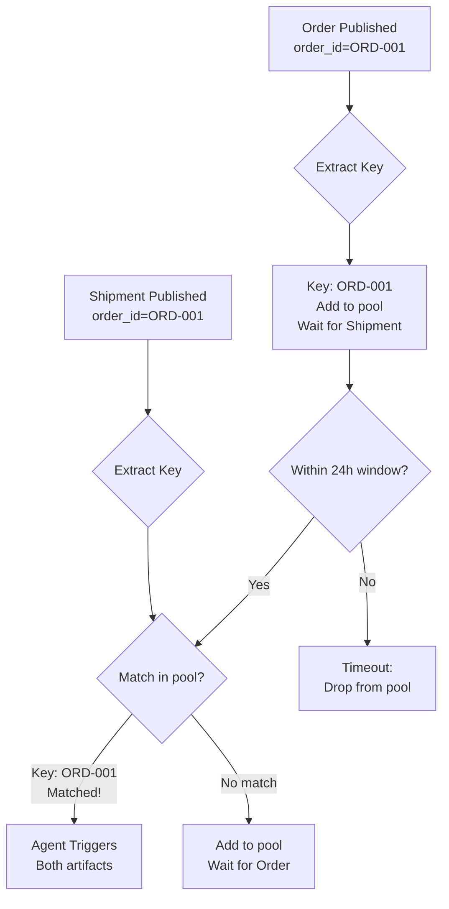

# Join Operations: Correlated AND Gates with JoinSpec

**JoinSpec** enables agents to correlate related artifacts that arrive independently but need to be processed together. Think of it as **"smart AND gates"** that match artifacts by common keys (like `order_id`, `patient_id`, `device_id`) within time windows.

**Common use cases:**
- E-commerce: Match orders ↔ shipment updates by `order_id`
- Healthcare: Correlate patient scans ↔ lab results by `patient_id`
- IoT: Match sensor readings ↔ device metadata by `device_id`
- Finance: Correlate trades ↔ confirmations by `trade_id` within 5-minute window
- Security: Match login attempts ↔ IP geolocation by `session_id`

---

## Quick Start

```python
from datetime import timedelta
from flock import Flock, flock_type
from flock.subscription import JoinSpec
from pydantic import BaseModel

@flock_type
class Order(BaseModel):
    order_id: str  # 🔑 Correlation key
    customer_name: str
    items: list[str]

@flock_type
class ShipmentUpdate(BaseModel):
    order_id: str  # 🔑 Same key!
    tracking_number: str
    carrier: str
    status: str

@flock_type
class CustomerNotification(BaseModel):
    order_summary: str
    tracking_info: str
    estimated_delivery: str

flock = Flock()

# 🔗 Correlate orders with shipments by order_id
customer_service = (
    flock.agent("customer_service")
    .consumes(
        Order,
        ShipmentUpdate,
        join=JoinSpec(
            by=lambda x: x.order_id,  # 🔥 Correlation key
            within=timedelta(hours=24)  # 🔥 Time window
        )
    )
    .publishes(CustomerNotification)
)
```

**What happens:**
1. `Order(order_id="ORD-001")` published → Agent waits...
2. `ShipmentUpdate(order_id="ORD-001")` published → **Agent triggers!** ✅
3. Agent receives **both** correlated artifacts together
4. Agent processes the matched pair

---

## How JoinSpec Works

### Correlation Mechanism

JoinSpec creates a **correlation pool** that matches artifacts by:
1. **Key extraction** - `by=` function extracts correlation key from each artifact
2. **Key matching** - Artifacts with same key are correlated
3. **Time window** - Only artifacts within `within=` time window are matched
4. **Triggering** - When ALL required types matched, agent triggers



### Key Points

**✅ Order-independent:**
```python
# Scenario A: Order → Shipment
await flock.publish(Order(order_id="ORD-001"))
await flock.publish(ShipmentUpdate(order_id="ORD-001"))  # ✅ Matches!

# Scenario B: Shipment → Order (reversed order)
await flock.publish(ShipmentUpdate(order_id="ORD-001"))
await flock.publish(Order(order_id="ORD-001"))  # ✅ Still matches!
```

**✅ One-to-one matching:**
```python
# Each correlation consumes matching artifacts
await flock.publish(Order(order_id="ORD-001"))
await flock.publish(ShipmentUpdate(order_id="ORD-001"))  # Matched, pool cleared

# Next order needs new shipment
await flock.publish(Order(order_id="ORD-002"))
await flock.publish(ShipmentUpdate(order_id="ORD-002"))  # New match
```

**✅ Time window enforcement:**
```python
await flock.publish(Order(order_id="ORD-001"))
# ... 25 hours pass ...
await flock.publish(ShipmentUpdate(order_id="ORD-001"))
# ❌ Timeout! Order dropped from pool (outside 24h window)
```

---

## JoinSpec Parameters

### `by=` - Correlation Key Extractor

**Purpose:** Extract the correlation key from artifacts

**Signature:**
```python
def by_function(artifact: AnyConsumedType) -> str:
    """
    Args:
        artifact: Can be ANY type consumed by the agent

    Returns:
        Correlation key as string (must be consistent across types)
    """
    return artifact.correlation_key
```

**Examples:**

```python
# Simple field extraction
join=JoinSpec(by=lambda x: x.order_id)

# Nested field
join=JoinSpec(by=lambda x: x.metadata.session_id)

# Computed key (e.g., concatenate fields)
join=JoinSpec(by=lambda x: f"{x.user_id}_{x.date}")

# Conditional logic
def extract_key(artifact):
    if isinstance(artifact, Order):
        return artifact.order_id
    elif isinstance(artifact, Shipment):
        return artifact.tracking_number.split("-")[0]  # Extract order ID from tracking
    return artifact.id

join=JoinSpec(by=extract_key)
```

**⚠️ Important:** The `by=` function must work for **all** consumed types!

```python
# ✅ Good: Works for both Order and Shipment
.consumes(
    Order,           # Has order_id field
    Shipment,        # Also has order_id field
    join=JoinSpec(by=lambda x: x.order_id)  # Works for both!
)

# ❌ Bad: Will crash if Shipment doesn't have order_id
.consumes(
    Order,
    Shipment,
    join=JoinSpec(by=lambda x: x.order_id)  # Assumes all types have order_id
)
```

### `within=` - Time Window

**Purpose:** Maximum time between correlated artifacts

**Type:** `timedelta` from Python's `datetime` module

**Examples:**

```python
from datetime import timedelta

# 5-minute window (financial trading)
join=JoinSpec(by=..., within=timedelta(minutes=5))

# 24-hour window (e-commerce)
join=JoinSpec(by=..., within=timedelta(hours=24))

# 30-second window (IoT sensors)
join=JoinSpec(by=..., within=timedelta(seconds=30))

# 7-day window (medical diagnostics)
join=JoinSpec(by=..., within=timedelta(days=7))
```

**How timeout works:**
- First artifact arrives → Start timer
- Matching artifacts arrive → Check if within window
- Timeout expires → Drop artifacts from correlation pool

**⚠️ Timeout behavior:**
```python
# Time = 0: Order arrives
await flock.publish(Order(order_id="ORD-001"))

# Time = 10 min: Shipment arrives
await flock.publish(ShipmentUpdate(order_id="ORD-001"))

# ✅ If within=timedelta(minutes=15): MATCHED
# ❌ If within=timedelta(minutes=5): TIMEOUT (order dropped at 5 min mark)
```

---

## Common Patterns

### Pattern 1: E-Commerce Order Fulfillment

**Scenario:** Match customer orders with warehouse shipments

```python
@flock_type
class Order(BaseModel):
    order_id: str
    customer_email: str
    items: list[dict]

@flock_type
class ShipmentUpdate(BaseModel):
    order_id: str
    tracking_number: str
    carrier: str
    estimated_delivery: str

notification_service = (
    flock.agent("notifications")
    .consumes(
        Order,
        ShipmentUpdate,
        join=JoinSpec(
            by=lambda x: x.order_id,
            within=timedelta(hours=24)  # Orders should ship within 24h
        )
    )
    .publishes(CustomerEmail)
)
```

### Pattern 2: Healthcare Diagnostics

**Scenario:** Correlate patient scans with lab results for diagnosis

```python
@flock_type
class PatientScan(BaseModel):
    patient_id: str
    scan_type: str  # "xray", "mri", "ct"
    image_data: bytes

@flock_type
class LabResults(BaseModel):
    patient_id: str
    blood_work: dict
    markers: list[str]

diagnostician = (
    flock.agent("diagnostician")
    .consumes(
        PatientScan,
        LabResults,
        join=JoinSpec(
            by=lambda x: x.patient_id,
            within=timedelta(minutes=30)  # Results should be recent
        )
    )
    .publishes(DiagnosticReport)
)
```

### Pattern 3: IoT Sensor Correlation

**Scenario:** Match temperature + pressure readings from same device

```python
@flock_type
class TemperatureSensor(BaseModel):
    device_id: str
    temperature_c: float
    timestamp: str

@flock_type
class PressureSensor(BaseModel):
    device_id: str
    pressure_bar: float
    timestamp: str

quality_monitor = (
    flock.agent("quality_monitor")
    .consumes(
        TemperatureSensor,
        PressureSensor,
        join=JoinSpec(
            by=lambda x: x.device_id,
            within=timedelta(seconds=30)  # Readings should be synchronized
        )
    )
    .publishes(QualityAlert)
)
```

### Pattern 4: Financial Trade Reconciliation

**Scenario:** Match trades with confirmations within 5-minute window

```python
@flock_type
class TradeOrder(BaseModel):
    trade_id: str
    symbol: str
    quantity: int
    price: float
    timestamp: str

@flock_type
class TradeConfirmation(BaseModel):
    trade_id: str
    execution_price: float
    status: str  # "filled", "partial", "rejected"
    exchange_timestamp: str

reconciliation = (
    flock.agent("trade_reconciliation")
    .consumes(
        TradeOrder,
        TradeConfirmation,
        join=JoinSpec(
            by=lambda x: x.trade_id,
            within=timedelta(minutes=5)  # Confirmations arrive within 5 min
        )
    )
    .publishes(ReconciliationReport)
)
```

### Pattern 5: Multi-Way Correlation (3+ Types)

**Scenario:** Correlate user, location, and device for security

```python
@flock_type
class LoginAttempt(BaseModel):
    session_id: str
    username: str
    timestamp: str

@flock_type
class IPGeolocation(BaseModel):
    session_id: str
    country: str
    city: str
    is_vpn: bool

@flock_type
class DeviceFingerprint(BaseModel):
    session_id: str
    device_type: str
    browser: str
    os: str

security_analyzer = (
    flock.agent("security")
    .consumes(
        LoginAttempt,
        IPGeolocation,
        DeviceFingerprint,
        join=JoinSpec(
            by=lambda x: x.session_id,
            within=timedelta(seconds=10)  # All must arrive quickly
        )
    )
    .publishes(SecurityRiskScore)
)
```

---

## Combining with Other Features

### JoinSpec + Predicates

**Filter correlated artifacts:**

```python
# Only process express shipping orders
express_tracker = (
    flock.agent("express_tracker")
    .consumes(
        Order,
        Shipment,
        where=lambda o, s: o.shipping_method == "express",  # 🎯 Predicate!
        join=JoinSpec(by=lambda x: x.order_id, within=timedelta(hours=24))  # 🔗 Join!
    )
    .publishes(ExpressTracking)
)
```

**How it works:**
1. JoinSpec correlates `Order` + `Shipment` by `order_id`
2. Predicate evaluates **correlated pair**
3. Only pairs where `Order.shipping_method == "express"` trigger agent

### JoinSpec + BatchSpec

**Correlate, then batch for efficiency:**

```python
from flock.subscription import BatchSpec

# Smart factory: Correlate sensors, then batch 5 devices for analysis
quality_control = (
    flock.agent("qc")
    .consumes(
        TemperatureSensor,
        PressureSensor,
        join=JoinSpec(
            by=lambda x: x.device_id,
            within=timedelta(seconds=30)
        ),
        batch=BatchSpec(
            size=5,  # Batch 5 correlated PAIRS
            timeout=timedelta(seconds=45)
        )
    )
    .publishes(QualityReport)
)
```

**How it works:**
1. JoinSpec correlates temp + pressure readings by `device_id`
2. Each correlated pair becomes ONE batch item
3. BatchSpec accumulates 5 correlated pairs
4. Agent processes 5 devices together (10 sensors total)

**💡 Key insight:** `BatchSpec(size=5)` means "batch 5 **correlation groups**", not "batch 5 individual artifacts"!

### JoinSpec + Visibility

**Correlate with access control:**

```python
from flock.core.visibility import TenantVisibility

# Multi-tenant: Correlate orders + shipments per tenant
tenant_notifications = (
    flock.agent("tenant_notifier")
    .consumes(
        Order,
        Shipment,
        join=JoinSpec(by=lambda x: x.order_id, within=timedelta(hours=24))
    )
    .publishes(
        Notification,
        visibility=TenantVisibility(tenant_id_extractor=lambda n: n.tenant_id)
    )
)
```

---

## Best Practices

### ✅ Do

**1. Use consistent correlation keys**

```python
# ✅ Good: Same field name, same meaning
@flock_type
class Order(BaseModel):
    order_id: str  # Consistent naming

@flock_type
class Shipment(BaseModel):
    order_id: str  # Same field!

join=JoinSpec(by=lambda x: x.order_id)  # Simple and clear
```

**2. Set realistic time windows**

```python
# ✅ Good: Business-appropriate timeouts
# E-commerce: Orders ship within 24 hours
within=timedelta(hours=24)

# Financial: Trades confirmed within 5 minutes
within=timedelta(minutes=5)

# IoT: Sensor readings synchronized within 30 seconds
within=timedelta(seconds=30)

# ❌ Bad: Unrealistic timeout
within=timedelta(days=365)  # Why wait a year?
```

**3. Handle missing correlations gracefully**

```python
# ✅ Good: Timeout monitoring
timeout_monitor = (
    flock.agent("timeout_monitor")
    .consumes(Order)
    .publishes(TimeoutAlert)
)

# Monitor orders without shipments after 24h
# (Separate agent checks for correlation timeouts)
```

**4. Use descriptive key extractors**

```python
# ✅ Good: Clear function name
def extract_patient_id(artifact):
    """Extract patient identifier for correlation"""
    return artifact.patient_id

join=JoinSpec(by=extract_patient_id, within=...)

# ❌ Bad: Unclear lambda
join=JoinSpec(by=lambda x: x.p_id, within=...)  # What's p_id?
```

### ❌ Don't

**1. Don't use mutable keys**

```python
# ❌ Bad: Key changes over time
@flock_type
class Order(BaseModel):
    status: str  # Changes from "pending" → "shipped"

join=JoinSpec(by=lambda x: x.status)  # Key can change!

# ✅ Good: Immutable ID
join=JoinSpec(by=lambda x: x.order_id)  # ID never changes
```

**2. Don't correlate unrelated data**

```python
# ❌ Bad: Correlating by timestamp (probably wrong!)
join=JoinSpec(by=lambda x: x.timestamp)  # Many artifacts same timestamp!

# ✅ Good: Correlate by unique relationship
join=JoinSpec(by=lambda x: x.order_id)  # One order per ID
```

**3. Don't set infinite time windows**

```python
# ❌ Bad: No practical timeout
within=timedelta(days=10000)  # 27 years?!

# ✅ Good: Realistic business timeout
within=timedelta(hours=24)
```

**4. Don't forget type compatibility**

```python
# ❌ Bad: Key extractor doesn't work for all types
.consumes(
    Order,           # Has order_id
    Shipment,        # Has shipment_id (different field!)
    join=JoinSpec(by=lambda x: x.order_id)  # Crashes on Shipment!
)

# ✅ Good: Generic extractor or consistent schema
.consumes(
    Order,
    Shipment,
    join=JoinSpec(by=lambda x: x.correlation_id)  # Both have this field
)
```

---

## Performance Considerations

### Memory Usage

**Correlation pool grows with:**
- Number of active correlations
- Length of time window
- Frequency of artifact arrival

**Example calculation:**
```python
# Scenario: IoT sensors
# - 1000 devices
# - Each publishes temp + pressure every 10 seconds
# - Time window: 30 seconds

# At peak: 1000 devices * 2 sensors * 3 readings = 6000 artifacts in pool
# (Each device has 3 readings within 30-second window)
```

**Optimization tips:**

```python
# ✅ Good: Short windows for high-frequency data
within=timedelta(seconds=30)  # Minimal memory footprint

# ❌ Bad: Long windows for high-frequency data
within=timedelta(hours=24)  # Huge memory footprint!
```

### Timeout Checking

Flock periodically checks for expired correlations:

```python
# Manual timeout check (for testing/debugging)
await flock._check_join_timeouts()

# In production, this happens automatically every N seconds
```

**Performance impact:**
- O(n) scan of correlation pool
- Runs asynchronously (doesn't block agent execution)
- Frequency depends on `within=` timeout values

---

## Debugging JoinSpec

### Enable Correlation Logging

```python
import logging
logging.basicConfig(level=logging.DEBUG)

# Logs will show:
# - Artifacts added to correlation pool
# - Successful matches
# - Timeout expirations
```

### Query Correlation State

```python
# Check active correlations
active = flock._join_pools  # Dict of correlation pools by agent/subscription

for (agent_name, sub_index), pool in active.items():
    print(f"{agent_name}: {len(pool)} pending correlations")
```

### Trace with DuckDB

```bash
export FLOCK_AUTO_TRACE=true
export FLOCK_TRACE_FILE=true
```

```python
import duckdb
conn = duckdb.connect('.flock/traces.duckdb', read_only=True)

# Find correlation events
correlations = conn.execute("""
    SELECT
        name,
        attributes->'$.correlation_key' as key,
        attributes->'$.matched' as matched
    FROM spans
    WHERE name LIKE '%join%' OR name LIKE '%correlat%'
    ORDER BY start_time DESC
    LIMIT 20
""").fetchall()

for name, key, matched in correlations:
    print(f"{name}: key={key}, matched={matched}")
```

---

## Real-World Examples

### Example: Customer Order Journey

```python
@flock_type
class OrderPlaced(BaseModel):
    order_id: str
    customer_email: str
    items: list[dict]
    total: float

@flock_type
class PaymentConfirmed(BaseModel):
    order_id: str
    transaction_id: str
    amount: float

@flock_type
class WarehouseShipped(BaseModel):
    order_id: str
    tracking_number: str
    carrier: str

@flock_type
class CompleteOrderJourney(BaseModel):
    order_summary: str
    payment_details: str
    shipping_info: str
    customer_email: str

# Correlate 3-way: Order + Payment + Shipment
journey_tracker = (
    flock.agent("journey_tracker")
    .consumes(
        OrderPlaced,
        PaymentConfirmed,
        WarehouseShipped,
        join=JoinSpec(
            by=lambda x: x.order_id,
            within=timedelta(hours=48)  # Complete journey within 48h
        )
    )
    .publishes(CompleteOrderJourney)
)
```

---

## Next Steps

- **[Batch Processing](batch-processing.md)** - Combine JoinSpec with BatchSpec
- **[Predicates](predicates.md)** - Filter correlated artifacts
- **[Agent Guide](agents.md)** - Complete agent patterns
- **[Examples: IoT Monitoring](../../examples/01-cli/15_iot_sensor_batching.py)** - Full working example

---

## Quick Reference

| Parameter | Type | Purpose | Example |
|-----------|------|---------|---------|
| **`by=`** | `Callable[[Any], str]` | Extract correlation key | `lambda x: x.order_id` |
| **`within=`** | `timedelta` | Time window for matching | `timedelta(hours=24)` |

**Common time windows:**
- Financial trading: `timedelta(minutes=5)`
- E-commerce: `timedelta(hours=24)`
- IoT sensors: `timedelta(seconds=30)`
- Healthcare: `timedelta(minutes=30)`
- Security events: `timedelta(seconds=10)`

**Remember:** JoinSpec creates **one-to-one** correlations. Each matched group triggers the agent once, then the pool clears for that correlation key!
