# Tutorials

Welcome to Flock tutorials! These hands-on guides will take you from zero to building production-ready multi-agent systems.

## Learning Path

Our tutorials follow a carefully designed progression from beginner to advanced concepts. Each tutorial builds on previous knowledge, so we recommend completing them in order.

```mermaid
graph LR
    A[Your First Agent<br/>⏱️ 15 min] --> B[Multi-Agent Workflow<br/>⏱️ 30 min]
    B --> C[Conditional Routing<br/>⏱️ 30 min]
    C --> D[Advanced Patterns<br/>⏱️ 45 min]
    D --> E[Custom Engines<br/>⏱️ 25 min]
    E --> F[Custom Agent Components<br/>⏱️ 25 min]

    style A fill:#e1f5e1,stroke:#2d5016,stroke-width:2px,color:#1a1a1a
    style B fill:#fff4e6,stroke:#8b6914,stroke-width:2px,color:#1a1a1a
    style C fill:#ffe6e6,stroke:#8b1a1a,stroke-width:2px,color:#1a1a1a
    style D fill:#f0e6ff,stroke:#5a1a8b,stroke-width:2px,color:#1a1a1a
    style E fill:#e6f7ff,stroke:#0b6796,stroke-width:2px,color:#1a1a1a
    style F fill:#fff0f6,stroke:#a61e4d,stroke-width:2px,color:#1a1a1a
```

## Tutorial Overview

### 1. Your First Agent
**Difficulty:** ⭐ Beginner | **Time:** 15 minutes

Build your first Flock agent using the declarative approach. Learn why schemas replace prompts and experience the "aha moment" that makes Flock different.

**What You'll Learn:**

- The declarative programming paradigm
- How `@flock_type` registers types with the blackboard
- Why "the schema IS the instruction"
- Type-safe artifact production

**What You'll Build:** A pizza recipe generator that transforms vague ideas into structured recipes

[Start Tutorial →](your-first-agent.md){ .md-button .md-button--primary }

---

### 2. Multi-Agent Workflow
**Difficulty:** ⭐⭐ Intermediate | **Time:** 30 minutes

Discover how agents automatically chain through the blackboard without explicit graph wiring. Build a 3-agent pipeline with zero coordination code.

**What You'll Learn:**

- How agents auto-chain through type subscriptions
- Why blackboard beats explicit workflow graphs
- Sequential execution patterns
- Emergent workflows from declarative subscriptions

**What You'll Build:** A music industry pipeline (band concept → lineup → album → marketing)

**Prerequisites:** Complete "Your First Agent"

[Start Tutorial →](multi-agent-workflow.md){ .md-button .md-button--primary }

---

### 3. Conditional Routing
**Difficulty:** ⭐⭐⭐ Intermediate-Advanced | **Time:** 30 minutes

Learn how to give agents web-browsing capabilities using Model Context Protocol (MCP) and Playwright. Build research agents that gather real-time information.

**What You'll Learn:**

- MCP (Model Context Protocol) integration
- Playwright browser automation for agents
- How tools extend agent capabilities beyond LLM knowledge
- Real-time web research patterns

**What You'll Build:** A tech trend detective that researches emerging technologies by browsing websites

**Prerequisites:**

- Complete "Multi-Agent Workflow"
- Node.js installed (for MCP)
- Internet connection

[Start Tutorial →](conditional-routing.md){ .md-button .md-button--primary }

---

### 4. Advanced Patterns
**Difficulty:** ⭐⭐⭐ Advanced | **Time:** 45 minutes

Master parallel processing at scale with Flock's blackboard architecture. Build an 8-agent news agency where all analysts process breaking news simultaneously.

**What You'll Learn:**

- Automatic parallel execution
- How multiple agents process the same artifact concurrently
- Scaling to dozens of agents without complexity
- Why parallel processing is O(n) in Flock vs O(n²) in graphs

**What You'll Build:** A real-time news agency with 8 specialized analysts processing breaking news in parallel

**Prerequisites:** Complete all previous tutorials

[Start Tutorial →](advanced-patterns.md){ .md-button .md-button--primary }

---

### 5. Custom Engines: Emoji Vibes & Batch Brews
**Difficulty:** ⭐⭐ Intermediate | **Time:** 25 minutes

Discover how to implement bespoke `EngineComponent`s—one that reacts instantly to mood messages and another that waits for BatchSpec flushes before revealing a potion recipe.

**What You'll Learn:**

- Building single-artifact engines with `EvalResult.from_object`
- Crafting batch-aware engines with `evaluate_batch`
- When to split logic into helper functions for clarity

**What You'll Build:** An emoji mood interpreter and a potion brewer that only speaks when the cauldron is full

**Prerequisites:** Comfortable with single-agent basics

[Start Tutorial →](custom-engines.md){ .md-button .md-button--primary }

---

### 6. Custom Agent Components: Foreshadow & Hype
**Difficulty:** ⭐⭐ Intermediate | **Time:** 25 minutes

Learn how lifecycle hooks let you augment an agent without touching its engine—by adding foreshadowing hints before evaluation and tracking crowd energy afterwards.

**What You'll Learn:**

- `on_pre_evaluate`, `on_post_evaluate`, and `on_post_publish` hook patterns
- Passing state between components and engines
- Emitting metrics/logs from components

**What You'll Build:** A campfire storyteller with subtle hints and a hype meter that reports audience applause

**Prerequisites:** Complete “Custom Engines” or have equivalent experience

[Start Tutorial →](custom-agent-components.md){ .md-button .md-button--primary }

---

## Tutorial Difficulty Guide

| Symbol | Level | Description |
|--------|-------|-------------|
| ⭐ | Beginner | No prior Flock knowledge needed. Core concepts explained. |
| ⭐⭐ | Intermediate | Assumes completion of beginner tutorials. Introduces advanced patterns. |
| ⭐⭐⭐ | Advanced | Requires solid understanding of Flock concepts. Production-ready patterns. |

## What You'll Know After Completing All Tutorials

By the end of this tutorial series, you'll be able to:

✅ Build declarative agents using Pydantic schemas
✅ Create multi-agent workflows that auto-chain through the blackboard
✅ Integrate external tools and APIs using MCP
✅ Implement conditional routing and intelligent agent selection
✅ Scale to dozens of agents with parallel processing
✅ Understand why blackboard architecture beats traditional graphs
✅ Apply production-ready patterns in your own projects

## Next Steps After Tutorials

Once you've completed these tutorials, explore:

- **[User Guides](../guides/index.md)** - Deep dives into specific features
- **[API Reference](../reference/api.md)** - Complete API documentation
- **[Patterns Guide](../guides/patterns.md)** - Common architectural patterns
- **[Use Cases](../guides/use-cases.md)** - Real-world production examples

## Learning Tips

**For Best Results:**

1. **Code Along** - Don't just read, type out the examples yourself
2. **Experiment** - Try the "Try It Yourself" challenges at the end of each tutorial
3. **Enable Tracing** - Run with `FLOCK_AUTO_TRACE=true` to see execution flow
4. **Ask Questions** - Join our community if you get stuck

**Time Commitment:**

- Full tutorial series: ~2 hours
- Can be completed in one sitting or split across sessions
- Each tutorial is self-contained with checkpoints

## Ready to Start?

Jump into your first tutorial and experience the power of blackboard orchestration!

[Begin with Your First Agent →](your-first-agent.md){ .md-button .md-button--primary }
