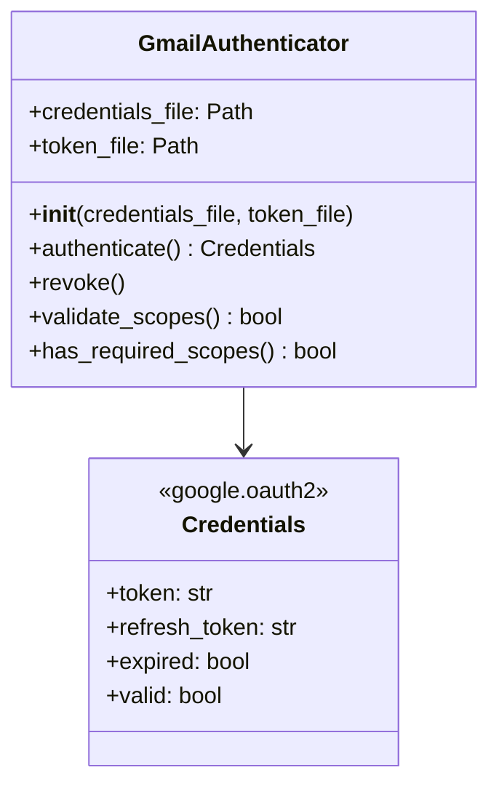
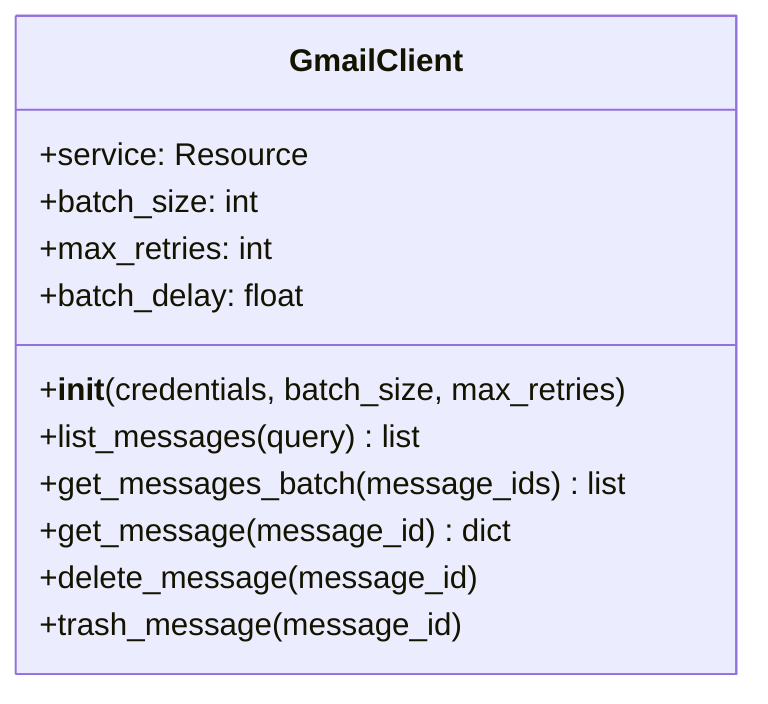
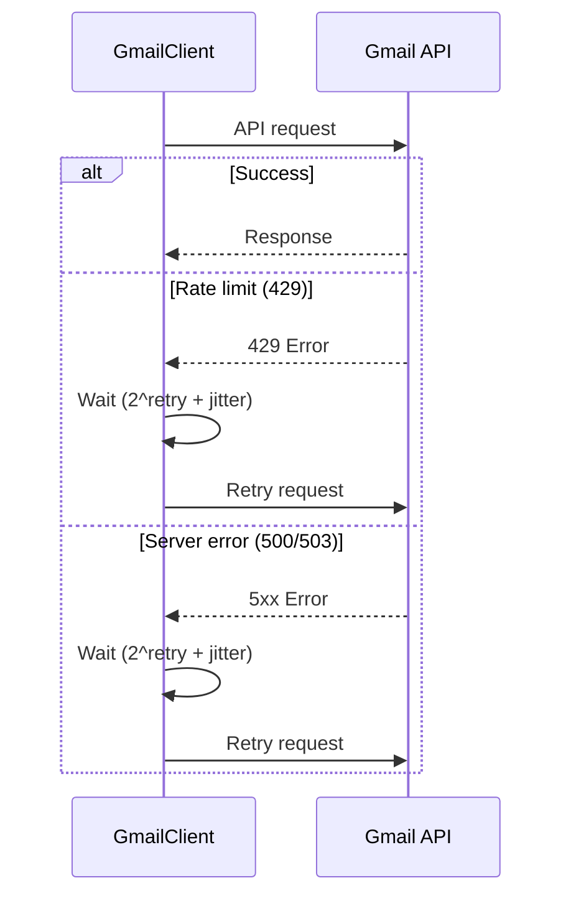
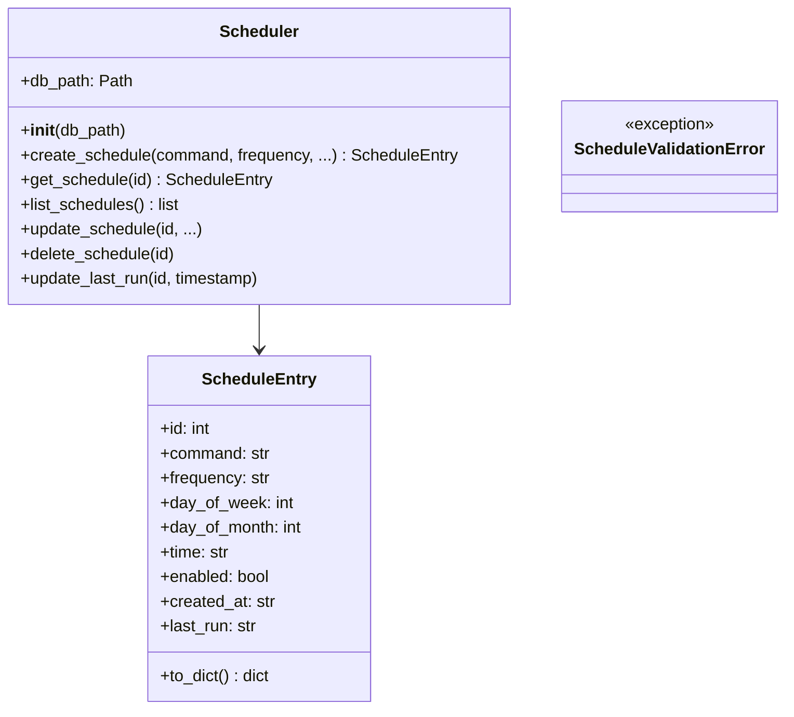
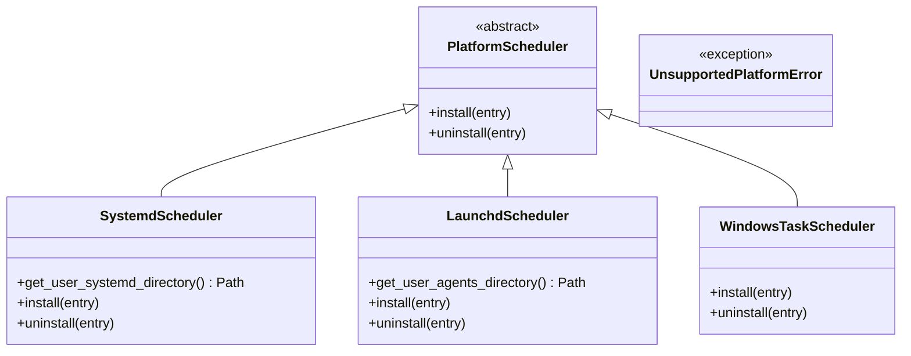
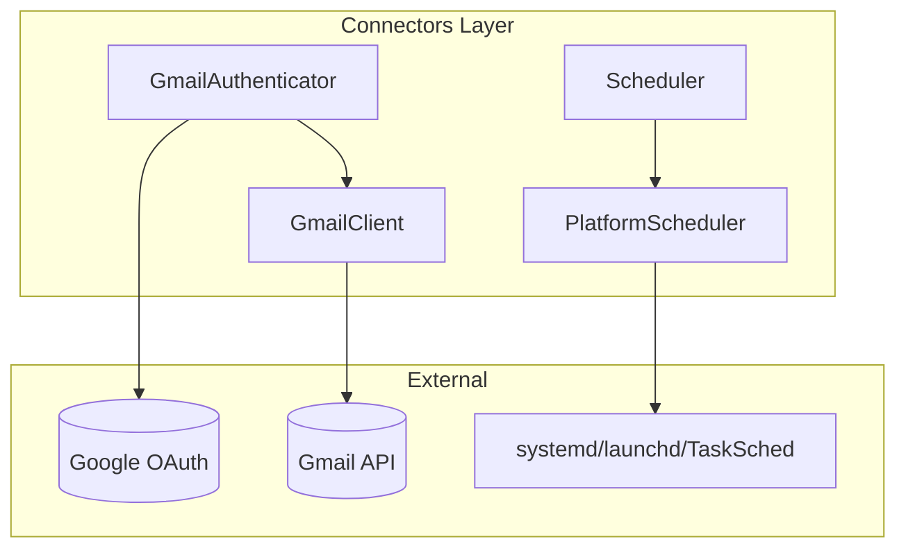

# Connectors Layer Architecture

**Last Updated:** 2025-11-26

The connectors layer provides external system integrations: Gmail API access, OAuth authentication, and platform-specific scheduling.

---

## Layer Contract

| Property | Value |
|----------|-------|
| **Dependencies** | `shared` layer only |
| **Dependents** | `core`, `cli` layers |
| **Responsibility** | Gmail API, OAuth2, platform scheduling |
| **Thread Safety** | Not thread-safe (credentials/service objects not shared) |

---

## Components

### GmailAuthenticator

OAuth2 authentication flow with bundled credentials support.

#### Interface

- **Authenticate**: `authenticate()` returns valid Google OAuth2 credentials
- **Token storage**: Saves/loads tokens from XDG-compliant paths
- **Bundled credentials**: Uses app credentials by default, no user setup required
- **Scope validation**: `validate_scopes()` checks if token has required permissions

#### Key Functions

| Function | Purpose |
|----------|---------|
| `_get_bundled_credentials_path()` | Get path to bundled OAuth credentials |
| `_get_default_token_path()` | Get XDG-compliant token storage path |

---

### GmailClient

Gmail API wrapper with retry logic and batch operations.

#### Interface

- **List messages**: Query Gmail with automatic pagination
- **Batch fetch**: Retrieve multiple messages efficiently
- **Retry logic**: Exponential backoff for rate limits and server errors
- **Delete/trash**: Remove messages from Gmail

#### Retry Strategy

---

### Scheduler

Schedule storage and management (database-backed).

#### Interface

- **CRUD operations**: Create, read, update, delete schedules
- **Validation**: Ensures schedule parameters are valid
- **Persistence**: SQLite-backed storage

---

### PlatformScheduler

Platform-specific scheduling implementations.

#### Platform Support

| Platform | Implementation | Location |
|----------|---------------|----------|
| **Linux** | systemd timers | `~/.config/systemd/user/` |
| **macOS** | launchd plists | `~/Library/LaunchAgents/` |
| **Windows** | Task Scheduler | Windows Task Scheduler |

---

## Data Flow

---

## Security Considerations

### OAuth Credentials

- Bundled credentials are "installed application" type (client secret not confidential)
- Security relies on user consent at authorization time
- Users can provide custom credentials via `--credentials` flag

### Scopes

- **Current scope**: `https://mail.google.com/` (full Gmail access)
- Required for permanent deletion (`messages.delete` API)
- Breaking change from earlier versions - requires re-auth

### Token Storage

- Tokens stored in XDG-compliant paths
- Permissions: user-only readable (0600)
- Refresh tokens allow offline access

---

## Testing Strategy

| Component | Test Focus |
|-----------|------------|
| `GmailAuthenticator` | OAuth flow mocking, token refresh, scope validation |
| `GmailClient` | API responses, retry logic, batch operations |
| `Scheduler` | CRUD operations, validation, edge cases |
| `PlatformScheduler` | File generation (no actual installation in tests) |

See `tests/connectors/` for test implementations.
