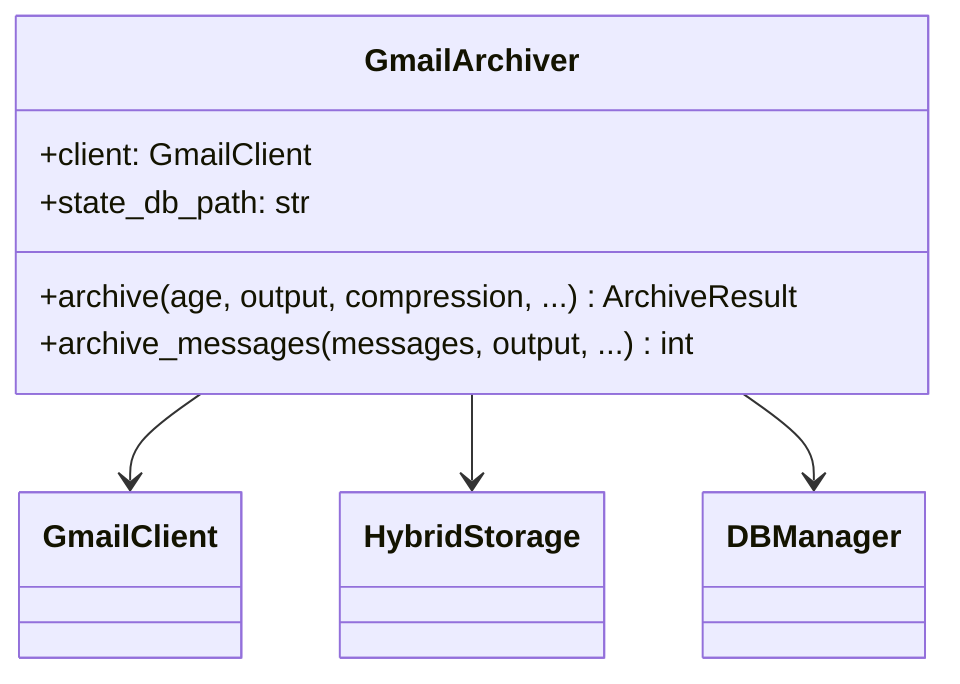
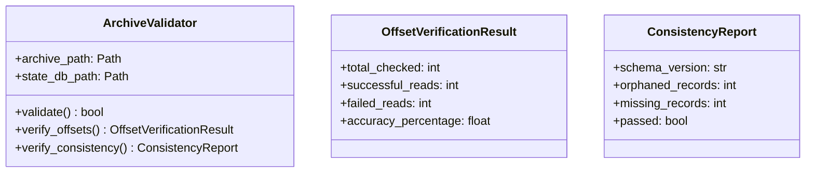
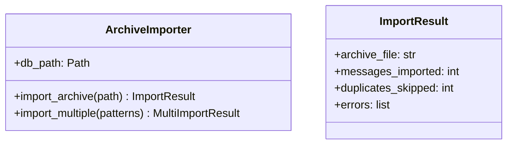
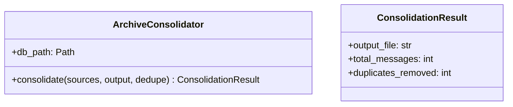
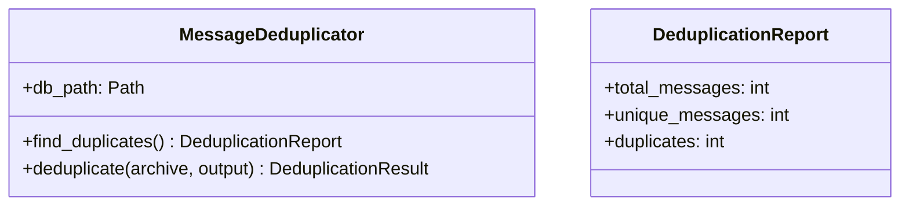
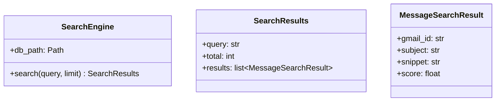
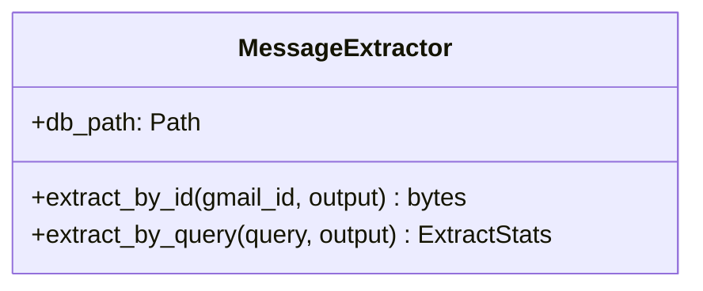
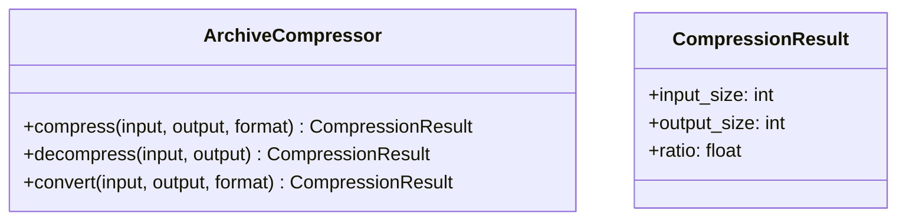
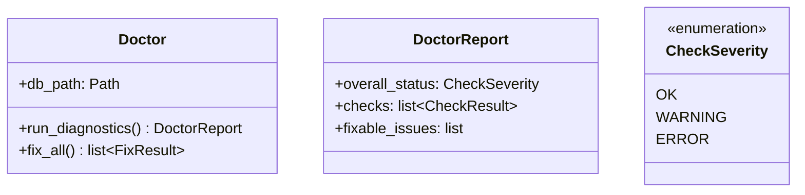
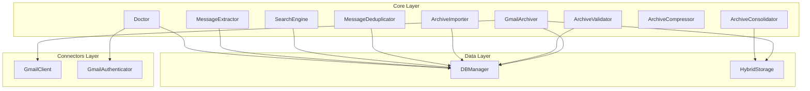

# Core Layer Architecture

**Last Updated:** 2025-11-26

The core layer contains business logic for email archiving operations: archiving, validation, consolidation, deduplication, search, extraction, compression, and diagnostics.

---

## Layer Contract

| Property | Value |
|----------|-------|
| **Dependencies** | `shared`, `data`, `connectors` layers |
| **Dependents** | `cli` layer only |
| **Responsibility** | Business logic for all archiving operations |
| **Thread Safety** | Components are not thread-safe (use separate instances per thread) |

---

## Components

### GmailArchiver

Main archiving orchestrator - coordinates Gmail fetch, mbox write, and database operations.

### ArchiveValidator

Multi-layer archive validation before deletion.

### ArchiveImporter

Import existing mbox archives into database.

### ArchiveConsolidator

Merge multiple archives into one.

### MessageDeduplicator

Message-ID based deduplication across archives.

### SearchEngine

Full-text search via SQLite FTS5.

### MessageExtractor

Extract messages from archives by ID or criteria.

### ArchiveCompressor

Compress/decompress archive files.

### Doctor

System diagnostics and auto-repair.

---

## Data Flow

---

## Testing Strategy

| Component | Test Focus |
|-----------|------------|
| `GmailArchiver` | Atomic operations, incremental mode, compression |
| `ArchiveValidator` | Offset verification, consistency checks |
| `ArchiveImporter` | Glob patterns, deduplication, error handling |
| `ArchiveConsolidator` | Merge operations, offset updates |
| `MessageDeduplicator` | Message-ID matching, preservation logic |
| `SearchEngine` | FTS5 queries, ranking, Gmail syntax |
| `MessageExtractor` | Offset-based retrieval, compression support |
| `ArchiveCompressor` | All formats, streaming, integrity |
| `Doctor` | Diagnostics, auto-fix, edge cases |

See `tests/core/` for test implementations.
