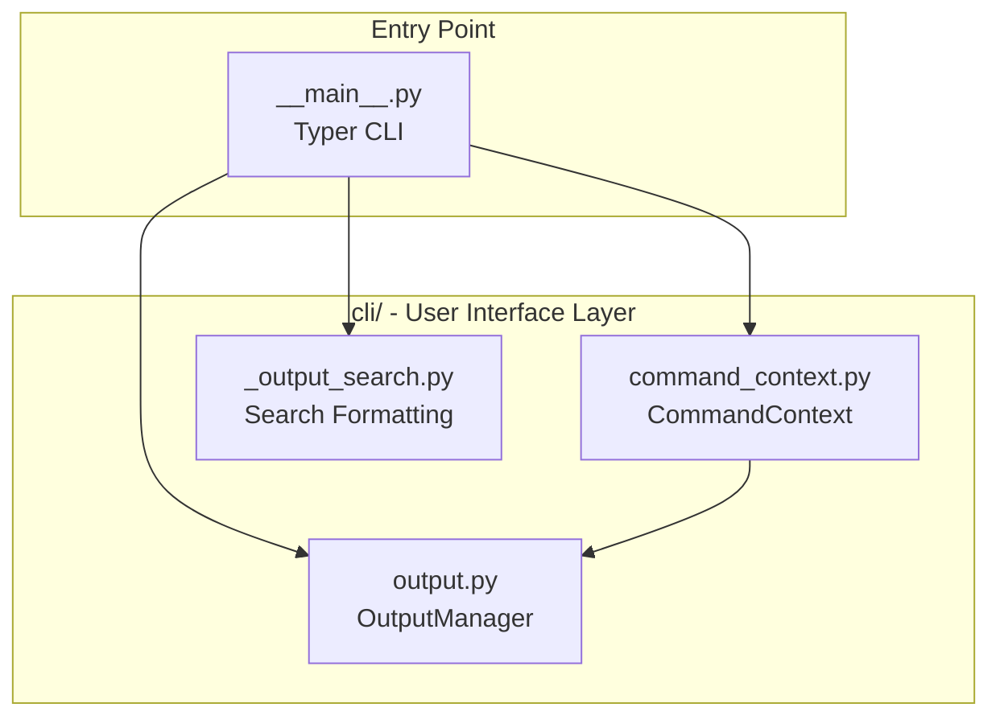
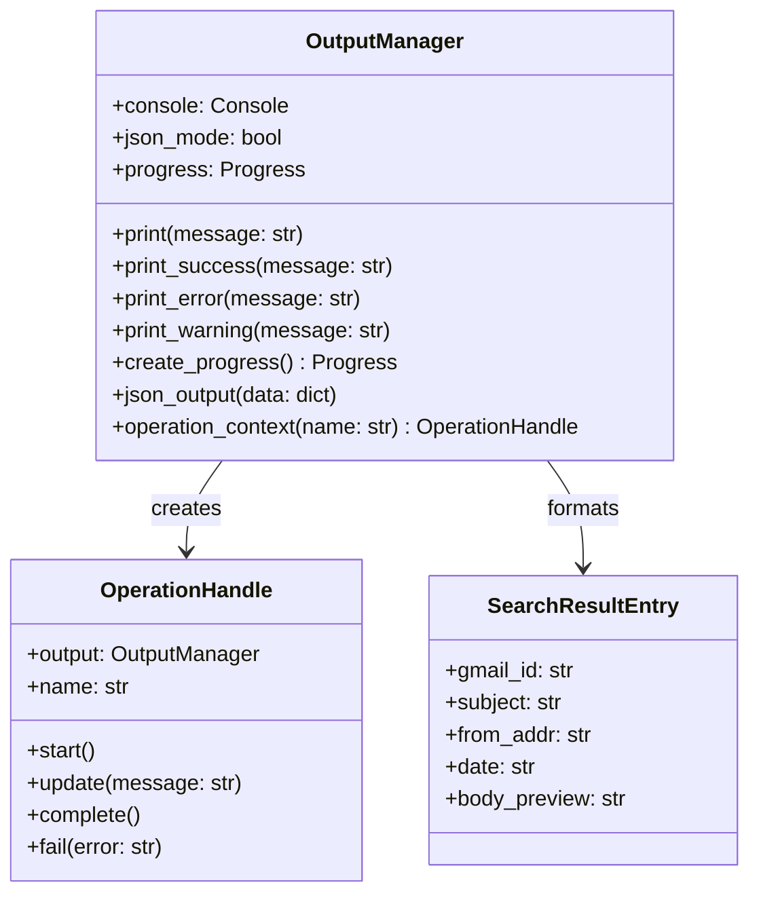
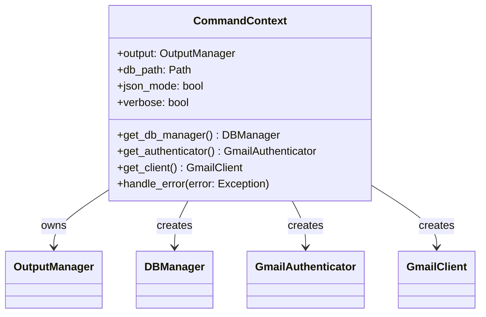
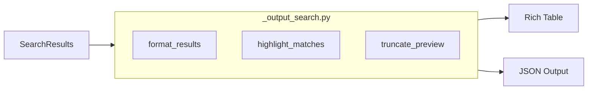
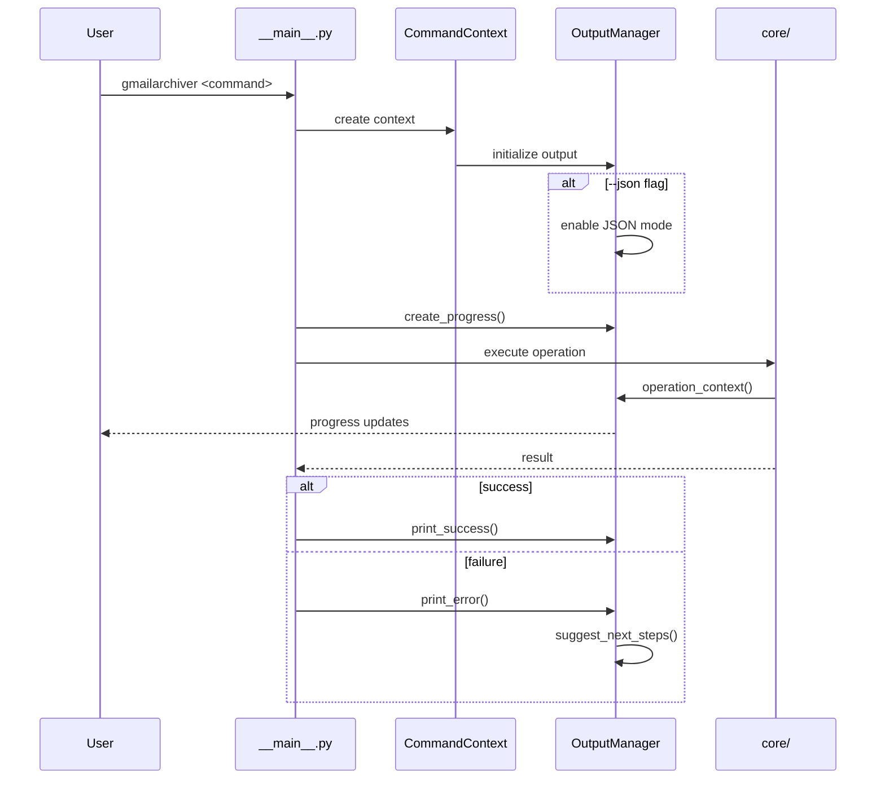

# CLI Layer Architecture

This document defines the design of the CLI layer, which handles user interaction,
command processing, and output formatting for the Gmail Archiver application.

## Layer Overview

The CLI layer provides:
1. **OutputManager**: Unified output system (Rich terminal / JSON modes)
2. **CommandContext**: Dependency injection for CLI commands
3. **Search Output**: Formatted search result display



## Component Design

### OutputManager (output.py)

The unified output system supporting both rich terminal output and JSON mode.



**Key Features:**
- Rich console output with colors, progress bars, status indicators
- JSON output mode (`--json`) for scripting and automation
- Progress tracking (uv-style spinners and progress bars)
- Actionable next-step suggestions on errors
- Operation contexts for start/update/complete tracking

### CommandContext (command_context.py)

Dependency injection container for CLI commands, providing consistent access to
shared resources across all commands.



**Key Features:**
- Lazy initialization of expensive resources
- Consistent error handling across commands
- Shared configuration (db path, verbosity, JSON mode)
- Clean resource cleanup on exit

### Search Output (_output_search.py)

Specialized formatting for search results with relevance highlighting.



## Data Flow

### Command Execution Flow



### Output Mode Decision

```mermaid
flowchart TD
    Input[Command Output] --> Check{JSON Mode?}
    Check -->|Yes| JSON[json_output()]
    Check -->|No| Rich[Rich Console]

    Rich --> Table[Tables]
    Rich --> Progress[Progress Bars]
    Rich --> Status[Status Messages]

    JSON --> Structured[Structured Data]
    Structured --> Stdout[stdout]
```

## Integration Points

### Dependencies (imports from other layers)

```python
# From data layer
from gmailarchiver.data.db_manager import DBManager

# From connectors layer
from gmailarchiver.connectors.auth import GmailAuthenticator
from gmailarchiver.connectors.gmail_client import GmailClient

# From core layer
from gmailarchiver.core.search import SearchResults
```

### Dependents (imported by)

```python
# Entry point
from gmailarchiver.cli.output import OutputManager
from gmailarchiver.cli.command_context import CommandContext

# Core layer (for progress reporting)
from gmailarchiver.cli.output import OperationHandle
```

## Design Decisions

### Why Separate CLI Layer?

1. **Separation of Concerns**: CLI-specific logic (formatting, progress, user interaction)
   is isolated from business logic
2. **Testability**: Core logic can be tested without CLI dependencies
3. **Alternative Interfaces**: Future GUI or API could reuse core without CLI code
4. **JSON Mode**: Clean implementation of dual output modes

### OutputManager in CLI vs Shared

OutputManager is in CLI because:
- It's fundamentally about user output (Rich console, JSON)
- Core components receive `OperationHandle` for progress, not full OutputManager
- This maintains the boundary between business logic and presentation

### Entry Point Location

`__main__.py` remains at package root because:
- Python convention for `python -m gmailarchiver`
- Typer app definition is the natural entry point
- CLI layer provides supporting infrastructure
