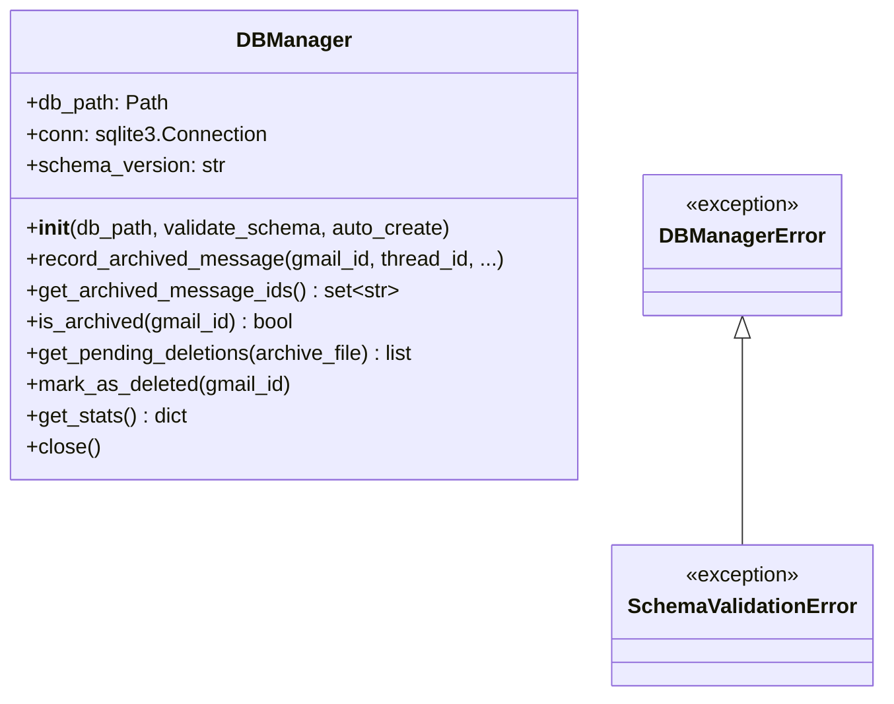
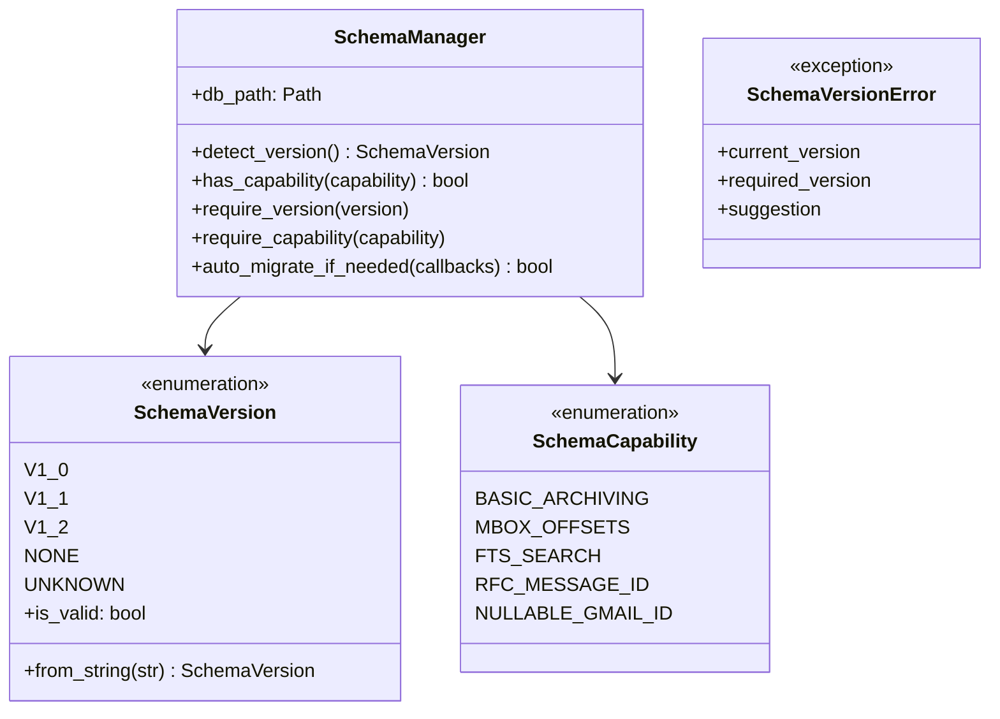
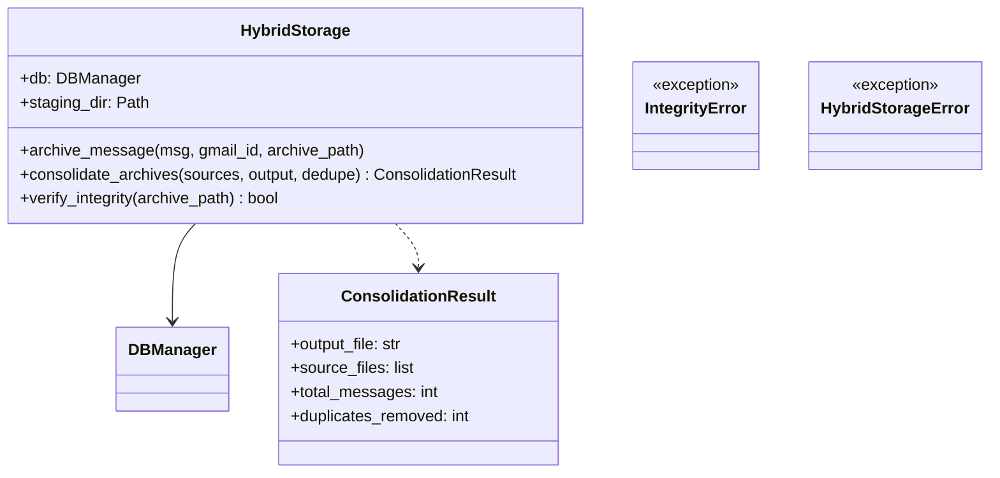
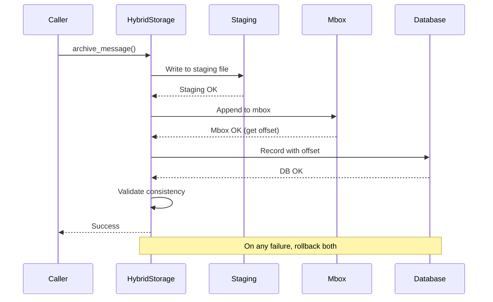
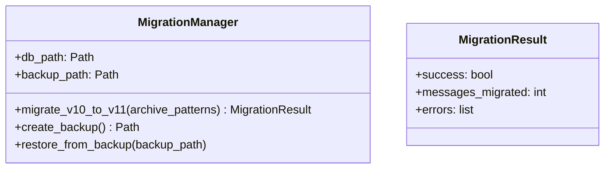
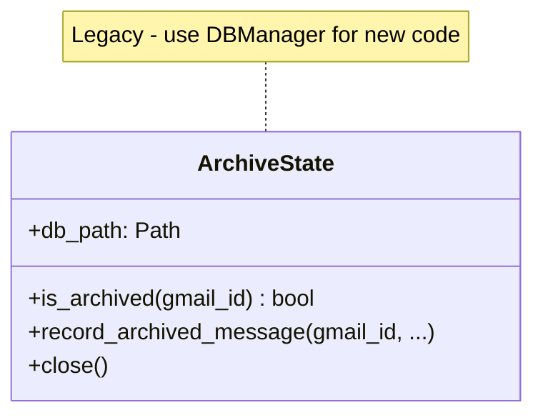
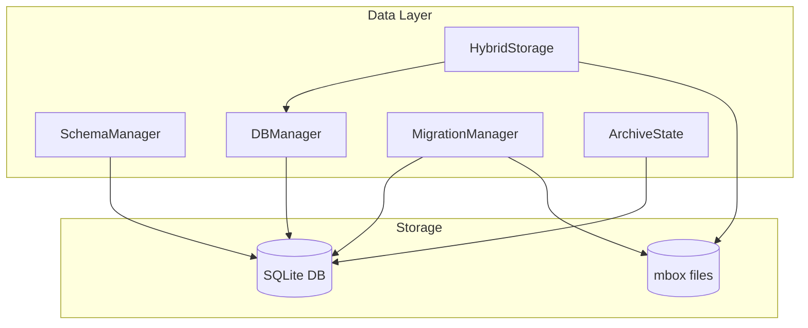

# Data Layer Architecture

**Last Updated:** 2025-11-26

The data layer manages all persistent state: SQLite database and mbox file operations. It provides transactional guarantees for atomic operations across both storage systems.

---

## Layer Contract

| Property | Value |
|----------|-------|
| **Dependencies** | `shared` layer only |
| **Dependents** | `core`, `cli` layers |
| **Responsibility** | Database operations, mbox storage, schema management, migrations |
| **Thread Safety** | Not thread-safe (SQLite connections are not shared between threads) |

---

## Components

### DBManager

Single source of truth for all database operations with transaction management and audit trails.



#### Interface

- **Context manager**: Use `with DBManager(path) as db:` for auto-cleanup
- **Transaction support**: All writes are wrapped in transactions with auto-rollback
- **Audit trail**: All operations recorded in `archive_runs` table
- **Schema validation**: Validates database schema on init (configurable)

#### Key Methods

| Method | Purpose |
|--------|---------|
| `record_archived_message()` | Record a newly archived message |
| `get_archived_message_ids()` | Get all archived Gmail IDs (for deduplication) |
| `is_archived(gmail_id)` | Check if message is already archived |
| `get_pending_deletions()` | Get messages archived but not yet deleted |
| `mark_as_deleted(gmail_id)` | Mark message as deleted from Gmail |
| `get_stats()` | Get database statistics |

---

### SchemaManager

Version detection, capability checking, and migration coordination.



#### Interface

- **Version detection**: `detect_version()` examines table structure
- **Capability checking**: `has_capability()` / `require_capability()` for feature flags
- **Migration coordination**: `auto_migrate_if_needed()` handles upgrades

#### Usage Example

```python
from gmailarchiver.data.schema_manager import SchemaManager, SchemaCapability

mgr = SchemaManager(db_path)

# Check capabilities (preferred over version comparison)
if mgr.has_capability(SchemaCapability.FTS_SEARCH):
    # Use full-text search features
    pass

# Require specific capability
mgr.require_capability(SchemaCapability.MBOX_OFFSETS)  # Raises if not available
```

---

### HybridStorage

Transactional coordinator ensuring atomic mbox + database operations.



#### Guarantees

1. **Atomicity**: Both mbox and database succeed, OR both are rolled back
2. **Validation**: After every write, consistency is verified
3. **Recovery**: Staging area allows rollback on failures

#### Two-Phase Commit Pattern



---

### MigrationManager

Database schema migrations with backup and rollback support.



#### Interface

- **Backup**: Always creates backup before migration
- **Progress**: Optional callback for progress reporting
- **Rollback**: `restore_from_backup()` reverts failed migrations

---

### ArchiveState (Legacy)

Legacy state tracking, preserved for backward compatibility. New code should use `DBManager`.



---

## Data Flow



---

## Schema Versions

| Version | Tables | Capabilities |
|---------|--------|--------------|
| **1.0** | `archived_messages`, `archive_runs` | Basic archiving |
| **1.1** | `messages`, `messages_fts`, `archive_runs` | FTS, offsets, Message-ID |
| **1.2** | Same as 1.1 | Nullable gmail_id |

---

## Testing Strategy

| Component | Test Focus |
|-----------|------------|
| `DBManager` | Transactions, rollback, concurrent access, schema validation |
| `SchemaManager` | Version detection, capability checks, migration triggers |
| `HybridStorage` | Atomicity (partial failures), integrity validation |
| `MigrationManager` | Backup/restore, data preservation, error handling |

See `tests/data/` for test implementations.
