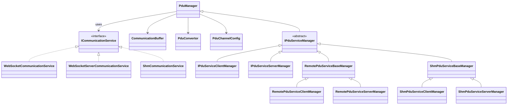

# hakoniwa-pdu-python

[](https://github.com/hakoniwalab/hakoniwa-pdu-python/actions/workflows/tests.yml)

**Python PDU communication library for the Hakoniwa simulator.**
Provides a unified transport layer where **RPC** and **Pub/Sub (topics)** run seamlessly over WebSocket.
For high-speed use cases, a **Shared Memory (SHM)** backend is also available.
The architecture is extensible to **Zenoh**, enabling scalable and distributed systems.
Binary ⇔ JSON ⇔ Python type conversion is built-in, reducing boilerplate to a minimum.

---

## ✨ Features

* **Unified layer**: RPC and Pub/Sub integrated on top of WebSocket
* **Automatic type conversion**: safely convert between binary, JSON, and Python types with offset definitions
* **Transport flexibility**: choose between **WebSocket**, **Shared Memory (SHM)**, and extensible backends such as **Zenoh**
* **Explicit & secure connections**: WebSocket URIs (`ws://...`) clearly define communication scope
* **Event-driven & polling support**: register handlers or poll buffers as needed
* **Ready-to-run samples**: minimal examples for `Twist` (topic) and `AddTwoInts` (RPC) included

---

## 📦 Installation

```bash
pip install hakoniwa-pdu
pip show hakoniwa-pdu   # check version
```

### Environment Variables

Specify the directory containing `.offset` files for PDU conversion:

```bash
export HAKO_BINARY_PATH=/your/path/to/offset
```

Default path if unset:

```
/usr/local/lib/hakoniwa/hako_binary/offset
```

---

## 🚀 Quick Start (3 commands)

> Example 1: **WebSocket Topic** (`geometry_msgs/Twist` publish → subscribe)

1. **Publisher (server)**

```bash
python examples/topic/websocket/remote_publisher.py \
  --uri ws://localhost:8080 \
  --pdu-config examples/pdu_config.json \
  --service-config examples/service.json
```

2. **Subscriber (client)**

```bash
python examples/topic/websocket/remote_subscriber.py \
  --uri ws://localhost:8080 \
  --pdu-config examples/pdu_config.json \
  --service-config examples/service.json
```

3. **Output**

```
[INFO] Received Twist: linear.x=0 angular.z=0
[INFO] Received Twist: linear.x=1 angular.z=1
```

---

> Example 2: **WebSocket RPC** (`AddTwoInts` service)

1. **RPC Server**

```bash
python examples/rpc/websocket/remote_rpc_server.py \
  --uri ws://localhost:8080 \
  --pdu-config examples/pdu_config.json \
  --service-config examples/service.json
```

2. **RPC Client**

```bash
python examples/rpc/websocket/remote_rpc_client.py \
  --uri ws://localhost:8080 \
  --pdu-config examples/pdu_config.json \
  --service-config examples/service.json
```

3. **Output**

```
Response: 3
```

---

## 📡 Event-Driven PDU Handling

Server:

```python
server_manager.register_handler_pdu_data(on_pdu)

def on_pdu(client_id, packet):
    ...
```

Client:

```python
client_manager.register_handler_pdu_data(on_pdu)

def on_pdu(packet):
    ...
```

Polling via `contains_buffer()` / `get_buffer()` is also available.

---

## 📁 Project Structure

```
hakoniwa_pdu/
├── pdu_manager.py
├── impl/
│   ├── icommunication_service.py
│   ├── websocket_communication_service.py
│   ├── websocket_server_communication_service.py
│   ├── shm_communication_service.py
│   ├── pdu_convertor.py
│   └── hako_binary/
├── rpc/
│   ├── ipdu_service_manager.py
│   ├── protocol_client.py
│   ├── protocol_server.py
│   ├── auto_wire.py
│   ├── remote/
│   └── shm/
├── resources/
│   └── offset/
└── examples/
```

---

## 🧰 Hakoniwa Launcher

`hako_launcher.py` orchestrates multiple Hakoniwa assets described in a JSON file. The
launcher handles environment preparation, process supervision, and optional
notifications when an asset exits unexpectedly.

### How to run

```bash
# Basic usage (immediate mode)
python -m hakoniwa_pdu.apps.launcher.hako_launcher path/to/launch.json

# Immediate mode with background exit (skip monitoring loop)
python -m hakoniwa_pdu.apps.launcher.hako_launcher path/to/launch.json --no-watch

# Interactive control (serve mode)
python -m hakoniwa_pdu.apps.launcher.hako_launcher path/to/launch.json --mode serve
```

* **Immediate mode** (default) performs `activate → hako-cmd start → watch`.
  * Assets whose `activation_timing` is `"before_start"` are spawned first.
  * After `hako-cmd start` completes successfully, assets with
    `"after_start"` are started.
  * Unless `--no-watch` is specified, the launcher keeps monitoring child
    processes. If any asset stops, every remaining asset is terminated.
* **Serve mode** keeps the process alive and accepts commands via STDIN.
  Available commands: `activate`, `start`, `stop`, `reset`, `terminate`,
  `status`, `quit`/`exit`.

Set `HAKO_PDU_DEBUG=1` to enable debug logging from the launcher modules.

### Launcher JSON format

The schema is provided at
`src/hakoniwa_pdu/apps/launcher/schemas/launcher.schema.json`. A minimal
configuration consists of a version header, optional defaults, and at least one
asset definition.

```jsonc
{
  "version": "0.1",
  "defaults": {
    "cwd": ".",
    "stdout": "logs/${asset}.out",
    "stderr": "logs/${asset}.err",
    "start_grace_sec": 1,
    "delay_sec": 3,
    "env": {
      "prepend": {
        "PATH": ["/usr/bin"]
      }
    }
  },
  "assets": [
    {
      "name": "drone",
      "command": "linux-main_hako_aircraft_service_px4",
      "args": ["127.0.0.1", "4560"],
      "activation_timing": "before_start"
    }
  ]
}
```

#### Top level keys

| Key        | Description |
| ---------- | ----------- |
| `version`  | Free-form version string for the specification.【F:src/hakoniwa_pdu/apps/launcher/model.py†L82-L90】 |
| `defaults` | Shared defaults applied to every asset when the field is omitted at the asset level. Paths are resolved relative to the launch file.【F:src/hakoniwa_pdu/apps/launcher/loader.py†L47-L91】 |
| `assets`   | Array of process definitions. Launch order is automatically sorted by `depends_on` while preserving the original order when there is no dependency.【F:src/hakoniwa_pdu/apps/launcher/model.py†L112-L167】 |
| `notify`   | Optional notification that fires when an asset exits or the launcher aborts. Supports `webhook` and `exec` variants.【F:src/hakoniwa_pdu/apps/launcher/model.py†L58-L80】【F:src/hakoniwa_pdu/apps/launcher/hako_monitor.py†L83-L121】 |

#### Defaults block

* `cwd`, `stdout`, `stderr`: default working directory and log sinks for assets.
  These support `${asset}`, `${timestamp}`, and `${base_dir}` placeholders. The
  loader resolves relative paths using the directory of the launch file.【F:src/hakoniwa_pdu/apps/launcher/loader.py†L30-L91】【F:src/hakoniwa_pdu/apps/launcher/hako_monitor.py†L19-L35】
* `start_grace_sec`: minimum time (seconds) an asset must stay alive after
  spawn to be considered healthy (default `5.0`).【F:src/hakoniwa_pdu/apps/launcher/model.py†L40-L54】
* `delay_sec`: delay inserted before launching the next asset (default `3.0`).【F:src/hakoniwa_pdu/apps/launcher/model.py†L40-L54】
* `env`: environment operations merged into the runtime environment in three
  stages: OS env → defaults.env → asset.env. Keys `set`, `prepend`, `append`,
  and `unset` are supported, and `lib_path` automatically maps to
  `LD_LIBRARY_PATH`/`DYLD_LIBRARY_PATH`/`PATH` depending on the platform.【F:src/hakoniwa_pdu/apps/launcher/model.py†L12-L37】【F:src/hakoniwa_pdu/apps/launcher/envmerge.py†L1-L103】

Environment variables written as `${VAR}` or `${VAR:-default}` inside the JSON
are resolved when the file is loaded. Placeholders `${asset}` and `${timestamp}`
are preserved for runtime expansion inside log paths and environment settings.【F:src/hakoniwa_pdu/apps/launcher/loader.py†L18-L67】

#### Asset entries

| Field                | Description |
| -------------------- | ----------- |
| `name`               | Asset identifier. Used for dependency checks and placeholders.【F:src/hakoniwa_pdu/apps/launcher/model.py†L56-L115】 |
| `command` / `args`   | Executable and argument vector passed to the process.【F:src/hakoniwa_pdu/apps/launcher/hako_monitor.py†L40-L77】 |
| `cwd`                | Working directory. Defaults to the launch file directory or `defaults.cwd`.【F:src/hakoniwa_pdu/apps/launcher/loader.py†L47-L91】 |
| `stdout` / `stderr`  | Optional log file destinations. Directories are created automatically and support placeholders. Leave `null` to inherit the parent stream.【F:src/hakoniwa_pdu/apps/launcher/hako_asset_runner.py†L60-L117】 |
| `delay_sec`          | Wait time before the next asset starts (overrides `defaults.delay_sec`).【F:src/hakoniwa_pdu/apps/launcher/model.py†L94-L107】 |
| `activation_timing`  | `before_start` launches prior to `hako-cmd start`; `after_start` launches only after a successful `hako-cmd start`.【F:src/hakoniwa_pdu/apps/launcher/model.py†L94-L107】【F:src/hakoniwa_pdu/apps/launcher/hako_launcher.py†L28-L70】 |
| `depends_on`         | List of other asset names that must start before this one. Cycles are rejected during load.【F:src/hakoniwa_pdu/apps/launcher/model.py†L112-L167】 |
| `start_grace_sec`    | Asset-specific stability grace period overriding `defaults.start_grace_sec`.【F:src/hakoniwa_pdu/apps/launcher/model.py†L94-L107】【F:src/hakoniwa_pdu/apps/launcher/hako_monitor.py†L40-L77】 |
| `env`                | Environment overrides merged on top of `defaults.env`. Supports `${asset}`, `${timestamp}`, and `${ENV:VAR}` substitutions at runtime.【F:src/hakoniwa_pdu/apps/launcher/envmerge.py†L14-L103】 |

#### Notify section

* `type: "exec"` executes a local command when the launcher aborts (placeholders
  `${asset}` and `${timestamp}` are available).【F:src/hakoniwa_pdu/apps/launcher/model.py†L58-L80】【F:src/hakoniwa_pdu/apps/launcher/hako_monitor.py†L83-L121】
* `type: "webhook"` issues an HTTP POST with the event name, asset, and
  timestamp. Use for integrations such as Slack or monitoring dashboards.【F:src/hakoniwa_pdu/apps/launcher/model.py†L58-L80】【F:src/hakoniwa_pdu/apps/launcher/hako_monitor.py†L83-L121】

Refer to the sample JSON provided above for a real-world configuration that
launches a drone asset together with supporting services.

---

## 🧭 Class Overview

### PduManager

* Orchestrates PDU buffers and delegates to a transport (`ICommunicationService`).
* Direct I/O: `declare_pdu_for_read/write` → `flush_pdu_raw_data()` / `read_pdu_raw_data()`.
* For RPC: extended via `rpc.IPduServiceManager` (handles `register_client`, `start_rpc_service`, etc.).

### Transport Implementations (`impl/`)

* `ICommunicationService` defines the transport API.
* `WebSocketCommunicationService` / `WebSocketServerCommunicationService`: WebSocket backend (explicit URI-based connection, simple & secure).
* `ShmCommunicationService`: high-speed shared memory backend.
* **Pluggable design**: additional transports (e.g., **Zenoh**) can be integrated without changing application code.

### RPC Layer (`rpc/`)

* `IPduServiceManager` family provides RPC APIs (client/server).
* `protocol_client.py` / `protocol_server.py`: user-friendly helpers.
* `auto_wire.py`: auto-loads generated converters.
* `remote/`: WebSocket managers.
* `shm/`: SHM managers.

---

## 🧩 Class Diagram (Mermaid)



---

## 🔗 Links

* 📘 GitHub: [https://github.com/hakoniwalab/hakoniwa-pdu-python](https://github.com/hakoniwalab/hakoniwa-pdu-python)
* 🌐 Hakoniwa Lab: [https://hakoniwa-lab.net](https://hakoniwa-lab.net)

---

## 📚 Documentation

For detailed API usage:
➡️ [API Reference (api-doc.md)](./api-doc.md)

---

## 📜 License

MIT License — see [LICENSE](./LICENSE)

