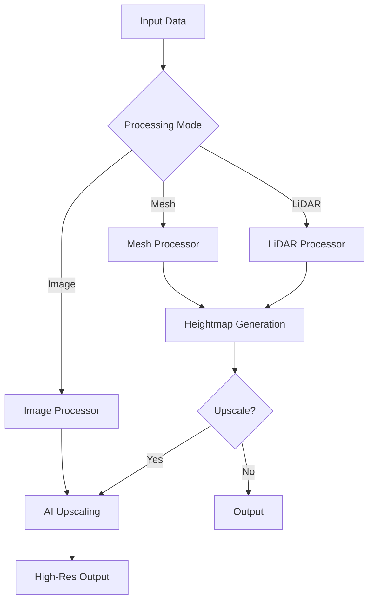

# Introduction

**Heightcraft** is a high-performance, AI-powered heightmap generation and upscaling tool designed for **GIS professionals**, **Game Engineers**, and **Researchers**.

It streamlines the pipeline from raw data (3D Meshes, LiDAR Point Clouds, or Low-Res Images) to high-quality, high-precision heightmaps ready for use in game engines (Unreal, Unity) or GIS software (QGIS, ArcGIS).

## Key Features

### 🚀 AI-Powered Upscaling
Transform low-resolution heightmaps into crisp, high-res/high-detail terrains using advanced AI models. Optionally increase original bit depth (e.g., 8-bit to 16-bit) to eliminate stepping artifacts.

### 📡 LiDAR Support
Process massive `.las` and `.laz` point cloud files efficiently. Heightcraft uses a streaming, chunked processing pipeline to handle gigabytes of data with minimal memory footprint.

### 🏔️ 3D Mesh to Heightmap
Convert `.gltf`, `.glb`, `.obj`, `.stl`, `.ply`, and other 3D mesh formats into heightmaps. Supports large models with automated chunking and memory management.

### 🎯 Precision & Formats
- **32-bit Float TIFF**: Full precision for scientific and GIS applications.
- **16-bit PNG/TIFF/RAW**: Standard for game engines.

## The Pipeline

## Who is this for?

- **Game Developers**: Automate terrain generation pipelines.
- **GIS Specialists**: Convert LiDAR data to DEMs efficiently.
- **Researchers**: Process large datasets for terrain analysis.
