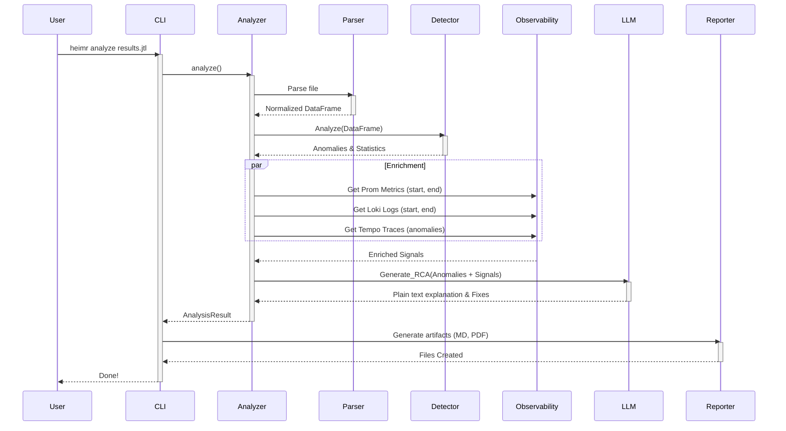

# Architecture

[← Back to Index](../WIKI.md)

Heimr.ai is designed as a **local-first, modular observability pipeline** that bridges the gap between raw tracking data and actionable human insight. Unlike traditional APM tools that merely visualize data, Heimr actively interprets it using statistical analysis and Large Language Models.

## 1. System Overview

Heimr operates on a **Stateless Pipeline Architecture**. It ingests static load test result files (JTL, JSON, HAR), enriches them with ephemeral data from observability backends (Prometheus, Loki, Tempo), analyzes them for anomalies, and uses an LLM to synthetize a root cause explanation.

### System Context Diagram

```mermaid
graph TD
    User((User))
    
    subgraph "Heimr.ai Ecosystem"
        CLI[Heimr CLI]
    end
    
    subgraph "Load Testing Tools"
        JMeter[Apache JMeter]
        k6[k6.io]
        Gatling[Gatling]
    end
    
    subgraph "Observability Stack"
        Prometheus[Prometheus<br/>(Metrics)]
        Loki[Loki<br/>(Logs)]
        Tempo[Tempo<br/>(Traces)]
    end
    
    subgraph "AI Inference"
        Ollama[Ollama<br/>(Local Llama 3)]
        OpenAI[OpenAI API]
    end

    User -->|Runs Load Test| Load Testing Tools
    Load Testing Tools -->|Generates Results| CLI
    User -->|Executes Analysis| CLI
    CLI -->|Queries| Prometheus
    CLI -->|Queries| Loki
    CLI -->|Queries| Tempo
    CLI -->|Send Prompt| Ollama
    CLI -->|Send Prompt| OpenAI
```

---

## 2. Component Architecture

The codebase is organized into distinct functional layers found in `heimr/`.

### 2.1 Core Orchestrator (`analyzer.py`)
The heart of the application logic. It handles:
- **Workflow Orchestration**: Directs the flow of data from parsers → detectors → enrichers → LLM.
- **State Management**: Holds the analysis context.
- **Public API**: Exposed for programmatic usage.

### 2.2 CLI Interface (`cli.py`)
- **Argument Parsing**: Processes CLI flags and `heimr.yaml` configuration.
- **Report Generation**: Formats the `AnalysisResult` from the Analyzer into Markdown/PDF.

### 2.2 Data Ingestion Layer (`parsers/`)
Responsible for normalizing diverse load test formats into a standard internal DataFrame structure.
- **Parsers**: Specific implementations for JTL (CSV), k6 (JSON), HAR (HTTP Archive), and others.
- **Normalization**: Ensures headers like `timestamp`, `latency`, `error_code`, and `response_message` are consistent regardless of the input source.

### 2.3 Analysis Engine
The "brain" of the pre-processing phase before LLM involvement.
- **Statistical Detector (`detector.py`)**:
    - **Algorithmic Detection**: Uses Z-Score (Mean + 2.5 STD) and Modified Z-Score to identify outliers.
    - **Pattern Recognition**: Detects bimodal distributions (e.g., cache hits vs. misses) by comparing P99 vs P50 ratios.
- **KPI Processor (`kpi.py`)**:
    - Aggregates Time-Series data.
    - Calculates high-level metrics: Throughput, Error Rate, Apdex Score.

### 2.4 Observability Interface
Connects to external data sources to correlate load test anomalies with system health.
- **`prometheus.py`**: Queries time-series databases for CPU, Memory, Disk I/O, and custom app metrics during the test window.
- **`loki.py`**: Fetches application logs, filtering for `ERROR` and `WARN` levels to find stack traces.
- **`tempo.py`**: Retrieves distributed traces to pinpoint bottlenecks in microservice calls (spans).

### 2.5 AI & Reasoning Layer (`llm.py`)
This layer prepares the "context package" for the LLM.
- **Context Stuffing**: Intelligently summarizes the thousands of data points into a concise prompt that fits within the model's context window.
- **Prompt Engineering**: Dynamic templates that instruct the model to act as a Senior SRE.
- **Client Abstraction**: Supports swapping between Local (Ollama) and Cloud (OpenAI, Anthropic) providers seamlessly.

### 2.6 Reporting Layer (`reporters/`)
Generates the final artifacts for the user.
- **Markdown Reporter**: Creates detailed technical reports.
- **PDF Generator (`pdf_generator.py`)**: Converts markdown to professional PDFs.
- **Dashboard**: The HTML dashboard has been discarded. A comprehensive dashboard implementation is planned using Grafana for future versions.

---

## 3. Data Flow Pipeline

The following sequence details how a single execution allows raw data to become an insight.


