# 🏰 System Architecture

This document provides an overview of the system architecture following the **C4 Model**, progressively detailing **context (level 1) and containers (level 2) structures**.

---
## **📡 System Context**

The System Context Diagram provides a high-level view of **HESTIA**, showing:

- Who interacts with it (Users, External Systems).
- How it fits into the ecosystem.

```mermaid
graph TB;

    developer["👨‍💻 Developer"] --> hestia["📜 HESTIA Asynchronous Logger"];
    app["🖥️ Application (FastAPI, Flask, CLI)"] --> hestia;
    externalAPIs["🔗 External Logging APIs"] --> hestia;

    hestia --> logStorage["📝 Log Storage (JSON and TXT)"];
    hestia --> console["🖥️ Console (Human-Readable Logs)"];
    
    logStorage --Parse/Forward Logs--- logForwarder["🛢️ Fluent Bit"] 
    logForwarder --> elasticsearch["🔍 Elasticsearch"] 
    elasticsearch --Full Text-Search--> kibana["📊 Kibana"];
    elasticsearch --Monitoring Dashboards--> grafana["🎨 Grafana"];

```

---

## **📦 Container Diagram**

This diagram details the deployed containers in the HESTIA Logger demo, showing log flow from a microservice to an observability stack, orchestrated by a setup script.

```mermaid

graph TB
    dev["👨‍💻 Developer"] -.- logGen["🖥️ Log Generator<br>services/log-generator"]

    subgraph Hestia_Logger_System ["HESTIA Logger System"]
        logGen -->|Writes Logs| vol[(/var/logs/hestia<br>Shared Storage)]
        vol -->|Reads Logs| fluent["🛢️ Fluent Bit<br>services/fluentbit"]

        subgraph Docker_Compose ["Docker Compose"]
            logGen
            fluent
            subgraph Elasticsearch_Cluster ["Elasticsearch Cluster"]
                es01["🔍 Elasticsearch Node 1<br>es01"]
                es02["🔍 Elasticsearch Node 2<br>es02"]
            end
            kibana["📊 Kibana<br>PORT: 5601"]
            grafana["🎨 Grafana<br>PORT: 3000"]
        end

        fluent -->|Forwards| es01
        fluent -->|Forwards| es02
        es01 -->|Stores| indices[(hestia-logs-*<br>INDICES)]
        es02 -->|Stores| indices
        indices -->|Queries| kibana
        indices -->|Queries| grafana
    end

    setup["⚙️ setup_microservices.sh"] -->|Orchestrates| logGen
    setup -->|Orchestrates| fluent
    setup -->|Orchestrates| es01
    setup -->|Orchestrates| es02
    setup -->|Orchestrates| kibana
    setup -->|Orchestrates| grafana
```

---
## **📚 References**
- [C4 Model Documentation](https://c4model.com/)
- [Mermaid.js Diagrams](https://mermaid-js.github.io/)
- [MkDocs Material](https://squidfunk.github.io/mkdocs-material/)
