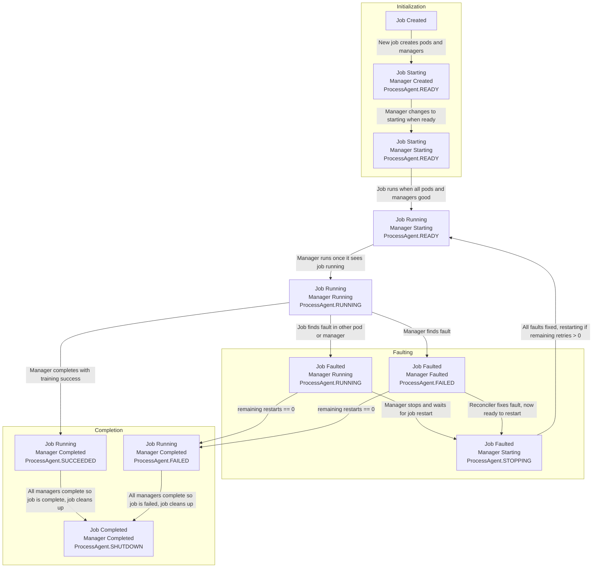

```mermaid
graph
 Jc[Job Created]
 JsMcPi[Job Starting\nManager Created\nProcessAgent.READY]
 JsMsPi[Job Starting\nManager Starting\nProcessAgent.READY]
 JrMsPi[Job Running\nManager Starting\nProcessAgent.READY]
 JrMrPr[Job Running\nManager Running\nProcessAgent.RUNNING]
 JfMrPr[Job Faulted\nManager Running\nProcessAgent.RUNNING]
 JfMfPf[Job Faulted\nManager Faulted\nProcessAgent.FAILED]
 JfMsPe[Job Faulted\nManager Starting\nProcessAgent.STOPPING]
 JrMcPs[Job Running\nManager Completed\nProcessAgent.SUCCEEDED]
 JrMcPf[Job Running\nManager Completed\nProcessAgent.FAILED]
 JcMcPt[Job Completed\nManager Completed\nProcessAgent.SHUTDOWN]
 
 subgraph Initialization
     Jc -->|New job creates pods and managers| JsMcPi
     JsMcPi -->|Manager changes to starting when ready| JsMsPi
 end
 
 JsMsPi -->|Job runs when all pods and managers good| JrMsPi
 JrMsPi -->|Manager runs once it sees job running| JrMrPr
 JrMrPr -->|Job finds fault in other pod or manager| JfMrPr
 JrMrPr -->|Manager finds fault| JfMfPf
 JrMrPr -->|Manager completes with training success| JrMcPs
 JfMsPe -->|All faults fixed, restarting if remaining retries > 0| JrMsPi
 
 subgraph Faulting
     JfMrPr -->|Manager stops and waits for job restart| JfMsPe
     JfMfPf -->|Reconciler fixes fault, now ready to restart| JfMsPe
 end
 
 subgraph Completion
     JrMcPs -->|All managers complete so job is complete, job cleans up| JcMcPt
     JfMrPr -->|remaining restarts == 0| JrMcPf
     JfMfPf -->|remaining restarts == 0| JrMcPf
     JrMcPf -->|All managers complete so job is failed, job cleans up| JcMcPt
 end
```
