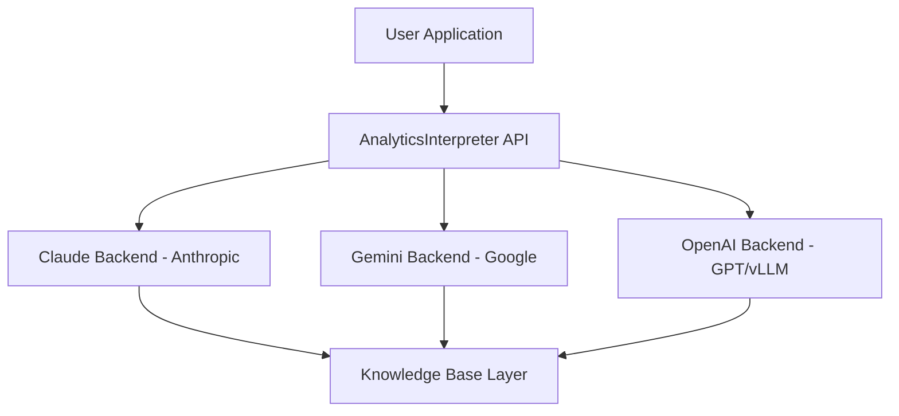

# Analytics Interpreter - Product Specification

**Version:** 1.2
**Date:** November 30, 2025
**Status:** Ready for Implementation
**Target:** GitHub Coding Agent Implementation
**Repository:** `lhzn-io/kanoa` (Standalone, Open-Source)

---

## Table of Contents

1. [Executive Summary](#executive-summary)
2. [Project Overview](#project-overview)
3. [Architecture](#architecture)
4. [Standalone Package Implementation](#standalone-package-implementation)
5. [Integration Patterns](#integration-patterns)
6. [Technical Specifications](#technical-specifications)
7. [API Reference](#api-reference)
8. [Testing Requirements](#testing-requirements)
9. [Open Source Strategy & Philosophy](#open-source-strategy--philosophy)
10. [Implementation Checklist](#implementation-checklist)

---

## Executive Summary

### Goal

Build a **standalone, open-source Python package** that provides AI-powered interpretation of data science outputs (matplotlib plots, DataFrames, statistical summaries) using multiple AI backends with optional knowledge base grounding. **Designed to be imported and used across multiple projects** (any data science project).

### Key Deliverables

1. **Standalone Package**: `kanoa` - Fully independent, pip-installable
2. **Multi-Project Support**: Import into any data science project
3. **Multi-Backend Support**:
    - **Cloud Providers**: Gemini 3 Pro, Claude Sonnet 4.5, OpenAI GPT-5.1
    - **Self-Hosted (vLLM)**: Ai2 Molmo, Google Gemma 3
4. **Provider-Native Grounding**: Leverage Gemini Context Caching, OpenAI Vector Stores, etc.
5. **Multimodal Knowledge Base**: Native PDF, Code, Audio, and Video processing (Gemini)
6. **Open Source**: MIT license, community-friendly
7. **Cost Optimization**: Context caching, efficient token usage

### Success Metrics

- Interprets matplotlib figures with 90%+ accuracy
- Supports 3+ AI backends with unified interface
- Processes full PDFs with visual context (Gemini)
- <$0.05 per interpretation at scale (with caching)
- <5 seconds response time for typical requests
- 85%+ test coverage
- Works seamlessly in any data science project
- Community adoption (GitHub stars, PyPI downloads)

---

## Project Overview

### Problem Statement

Data scientists currently use manual, disconnected workflows to interpret visualizations:

1. Create matplotlib plot
2. Take screenshot
3. Paste into ChatGPT/Claude
4. Copy response to markdown
5. Results are static, non-reproducible, lack project context

### Solution

**Standalone, reusable Python package** that:

- Directly interprets matplotlib figures programmatically
- Automatically loads project-specific knowledge bases
- Supports multiple AI backends (cloud + local)
- Provides reproducible, documented analysis
- Enables privacy-preserving local inference
- **Can be pip-installed into any project**
- **Domain-agnostic by design, extensible for specific domains**

### Usage Workflow

The core usage pattern approximates the experience of a dedicated research assistant, designed for in-notebook visualization and results interpretation:

1. **Execution**: Code runs in a notebook, producing a result (visualization, table, text, or video).
2. **Context Capture**: Optionally, the return value/artifact includes prompt-context text about the code's intent.
3. **User Query**: The notebook cell provides additional prompt context (the specific question to ask).
4. **Prompt Assembly**: A complete prompt is assembled, including:
    - System prompt
    - Code intent context
    - User question
    - Visual/Data artifacts
5. **Multimodal Invocation**: The prompt is invoked on a multimodal LLM.
6. **Grounding**: The LLM consults the knowledge base, which includes:
    - The codebase and documentation
    - User-supplied knowledge base (PDF, text, Audio, Video) - already integrated for efficiency.
7. **Interpretation**: The LLM produces an interpretation result (initially Markdown with tables, Mermaid diagrams, etc.; potentially multimodal in the future).
8. **Rendering**: The result renders in the notebook with clear formatting/background indicating it was generated by an in-line LLM interpretation.

### Multi-Domain Use Cases

#### 1. **Marine Biology Research**

- Interpret dive profile plots with marine biology context
- Analyze sensor data visualizations with domain-specific knowledge
- Compare analysis outputs with methodological grounding
- Load academic PDFs from literature

#### 2. **Aquaculture Analytics**

- Interpret growth curve visualizations
- Analyze water quality time series
- Statistical model output interpretation
- Integration with domain-specific knowledge bases

#### 3. **Any Data Science Domain**

- Exploratory data analysis commentary
- Model performance visualization analysis
- Report generation with AI assistance
- Custom knowledge base integration

---

## Architecture

### System Diagram



**Components:**

| Component | Description |
| ----------- | ------------- |
| **User Application** | Jupyter Notebook, Streamlit App, or Python Script |
| **AnalyticsInterpreter API** | `interpret(fig, context, focus)`, `interpret_dataframe(df)`, `load_knowledge_base(path)` |
| **Claude Backend** | Anthropic - Text KB only, $3/$15 per 1M tokens, 200K context |
| **Gemini Backend** | Google - Full PDF vision, $2/$12 per 1M tokens, 2M context (Gemini 3 Pro) |
| **OpenAI Backend** | GPT 5.1 / vLLM - OpenAI-compatible API, Molmo, Gemma 3, Local or Cloud |
| **Knowledge Base Layer** | Pre-integrated Content, Provider-Specific Adapters (Gemini Cache, OpenAI Vector Store) |

### Design Principles

1. **Backend Agnostic**: Unified interface, swappable backends
2. **Knowledge Base Flexible**: Works with/without KB, supports text and PDFs
3. **Cost Optimized**: Context caching, smart token usage
4. **Privacy Aware**: Local inference option via vLLM (Molmo, Gemma 3)
5. **Extensible**: Easy to add new backends, input types, KB formats

### Future Enhancements

- **Multi-Turn Memory**: Currently, the system is stateless (single-turn analysis). Future versions will include a `ChatSession` class to support multi-turn conversations and memory retention across requests.
- **Structured Logging**: Evaluate `structlog` to replace the current custom logging implementation for better observability and structured output handling.

---

## Standalone Package Implementation

**Repository**: `lhzn-io/kanoa`
**License**: MIT (recommended for open-source data science tools)
**Python Version**: 3.11+
**Distribution**: PyPI + GitHub releases

### Directory Structure

```text
kanoa/
├── analytics_interpreter/
│   ├── __init__.py
│   ├── core/
│   │   ├── __init__.py
│   │   ├── interpreter.py          # Main AnalyticsInterpreter class
│   │   └── types.py                 # Type definitions
│   ├── backends/
│   │   ├── __init__.py
│   │   ├── base.py                  # BaseBackend abstract class
│   │   ├── claude.py                # ClaudeBackend implementation
│   │   ├── gemini.py                # GeminiBackend implementation
│   │   └── openai.py                # OpenAIBackend (GPT/vLLM)
│   ├── knowledge_base/
│   │   ├── __init__.py
│   │   ├── base.py                  # BaseKnowledgeBase
│   │   ├── text_kb.py               # TextKnowledgeBase (markdown)
│   │   ├── pdf_kb.py                # PDFKnowledgeBase (full PDFs)
│   │   └── cache.py                 # Caching layer
│   ├── converters/
│   │   ├── __init__.py
│   │   ├── figure.py                # Matplotlib to base64/image
│   │   ├── dataframe.py             # DataFrame to text/markdown
│   │   └── utils.py                 # Helper functions
│   └── utils/
│       ├── __init__.py
│       ├── prompts.py               # Prompt templates
│       └── cost_tracking.py         # Token/cost monitoring
├── tests/
│   ├── unit/
│   │   ├── test_interpreter.py
│   │   ├── test_backends.py
│   │   ├── test_knowledge_base.py
│   │   └── test_converters.py
│   ├── integration/
│   │   ├── test_claude_integration.py
│   │   ├── test_gemini_integration.py
│   │   └── test_openai_integration.py
│   └── fixtures/
│       ├── sample_plots.py
│       ├── sample_data.py
│       └── mock_responses.py
├── examples/
│   ├── basic_usage.py
│   ├── with_knowledge_base.py
│   ├── backend_comparison.py
│   ├── pdf_processing.py
│   └── cost_optimization.py
├── docs/
│   ├── README.md
│   ├── API.md
│   ├── BACKENDS.md
│   ├── KNOWLEDGE_BASES.md
│   └── CONTRIBUTING.md
├── setup.py
├── pyproject.toml
├── requirements.txt
├── requirements-dev.txt
├── LICENSE
└── README.md
```

### Core Components

#### 1. Main Interpreter Class

**File**: `analytics_interpreter/core/interpreter.py`

```python
from typing import Optional, Union, Literal
from pathlib import Path
import matplotlib.pyplot as plt

from .types import InterpretationResult
from ..backends.base import BaseBackend
from ..backends.claude import ClaudeBackend
from ..backends.gemini import GeminiBackend
from ..backends.openai import OpenAIBackend
from ..knowledge_base.base import BaseKnowledgeBase
from ..knowledge_base.text_kb import TextKnowledgeBase
from ..knowledge_base.pdf_kb import PDFKnowledgeBase


class AnalyticsInterpreter:
    """
    AI-powered analytics interpreter with multi-backend support.

    Supports:
    - Multiple AI backends (Claude, Gemini, OpenAI/vLLM)
    - Knowledge base grounding (text, PDFs, or none)
    - Multiple input types (figures, DataFrames, dicts)
    - Cost tracking and optimization

    Examples:
        >>> # Basic usage
        >>> interpreter = AnalyticsInterpreter()
        >>> result = interpreter.interpret(fig, context="Sales data")

        >>> # With knowledge base
        >>> interpreter = AnalyticsInterpreter(kb_path="./docs")
        >>> result = interpreter.interpret(fig, context="Analysis")

        >>> # Specific backend
        >>> interpreter = AnalyticsInterpreter(backend='gemini')
        >>> result = interpreter.interpret(fig)
    """

    BACKENDS = {
        'claude': ClaudeBackend,
        'claude-sonnet-4.5': ClaudeBackend,
        'gemini': GeminiBackend,
        'gemini': GeminiBackend,
        'openai': OpenAIBackend,
        'vllm': OpenAIBackend,
    }

    def __init__(
        self,
        backend: Literal['claude', 'gemini', 'openai', 'vllm'] = 'gemini',
        kb_path: Optional[Union[str, Path]] = None,
        kb_content: Optional[str] = None,
        kb_type: Literal['text', 'pdf', 'auto'] = 'auto',
        api_key: Optional[str] = None,
        max_tokens: int = 3000,
        enable_caching: bool = True,
        track_costs: bool = True,
        **backend_kwargs
    ):
        """
        Initialize analytics interpreter.

        Args:
            backend: AI backend to use ('claude', 'gemini', 'openai', 'vllm')
            kb_path: Path to knowledge base directory
            kb_content: Pre-loaded knowledge base string
            kb_type: Knowledge base type ('text', 'pdf', 'auto')
            api_key: API key for cloud backends (or use env vars)
            max_tokens: Maximum tokens for response
            enable_caching: Enable context caching for cost savings
            track_costs: Track token usage and costs
            **backend_kwargs: Additional backend-specific arguments
        """
        # Initialize backend
        backend_class = self.BACKENDS.get(backend)
        if not backend_class:
            raise ValueError(f"Unknown backend: {backend}. Choose from {list(self.BACKENDS.keys())}")

        self.backend_name = backend
        self.backend: BaseBackend = backend_class(
            api_key=api_key,
            max_tokens=max_tokens,
            enable_caching=enable_caching,
            **backend_kwargs
        )

        # Initialize knowledge base
        self.kb: Optional[BaseKnowledgeBase] = None
        if kb_path or kb_content:
            self.kb = self._initialize_knowledge_base(
                kb_path=kb_path,
                kb_content=kb_content,
                kb_type=kb_type,
                backend=backend
            )

        # Cost tracking
        self.track_costs = track_costs
        self.total_cost = 0.0
        self.total_tokens = {'input': 0, 'output': 0}

    def _initialize_knowledge_base(
        self,
        kb_path: Optional[Union[str, Path]],
        kb_content: Optional[str],
        kb_type: str,
        backend: str
    ) -> BaseKnowledgeBase:
        """Initialize appropriate knowledge base type."""
        # Auto-detect KB type
        if kb_type == 'auto':
            if kb_path:
                kb_path = Path(kb_path)
                has_pdfs = any(kb_path.glob('**/*.pdf'))
                kb_type = 'pdf' if has_pdfs else 'text'
            else:
                kb_type = 'text'

        # Create KB instance
        if kb_type == 'pdf':
            # PDF KB requires Gemini backend
            if 'gemini' not in backend.lower():
                raise ValueError(
                    f"PDF knowledge base requires Gemini backend (for native vision). "
                    f"Current backend: {backend}. Use kb_type='text' or switch to 'gemini'."
                )
            return PDFKnowledgeBase(kb_path=kb_path, backend=self.backend)
        else:
            return TextKnowledgeBase(kb_path=kb_path, kb_content=kb_content)

    def interpret(
        self,
        fig: Optional[plt.Figure] = None,
        data: Optional[any] = None,
        context: Optional[str] = None,
        focus: Optional[str] = None,
        include_kb: bool = True,
        display_result: bool = True,
        custom_prompt: Optional[str] = None,
        **kwargs
    ) -> InterpretationResult:
        """
        Interpret analytical output using configured backend.

        Args:
            fig: Matplotlib figure to interpret
            data: DataFrame/dict/other data to interpret
            context: Brief description of the output
            focus: Specific aspects to analyze
            include_kb: Whether to include knowledge base context
            display_result: Auto-display as Markdown in Jupyter
            custom_prompt: Override default prompt template
            **kwargs: Additional backend-specific arguments

        Returns:
            InterpretationResult with text, metadata, and cost info

        Raises:
            ValueError: If neither fig nor data provided
        """
        # Validate input
        if fig is None and data is None:
            raise ValueError("Must provide either 'fig' or 'data' to interpret")

        # Get knowledge base context
        kb_context = None
        if include_kb and self.kb:
            kb_context = self.kb.get_context()

        # Call backend
        result = self.backend.interpret(
            fig=fig,
            data=data,
            context=context,
            focus=focus,
            kb_context=kb_context,
            custom_prompt=custom_prompt,
            **kwargs
        )

        # Track costs
        if self.track_costs and result.usage:
            self.total_tokens['input'] += result.usage.input_tokens
            self.total_tokens['output'] += result.usage.output_tokens
            self.total_cost += result.usage.cost

        # Auto-display
        if display_result:
            from IPython.display import display, Markdown
            display(Markdown(result.text))

        return result

    def interpret_figure(self, fig: Optional[plt.Figure] = None, **kwargs) -> InterpretationResult:
        """Convenience method for matplotlib figures."""
        if fig is None:
            fig = plt.gcf()
        return self.interpret(fig=fig, **kwargs)

    def interpret_dataframe(self, df, **kwargs) -> InterpretationResult:
        """Convenience method for DataFrames."""
        return self.interpret(data=df, **kwargs)

    def get_cost_summary(self) -> dict:
        """Get summary of token usage and costs."""
        return {
            'backend': self.backend_name,
            'total_calls': self.backend.call_count,
            'total_tokens': self.total_tokens,
            'total_cost_usd': self.total_cost,
            'avg_cost_per_call': self.total_cost / max(self.backend.call_count, 1)
        }

    def reload_knowledge_base(self):
        """Reload knowledge base from source."""
        if self.kb:
            self.kb.reload()
```

#### 2. Backend Base Class

**File**: `analytics_interpreter/backends/base.py`

```python
from abc import ABC, abstractmethod
from typing import Optional, Any
from dataclasses import dataclass
import matplotlib.pyplot as plt


@dataclass
class UsageInfo:
    """Token usage and cost information."""
    input_tokens: int
    output_tokens: int
    cost: float
    cached_tokens: int = 0


@dataclass
class InterpretationResult:
    """Result from interpretation."""
    text: str
    backend: str
    usage: Optional[UsageInfo] = None
    metadata: Optional[dict] = None


class BaseBackend(ABC):
    """Abstract base class for AI backends."""

    def __init__(
        self,
        api_key: Optional[str] = None,
        max_tokens: int = 3000,
        enable_caching: bool = True,
        **kwargs
    ):
        self.api_key = api_key
        self.max_tokens = max_tokens
        self.enable_caching = enable_caching
        self.call_count = 0

    @abstractmethod
    def interpret(
        self,
        fig: Optional[plt.Figure],
        data: Optional[Any],
        context: Optional[str],
        focus: Optional[str],
        kb_context: Optional[str],
        custom_prompt: Optional[str],
        **kwargs
    ) -> InterpretationResult:
        """
        Interpret analytical output.

        Must be implemented by subclasses.
        """
        pass

    @abstractmethod
    def _build_prompt(
        self,
        context: Optional[str],
        focus: Optional[str],
        kb_context: Optional[str],
        custom_prompt: Optional[str]
    ) -> str:
        """Build prompt for the backend."""
        pass

    def _fig_to_base64(self, fig: plt.Figure) -> str:
        """Convert matplotlib figure to base64."""
        from io import BytesIO
        import base64

        buf = BytesIO()
        fig.savefig(buf, format='png', dpi=150, bbox_inches='tight')
        buf.seek(0)
        img_base64 = base64.b64encode(buf.read()).decode('utf-8')
        buf.close()
        return img_base64

    def _data_to_text(self, data: Any) -> str:
        """Convert data to text representation."""
        # Try DataFrame methods
        if hasattr(data, 'to_string'):
            return data.to_string()
        if hasattr(data, 'to_markdown'):
            return data.to_markdown()

        # Try dict/JSON
        if isinstance(data, dict):
            import json
            return json.dumps(data, indent=2, default=str)

        # Fallback
        return str(data)
```

#### 3. Gemini Backend (Priority)

**File**: `analytics_interpreter/backends/gemini.py`

```python
import os
from typing import Optional, Any
import matplotlib.pyplot as plt
from google import genai
import time

from .base import BaseBackend, InterpretationResult, UsageInfo


class GeminiBackend(BaseBackend):
    """
    Google Gemini backend with native PDF support.

    Features:
    - Native multimodal PDF processing (sees figures, tables)
    - 1M token context window
    - Context caching for cost optimization
    - File Search tool for RAG
    """

    # Pricing (per 1M tokens)
    PRICING = {
        'input': 2.00,          # <200K context
        'output': 12.00,
        'input_long': 4.00,     # >200K context
        'output_long': 18.00,
        'cached': 0.20,         # Cached content
    }

    def __init__(
        self,
        api_key: Optional[str] = None,
        model: str = "gemini-3-pro-preview",
        max_tokens: int = 3000,
        enable_caching: bool = True,
        thinking_level: str = "high",
        media_resolution: str = "medium",
        **kwargs
    ):
        super().__init__(api_key, max_tokens, enable_caching)

        self.client = genai.Client(
            api_key=api_key or os.environ.get('GOOGLE_API_KEY')
        )
        self.model = model
        self.thinking_level = thinking_level
        self.media_resolution = media_resolution

        # PDF cache
        self.uploaded_pdfs = {}
        self.cached_context = None

    def load_pdfs(self, pdf_paths: list) -> dict:
        """
        Upload PDFs to Gemini for native vision processing.

        Args:
            pdf_paths: List of paths to PDF files

        Returns:
            Dict mapping filename to uploaded file object
        """
        for pdf_path in pdf_paths:
            if pdf_path in self.uploaded_pdfs:
                continue

            with open(pdf_path, 'rb') as f:
                uploaded = self.client.files.upload(
                    file=f,
                    config={
                        'mime_type': 'application/pdf',
                        'display_name': pdf_path.name
                    }
                )

            # Wait for processing
            while uploaded.state == 'PROCESSING':
                time.sleep(2)
                uploaded = self.client.files.get(name=uploaded.name)

            if uploaded.state == 'ACTIVE':
                self.uploaded_pdfs[pdf_path] = uploaded

        return self.uploaded_pdfs

    def interpret(
        self,
        fig: Optional[plt.Figure],
        data: Optional[Any],
        context: Optional[str],
        focus: Optional[str],
        kb_context: Optional[str],
        custom_prompt: Optional[str],
        **kwargs
    ) -> InterpretationResult:
        """Interpret using Gemini."""
        self.call_count += 1

        # Build content parts
        content_parts = []

        # Add figure
        if fig is not None:
            img_data = self._fig_to_base64(fig)
            content_parts.append({
                'role': 'user',
                'parts': [{
                    'inline_data': {
                        'mime_type': 'image/png',
                        'data': img_data
                    }
                }]
            })

        # Add data
        if data is not None:
            data_text = self._data_to_text(data)
            content_parts.append({
                'role': 'user',
                'parts': [{'text': f"Data to analyze:\n```\n{data_text}\n```"}]
            })

        # Add PDFs if available
        for pdf_file in self.uploaded_pdfs.values():
            content_parts.append({
                'role': 'user',
                'parts': [{
                    'file_data': {
                        'file_uri': pdf_file.uri,
                        'mime_type': 'application/pdf'
                    }
                }]
            })

        # Build prompt
        prompt = self._build_prompt(context, focus, kb_context, custom_prompt)
        content_parts.append({
            'role': 'user',
            'parts': [{'text': prompt}]
        })

        # Call API
        try:
            response = self.client.models.generate_content(
                model=self.model,
                contents=content_parts,
                config={
                    'max_output_tokens': self.max_tokens,
                    'thinking_level': self.thinking_level,
                }
            )

            # Extract text
            interpretation = response.text

            # Calculate usage
            usage = self._calculate_usage(response)

            # Add metadata
            interpretation += f"\n\n---\n*Generated by {self.model}*"
            if self.uploaded_pdfs:
                interpretation += f" *with {len(self.uploaded_pdfs)} PDF references*"

            return InterpretationResult(
                text=interpretation,
                backend='gemini',
                usage=usage,
                metadata={
                    'model': self.model,
                    'pdf_count': len(self.uploaded_pdfs)
                }
            )

        except Exception as e:
            error_msg = f"❌ **Error**: {str(e)}"
            return InterpretationResult(
                text=error_msg,
                backend='gemini',
                usage=None
            )

    def _build_prompt(
        self,
        context: Optional[str],
        focus: Optional[str],
        kb_context: Optional[str],
        custom_prompt: Optional[str]
    ) -> str:
        """Build Gemini-optimized prompt."""
        if custom_prompt:
            return custom_prompt

        parts = []

        if kb_context:
            parts.append(f"""You are an expert data analyst with access to domain-specific knowledge.

# Knowledge Base

{kb_context}

Use this information to provide informed, technically accurate interpretations.
""")

        parts.append("Analyze this analytical output and provide a technical interpretation.")

        if context:
            parts.append(f"\n**Context**: {context}")

        if focus:
            parts.append(f"\n**Analysis Focus**: {focus}")

        parts.append("""

Provide:
1. **Summary**: What the output shows
2. **Key Observations**: Notable patterns and trends
3. **Technical Interpretation**: Insights based on domain knowledge
4. **Potential Issues**: Data quality concerns or anomalies
5. **Recommendations**: Suggestions for further analysis

Use markdown formatting. Be concise but technically precise.
""")

        return "\n".join(parts)

    def _calculate_usage(self, response) -> UsageInfo:
        """Calculate token usage and cost."""
        # Extract token counts from response metadata
        usage_metadata = getattr(response, 'usage_metadata', None)
        if not usage_metadata:
            return None

        input_tokens = getattr(usage_metadata, 'prompt_token_count', 0)
        output_tokens = getattr(usage_metadata, 'candidates_token_count', 0)
        cached_tokens = getattr(usage_metadata, 'cached_content_token_count', 0)

        # Calculate cost
        # Determine if long context (>200K)
        is_long = input_tokens > 200_000

        input_rate = self.PRICING['input_long'] if is_long else self.PRICING['input']
        output_rate = self.PRICING['output_long'] if is_long else self.PRICING['output']

        # Regular tokens
        regular_input = input_tokens - cached_tokens
        input_cost = (regular_input * input_rate / 1_000_000)

        # Cached tokens (cheaper)
        cached_cost = (cached_tokens * self.PRICING['cached'] / 1_000_000)

        # Output tokens
        output_cost = (output_tokens * output_rate / 1_000_000)

        total_cost = input_cost + cached_cost + output_cost

        return UsageInfo(
            input_tokens=input_tokens,
            output_tokens=output_tokens,
            cost=total_cost,
            cached_tokens=cached_tokens
        )
```

#### 4. OpenAI Backend

**File**: `analytics_interpreter/backends/openai.py`

```python
import os
from typing import Optional, Any
import matplotlib.pyplot as plt
from openai import OpenAI

from .base import BaseBackend, InterpretationResult, UsageInfo


class OpenAIBackend(BaseBackend):
    """
    OpenAI GPT-4o backend.

    Features:
    - High performance reasoning
    - Vector Store integration (Assistants API)
    - 128K context window
    """

    # Pricing (per 1M tokens) - GPT-4o
    PRICING = {
        'input': 5.00,
        'output': 15.00,
    }

    def __init__(
        self,
        api_key: Optional[str] = None,
        model: str = "gpt-4o",
        max_tokens: int = 3000,
        enable_caching: bool = True,
        **kwargs
    ):
        super().__init__(api_key, max_tokens, enable_caching)
        self.client = OpenAI(
            api_key=api_key or os.environ.get('OPENAI_API_KEY')
        )
        self.model = model

    def interpret(
        self,
        fig: Optional[plt.Figure],
        data: Optional[Any],
        context: Optional[str],
        focus: Optional[str],
        kb_context: Optional[str],
        custom_prompt: Optional[str],
        **kwargs
    ) -> InterpretationResult:
        """Interpret using OpenAI."""
        self.call_count += 1

        messages = []

        # System prompt with KB
        system_content = "You are an expert data analyst."
        if kb_context:
            system_content += f"\n\nKnowledge Base:\n{kb_context}"

        messages.append({"role": "system", "content": system_content})

        # User content
        user_content = []
        if fig:
            img_data = self._fig_to_base64(fig)
            user_content.append({
                "type": "image_url",
                "image_url": {"url": f"data:image/png;base64,{img_data}"}
            })

        prompt = self._build_prompt(context, focus, None, custom_prompt)
        user_content.append({"type": "text", "text": prompt})

        messages.append({"role": "user", "content": user_content})

        try:
            response = self.client.chat.completions.create(
                model=self.model,
                messages=messages,
                max_tokens=self.max_tokens
            )

            interpretation = response.choices[0].message.content

            usage = UsageInfo(
                input_tokens=response.usage.prompt_tokens,
                output_tokens=response.usage.completion_tokens,
                cost=(
                    response.usage.prompt_tokens * self.PRICING['input'] / 1_000_000 +
                    response.usage.completion_tokens * self.PRICING['output'] / 1_000_000
                )
            )

            return InterpretationResult(
                text=interpretation,
                backend='openai',
                usage=usage,
                metadata={'model': self.model}
            )

        except Exception as e:
            return InterpretationResult(
                text=f"❌ **Error**: {str(e)}",
                backend='openai',
                usage=None
            )

    def _build_prompt(self, context, focus, kb_context, custom_prompt) -> str:
        # ... similar to others ...
        return "Analyze this output." # Placeholder
```

#### 5. Claude Backend

**File**: `analytics_interpreter/backends/claude.py`

```python
import os
from typing import Optional, Any
import matplotlib.pyplot as plt
from anthropic import Anthropic

from .base import BaseBackend, InterpretationResult, UsageInfo


class ClaudeBackend(BaseBackend):
    """
    Anthropic Claude backend.

    Features:
    - Excellent vision and reasoning
    - 200K context window
    - Proven reliability
    - Text-based knowledge base only
    """

    # Pricing (per 1M tokens)
    PRICING = {
        'input': 3.00,
        'output': 15.00,
        'cached': 0.30,
    }

    def __init__(
        self,
        api_key: Optional[str] = None,
        model: str = "claude-sonnet-4-5-20250514",
        max_tokens: int = 3000,
        enable_caching: bool = True,
        **kwargs
    ):
        super().__init__(api_key, max_tokens, enable_caching)

        self.client = Anthropic(
            api_key=api_key or os.environ.get('ANTHROPIC_API_KEY')
        )
        self.model = model

    def interpret(
        self,
        fig: Optional[plt.Figure],
        data: Optional[Any],
        context: Optional[str],
        focus: Optional[str],
        kb_context: Optional[str],
        custom_prompt: Optional[str],
        **kwargs
    ) -> InterpretationResult:
        """Interpret using Claude."""
        self.call_count += 1

        # Build content
        content = []

        # Add figure
        if fig is not None:
            img_data = self._fig_to_base64(fig)
            content.append({
                'type': 'image',
                'source': {
                    'type': 'base64',
                    'media_type': 'image/png',
                    'data': img_data
                }
            })

        # Add data
        if data is not None:
            data_text = self._data_to_text(data)
            content.append({
                'type': 'text',
                'text': f"Data to analyze:\n```\n{data_text}\n```"
            })

        # Add prompt
        prompt = self._build_prompt(context, focus, kb_context, custom_prompt)
        content.append({
            'type': 'text',
            'text': prompt
        })

        # Build system message with KB
        system = None
        if kb_context:
            system = f"""You are an expert data analyst with domain knowledge.

{kb_context}

Use this knowledge to provide informed interpretations."""

        # Call API
        try:
            message = self.client.messages.create(
                model=self.model,
                max_tokens=self.max_tokens,
                system=system,
                messages=[{
                    'role': 'user',
                    'content': content
                }]
            )

            interpretation = message.content[0].text

            # Calculate usage
            usage = UsageInfo(
                input_tokens=message.usage.input_tokens,
                output_tokens=message.usage.output_tokens,
                cost=(
                    message.usage.input_tokens * self.PRICING['input'] / 1_000_000 +
                    message.usage.output_tokens * self.PRICING['output'] / 1_000_000
                )
            )

            interpretation += f"\n\n---\n*Generated by {self.model}*"

            return InterpretationResult(
                text=interpretation,
                backend='claude',
                usage=usage,
                metadata={'model': self.model}
            )

        except Exception as e:
            return InterpretationResult(
                text=f"❌ **Error**: {str(e)}",
                backend='claude',
                usage=None
            )

    def _build_prompt(
        self,
        context: Optional[str],
        focus: Optional[str],
        kb_context: Optional[str],
        custom_prompt: Optional[str]
    ) -> str:
        """Build Claude-optimized prompt."""
        if custom_prompt:
            return custom_prompt

        parts = ["Analyze this analytical output."]

        if context:
            parts.append(f"\n**Context**: {context}")
        if focus:
            parts.append(f"\n**Focus**: {focus}")

        parts.append("""

Provide:
1. Summary of the output
2. Key observations
3. Technical interpretation
4. Potential issues
5. Recommendations

Be concise and technical.""")

        return "\n".join(parts)
```

#### 5. PDF Knowledge Base

**File**: `analytics_interpreter/knowledge_base/pdf_kb.py`

```python
from pathlib import Path
from typing import List, Optional
import time

from .base import BaseKnowledgeBase


class PDFKnowledgeBase(BaseKnowledgeBase):
    """
    Knowledge base that processes full PDFs with native vision.

    Only compatible with Gemini backend (native PDF vision).
    Preserves figures, tables, equations, and visual layout.
    """

    def __init__(
        self,
        kb_path: Optional[Path] = None,
        backend = None
    ):
        super().__init__(kb_path, None)
        self.backend = backend
        self.uploaded_pdfs = {}

    def load(self):
        """Upload PDFs to backend for processing."""
        if not self.kb_path or not self.kb_path.exists():
            return

        # Find all PDFs
        pdf_files = list(self.kb_path.rglob("*.pdf"))

        if not pdf_files:
            print("Warning: No PDFs found in knowledge base path")
            return

        # Upload to backend
        if hasattr(self.backend, 'load_pdfs'):
            self.uploaded_pdfs = self.backend.load_pdfs(pdf_files)
            print(f"Loaded {len(self.uploaded_pdfs)} PDFs with full visual context")
        else:
            raise ValueError(
                f"Backend {type(self.backend).__name__} does not support PDF processing"
            )

    def get_context(self) -> Optional[str]:
        """
        For PDF KB, context is handled via file references.
        Return summary string for metadata.
        """
        if not self.uploaded_pdfs:
            self.load()

        if self.uploaded_pdfs:
            filenames = [Path(p).name for p in self.uploaded_pdfs.keys()]
            return f"Knowledge base: {len(filenames)} PDFs loaded - {', '.join(filenames[:5])}"

        return None

    def reload(self):
        """Reload PDFs."""
        self.uploaded_pdfs.clear()
        self.load()
```

#### 6. Text Knowledge Base

**File**: `analytics_interpreter/knowledge_base/text_kb.py`

```python
from pathlib import Path
from typing import Optional, List

from .base import BaseKnowledgeBase


class TextKnowledgeBase(BaseKnowledgeBase):
    """
    Text-based knowledge base from markdown and code files.

    Compatible with all backends.
    Loads .md, .py, .rst files and combines into context string.
    """

    def __init__(
        self,
        kb_path: Optional[Path] = None,
        kb_content: Optional[str] = None
    ):
        super().__init__(kb_path, kb_content)
        self._cached_context: Optional[str] = None
        self._loaded_files: List[str] = []

    def load(self):
        """Load markdown files from path."""
        if self.kb_content:
            self._cached_context = self.kb_content
            return

        if not self.kb_path or not self.kb_path.exists():
            return

        # Find all markdown files
        md_files = sorted(self.kb_path.rglob("*.md"))

        if not md_files:
            print("Warning: No markdown files found in knowledge base path")
            return

        # Load and concatenate
        context_parts = []
        for md_file in md_files:
            try:
                content = md_file.read_text(encoding='utf-8')
                context_parts.append(f"# Source: {md_file.name}\n\n{content}")
                self._loaded_files.append(md_file.name)
            except Exception as e:
                print(f"Warning: Could not load {md_file}: {e}")

        self._cached_context = "\n\n---\n\n".join(context_parts)
        print(f"Loaded {len(self._loaded_files)} markdown files")

    def get_context(self) -> Optional[str]:
        """Get knowledge base text content."""
        if self._cached_context is None:
            self.load()
        return self._cached_context

    def reload(self):
        """Clear cache and reload."""
        self._cached_context = None
        self._loaded_files.clear()
        self.load()

    def get_loaded_files(self) -> List[str]:
        """Get list of loaded files."""
        return self._loaded_files
```

#### 7. Media Knowledge Base

**File**: `analytics_interpreter/knowledge_base/media_kb.py`

```python
from pathlib import Path
from typing import Optional, List

from .base import BaseKnowledgeBase


class MediaKnowledgeBase(BaseKnowledgeBase):
    """
    Knowledge base for Audio and Video files.

    Only compatible with Gemini backend.
    """

    def __init__(
        self,
        kb_path: Optional[Path] = None,
        backend = None
    ):
        super().__init__(kb_path, None)
        self.backend = backend
        self.uploaded_media = {}

    def load(self):
        """Upload media to backend."""
        if not self.kb_path or not self.kb_path.exists():
            return

        # Find media files
        media_files = []
        for ext in ['*.mp3', '*.wav', '*.mp4', '*.mov']:
            media_files.extend(self.kb_path.rglob(ext))

        if not media_files:
            return

        # Upload to backend (Gemini only)
        if hasattr(self.backend, 'load_media'):
            self.uploaded_media = self.backend.load_media(media_files)
            print(f"Loaded {len(self.uploaded_media)} media files")
```

---

## Integration Patterns

### Pattern 1: Direct Import (Simple Projects)

#### Example: Quick Analysis Script

```python
# Install once
# pip install kanoa

from analytics_interpreter import AnalyticsInterpreter
import matplotlib.pyplot as plt

# Use directly
interpreter = AnalyticsInterpreter()
plt.plot(data)
result = interpreter.interpret(fig=plt.gcf(), context="Sales analysis")
```

### Pattern 2: Project-Specific Wrapper (Recommended)

#### Example: Marine Biology Project Integration

Create a thin wrapper that provides domain-specific defaults:

**File**: `marine_project/analysis/interpretation.py`

```python
"""
Marine biology-specific analytics interpretation wrapper.
"""

from pathlib import Path
from typing import Optional
from analytics_interpreter import AnalyticsInterpreter


class MarineBioInterpreter:
    """Wrapper with marine biology defaults."""

    def __init__(self, backend='gemini', **kwargs):
        # Auto-detect project knowledge base
        project_root = Path(__file__).parent.parent.parent
        kb_path = project_root / "docs"

        self.interpreter = AnalyticsInterpreter(
            backend=backend,
            kb_path=kb_path,
            kb_type='auto',  # Will detect PDFs in refs/
            **kwargs
        )

    def interpret_dive_profile(self, fig, deployment_id=None, **kwargs):
        """Marine biology-specific convenience method."""
        context = f"Dive profile analysis"
        if deployment_id:
            context += f" - {deployment_id}"

        return self.interpreter.interpret(
            fig=fig,
            context=context,
            focus="Dive frequency, depth range, behavioral patterns",
            **kwargs
        )

    def interpret(self, *args, **kwargs):
        """Pass-through to underlying interpreter."""
        return self.interpreter.interpret(*args, **kwargs)


# Convenience function for notebooks
def interpret(fig=None, **kwargs):
    """Quick helper for marine biology notebooks."""
    return MarineBioInterpreter().interpret(fig=fig, **kwargs)
```

**File**: `marine_project/analysis/__init__.py`

```python
from .interpretation import MarineBioInterpreter, interpret

__all__ = [
    # ... existing exports ...
    'MarineBioInterpreter',
    'interpret',
]
```

**Usage in notebooks:**

```python
from marine_project.analysis import interpret

# Just works with project defaults!
plt.plot(depth_data)
interpret(deployment_id="DEPLOY001")
```

### Pattern 3: Aquaculture Analytics Integration

**File**: `aquaculture_project/interpretation.py`

```python
"""
Aquaculture-specific analytics interpretation wrapper.
"""

from pathlib import Path
from analytics_interpreter import AnalyticsInterpreter


class AquacultureInterpreter:
    """Wrapper with aquaculture defaults."""

    def __init__(self, backend='gemini', **kwargs):
        # Load aquaculture knowledge base
        project_root = Path(__file__).parent.parent
        kb_path = project_root / "knowledge_base"

        self.interpreter = AnalyticsInterpreter(
            backend=backend,
            kb_path=kb_path,
            kb_type='auto',
            **kwargs
        )

    def interpret_growth_curve(self, fig, species=None, **kwargs):
        """Interpret aquaculture growth curves."""
        context = "Aquaculture growth curve analysis"
        if species:
            context += f" - {species}"

        return self.interpreter.interpret(
            fig=fig,
            context=context,
            focus="Growth rates, anomalies, optimal conditions",
            **kwargs
        )

    def interpret_water_quality(self, fig, parameter=None, **kwargs):
        """Interpret water quality time series."""
        context = "Water quality monitoring"
        if parameter:
            context += f" - {parameter}"

        return self.interpreter.interpret(
            fig=fig,
            context=context,
            focus="Trends, thresholds, environmental factors",
            **kwargs
        )


# Module-level convenience
_interpreter = None

def interpret(fig=None, **kwargs):
    """Quick aquaculture interpretation helper."""
    global _interpreter
    if _interpreter is None:
        _interpreter = AquacultureInterpreter()
    return _interpreter.interpret(fig=fig, **kwargs)
```

**Usage in aquaculture projects:**

```python
from aquaculture_project.interpretation import interpret

# Works with project defaults and knowledge base
plt.plot(growth_data)
interpret(species="Atlantic Salmon")
```

### Pattern 4: Multi-Backend Configuration

#### Example: Research Project with Multiple Needs

```python
from analytics_interpreter import AnalyticsInterpreter

# Public data - use cloud backend
public_interpreter = AnalyticsInterpreter(backend='gemini')

# Proprietary data - use local backend (vLLM with Molmo/Gemma 3)
private_interpreter = AnalyticsInterpreter(backend='vllm')

# Cost-optimized for high volume
bulk_interpreter = AnalyticsInterpreter(
    backend='gemini',
    enable_caching=True  # Reuse KB across calls
)

# Then use appropriately
public_interpreter.interpret(fig1, context="Published dataset")
private_interpreter.interpret(fig2, context="Confidential results")
```

### Pattern 5: Custom Knowledge Base Per Analysis

#### Example: Paper-Specific Analysis

```python
from analytics_interpreter import AnalyticsInterpreter

# Analysis for Paper A
paper_a_interpreter = AnalyticsInterpreter(
    kb_path="./papers/paper_a_refs",
    kb_type='pdf'
)

# Analysis for Paper B
paper_b_interpreter = AnalyticsInterpreter(
    kb_path="./papers/paper_b_refs",
    kb_type='pdf'
)

# Each uses only relevant literature
paper_a_interpreter.interpret(fig_a, context="Experiment 1")
paper_b_interpreter.interpret(fig_b, context="Experiment 2")
```

### Pattern 6: Streamlit Application

#### Example: Interactive Research Assistant

```python
import streamlit as st
from analytics_interpreter import AnalyticsInterpreter

st.title("Research Assistant")

# Initialize (cached)
@st.cache_resource
def get_interpreter():
    return AnalyticsInterpreter(
        backend='gemini',
        kb_path='./docs',
        kb_type='pdf'
    )

interpreter = get_interpreter()

# Upload plot
uploaded_file = st.file_uploader("Upload a plot", type=['png', 'jpg'])
if uploaded_file:
    # Display
    st.image(uploaded_file)

    # Interpret
    if st.button("Interpret"):
        with st.spinner("Analyzing with Knowledge Base..."):
            # Convert to PIL/matplotlib compatible format if needed
            # ...
            result = interpreter.interpret(
                fig=uploaded_file,
                context="User uploaded plot"
            )
            st.markdown(result.text)
```

### Integration Checklist

When integrating into a new project:

1. **Add dependency**:

    ```bash
    # requirements.txt
    kanoa>=0.1.0

    # Or poetry
    poetry add kanoa
    ```

2. **Set API keys** (one-time setup):

    ```bash
    export GOOGLE_API_KEY='your-key'  # For Gemini
    export ANTHROPIC_API_KEY='your-key'  # For Claude
    ```

3. **Create project wrapper** (optional but recommended):
    - Thin wrapper class with domain defaults
    - Convenience functions for common visualizations
    - Auto-load project knowledge base

4. **Update project docs**:
    - Add interpretation examples to notebooks
    - Document knowledge base location
    - Show backend selection guidance

5. **Test integration**:
    - Verify KB loading works
    - Test with real project data
    - Check cost tracking

### Benefits of This Architecture

#### For kanoa (the package)

- Stays generic and reusable
- No project-specific dependencies
- Clean, minimal API surface
- Easy to test and maintain
- Open-source friendly

#### For downstream projects (marine biology, aquaculture, etc)

- Import and use immediately
- Add domain-specific wrappers as needed
- Control knowledge base location
- Customize for specific workflows
- No vendor lock-in

#### For the community

- Reusable across domains
- Contribute backends, features
- Share knowledge base patterns
- Build ecosystem tools

---

## Technical Specifications

### Dependencies

#### Core (kanoa)

```text
anthropic>=0.39.0
google-genai>=1.0.0
transformers>=4.40.0
torch>=2.0.0
matplotlib>=3.5.0
pandas>=1.5.0
IPython>=7.0.0
```

#### Dev

```text
pytest>=7.4.0
pytest-cov>=4.1.0
pytest-mock>=3.11.0
black>=23.0.0
flake8>=6.0.0
mypy>=1.4.0
```

### Performance Requirements

| Metric | Target | Notes |
| :------- | :------- | :---- |
| **First call latency** | <5s | Includes KB loading |
| **Subsequent calls** | <3s | With caching |
| **Memory usage** | <500MB | Including 100K token KB |
| **Token efficiency** | >80% | Relevant content only |
| **Cost per call** | <$0.05 | With caching |

### Configuration

#### Environment Variables

```bash
# API Keys
ANTHROPIC_API_KEY=your_claude_key
GOOGLE_API_KEY=your_gemini_key

# Optional
ANALYTICS_INTERPRETER_BACKEND=gemini
ANALYTICS_INTERPRETER_MAX_TOKENS=3000
ANALYTICS_INTERPRETER_ENABLE_CACHING=true
```

#### Config File (optional `config.yaml`)

```yaml
analytics_interpretation:
  backend: gemini
  max_tokens: 3000
  enable_caching: true
  track_costs: true

  knowledge_base:
    path: ./docs
    type: auto  # auto, text, pdf
    include_refs: true

  backends:
    claude:
      model: claude-sonnet-4-5-20250514
    gemini:
      model: gemini-3-pro-preview
      thinking_level: high
      media_resolution: medium
    vllm:
      base_url: http://localhost:8000/v1
      model: google/gemma-3-12b-it
```

---

## API Reference

### Quick Reference

```python
# Basic usage
from analytics_interpreter import AnalyticsInterpreter

interpreter = AnalyticsInterpreter()
result = interpreter.interpret(fig, context="Sales data")

# With knowledge base
interpreter = AnalyticsInterpreter(
    backend='gemini',
    kb_path='./docs',
    kb_type='pdf'  # Use full PDFs
)

# Project usage
from your_project.analysis import interpret

interpret(
    fig=dive_profile,
    deployment_id="RED001",
    viz_type="dive_profile"
)
```

### Backends

| Backend | Use When | Pros | Cons |
| :------- | :------- | :--- | :--- |
| **gemini** | Default, PDF KB | 1M context, PDF vision, cheaper with caching | Preview status |
| **claude** | Proven stability | Reliable, excellent quality | Smaller context, text KB only |
| **openai/vllm** | Privacy / flexibility | OpenAI-compatible, local or cloud | Requires setup for local |

---

## Testing Requirements

### Unit Tests

#### Required Coverage: 85%+

```text
# Test structure
tests/
├── unit/
│   ├── test_interpreter.py           # Core interpreter logic
│   ├── test_backends/
│   │   ├── test_claude.py            # Claude backend
│   │   ├── test_gemini.py            # Gemini backend
│   │   └── test_openai.py            # OpenAI/vLLM backend
│   ├── test_knowledge_base/
│   │   ├── test_text_kb.py           # Text KB
│   │   └── test_pdf_kb.py            # PDF KB
│   └── test_converters/
│       ├── test_figure.py            # Figure conversion
│       └── test_dataframe.py         # DataFrame conversion
```

#### Key Test Cases

1. **Interpreter Initialization**
    - Default backend selection
    - KB auto-detection (text vs PDF)
    - API key handling (env vars)
    - Error handling for missing dependencies

2. **Backend Functionality**
    - Successful interpretation
    - Token counting and cost calculation
    - Error handling (API failures)
    - Context caching

3. **Knowledge Base Loading**
    - Text KB from markdown files
    - PDF KB upload and processing
    - Cache invalidation
    - Missing files handling

4. **Input Conversion**
    - Matplotlib figure to base64
    - DataFrame to text/markdown
    - Dict to JSON
    - Edge cases (empty data, corrupted images)

### Integration Tests

#### Required: API key in CI/CD

```python
import os
import pytest
import matplotlib.pyplot as plt
from analytics_interpreter import AnalyticsInterpreter

@pytest.mark.integration
@pytest.mark.skipif(
    not os.environ.get('GOOGLE_API_KEY'),
    reason="API key required"
)
def test_gemini_end_to_end():
    """Test complete Gemini workflow."""
    # Create figure
    fig, ax = plt.subplots()
    ax.plot([1, 2, 3], [1, 4, 9])

    # Interpret
    interpreter = AnalyticsInterpreter(backend='gemini')
    result = interpreter.interpret(
        fig=fig,
        context="Test data",
        display_result=False
    )

    # Validate
    assert len(result.text) > 100
    assert result.usage.input_tokens > 0
    assert result.usage.cost > 0
```

### Manual Testing Checklist

- [ ] Test with real domain-specific data
- [ ] Verify PDF processing (figures visible to AI)
- [ ] Compare interpretation quality across backends
- [ ] Test cost tracking accuracy
- [ ] Validate Jupyter notebook integration
- [ ] Test with large knowledge bases (>100K tokens)
- [ ] Verify context caching works
- [ ] Test error handling (network issues, rate limits)

---

## Open Source Strategy & Philosophy

`kanoa` is committed to an **Open Source First** philosophy. We believe that powerful AI interpretation should not be locked behind proprietary APIs.

### Core Principles

1. **Equal Weight**: Open-source models (via vLLM) are treated as first-class citizens, equal in weight and support to proprietary models like Gemini and Claude.
2. **Infrastructure Freedom**: We provide the tools (`kanoa-mlops`) to host your own inference infrastructure, ensuring data privacy and sovereignty.
3. **Community Driven**: We prioritize models and features requested by the open-source community.

### Model Priorities

Our integration roadmap supports both cloud and self-hosted options:

**Self-Hosted (via vLLM)**:

1. **Ai2 Molmo**: Premier open multimodal model (7B-72B parameters).
2. **Google Gemma 3**: State-of-the-art open model (12B-27B parameters).

**Cloud Providers** (for users who prefer managed services):

- **Gemini 3 Pro**: For massive context and native PDF understanding.
- **Claude Sonnet 4.5**: For superior reasoning and "thinking" capabilities.
- **OpenAI GPT-5.1**: For general-purpose excellence.

### Why Open Source?

#### Benefits for the Package

- Community contributions (backends, features, bug fixes)
- Wider adoption and testing
- Credibility and trust
- Attract contributors from academia and industry
- Citation potential for research papers

#### Benefits for Your Projects

- Professional portfolio piece
- Community support and maintenance
- Potential collaborators
- Industry recognition
- Hiring opportunities

#### Benefits for Community

- Reusable tool for data scientists
- Standardized approach to AI-assisted analysis
- Knowledge sharing (KB patterns)
- Benchmark for AI interpretation quality

### License Recommendation

#### MIT License (Recommended)

```text
MIT License

Copyright (c) 2025 LHZN

Permission is hereby granted, free of charge, to any person obtaining a copy
of this software and associated documentation files (the "Software"), to deal
in the Software without restriction, including without limitation the rights
to use, copy, modify, merge, publish, distribute, sublicense, and/or sell
copies of the Software, and to permit persons to whom the Software is
furnished to do so, subject to the following conditions:

[Standard MIT License text...]
```

#### Why MIT?

- Most permissive (industry-friendly)
- Allows commercial use
- Compatible with most projects
- Used by pandas, matplotlib, scikit-learn

#### Alternative: Apache 2.0

- Better patent protection
- More verbose
- Good for larger projects

### Repository Setup

#### File: `.github/FUNDING.yml` (Optional - if accepting sponsorship)

```yaml
# Optional: If you want to accept GitHub Sponsors
github: [your-username]
```

#### File: `CONTRIBUTING.md`

```markdown
# Contributing to Analytics Interpreter

We love your input! We want to make contributing to this project as easy and transparent as possible.

## Development Process

1. Fork the repo
2. Create your feature branch (`git checkout -b feature/amazing-feature`)
3. Commit your changes (`git commit -m 'Add amazing feature'`)
4. Push to the branch (`git push origin feature/amazing-feature`)
5. Open a Pull Request

## Code Style

- Follow PEP 8
- Use type hints
- Write docstrings (Google style)
- Add tests for new features (85%+ coverage)

## Testing

```bash
# Run tests
pytest tests/

# With coverage
pytest tests/ --cov=analytics_interpreter
```

## Adding a New Backend

See `docs/BACKEND_DEVELOPMENT.md` for detailed guide.

## Questions?

Open an issue or join our [Discord/Discussions].

```markdown

#### File: `CODE_OF_CONDUCT.md`

```markdown
# Contributor Covenant Code of Conduct

## Our Pledge

We pledge to make participation in our project and our community a harassment-free experience for everyone.

[Standard Contributor Covenant text...]
```

### PyPI Publishing

#### File: `setup.py` (for PyPI)

```python
from setuptools import setup, find_packages

with open("README.md", "r", encoding="utf-8") as fh:
    long_description = fh.read()

setup(
    name="kanoa",
    version="0.1.0",
    author="LHZN",
    author_email="your-email@example.com",
    description="AI-powered interpretation of data science outputs",
    long_description=long_description,
    long_description_content_type="text/markdown",
    url="https://github.com/lhzn-io/kanoa",
    project_urls={
        "Bug Tracker": "https://github.com/lhzn-io/kanoa/issues",
        "Documentation": "https://github.com/lhzn-io/kanoa/blob/main/docs/API.md",
        "Source Code": "https://github.com/lhzn-io/kanoa",
    },
    packages=find_packages(),
    classifiers=[
        "Development Status :: 3 - Alpha",
        "Intended Audience :: Science/Research",
        "Intended Audience :: Developers",
        "Topic :: Scientific/Engineering :: Artificial Intelligence",
        "Topic :: Scientific/Engineering :: Visualization",
        "License :: OSI Approved :: MIT License",
        "Programming Language :: Python :: 3",
        "Programming Language :: Python :: 3.11",
        "Programming Language :: Python :: 3.9",
        "Programming Language :: Python :: 3.10",
        "Programming Language :: Python :: 3.11",
        "Programming Language :: Python :: 3.12",
    ],
    python_requires=">=3.11",
    install_requires=[
        "anthropic>=0.39.0",
        "google-genai>=1.0.0",
        "matplotlib>=3.5.0",
        "pandas>=1.5.0",
        "IPython>=7.0.0",
    ],
    extras_require={
        "dev": [
            "pytest>=7.4.0",
            "pytest-cov>=4.1.0",
            "black>=23.0.0",
            "flake8>=6.0.0",
            "mypy>=1.4.0",
        ],
        "openai": [
            "openai>=1.0.0",
        ],
    },
)
```

### Release Process

#### Version 0.1.0 (Alpha Release)

- Core functionality working
- Gemini and Claude backends
- Text and PDF knowledge bases
- 85%+ test coverage
- Basic documentation

#### Version 0.2.0 (Beta Release)

- OpenAI backend with vLLM support (Molmo, Gemma 3)
- Advanced caching
- Performance optimizations
- Community feedback incorporated

#### Version 1.0.0 (Stable Release)

- Production-ready
- Comprehensive docs
- Integration examples
- Community adoption

### GitHub Configuration

#### Repository Settings

- Topics: `ai`, `data-science`, `machine-learning`, `visualization`, `python`
- Description: "AI-powered interpretation of data science outputs with multiple backends"
- Website: Link to documentation
- Enable Issues
- Enable Discussions
- Enable Wiki (optional)

#### Branch Protection (main)

- Require pull request reviews
- Require status checks to pass (CI/CD)
- Require branches to be up to date
- Include administrators

### Community Building

#### Documentation

- Clear README with quickstart
- API reference
- Tutorial notebooks
- Integration examples (marine biology, aquaculture, etc.)
- Backend comparison guide

#### Examples

- Jupyter notebooks in `examples/`
- Show different backends
- Show different domains (marine biology, aquaculture, generic)
- Cost optimization examples

#### Communication

- GitHub Discussions for questions
- Discord/Slack for real-time chat (optional)
- Twitter/blog for announcements
- Conference presentations (SciPy, JupyterCon)

#### Quality Signals

- CI/CD badges (tests passing, coverage)
- PyPI version badge
- License badge
- Python version badge
- Documentation status

### Marketing Strategy

#### Launch Announcement

- Post on Reddit (r/datascience, r/Python, r/MachineLearning)
- Tweet with examples
- Blog post with use cases
- Submit to PyPI trending
- Post in relevant academic communities

#### Use Cases to Highlight

1. **Academic Research** - "Interpret sensor data plots with literature context"
2. **Industry Analytics** - "Add AI commentary to dashboards"
3. **Education** - "Help students understand data visualizations"
4. **Reproducible Research** - "Document analysis with AI assistance"

#### Target Audience

- Data scientists needing visualization interpretation
- Researchers with domain-specific knowledge bases
- Teams wanting reproducible AI-assisted analysis
- Educators teaching data science

### Success Metrics

#### Short-term (3 months)

- 100+ GitHub stars
- 10+ issues/PRs from community
- 1,000+ PyPI downloads
- 3+ downstream projects using it

#### Long-term (12 months)

- 500+ GitHub stars
- Active contributor community (10+ contributors)
- 10,000+ PyPI downloads
- Academic citations
- Conference presentations

---

## Implementation Checklist

### Phase 1: Core Implementation (Week 1-2)

- [x] **Project Setup**
  - [x] Repository structure
  - [x] CI/CD (GitHub Actions)
  - [x] Pre-commit hooks (linting/formatting)
  - [x] Strict Type Annotation Policy

- [x] **Core Logic**
  - [x] `AnalyticsInterpreter` class
  - [x] Backend abstraction layer
  - [x] Knowledge Base abstraction layer

- [x] **Backends**
  - [x] Claude (Anthropic)
  - [x] Gemini (Google) - Native PDF support
  - [x] OpenAI (GPT/vLLM) - OpenAI-compatible

- [x] **Knowledge Base**
  - [x] Text/Markdown support
  - [x] PDF support (Gemini native)
  - [x] Caching layer

- [x] **Testing**
  - [x] Unit test suite
  - [x] Integration tests (Gemini)
  - [x] 85%+ coverage

### Phase 2: Advanced Features (Week 3-4)

- [ ] **RAG & Grounding**
  - [ ] Vertex AI RAG Engine integration
  - [ ] Google Search grounding
  - [ ] Hybrid retrieval strategies

- [ ] **Enhanced Backends**
  - [x] OpenAI Backend (GPT 5.1)
  - [ ] vLLM local inference optimization

- [ ] **Documentation**
  - [x] Sphinx setup
  - [x] API Reference
  - [x] User Guides
  - [ ] Advanced RAG tutorials

### Phase 3: Polish & Release (Week 5)

- [ ] **Performance Optimization**
- [ ] **Security Audit**
- [ ] **PyPI Release**

### Phase 2: Knowledge Base & Testing (Week 3)

- [ ] TextKnowledgeBase implementation
  - [ ] Markdown file loading
  - [ ] Concatenation and formatting
  - [ ] Caching
- [ ] PDFKnowledgeBase implementation
  - [ ] PDF upload to Gemini
  - [ ] File management
  - [ ] Error handling
- [ ] Knowledge base tests
- [ ] Examples and documentation
- [ ] Achieve 85%+ test coverage

### Phase 2.5: Vertex AI RAG & Grounding Integration (Week 3.5)

**Strategic Goal**: Implement provider-native RAG solutions as an alternative to context-stuffing for knowledge base integration.

#### Vertex AI RAG Engine Integration

- [ ] **RAG Corpus Management**
  - [ ] Create `VertexRAGKnowledgeBase` class
  - [ ] Implement corpus creation and indexing
  - [ ] Support for local files, GCS, and Google Drive sources
  - [ ] Automatic chunking and embedding generation
  - [ ] Managed vector database (`RagManagedDb`)

- [ ] **Retrieval Integration**
  - [ ] Implement semantic search against RAG corpus
  - [ ] Configure similarity thresholds and top-k results
  - [ ] Integrate retrieved context into Gemini prompts
  - [ ] Track retrieval metrics and relevance scores

- [ ] **Grounding with Google Search**
  - [ ] Add `enable_google_search_grounding` parameter
  - [ ] Implement dynamic retrieval via `tools=[{'google_search': {}}]` (model decides when to ground)
  - [ ] Parse and include grounding metadata with source citations
  - [ ] Support for third-party data sources (Moody's, MSCI, etc.)

#### Efficient GCS Integration

- [ ] **Direct GCS URI Support**: Enable `gs://` URIs in `add_resource` to pass directly to Gemini Context Caching without local download (using `file_uri` in `types.Part`).
- [ ] **Virtual File Handling**: Abstract GCS objects as virtual files in `BaseKnowledgeBase` to support cloud-native workflows.

#### Implementation Details

- [ ] **Backend Enhancement**
  - [ ] Extend `GeminiBackend` with RAG Engine support
  - [ ] Add `grounding_mode` parameter: `'context_stuffing'`, `'rag_engine'`, `'google_search'`, `'hybrid'`
  - [ ] Implement cost comparison between strategies
  - [ ] Add grounding source attribution to results

- [ ] **Knowledge Base Adapter**
  - [ ] Create `VertexRAGAdapter` for existing KB types
  - [ ] Auto-convert TextKB/PDFKB to RAG corpus
  - [ ] Implement incremental updates for corpus
  - [ ] Cache corpus IDs for reuse

- [ ] **Testing & Validation**
  - [ ] Compare accuracy: context-stuffing vs RAG Engine
  - [ ] Benchmark costs for different KB sizes
  - [ ] Test dynamic retrieval effectiveness
  - [ ] Validate grounding source citations

#### Success Metrics

- RAG Engine reduces costs by 60%+ for large KBs (>500K tokens)
- Retrieval precision >85% for domain-specific queries
- Google Search grounding adds verifiable citations
- Hybrid mode optimizes for both accuracy and cost

### Phase 3: Open Source Release (Week 4)

- [ ] Polish documentation
  - [ ] Update README with badges, quickstart
  - [ ] Create comprehensive examples
  - [ ] Write integration guide
  - [ ] Add backend comparison docs
- [ ] PyPI packaging
  - [ ] setup.py configuration
  - [ ] Test installation process
  - [ ] Version 0.1.0 release
- [ ] Publish to PyPI
- [ ] Announce on social media / Reddit / communities

### Phase 4: Example Domain Integrations (Week 5+)

#### Marine Biology Project Example

- [ ] Add kanoa to requirements
- [ ] Create domain-specific wrapper
- [ ] Update module exports
- [ ] Write integration tests
- [ ] Create demo notebook
- [ ] Update project documentation

#### Aquaculture Project Example

- [ ] Similar process as above
- [ ] Create domain-specific wrapper
- [ ] Add domain-specific conveniences
- [ ] Test with project data
- [ ] Documentation

#### Other Domains

- [ ] Document integration pattern
- [ ] Provide template wrapper
- [ ] Share best practices

### Phase 5: Advanced Integrations (Future)

- [ ] **Vertex AI Enterprise Backend**
  - [ ] Create `VertexAIBackend` class using `google-cloud-aiplatform` SDK
  - [ ] Service account authentication
  - [ ] VPC Service Controls support
  - [ ] Cloud Audit Logs integration
  - [ ] CMEK (Customer-Managed Encryption Keys)
  - [ ] Private endpoint configuration
  - [ ] Add `kanoa[vertexai]` package extra
  - [ ] Enterprise deployment documentation

- [ ] **Agent Development Kit (ADK) Integration** (contingent on demand)
  - [ ] Evaluate ADK for agentic interpretation workflows
  - [ ] Multi-step reasoning with tool use
  - [ ] Integration with Vertex AI Agent Builder

- [ ] **Streamlit Reference Implementation**
  - [ ] Build demo app `examples/app.py`
  - [ ] Demonstrate interactive KB querying
- [ ] **Reference Manager Integration**
  - [ ] Zotero API connector
  - [ ] Paperguide integration
- [ ] **BibTeX Automation**
  - [ ] `.bib` to PDF downloader utility
  - [ ] Auto-populate `docs/refs/` from bibliography

---

## Priority Features for GitHub Agent

### MUST IMPLEMENT (P0)

1. **Core AnalyticsInterpreter class**
    - Unified interface for all backends
    - Knowledge base integration
    - Cost tracking

2. **Gemini backend with PDF support**
    - Native PDF vision processing
    - Context caching
    - 1M token context window

3. **Knowledge base system**
    - TextKnowledgeBase (markdown)
    - PDFKnowledgeBase (full PDFs)
    - Auto-detection

4. **Input converters**
    - Matplotlib figure to base64
    - DataFrame to text/markdown

5. **DomainAnalyticsInterpreter wrapper**
    - Domain-specific methods
    - Convenience functions

### SHOULD IMPLEMENT (P1)

1. **Claude backend**
    - Text KB support
    - Vision support
    - Cost tracking

2. **Context caching optimization**
    - Persistent cache for KB
    - Token reuse tracking

3. **Comprehensive tests**
    - Unit tests (85% coverage)
    - Integration tests
    - Mock fixtures

4. **Documentation**
    - README with examples
    - API reference
    - Backend comparison guide

### COULD IMPLEMENT (P2)

1. ⚠️ **vLLM optimization** (defer to Phase 2)
    - Local inference tuning for Molmo/Gemma 3
    - GPU optimization
    - Model selection guide

2. ⚠️ **Advanced caching** (defer)
    - Persistent cache (Redis/disk)
    - TTL management
    - Cache statistics

3. ⚠️ **Cost optimization tools** (defer)
    - Token usage analyzer
    - Cost prediction
    - Budget alerts

---

## Success Criteria

### Functional

- [ ] Interprets matplotlib figures accurately
- [ ] Supports Claude, Gemini, and OpenAI/vLLM backends
- [ ] Processes full PDFs with Gemini (sees figures/tables)
- [ ] Loads text knowledge bases (markdown)
- [ ] Tracks costs and token usage
- [ ] Works in Jupyter notebooks
- [ ] Supports domain-specific wrappers

### Quality

- [ ] 85%+ test coverage
- [ ] All tests passing
- [ ] Type hints throughout
- [ ] Comprehensive docstrings
- [ ] Clean code (passes linting)

### Performance

- [ ] <5s first call (with KB load)
- [ ] <3s subsequent calls (cached)
- [ ] <$0.05 per call (with caching)
- [ ] Handles 100K+ token KBs

### Documentation

- [ ] Clear README with quickstart
- [ ] Complete API reference
- [ ] Backend comparison guide
- [ ] Working examples
- [ ] Domain integration docs

---

## Notes for GitHub Agent

### Implementation Order

1. **Start with Gemini backend** - Most critical for PDF support
2. **Build knowledge base system** - Core differentiator
3. **Add Claude backend** - Proven alternative
4. **Create domain-specific wrapper** - Domain integration
5. **Polish and test** - Production ready

### Key Design Decisions

#### Backend Selection

- Gemini-3 is default (best for PDFs, cost-effective)
- Claude is fallback (proven, reliable)
- OpenAI/vLLM for flexibility (privacy, OpenAI-compatible)

#### Knowledge Base

- Auto-detect text vs PDF based on file types
- PDF KB requires Gemini backend
- Text KB works with all backends

#### Cost Optimization

- Context caching is essential for PDFs
- Track all token usage
- Provide cost summaries

### Testing Strategy

- Mock external APIs for unit tests
- Real API calls for integration tests (CI/CD)
- Manual testing with real domain-specific data
- Performance benchmarks

### Documentation

- Code should be self-documenting with docstrings
- Examples should be runnable
- README should have quickstart in first 50 lines
- API docs should cover all public methods

---

## Appendices

### A. Example Usage Patterns

#### Basic Research Notebook

```python
from analytics_interpreter import AnalyticsInterpreter
import matplotlib.pyplot as plt

# Setup
interpreter = AnalyticsInterpreter()

# Create plot
plt.plot(depth_data)
plt.title("Dive Profile")

# Interpret
interpret(context="Swordfish RED001", focus="dive patterns")
```

#### With Full PDF Knowledge Base

```python
interpreter = AnalyticsInterpreter(
    backend='gemini',
    kb_path='./docs/refs',  # Contains academic PDFs
    kb_type='pdf'
)

# Gemini now sees figures in papers!
result = interpreter.interpret(
    fig=my_plot,
    context="Compare with Sepulveda et al. 2010",
    focus="Dive frequency matches Figure 3?"
)
```

#### Backend Comparison

```python
backends = ['claude', 'gemini', 'vllm']
results = {}

for backend in backends:
    interp = AnalyticsInterpreter(backend=backend)
    results[backend] = interp.interpret(fig, context="Test")

# Compare quality and cost
for name, result in results.items():
    print(f"{name}: ${result.usage.cost:.4f}")
```

### B. Cost Estimation

#### Gemini-3 with PDF KB (200 interpretations/month)

```text
Setup:
- 10 PDFs × 20 pages = 200 pages
- 200 pages × 258 tokens = 51,600 tokens
- Upload once: 51,600 × $2/1M = $0.103

Per interpretation (cached):
- Input: 51,600 × $0.20/1M (cached) = $0.010
- Output: 2,000 × $12/1M = $0.024
- Total: $0.034

Monthly: $0.103 + (200 × $0.034) = $6.90
```

#### Claude with Text KB (200 interpretations/month)

```text
Per interpretation:
- Input: 100,000 × $3/1M = $0.30
- Output: 2,000 × $15/1M = $0.03
- Total: $0.33

Monthly: 200 × $0.33 = $66.00
```

#### Winner: Gemini-3 with caching (10x cheaper!)

### C. Academic Paper Structure

PDFs typically contain:

- **Tables**: Statistical results, parameters (20% of value)
- **Equations**: Mathematical models (10% of value)
- **Text**: Methods, discussion (40% of value)

**Text-only extraction loses 60% of information!**

---

## Deferred Features

Features explicitly considered and deferred to maintain focus on core mission.

### Log Stream Reuse by ID/Handle

**Status**: Won't implement (out of scope)
**Date**: 2024-12-03

**Context**: The `log_stream()` context manager creates visual containers for
grouping verbose logs in Jupyter notebooks. Each `with log_stream()` block
creates a separate container, even when using the same `title=`.

**Feature Request**: Allow multiple `with log_stream()` blocks to append to
the same container by reusing a handle or ID.

**Decision**: Deferred indefinitely. Rationale:

1. **Scope creep** — kanoa's mission is AI-powered analytics interpretation,
   not general-purpose logging infrastructure.
2. **Complexity** — Stream reuse requires state management (registry, cleanup,
   cross-cell persistence) that adds maintenance burden.
3. **Existing solutions** — Users needing advanced log streaming should use
   dedicated libraries (loguru, structlog, rich).
4. **Current behavior is sufficient** — The primary use case (grouping verbose
   logs during `interpret()` calls) works well with the current design.

**If revisited**: Factor logging utilities into a separate lightweight package
(`kanoa-logging` or similar) rather than expanding kanoa's core.

---

## Changelog

### v1.3 (2025-12-01)

- Added Vertex AI Enterprise Backend to Phase 5 roadmap
- Added Agent Development Kit (ADK) integration as future consideration
- Documented Google Python SDK landscape (`google-genai` vs `vertexai` vs ADK)
- Updated backends documentation with enterprise considerations section

### v1.2 (2025-11-30)

- Replaced Molmo backend strategy with OpenAI-compatible backend (vLLM)
- Updated model priorities to focus on Ai2 Molmo and Google Gemma 3 for self-hosted
- Aligned with current codebase implementation (OpenAIBackend)
- Updated all examples and configuration to use `vllm` instead of `molmo`

### v1.1 (2025-11-20)

- Added OpenAI backend to multi-backend architecture
- Updated GPT model references to GPT-5.1
- Raised minimum Python version to 3.11

### v1.0 (2025-11-20)

- Initial specification
- Multi-backend architecture
- PDF knowledge base support
- Domain integration plan
- Complete implementation guide

---

## Contact

**Questions?** Open an issue on GitHub or contact project maintainers.
