# LatterDNS

**LatterDNS** is a lightweight, experimental DNS proxy designed to bypass DNS spoofing; a common censorship method used by the Great Firewall (GFW); by exploiting the timing difference between fake and legitimate packets.

> "The truth arrives late."

This project is inspired by prior research on DNS censorship, especially the measurement work in [“How Great is the Great Firewall? Measuring China’s DNS Censorship” (2021)](https://arxiv.org/abs/2106.02167). That paper documents the race condition between forged and legitimate DNS packets, which this tool leverages in practice.

## How It Works

This tool operates on a simple observation: **Censorship is a race.**

1. **The Trigger:** When you query a blocked domain (e.g., `facebook.com`), the firewall detects the request.

2. **The Race:** The firewall attempts to "poison" your DNS cache by racing to send you a fake response (usually a random or reset IP) before the legitimate DNS server can respond.

3. **The Exploit:** Because the firewall is injecting packets locally/en route, the fake response almost always arrives **first**. The legitimate response from the real DNS server travels a longer path and arrives **second** (milliseconds later).

**LatterDNS** simply discards the first response it sees for every query and accepts the second one.


### Visualizing the Logic

```mermaid
sequenceDiagram
    participant Client
    participant LatterDNS
    participant GFW
    participant RealDNS

    Client->>LatterDNS: Query: facebook.com
    LatterDNS->>RealDNS: Forward Query
    Note over GFW: GFW detects keyword!
    GFW-->>LatterDNS: Fake IP (First Packet)
    Note over LatterDNS: 🛑 BLOCKED (Too fast)
    RealDNS-->>LatterDNS: Real IP (Second Packet)
    Note over LatterDNS: ✅ ACCEPTED (The Latter)
    LatterDNS->>Client: Real IP
```




## Installation

### Normal Usage

```shell
pip install latterdns
```

### Development

```shell
git clone https://github.com/itsamirhn/latterdns.git
cd latterdns
uv pip install -e .
```


## Usage

Once installed, you can run LatterDNS from anywhere using the `latterdns` command.

```shell
# Basic usage (defaults to listening on port 1053)
latterdns

# Custom upstream (Google DNS) and custom timeouts
latterdns --upstream-host 8.8.8.8 --timeouts 150 --timeouts 600

# Enable debug logging
latterdns --log-level DEBUG

# Multiple timeout values for packet collection
latterdns --timeouts 50 --timeouts 200 --timeouts 500
```

**Available Options:**

You can view all options anytime by running `latterdns --help`:

```
Usage: latterdns [OPTIONS]

  LatterDNS - Returns the latter DNS response packet from upstream.

Options:
  --listen-port INTEGER           Port to listen on  [default: 1053]
  --upstream-host TEXT            Upstream DNS host  [default: 1.1.1.1]
  --upstream-port INTEGER         Upstream DNS port  [default: 53]
  --timeouts INTEGER              Timeout values in milliseconds (can be
                                  specified multiple times, e.g., --timeouts
                                  100 --timeouts 500)  [default: 100, 500]
  --log-level [DEBUG|INFO|WARNING|ERROR|CRITICAL]
                                  Logging level  [default: INFO]
  --help                          Show this message and exit.
```


## 🧪 How to Test

To verify that LatterDNS is working, you need to query a domain known to be poisoned by the GFW.

**1. Without LatterDNS (The Control Test)** Run a query against a standard upstream DNS. You should see a suspicious IP (often changed) or a connection reset.

```shell
dig @8.8.8.8 facebook.com +short
# Result: 1.2.3.4 (Fake IP / Poisoned Result)
```

**2. With LatterDNS** Point your query to the local port where LatterDNS is running (e.g., 1053).

```shell
dig @127.0.0.1 -p 1053 facebook.com +short
# Result: 157.240.x.x (Real Facebook IP)
```


## ⚠️ Limitations & Trade-offs

- **Latency for Unblocked Domains:** For unblocked domains (where the GFW sends nothing), the proxy receives the legitimate packet first. It waits for the first timeout (default 100ms) to check for additional packets before returning the result. This adds latency to every query.

- **Packet Loss:** If the legitimate packet (the latter one) is lost in transit, the proxy will timeout and return the last received packet (potentially the fake one), failing to bypass the block.
