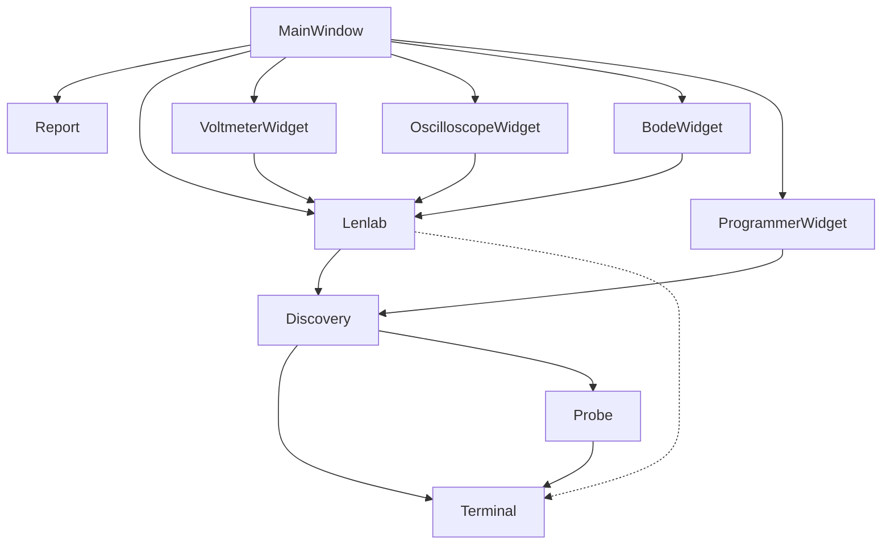

# Object structure

Lenlab (including Discovery) is the central singleton controller object. It may or may not have a connection to the firmware (a Terminal object).

Each Widget sends commands through the Lenlab object and receives replies from the Lenlab object. Errors also travel through the Lenlab object.

