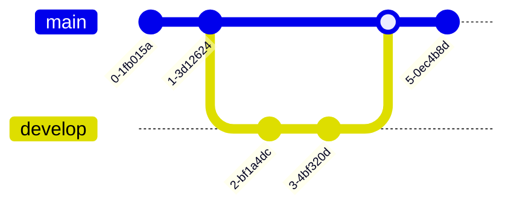

# MarkDeck

A lightweight markdown presentation tool

---

## What is MarkDeck?

MarkDeck is a simple, fast, and beautiful way to create presentations using Markdown.

- Write slides in plain text
- No complex software needed
- Focus on content, not formatting

---

## Getting Started

Create a markdown file with slides separated by `---`:

<table>
  <tr>
    <th>MarkDown</th>
    <th>Result</th>
  </tr>
  <tr>
    <td rowspan="2"></td>
    <td></td>
  </tr>
  <tr>
    <td></td>
  </tr>
</table>

---

## Key Features

- **Markdown-based**: Use familiar syntax
- **Fast**: Lightweight and responsive
- **Keyboard shortcuts**: Navigate with ease
- **Syntax highlighting**: Beautiful code blocks
- **Speaker notes**: Hidden notes for presenters

---

## Keyboard Navigation

| Key | Action |
|-----|--------|
| → / Space | Next slide |
| ← | Previous slide |
| Home | First slide |
| End | Last slide |
| F | Fullscreen |
| ? | Help |

---

## Speaker Notes

This slide demonstrates speaker notes functionality.

Speaker notes appear in the terminal where you run markdeck.

<!--NOTES:
These are speaker notes. They appear in the terminal where you run markdeck, not in the browser.

Use speaker notes to:
- Remember key points
- Add talking points
- Keep timing notes
- Store additional context
-->

---

## Images and Links

You can include images:


And links: [Visit MarkDeck on GitHub](https://github.com)

---

## Advanced Code Highlighting

Python with type hints:

```python
from typing import List, Optional

def process_data(items: List[str], limit: Optional[int] = None) -> dict:
    """Process a list of items and return statistics."""
    result = {
        'count': len(items),
        'items': items[:limit] if limit else items
    }
    return result
```

---

## More Language Support

Rust:

```rust
fn main() {
    let numbers = vec![1, 2, 3, 4, 5];
    let sum: i32 = numbers.iter().sum();
    println!("Sum: {}", sum);
}
```

SQL:

```sql
SELECT users.name, COUNT(orders.id) as order_count
FROM users
LEFT JOIN orders ON users.id = orders.user_id
GROUP BY users.id
HAVING order_count > 5;
```

---

## Complex Tables

| Feature | MarkDeck | PowerPoint | Google Slides |
|---------|-----------|------------|---------------|
| Markdown | ✓ | ✗ | ✗ |
| Version Control | ✓ | ✗ | ✗ |
| Lightweight | ✓ | ✗ | ✗ |
| Syntax Highlighting | ✓ | Limited | Limited |
| Free | ✓ | ✗ | ✓ |
| Open Source | ✓ | ✗ | ✗ |

---

## Text Formatting

You can use **bold**, *italic*, ***bold italic***, ~~strikethrough~~, and `inline code`.

You can also combine them: **bold with `code`** and *italic with `code`*.

---

## Block Quotes

> "Simplicity is the ultimate sophistication."
>
> — Leonardo da Vinci

> Multi-paragraph quotes work too.
>
> Just add a blank `>` line between paragraphs within the quote block.
>
> This is the third paragraph of this blockquote.

---

## Slide Delimiters

In MarkDeck, `---` is used to separate slides.

**Note**: The slide delimiter `---` must be on its own line with blank lines before and after.

Because of this, you cannot use `---` as a horizontal rule within a slide — it will always create a new slide instead.

---

## Lists with Nesting

Complex nested structure:

1. First level
   - Nested bullet
   - Another bullet
     - Even deeper
     - More depth
2. Back to first level
   1. Nested number
   2. Another number
3. Final item

---

## Math Equations

MarkDeck supports math equations using KaTeX:

**Inline math**: The famous equation $E = mc^2$ changed physics forever.

**Display math** (centered on its own line):

$$\int_{-\infty}^{\infty} e^{-x^2} dx = \sqrt{\pi}$$

**More examples**: $\sum_{i=1}^{n} i = \frac{n(n+1)}{2}$ and $\sqrt{a^2 + b^2}$

---

# Mermaid Diagrams

- FlowCharts
- Sequence Diagrams
- Class Diagrams
- Git Graphs
- Pie Charts
- State Diagrams

---

## Mermaid Flowchart Example


---

## Mermaid Sequence Diagram


---

## Mermaid Class Diagram


---

## Mermaid Git Graph



---

## Mermaid Pie Chart


---

## Mermaid State Diagram


---

## Two-Column Layout (Planned)

This is a planned feature for future releases.

You'll be able to split slides into columns:

- Left column content
- Right column content

---

## Performance

MarkDeck is designed to be:

- **Fast**: Minimal JavaScript, no heavy frameworks
- **Lightweight**: Small bundle size
- **Efficient**: Smooth navigation even with 100+ slides
- **Responsive**: Works on different screen sizes
- **Hot Reloads**: Use the `--watch` flag
- **Speaker Notes**: Check speaker notes in the terminal

---

## Customization Options

Future customization features:

- Custom themes
- Color schemes
- Font choices
- Transition effects
- Layout templates

---

## Use Cases

Perfect for:

- Technical presentations
- Code reviews
- Conference talks
- Teaching materials
- Documentation
- Lightning talks

---

## Open Source

MarkDeck is open source (MIT License).

Contributions welcome:
- Bug reports
- Feature requests
- Pull requests
- Documentation improvements

---

## Thank You!

Try MarkDeck for your next presentation.
