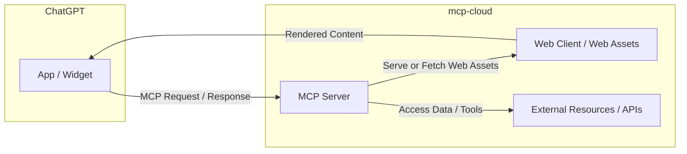

ChatGPT Apps enable interactive, context-aware experiences directly within ChatGPT conversations, letting users access tools and services without leaving the chat. Developers can build these apps using the new OpenAI Apps SDK, powered by the open Model Context Protocol (MCP), which connects ChatGPT to external APIs and data sources.  

**mcp-c** provides the infrastructure for deploying these apps — hosting MCP servers, managing web assets, and integrating them as actions or widgets within ChatGPT.  

Typical use cases include productivity tools, creative design assistants, educational aids, and service integrations. Building such apps involves combining a frontend (web assets), an MCP-compatible backend, and a simple deployment workflow through mcp-cloud.


## Architecture



ChatGPT Apps consist of two main parts — a **MCP Server** and a **Web Client**.
From the ChatGPT interface, the app connects directly to the MCP Server, which handles authentication and provides tools, prompts, and resources.

The MCP Server also serves the app’s UI — either by sending the HTML, JavaScript, and CSS directly, or by returning a URL to the Web Client that hosts these assets. Once loaded, the Web Client’s content is rendered back inside ChatGPT for the user to interact with.

## Application Design

The best ChatGPT apps are those that help people accomplish something **meaningful**. The experience is a combination of chat with a visual and interactive elements. Good use cases include ride booking, ordering food, or tracking a delivery. The hardest part is differentiating whether the experience is better suited as a Chat-based app or a Web app/Website.

The design principles mentioned by OpenAI:
* **Conversational**: Experiences should feel like a natural extension of ChatGPT, fitting seamlessly into the conversational flow and UI.
* **Intelligent**: Tools should be aware of conversation context, supporting and anticipating user intent. Responses and UI should feel individually relevant.
* **Simple**: Each interaction should focus on a single clear action or outcome. Information and UI should be reduced to the absolute minimum to support the context.
* **Responsive**: Tools should feel fast and lightweight, enhancing conversation rather than overwhelming it.
* **Accessible**: Designs must support a wide range of users, including those who rely on assistive technologies.

Our recommendation is to think through your application's user experience with it beginning through chat. 

For example, *"@your_app - what's the weather like?"*. 

Then, using conversation as the medium to navigate through your application. 

For example, *"@your_app - that's pretty cold. Give me a way to get uptown while minimizing my time outside in the cold"*. 

For more information about application design, check out [OpenAI's design guidelines](https://developers.openai.com/apps-sdk/concepts/design-guidelines).

## Recommended project structure

```
chatgpt-app/
├── main.py                    # MCP server (FastMCP or MCPApp)
├── web/                       # Front-end assets (React build)
│   ├── build/                 # React build (or dist) output
│   │   └── static/            # Built static resources (JS, CSS, etc.)
│   └── src/                   # Optional, your React source files
├── mcp_agent.config.yaml
└── requirements.txt
```

## 1. Build the app web assets

In the example project:

```bash
cd web
yarn install
yarn build          # Produces web/build/*
cd ..
```

[Example projects](https://github.com/lastmile-ai/mcp-agent/tree/main/examples/cloud/chatgpt_apps)

The server serves these assets via FastMCP resources. For initial iteration you can inline HTML/JS inside the MCP resource, but packaging static files yields better caching.

## 2. Define widget metadata

ChatGPT Apps understand OpenAI-specific tool annotations. This example widget uses:

```python
from dataclasses import dataclass
from fastmcp import FastMCP, EmbeddedResource

@dataclass
class CoinFlipWidget:
    template_uri: str
    html: str

    def to_tool_annotations(self) -> dict:
        return {
            "openai/outputTemplate": self.template_uri,
            "openai/toolInvocation/invoking": [
                {"type": "text", "text": "Flipping the coin…"}
            ],
            "openai/toolInvocation/invoked": [
                {"type": "text", "text": "Heads or tails?"}
            ],
            "openai/widgetAccessible": True,
            "openai/resultCanProduceWidget": True,
        }
```

When the tool returns an `EmbeddedResource`, ChatGPT hydrates the widget using the referenced HTML template.

## 3. Testing your app

Install the dependencies:

```bash
uv pip install -r requirements.txt
```

Spin up the mcp-agent server locally with SSE transport:
```bash
uv run main.py
```

This will:
* Start the MCP server on port 8000
* Serve the web client at http://127.0.0.1:8000
* Serve static assets (JS/CSS) at http://127.0.0.1:8000/static

Use [MCP Inspector](https://github.com/modelcontextprotocol/inspector) to explore and test the server:
```bash
npx @modelcontextprotocol/inspector --transport sse --server-url http://127.0.0.1:8000/sse
```

In MCP Inspector:
* Click **Tools > List Tools** to see the tools
* Click **Resources > List Resources** to see the widget HTML template
* Run the a tool to see the widget metadata and structured result

## 4. Deploy your app

ChatGPT apps can be deployed to **mcp-c**. 

```bash
uvx mcp-agent deploy your-chatgpt-app \
  --app-description "Your first chatgpt app" \
  --no-auth
```

## Next steps
- [ChatGPT Apps deployment →](/cloud/use-cases/deploy-chatgpt-apps)
- [OpenAI Apps SDK →](https://developers.openai.com/apps-sdk)
