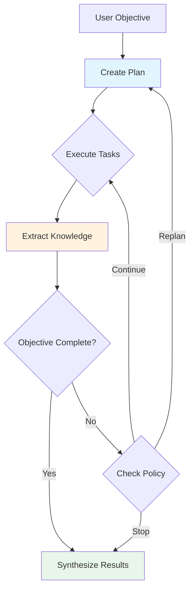
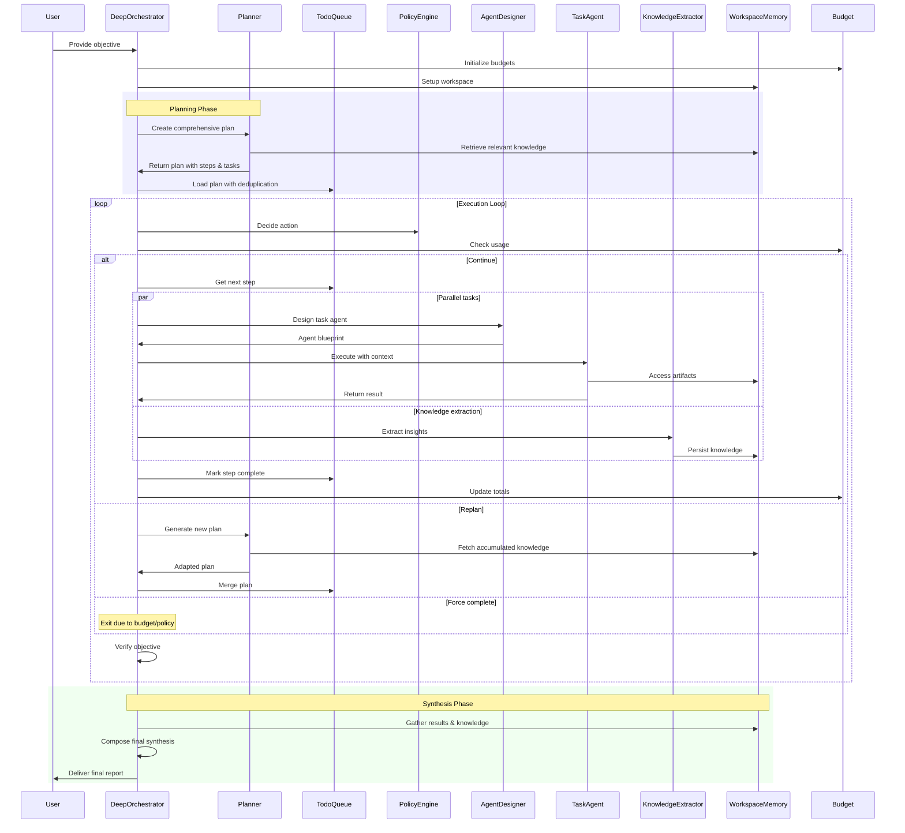

## When to use it

- Investigations span many steps or hours, and you need pause/resume without losing context.
- The system must collect structured knowledge, enforce policies, and keep working until an objective is genuinely satisfied.
- You want rich telemetry (plans, queue state, budgets, knowledge base) for dashboards or human reviews.
- You need to dynamically design specialist agents on the fly rather than predefining every worker.

`DeepOrchestrator` extends the standard orchestrator with durable execution, knowledge management, policy-driven replanning, and budget awareness—mirroring Anthropic’s “deep research” guidance.

## Capabilities at a glance

- **Comprehensive planning** – multiple planning passes, dependency tracking, and verification via [`PlanVerifier`](https://github.com/lastmile-ai/mcp-agent/blob/main/src/mcp_agent/workflows/deep_orchestrator/plan_verifier.py).
- **Knowledge extraction** – facts are stored in `WorkspaceMemory` as [`KnowledgeItem`](https://github.com/lastmile-ai/mcp-agent/blob/main/src/mcp_agent/workflows/deep_orchestrator/models.py#L28) objects with categories, confidences, and timestamps.
- **Policy engine** – [`PolicyEngine`](https://github.com/lastmile-ai/mcp-agent/blob/main/src/mcp_agent/workflows/deep_orchestrator/policy.py) decides when to continue, replan, force completion, or emergency stop based on verification plus budget thresholds.
- **Budgeting** – [`SimpleBudget`](https://github.com/lastmile-ai/mcp-agent/blob/main/src/mcp_agent/workflows/deep_orchestrator/budget.py) tracks tokens, cost, and elapsed time.
- **Agent factory & cache** – dynamically spins up agents tailored to a task and caches them for reuse.
- **Temporal-ready** – built to run on `execution_engine: temporal`, with queue state and knowledge stored so runs can pause, resume, or replay.



## Quick start

```python
from mcp_agent.app import MCPApp
from mcp_agent.workflows.factory import AgentSpec, create_deep_orchestrator
from mcp_agent.workflows.deep_orchestrator.config import DeepOrchestratorConfig

app = MCPApp(name="deep_research_example")

async def main():
    async with app.run() as running_app:
        config = DeepOrchestratorConfig.from_simple(
            name="MarketResearchOrchestrator",
            max_iterations=15,
            max_tokens=80_000,
            enable_parallel=True,
        ).with_strict_budget(max_tokens=60_000, max_cost=1.50, max_time_minutes=10)

        deep = create_deep_orchestrator(
            available_agents=[
                AgentSpec(
                    name="researcher",
                    instruction="Search primary sources and extract verifiable facts.",
                    server_names=["fetch"],
                ),
                AgentSpec(
                    name="writer",
                    instruction="Summarise findings in business-friendly language.",
                ),
            ],
            config=config,
            provider="openai",
            context=running_app.context,
        )

        answer = await deep.generate_str(
            "Produce a market overview of MCP tooling and cite your sources."
        )
        return answer
```

### What happens during a run

1. **Plan** – a comprehensive plan is generated and verified; the queue is populated with sequential steps and parallel tasks.
2. **Execute** – tasks are dispatched to existing or newly designed agents. Context is constructed via [`ContextBuilder`](https://github.com/lastmile-ai/mcp-agent/blob/main/src/mcp_agent/workflows/deep_orchestrator/context_builder.py) with relevance-based pruning.
3. **Extract & store knowledge** – each task outputs structured knowledge captured by [`KnowledgeExtractor`](https://github.com/lastmile-ai/mcp-agent/blob/main/src/mcp_agent/workflows/deep_orchestrator/knowledge.py).
4. **Verify & replan** – the policy engine evaluates progress. If confidence is low or the queue empties prematurely, it triggers replanning.
5. **Synthesis** – once the policy declares success (or the budget is exhausted), the orchestrator produces a final report with citations and knowledge summaries.

## Configuration surface

`DeepOrchestratorConfig` groups the knobs you need:

- **Execution** (`config.execution`): `max_iterations`, `max_replans`, `max_task_retries`, `enable_parallel`, `enable_filesystem`.
- **Context** (`config.context`): `task_context_budget`, relevance threshold, compression ratio, whether to propagate full context to every task.
- **Budget** (`config.budget`): token, cost, and time ceilings plus `cost_per_1k_tokens` for spend estimates.
- **Policy** (`config.policy`): maximum consecutive failures, budget warning thresholds, verification confidence requirements.
- **Cache** (`config.cache`): enable/size for the agent cache to avoid re-spawning similar agents.

Use helper methods like `with_strict_budget`, `with_resilient_execution`, and `with_minimal_context` to apply common presets.

## Inspecting progress

- `deep.queue.get_progress_summary()` – quick snapshot of pending/completed steps.
- `deep.memory.get_knowledge_summary(limit=10)` – retrieve the latest knowledge items for status dashboards.
- `await deep.get_token_node()` – drill into token/cost usage per planner iteration and worker task.
- The example dashboard (see screenshot above) listens to the orchestrator’s telemetry to display queue state, budgets, policy decisions, and knowledge categories in real time.

## Durability and human-in-the-loop

- Run with `execution_engine: temporal` to get durable execution, pause/resume, and audit logs. Temporal workers simply host your `MCPApp`; the orchestrator persists queue state, knowledge, and budgets across runs.
- Use the policy engine to hand off to humans: custom policies can emit `PolicyAction.FORCE_COMPLETE` to stop and request review, or `PolicyAction.REPLAN` after feedback.
- Knowledge and task artifacts are written to the filesystem workspace when `enable_filesystem=True`, making it straightforward to create attachments for reviewers.

## Example projects

- [workflow_deep_orchestrator](https://github.com/lastmile-ai/mcp-agent/tree/main/examples/workflows/workflow_deep_orchestrator) – end-to-end student essay grader with real-time dashboard, knowledge base, and policy enforcement.
- [Temporal deep orchestrator worker](https://github.com/lastmile-ai/mcp-agent/tree/main/examples/temporal) – shows how to deploy DeepOrchestrator on Temporal for durable operations.

## Related reading

- [Planner (Orchestrator) pattern](/mcp-agent-sdk/effective-patterns/planner)
- [Server authentication](/mcp-agent-sdk/mcp/server-authentication)
- [Temporal workflows guide](/mcp-agent-sdk/core-components/workflows#temporal)
