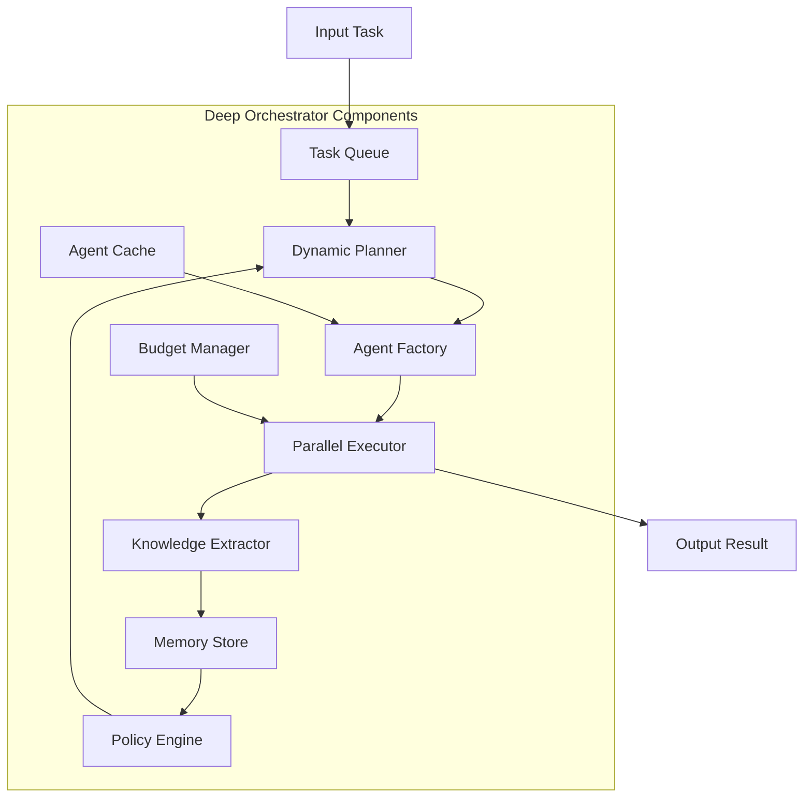

<Info>
  The Deep Orchestrator is an advanced workflow pattern that extends the standard orchestrator with persistent memory, dynamic agent creation, budget management, and adaptive replanning capabilities.
</Info>

## Overview

The Deep Orchestrator represents the cutting edge of agent orchestration, designed for complex tasks that require:
- **Exploration and Discovery**: When you can't predict all subtasks upfront
- **Knowledge Building**: Accumulating insights across multiple steps
- **Resource Constraints**: Managing token, cost, and time budgets
- **Adaptive Execution**: Replanning when objectives aren't met

<Frame caption="Deep Orchestrator Architecture">

</Frame>

## Key Features

<CardGroup cols={2}>
  <Card title="Dynamic Agent Creation" icon="wand-magic-sparkles">
    Automatically designs and spawns specialized agents for each task
  </Card>
  <Card title="Knowledge Accumulation" icon="brain">
    Extracts and reuses insights across the entire workflow
  </Card>
  <Card title="Adaptive Replanning" icon="arrows-rotate">
    Monitors progress and adjusts strategy when needed
  </Card>
  <Card title="Resource Management" icon="gauge">
    Tracks and enforces budgets for tokens, cost, and time
  </Card>
  <Card title="Parallel Execution" icon="bolt">
    Runs independent tasks concurrently for efficiency
  </Card>
  <Card title="Real-time Monitoring" icon="chart-line">
    Live dashboard showing progress and resource usage
  </Card>
</CardGroup>

## When to Use Deep Orchestrator

### Ideal Use Cases

- **Complex Research Tasks**: Multi-faceted investigations requiring exploration
- **Long-Running Workflows**: Tasks that may take hours or days
- **Unpredictable Workflows**: When you can't define all steps upfront
- **Knowledge-Intensive Tasks**: Building understanding across multiple domains
- **Resource-Constrained Environments**: When you need strict budget control

### Comparison with Standard Orchestrator

| Feature | Standard Orchestrator | Deep Orchestrator |
|---------|---------------------|-------------------|
| Planning | Fixed or simple iteration | Comprehensive + adaptive |
| Memory | In-context only | Persistent + knowledge extraction |
| Agents | Predefined only | Dynamic creation + caching |
| Execution | Single pass | Iterative until complete |
| Monitoring | Basic logging | Full state dashboard |
| Budget | None | Token/cost/time tracking |
| Replanning | Manual | Automatic based on policy |

## Implementation

### Basic Setup

<CodeGroup>
```python main.py
from mcp_agent.workflows.deep_orchestrator import DeepOrchestrator
from mcp_agent.workflows.llm.augmented_llm_openai import OpenAIAugmentedLLM

# Create Deep Orchestrator
orchestrator = DeepOrchestrator(
    llm_factory=OpenAIAugmentedLLM,
    max_iterations=25,          # Maximum workflow iterations
    max_replans=3,              # Maximum replanning attempts
    enable_filesystem=True,     # Enable persistent workspace
    enable_parallel=True,       # Enable parallel task execution
    max_task_retries=5,         # Retry failed tasks
    enable_dashboard=True,      # Show real-time monitoring
)

# Configure budget limits
orchestrator.budget.max_tokens = 100000
orchestrator.budget.max_cost = 1.00
orchestrator.budget.max_time_minutes = 10

# Run the orchestrator
result = await orchestrator.generate_str(
    "Analyze the company's Q3 financial report and create a comprehensive executive summary"
)
```

```yaml Configuration
# Deep Orchestrator specific settings
deep_orchestrator:
  # Planning configuration
  planner:
    model: "gpt-4o"  # Use best model for planning
    temperature: 0.7
    max_steps_per_plan: 10
    
  # Knowledge extraction
  knowledge:
    enabled: true
    max_items: 100
    categories:
      - insights
      - errors
      - patterns
      - recommendations
  
  # Agent factory settings
  agent_factory:
    cache_size: 20
    reuse_threshold: 0.8  # Similarity threshold for reuse
    
  # Parallel execution
  parallel:
    max_concurrent: 5
    timeout_seconds: 300
```
</CodeGroup>

### Advanced Configuration

```python
from mcp_agent.workflows.deep_orchestrator import (
    DeepOrchestrator,
    DeepOrchestratorConfig,
    BudgetConfig,
    PolicyConfig,
)

# Advanced configuration
config = DeepOrchestratorConfig(
    # Planning settings
    enable_comprehensive_planning=True,
    planning_temperature=0.7,
    max_planning_tokens=4000,
    
    # Execution settings
    enable_parallel=True,
    max_parallel_tasks=5,
    task_timeout_seconds=300,
    
    # Memory settings
    enable_memory=True,
    memory_window_size=50,
    knowledge_extraction_enabled=True,
    
    # Agent management
    enable_agent_cache=True,
    agent_cache_size=20,
    agent_reuse_threshold=0.8,
)

# Budget configuration
budget = BudgetConfig(
    max_tokens=100000,
    max_cost=2.00,
    max_time_minutes=15,
    enforce_hard_limits=True,
    warning_threshold=0.8,  # Warn at 80% usage
)

# Policy configuration
policy = PolicyConfig(
    max_consecutive_failures=3,
    replan_on_failure=True,
    replan_on_stagnation=True,
    stagnation_threshold=5,  # Iterations without progress
    allow_partial_completion=True,
)

# Create orchestrator with full config
orchestrator = DeepOrchestrator(
    config=config,
    budget=budget,
    policy=policy,
    llm_factory=OpenAIAugmentedLLM,
)
```

## Core Components

### Task Queue System

The task queue manages workflow execution:

```python
class TaskQueue:
    def __init__(self):
        self.pending: List[Task] = []
        self.in_progress: Dict[str, Task] = {}
        self.completed: List[Task] = []
        self.failed: List[Task] = []
    
    async def get_next_batch(self) -> List[Task]:
        """Get next batch of tasks for parallel execution"""
        # Group independent tasks
        batch = []
        for task in self.pending:
            if not self.has_dependencies(task):
                batch.append(task)
        return batch
```

### Dynamic Agent Factory

Creates specialized agents on-demand:

```python
class AgentFactory:
    async def create_agent(self, task: Task) -> Agent:
        """Dynamically create an agent for a specific task"""
        # Analyze task requirements
        requirements = await self.analyze_requirements(task)
        
        # Check cache for similar agent
        cached = self.cache.find_similar(requirements)
        if cached and cached.similarity > self.reuse_threshold:
            return cached.agent
        
        # Create new specialized agent
        agent = Agent(
            name=f"agent_{task.type}_{task.id}",
            instruction=self.generate_instruction(task, requirements),
            server_names=requirements.required_servers,
        )
        
        # Cache for reuse
        self.cache.add(requirements, agent)
        return agent
```

### Knowledge Extraction

Extracts and categorizes insights:

```python
class KnowledgeExtractor:
    async def extract(self, task_result: TaskResult) -> List[KnowledgeItem]:
        """Extract knowledge from task results"""
        items = []
        
        # Extract different types of knowledge
        insights = await self.extract_insights(task_result)
        patterns = await self.extract_patterns(task_result)
        errors = await self.extract_errors(task_result)
        
        # Categorize and store
        for insight in insights:
            items.append(KnowledgeItem(
                category="insight",
                content=insight,
                source=task_result.task_id,
                confidence=insight.confidence,
            ))
        
        return items
```

### Adaptive Replanning

Monitors and adjusts execution strategy:

```python
class AdaptivePlanner:
    async def should_replan(self, state: OrchestratorState) -> bool:
        """Determine if replanning is needed"""
        # Check failure rate
        if state.consecutive_failures > self.max_failures:
            return True
        
        # Check stagnation
        if state.iterations_without_progress > self.stagnation_threshold:
            return True
        
        # Check objective completion
        if not state.objectives_met and state.can_replan:
            return True
        
        return False
    
    async def replan(self, state: OrchestratorState) -> Plan:
        """Generate new plan based on current state"""
        # Incorporate learned knowledge
        context = self.build_context(
            original_task=state.original_task,
            completed_tasks=state.completed_tasks,
            failed_tasks=state.failed_tasks,
            knowledge=state.knowledge_base,
        )
        
        # Generate adaptive plan
        new_plan = await self.planner.generate_plan(
            context=context,
            avoid_failed_approaches=True,
            incorporate_learnings=True,
        )
        
        return new_plan
```

## Dashboard Monitoring

The Deep Orchestrator provides real-time monitoring:

{/* Screenshots from examples/workflows/workflow_deep_orchestrator/README.md */}


<Frame caption="Deep Orchestrator Dashboard">
```
╭─────────────────────────────────────────────────────────────╮
│ 🧠 Deep Orchestrator Dashboard                              │
├─────────────────────────────────────────────────────────────┤
│ Task Queue                                                  │
│ ├─ ✓ Completed: 12                                         │
│ ├─ ⟳ In Progress: 3                                        │
│ └─ ⧖ Pending: 5                                            │
│                                                             │
│ Current Plan                                                │
│ ├─ [✓] 1. Load and parse financial data                    │
│ ├─ [✓] 2. Calculate key metrics                            │
│ ├─ [⟳] 3. Analyze trends                                   │
│ ├─ [⟳] 4. Compare with previous quarters                   │
│ └─ [ ] 5. Generate executive summary                       │
│                                                             │
│ Knowledge Base (15 items)                                  │
│ ├─ 💡 Revenue increased 23% YoY                            │
│ ├─ 📊 Operating margin improved to 18.5%                   │
│ └─ ⚠️ Customer acquisition cost rising                     │
│                                                             │
│ Budget Usage                                                │
│ ├─ Tokens: 45,231 / 100,000 (45%)                         │
│ ├─ Cost: $0.67 / $1.00 (67%)                              │
│ └─ Time: 4:32 / 10:00 (45%)                               │
│                                                             │
│ Agent Cache                                                 │
│ ├─ Cached: 8 agents                                        │
│ ├─ Reuse Rate: 72%                                         │
│ └─ Cache Hits: 18                                          │
╰─────────────────────────────────────────────────────────────╯
```
</Frame>

## Example: Document Analysis Pipeline

Here's a complete example of using Deep Orchestrator for complex document analysis:

```python
import asyncio
from mcp_agent.app import MCPApp
from mcp_agent.workflows.deep_orchestrator import DeepOrchestrator

app = MCPApp(name="document_analyzer")

async def analyze_documents():
    async with app.run():
        # Configure Deep Orchestrator
        orchestrator = DeepOrchestrator(
            llm_factory=OpenAIAugmentedLLM,
            max_iterations=30,
            max_replans=3,
            enable_filesystem=True,
            enable_parallel=True,
        )
        
        # Set budget
        orchestrator.budget.max_tokens = 150000
        orchestrator.budget.max_cost = 2.50
        orchestrator.budget.max_time_minutes = 20
        
        # Complex analysis task
        task = """
        Analyze all PDF documents in the /documents folder:
        1. Extract key information from each document
        2. Identify common themes and patterns
        3. Find contradictions or inconsistencies
        4. Create a relationship map between documents
        5. Generate a comprehensive report with citations
        6. Provide actionable recommendations
        """
        
        # Run with monitoring
        result = await orchestrator.generate_str(
            task,
            stream_dashboard=True,  # Show live dashboard
        )
        
        # Display results
        print("\n" + "="*50)
        print("ANALYSIS COMPLETE")
        print("="*50)
        print(f"\nResult:\n{result}")
        
        # Show extracted knowledge
        print("\n" + "="*50)
        print("EXTRACTED KNOWLEDGE")
        print("="*50)
        for item in orchestrator.knowledge_base:
            print(f"[{item.category}] {item.content}")
        
        # Show statistics
        print("\n" + "="*50)
        print("EXECUTION STATISTICS")
        print("="*50)
        print(f"Total iterations: {orchestrator.stats.iterations}")
        print(f"Tasks completed: {orchestrator.stats.tasks_completed}")
        print(f"Tasks failed: {orchestrator.stats.tasks_failed}")
        print(f"Replanning count: {orchestrator.stats.replan_count}")
        print(f"Tokens used: {orchestrator.budget.tokens_used}")
        print(f"Cost: ${orchestrator.budget.cost_used:.2f}")
        print(f"Time: {orchestrator.budget.time_used_minutes:.1f} minutes")

if __name__ == "__main__":
    asyncio.run(analyze_documents())
```

## Best Practices

<AccordionGroup>
  <Accordion title="Set Appropriate Budgets">
    Always set realistic budgets based on task complexity:
    ```python
    # For simple tasks
    orchestrator.budget.max_tokens = 50000
    orchestrator.budget.max_cost = 0.50
    
    # For complex research
    orchestrator.budget.max_tokens = 500000
    orchestrator.budget.max_cost = 10.00
    ```
  </Accordion>
  
  <Accordion title="Enable Monitoring for Long Tasks">
    Use the dashboard for tasks over 5 minutes:
    ```python
    result = await orchestrator.generate_str(
        task,
        stream_dashboard=True,
        dashboard_update_interval=2.0,  # Update every 2 seconds
    )
    ```
  </Accordion>
  
  <Accordion title="Configure Knowledge Categories">
    Customize knowledge extraction for your domain:
    ```python
    orchestrator.knowledge_extractor.categories = [
        "technical_specs",
        "business_insights",
        "risk_factors",
        "opportunities",
    ]
    ```
  </Accordion>
  
  <Accordion title="Use Agent Caching">
    Enable caching for repetitive tasks:
    ```python
    orchestrator.agent_factory.enable_cache = True
    orchestrator.agent_factory.cache_size = 50
    orchestrator.agent_factory.reuse_threshold = 0.7
    ```
  </Accordion>
  
  <Accordion title="Handle Partial Results">
    Configure policy for incomplete execution:
    ```python
    orchestrator.policy.allow_partial_completion = True
    orchestrator.policy.min_completion_percentage = 0.8
    ```
  </Accordion>
</AccordionGroup>

## Performance Tuning

### Parallel Execution

Optimize parallel task execution:

```python
orchestrator.parallel_config = ParallelConfig(
    max_concurrent_tasks=10,
    batch_size=5,
    task_timeout_seconds=120,
    retry_failed_tasks=True,
    retry_delay_seconds=5,
)
```

### Memory Management

Control memory usage:

```python
orchestrator.memory_config = MemoryConfig(
    max_memory_items=100,
    memory_compression=True,
    memory_summarization_threshold=50,
    use_vector_store=True,  # For similarity search
)
```

### Planning Optimization

Fine-tune the planning process:

```python
orchestrator.planning_config = PlanningConfig(
    planning_model="gpt-4o",  # Use best model
    planning_temperature=0.5,  # More focused plans
    max_steps_per_plan=15,
    decomposition_depth=3,  # How deep to break down tasks
    use_examples=True,  # Learn from previous plans
)
```

## Setup and Installation

Clone the repository and navigate to the deep orchestrator example:

```bash
git clone https://github.com/lastmile-ai/mcp-agent.git
cd mcp-agent/examples/workflows/workflow_deep_orchestrator
```

Install dependencies:

```bash
pip install uv
uv sync
uv pip install -r requirements.txt
```

Configure your environment:

```bash
cp mcp_agent.secrets.yaml.example mcp_agent.secrets.yaml
```

Add your API keys to `mcp_agent.secrets.yaml`:

```yaml
openai_api_key: "your-openai-api-key"
anthropic_api_key: "your-anthropic-api-key"  # optional
```

Create a sample story for the grading example:

```bash
echo "The sun was shining brightly as Sarah walked to school. She was excited about presenting her science project on renewable energy. Her teacher, Mr. Johnson, had been very supportive throughout the process." > short_story.md
```

Run the Deep Orchestrator example:

```bash
uv run main.py
```

The example will show a real-time dashboard and produce a comprehensive grading report with detailed analysis and feedback.

## Troubleshooting

<AccordionGroup>
  <Accordion title="Orchestrator Stuck in Planning">
    Reduce planning complexity:
    ```python
    orchestrator.max_planning_iterations = 3
    orchestrator.planning_timeout_seconds = 60
    ```
  </Accordion>
  
  <Accordion title="High Token Usage">
    Enable token optimization:
    ```python
    orchestrator.enable_token_optimization = True
    orchestrator.summarize_long_context = True
    orchestrator.max_context_tokens = 8000
    ```
  </Accordion>
  
  <Accordion title="Tasks Failing Repeatedly">
    Adjust retry and failure policies:
    ```python
    orchestrator.max_task_retries = 3
    orchestrator.policy.skip_on_repeated_failure = True
    orchestrator.policy.fallback_to_simple_approach = True
    ```
  </Accordion>
</AccordionGroup>

## Next Steps

<CardGroup cols={2}>
  <Card title="View Example" icon="code" href="https://github.com/lastmile-ai/mcp-agent/tree/main/examples/workflows/workflow_deep_orchestrator">
    Complete Deep Orchestrator example
  </Card>
  <Card title="Standard Orchestrator" icon="diagram-project" href="/workflows/orchestrator">
    Compare with standard orchestrator
  </Card>
  <Card title="Workflow Patterns" icon="pattern" href="/workflows/overview">
    Explore other workflow patterns
  </Card>
  <Card title="Cloud Deployment" icon="cloud" href="/cloud/deployment-quickstart">
    Deploy orchestrators to the cloud
  </Card>
</CardGroup>
