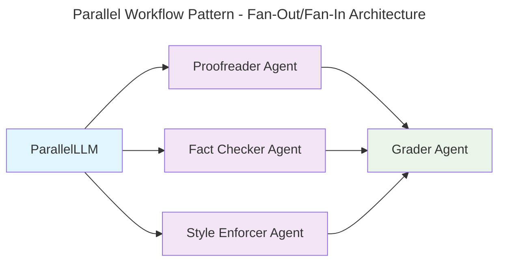

{/* TODO: Add ASCII diagram from examples/workflows/workflow_parallel/README.md */}


## Overview

The Parallel Workflow pattern uses a fan-out/fan-in approach where multiple agents work on different aspects of a task simultaneously, then a coordinating agent aggregates their results.

## Complete Implementation

The Parallel workflow is ideal for tasks requiring multiple specialized perspectives simultaneously. Here's a complete example using a student assignment grader:

### Basic Setup

```python
import asyncio
from mcp_agent.app import MCPApp
from mcp_agent.agents.agent import Agent
from mcp_agent.workflows.llm.augmented_llm_openai import OpenAIAugmentedLLM
from mcp_agent.workflows.parallel.parallel_llm import ParallelLLM

app = MCPApp(name="parallel_grader")

async def run_parallel_grading():
    async with app.run() as context:
        # Create specialized agents for different evaluation criteria
        proofreader = Agent(
            name="proofreader",
            instruction="""Review the short story for grammar, spelling, and punctuation errors.
            Identify any awkward phrasing or structural issues that could improve clarity. 
            Provide detailed feedback on corrections."""
        )

        fact_checker = Agent(
            name="fact_checker",
            instruction="""Verify the factual consistency within the story. Identify any contradictions,
            logical inconsistencies, or inaccuracies in the plot, character actions, or setting. 
            Highlight potential issues with reasoning or coherence."""
        )

        style_enforcer = Agent(
            name="style_enforcer",
            instruction="""Analyze the story for adherence to style guidelines but first fetch APA style guides from
            at https://owl.purdue.edu/owl/research_and_citation/apa_style/apa_formatting_and_style_guide/general_format.html.
            Evaluate the narrative flow, clarity of expression, and tone. Suggest improvements to 
            enhance storytelling, readability, and engagement.""",
            server_names=["fetch"]  # Access to web fetch for style guidelines
        )

        # Aggregator agent to compile all feedback
        grader = Agent(
            name="grader",
            instruction="""Compile the feedback from the Proofreader, Fact Checker, and Style Enforcer
            into a structured report. Summarize key issues and categorize them by type. 
            Provide actionable recommendations for improving the story, 
            and give an overall grade based on the feedback."""
        )

        # Create parallel workflow
        parallel = ParallelLLM(
            fan_in_agent=grader,
            fan_out_agents=[proofreader, fact_checker, style_enforcer],
            llm_factory=OpenAIAugmentedLLM,
        )

        # Sample story for grading
        story = """
        The Battle of Glimmerwood
        
        In the heart of Glimmerwood, a mystical forest knowed for its radiant trees, a small village thrived. 
        The villagers, who were live peacefully, shared their home with the forest's magical creatures, 
        especially the Glimmerfoxes whose fur shimmer like moonlight.
        
        One fateful evening, the peace was shaterred when the infamous Dark Marauders attack. 
        Lead by the cunning Captain Thorn, the bandits aim to steal the precious Glimmerstones which was believed to grant immortality.
        """

        # Execute parallel grading
        result = await parallel.generate_str(
            message=f"Grade this student's short story submission: {story}"
        )
        
        return result

if __name__ == "__main__":
    result = asyncio.run(run_parallel_grading())
    print(result)
```

### Configuration Options

You can customize the parallel workflow behavior:

```python
# Advanced configuration
parallel = ParallelLLM(
    fan_in_agent=grader,
    fan_out_agents=[proofreader, fact_checker, style_enforcer],
    llm_factory=OpenAIAugmentedLLM,
    max_concurrent_tasks=3,  # Control concurrency
    timeout_seconds=300,     # Task timeout
    retry_failed_tasks=True, # Retry on failure
)

# Execute with custom parameters
from mcp_agent.workflows.llm.augmented_llm import RequestParams

result = await parallel.generate_str(
    message="Grade this assignment",
    request_params=RequestParams(
        model="gpt-4o",
        temperature=0.3,
        max_tokens=2000
    )
)
```

## Key Features

- **Fan-Out Processing**: Distribute work across multiple specialized agents
- **Fan-In Aggregation**: Intelligent result compilation and synthesis
- **Concurrent Execution**: All fan-out agents work simultaneously
- **Specialized Roles**: Each agent focuses on specific expertise areas
- **Structured Output**: Coordinated final result from aggregator agent

## Use Cases

### Content Review and Grading
Perfect for academic or content evaluation where multiple criteria need simultaneous assessment:
- Grammar and style checking
- Factual accuracy verification
- Compliance with guidelines
- Technical quality assessment

### Multi-Domain Analysis
Analyze complex topics from different expert perspectives:
- Financial reports (risk, compliance, performance analysis)
- Legal documents (regulatory, contractual, liability review)
- Medical cases (diagnosis, treatment, side effects)
- Technical specifications (security, performance, usability)

### Quality Assurance
Parallel validation across different testing criteria:
- Code review (security, performance, maintainability)
- Product testing (functionality, UI/UX, accessibility)
- Data validation (accuracy, completeness, consistency)

### Research and Information Gathering
Simultaneous information collection from specialized sources:
- Market research (competitor analysis, trend analysis, customer feedback)
- Literature review (multiple databases, different methodologies)
- Due diligence (financial, legal, technical assessments)

## Setup and Installation

Clone the repository and navigate to the parallel workflow example:

```bash
git clone https://github.com/lastmile-ai/mcp-agent.git
cd mcp-agent/examples/workflows/workflow_parallel
```

Install dependencies:

```bash
pip install uv
uv sync
uv pip install -r requirements.txt
```

Configure your environment:

```bash
cp mcp_agent.secrets.yaml.example mcp_agent.secrets.yaml
```

Add your API keys to `mcp_agent.secrets.yaml`:

```yaml
openai_api_key: "your-openai-api-key"
anthropic_api_key: "your-anthropic-api-key"  # optional
```

Run the example:

```bash
uv run main.py
```

<Card
  title="Full Implementation"
  href="https://github.com/lastmile-ai/mcp-agent/tree/main/examples/workflows/workflow_parallel"
>
  See the complete parallel workflow example with student assignment grading use
  case.
</Card>
