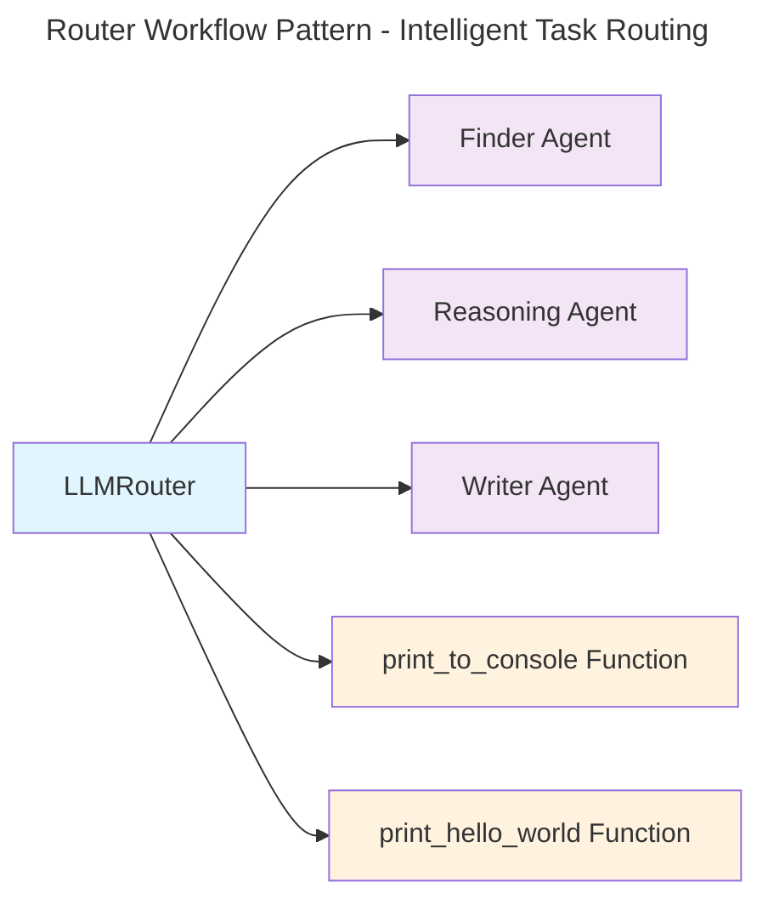

## Overview

The Router Pattern intelligently analyzes incoming requests and routes them to the most appropriate handler from three categories: MCP servers, specialized agents, or individual functions.

## Complete Implementation

The Router pattern intelligently routes requests to the most appropriate handler based on natural language analysis. Here's a comprehensive implementation:

### Basic Router Setup

```python
import asyncio
import os
from mcp_agent.app import MCPApp
from mcp_agent.agents.agent import Agent
from mcp_agent.workflows.router.router_llm_openai import OpenAILLMRouter
from mcp_agent.workflows.router.router_llm_anthropic import AnthropicLLMRouter

app = MCPApp(name="intelligent_router")

def print_to_console(message: str):
    """A simple function that prints a message to the console."""
    print(f"[CONSOLE] {message}")

def print_hello_world():
    """A simple function that prints 'Hello, world!' to the console."""
    print_to_console("Hello, world!")

async def run_router_example():
    async with app.run() as context:
        # Add current directory to filesystem server
        context.config.mcp.servers["filesystem"].args.extend([os.getcwd()])

        # Create specialized agents for different capabilities
        finder_agent = Agent(
            name="finder",
            instruction="""You are an agent with access to the filesystem and web fetching capabilities. 
            Your job is to identify the closest match to a user's request, make the appropriate tool calls, 
            and return the URI and CONTENTS of the closest match.""",
            server_names=["fetch", "filesystem"]
        )

        writer_agent = Agent(
            name="writer",
            instruction="""You are an agent that can write to the filesystem.
            You are tasked with taking the user's input, addressing it, and 
            writing the result to disk in the appropriate location.""",
            server_names=["filesystem"]
        )

        reasoning_agent = Agent(
            name="reasoner",
            instruction="""You are a generalist with knowledge about a vast
            breadth of subjects. You are tasked with analyzing and reasoning over
            the user's query and providing a thoughtful response.""",
            server_names=[]
        )

        # Create router with multiple routing options
        router = OpenAILLMRouter(
            name="intelligent-router",
            agents=[finder_agent, writer_agent, reasoning_agent],
            functions=[print_to_console, print_hello_world]
        )

        # Example 1: Route to agent
        print("=== Routing to Agent ===")
        results = await router.route_to_agent(
            request="Print the contents of mcp_agent.config.yaml verbatim",
            top_k=1
        )
        
        selected_agent = results[0].result
        print(f"Routed to: {selected_agent.name}")
        print(f"Confidence: {results[0].confidence}")
        print(f"Reasoning: {results[0].reasoning}")

        # Use the selected agent
        async with selected_agent:
            result = await selected_agent.call_tool(
                name="read_file",
                arguments={"path": os.path.join(os.getcwd(), "mcp_agent.config.yaml")}
            )
            print("File content preview:", result.content[:200] + "...")

        # Example 2: Route to function
        print("\n=== Routing to Function ===")
        results = await router.route_to_function(
            request="Print 'Hello world' to console",
            top_k=1
        )
        
        selected_function = results[0].result
        print(f"Routed to function: {selected_function.__name__}")
        selected_function()

        # Example 3: Route across all categories
        print("\n=== Universal Routing ===")
        results = await router.route(
            request="Analyze the configuration file structure",
            top_k=3
        )
        
        for i, result in enumerate(results, 1):
            print(f"{i}. {result.category}: {result.name} (confidence: {result.confidence:.2f})")
            print(f"   Reasoning: {result.reasoning}")

        return router

if __name__ == "__main__":
    asyncio.run(run_router_example())
```

### Advanced Routing Patterns

#### Multi-Provider Support

```python
# Use Anthropic models for routing decisions
anthropic_router = AnthropicLLMRouter(
    name="anthropic-router",
    server_names=["fetch", "filesystem"],
    agents=[finder_agent, writer_agent, reasoning_agent],
    functions=[print_to_console, print_hello_world]
)

# Route with detailed analysis
results = await anthropic_router.route(
    request="Create a report about the latest AI developments",
    top_k=2
)
```

#### Confidence-Based Decision Making

```python
async def smart_routing_with_fallback(router, request: str):
    """Route with confidence-based fallback logic"""
    results = await router.route(request=request, top_k=3)
    
    # Use high-confidence results
    high_confidence = [r for r in results if r.confidence > 0.8]
    if high_confidence:
        return high_confidence[0]
    
    # Fallback to reasoning agent for ambiguous requests
    reasoning_results = await router.route_to_agent(
        request=f"Analyze and respond to: {request}",
        top_k=1
    )
    return reasoning_results[0]

# Example usage
result = await smart_routing_with_fallback(
    router, 
    "What's the weather like in San Francisco?"
)
```

#### Custom Routing Logic

```python
from mcp_agent.workflows.router.base import BaseRouter

class CustomDomainRouter(BaseRouter):
    def __init__(self, domain_agents: dict, **kwargs):
        super().__init__(**kwargs)
        self.domain_agents = domain_agents
    
    async def route_by_domain(self, request: str, domain: str):
        """Route based on predefined domain mapping"""
        if domain in self.domain_agents:
            agent = self.domain_agents[domain]
            return await self._execute_with_agent(agent, request)
        else:
            # Fallback to intelligent routing
            return await self.route(request, top_k=1)

# Usage
domain_router = CustomDomainRouter(
    domain_agents={
        "finance": finance_agent,
        "technical": tech_agent,
        "customer_service": support_agent
    }
)
```

## Key Features

- **Multi-Category Routing**: Routes between MCP servers, agents, and functions
- **Confidence Scoring**: Returns confidence levels with reasoning
- **Top-K Results**: Multiple routing candidates ranked by relevance
- **LLM-Powered**: Uses natural language understanding for routing decisions
- **Provider Agnostic**: Works with OpenAI, Anthropic, and other LLM providers

## Use Cases

### Customer Service Systems
Intelligently route customer inquiries to appropriate specialists:
- **General Inquiries**: Basic questions to general support agent
- **Technical Issues**: Complex technical problems to specialized tech support
- **Billing/Refunds**: Financial matters to billing department
- **Sales Inquiries**: Product questions to sales representatives

### Content Management and Analysis
Direct content-related requests to domain experts:
- **Technical Documentation**: Route to technical writers
- **Marketing Content**: Direct to marketing specialists  
- **Legal Content**: Route to legal compliance reviewers
- **Data Analysis**: Send to analytics specialists

### Development and Operations
Route development tasks to appropriate systems:
- **Code Reviews**: Direct to security, performance, or maintainability experts
- **Deployment**: Route to staging, production, or testing environments
- **Monitoring**: Send alerts to on-call engineers or specific team channels
- **Documentation**: Route to appropriate documentation systems

### Model and Resource Optimization
Optimize costs and performance through intelligent routing:
- **Simple Queries**: Route to faster, cheaper models
- **Complex Analysis**: Direct to more powerful, expensive models
- **Specialized Domains**: Route to domain-specific fine-tuned models
- **Load Balancing**: Distribute requests across multiple endpoints

## Setup and Installation

Clone the repository and navigate to the router workflow example:

```bash
git clone https://github.com/lastmile-ai/mcp-agent.git
cd mcp-agent/examples/workflows/workflow_router
```

Install dependencies:

```bash
pip install uv
uv sync
uv pip install -r requirements.txt
```

Configure your environment:

```bash
cp mcp_agent.secrets.yaml.example mcp_agent.secrets.yaml
```

Add your API keys to `mcp_agent.secrets.yaml`:

```yaml
openai_api_key: "your-openai-api-key"
anthropic_api_key: "your-anthropic-api-key"  # optional
```

Enable optional tracing in `mcp_agent.config.yaml`:

```yaml
otel:
  enabled: true  # Enable OpenTelemetry tracing
```

Run the example:

```bash
uv run main.py
```

## Configuration Examples

### MCP Server Configuration

Configure server descriptions to help routing decisions:

```yaml
# mcp_agent.config.yaml
mcp:
  servers:
    fetch:
      command: "uvx"
      args: ["mcp-server-fetch"]
      description: "Fetch content from URLs and web pages"
    
    filesystem:
      command: "npx"
      args: ["-y", "@modelcontextprotocol/server-filesystem"]
      description: "Read and write files on the local filesystem"
    
    database:
      command: "python"
      args: ["-m", "mcp_server_database"]
      description: "Query and update database records"
```

### Router Configuration

```python
# Advanced router configuration
router = OpenAILLMRouter(
    name="production-router",
    agents=agents,
    functions=functions,
    server_names=["fetch", "filesystem", "database"],
    
    # Routing parameters
    default_top_k=3,
    confidence_threshold=0.7,
    
    # LLM parameters for routing decisions
    routing_model="gpt-4o-mini",  # Use fast model for routing
    routing_temperature=0.1,      # Low temperature for consistent routing
    
    # Enable detailed reasoning in routing decisions
    include_reasoning=True,
)
```

<Card
  title="Full Implementation"
  href="https://github.com/lastmile-ai/mcp-agent/tree/main/examples/workflows/workflow_router"
>
  See complete router examples with specialized agents and routing logic.
</Card>
