# mcp-bigquery

<div align="center">


**Safe BigQuery exploration through Model Context Protocol**

[](LICENSE)
[](https://pypi.org/project/mcp-bigquery/)
[](https://pypi.org/project/mcp-bigquery/)
[](https://pypi.org/project/mcp-bigquery/)

[**Documentation**](https://caron14.github.io/mcp-bigquery/) | 
[**Quick Start**](#-quick-start-4-minutes) | 
[**Tools**](#-available-tools) | 
[**Examples**](#-real-world-examples)

</div>

---

## 📌 What is this?

**mcp-bigquery** is an MCP (Model Context Protocol) server that enables AI assistants like Claude to **safely** interact with Google BigQuery.

### 🎯 Key Features

```mermaid
graph LR
    A[AI Assistant] -->|MCP Protocol| B[mcp-bigquery]
    B -->|Dry-run Only| C[BigQuery API]
    B -.->|❌ Never Executes| D[Actual Query Execution]
```



- **🛡️ 100% Safe**: All operations are dry-run only (never executes queries)
- **💰 Cost Transparency**: See costs before running any query
- **🔍 Complete Analysis**: Analyze SQL structure, dependencies, and performance
- **📊 Schema Explorer**: Browse datasets, tables, and columns with ease

### ⚡ Why use mcp-bigquery?

| Problem | Solution with mcp-bigquery |
|---------|---------------------------|
| 💸 Accidentally running expensive queries | Check costs before execution |
| 🐛 Wasting time on SQL errors | Detect syntax errors before running |
| 🗺️ Unknown table structures | Easily explore schemas |
| ⚠️ AI executing dangerous operations | Everything is read-only and safe |

## 🚀 Quick Start (4 minutes)

### Step 1: Install (1 minute)

```bash
pip install mcp-bigquery
```

### Step 2: Authenticate with Google Cloud (2 minutes)

```bash
# For personal accounts
gcloud auth application-default login

# For service accounts
export GOOGLE_APPLICATION_CREDENTIALS=/path/to/key.json
```

### Step 3: Configure Claude Desktop (1 minute)

Open your Claude Desktop config:
- **Mac**: `~/Library/Application Support/Claude/claude_desktop_config.json`
- **Windows**: `%APPDATA%\Claude\claude_desktop_config.json`

Add this configuration:

```json
{
  "mcpServers": {
    "mcp-bigquery": {
      "command": "mcp-bigquery",
      "env": {
        "BQ_PROJECT": "your-gcp-project-id"  // ← Replace with your project ID
      }
    }
  }
}
```

### Step 4: Test It!

Restart Claude Desktop and try these questions:

```
"What datasets are available in my BigQuery project?"
"Can you estimate the cost of: SELECT * FROM dataset.table"
"Show me the schema for the users table"
```

## 🛠️ Available Tools

### 📝 SQL Validation & Analysis

| Tool | Purpose | When to Use |
|------|---------|-------------|
| **bq_validate_sql** | Check SQL syntax | Before running any query |
| **bq_dry_run_sql** | Get cost estimates & metadata | 💰 To check costs |
| **bq_analyze_query_structure** | Analyze query complexity | To improve performance |
| **bq_extract_dependencies** | Extract table dependencies | To understand data lineage |
| **bq_validate_query_syntax** | Detailed error analysis | To debug SQL errors |

### 🔍 Schema Discovery

| Tool | Purpose | When to Use |
|------|---------|-------------|
| **bq_list_datasets** | List all datasets | To explore your project |
| **bq_list_tables** | List tables with partitioning info | To browse a dataset |
| **bq_describe_table** | Get detailed table schema | To understand columns |
| **bq_get_table_info** | Complete table metadata | To get statistics |
| **bq_query_info_schema** | Query INFORMATION_SCHEMA | For advanced metadata queries |

### ⚡ Performance Optimization

| Tool | Purpose | When to Use |
|------|---------|-------------|
| **bq_analyze_query_performance** | Analyze performance | To optimize queries |

## 💡 Real-World Examples

### Example 1: Check Costs Before Running

```python
# Before running an expensive query...
query = "SELECT * FROM `bigquery-public-data.github_repos.commits`"

# First, check the cost
result = bq_dry_run_sql(sql=query)
print(f"Estimated cost: ${result['usdEstimate']}")
print(f"Data processed: {result['totalBytesProcessed'] / 1e9:.2f} GB")

# Output:
# Estimated cost: $12.50
# Data processed: 2500.00 GB
```

### Example 2: Understand Table Structure

```python
# Check table schema
result = bq_describe_table(
    dataset_id="your_dataset",
    table_id="users"
)

# Output:
# ├── user_id (INTEGER, REQUIRED)
# ├── email (STRING, NULLABLE)
# ├── created_at (TIMESTAMP, REQUIRED)
# └── profile (RECORD, REPEATED)
#     ├── name (STRING)
#     └── age (INTEGER)
```

### Example 3: Get Optimization Suggestions

```python
# Analyze a slow query
query = """
SELECT * 
FROM large_table 
WHERE date > '2024-01-01'
"""

result = bq_analyze_query_performance(sql=query)

# Output:
# Performance Score: 45/100 (Needs Improvement)
# 
# Optimization Suggestions:
# 1. Avoid SELECT * - specify only needed columns
# 2. Use partition filter on date field
# 3. Consider adding LIMIT clause
```

### Example 4: Track Data Dependencies

```python
# Understand query dependencies
query = """
WITH user_stats AS (
  SELECT user_id, COUNT(*) as order_count
  FROM orders
  GROUP BY user_id
)
SELECT u.name, s.order_count
FROM users u
JOIN user_stats s ON u.id = s.user_id
"""

result = bq_extract_dependencies(sql=query)

# Output:
# Tables: ['orders', 'users']
# Columns: ['user_id', 'name', 'id']
# Dependency Graph:
#   orders → user_stats → final_result
#   users → final_result
```

## 🎨 How It Works

```
Your Code ← → Claude/AI Assistant
                   ↓
            MCP Protocol
                   ↓
            mcp-bigquery
                   ↓
         BigQuery API (Dry-run)
                   ↓
             BigQuery
      (Never executes actual queries)
```

## ⚙️ Configuration

### Environment Variables

```bash
export BQ_PROJECT="my-project"        # GCP Project ID (required)
export BQ_LOCATION="asia-northeast1"  # Region (optional)
export SAFE_PRICE_PER_TIB="5.0"      # Price per TiB (default: $5)
export DEBUG="true"                   # Enable debug logging
```

### Full Claude Desktop Configuration

```json
{
  "mcpServers": {
    "mcp-bigquery": {
      "command": "mcp-bigquery",
      "env": {
        "BQ_PROJECT": "my-production-project",
        "BQ_LOCATION": "asia-northeast1",
        "SAFE_PRICE_PER_TIB": "6.0",
        "DEBUG": "false"
      }
    }
  }
}
```

## 🔧 Troubleshooting

### Common Issues & Solutions

#### ❌ Authentication Error
```
Error: Could not automatically determine credentials
```
**Solution:**
```bash
gcloud auth application-default login
```

#### ❌ Permission Error
```
Error: User does not have bigquery.tables.get permission
```
**Solution:** Grant BigQuery Data Viewer role
```bash
gcloud projects add-iam-policy-binding YOUR_PROJECT \
  --member="user:your-email@example.com" \
  --role="roles/bigquery.dataViewer"
```

#### ❌ Project Not Set
```
Error: Project ID is required
```
**Solution:** Set `BQ_PROJECT` in your configuration

### Debug Mode

If issues persist, enable debug mode:

```json
{
  "env": {
    "DEBUG": "true",
    "BQ_PROJECT": "your-project"
  }
}
```

## 📚 Learn More

### Getting Started
- [Installation Guide](https://caron14.github.io/mcp-bigquery/getting-started/)
- [Tool Documentation](https://caron14.github.io/mcp-bigquery/api/)
- [Example Workflows](https://caron14.github.io/mcp-bigquery/examples/)

### For Developers
- [Local Development](https://caron14.github.io/mcp-bigquery/development/)
- [Running Tests](https://caron14.github.io/mcp-bigquery/testing/)
- [Contributing Guide](CONTRIBUTING.md)

## 🚦 Project Status

| Version | Release Date | Key Features |
|---------|--------------|--------------|
| v0.4.2 | 2025-12-08 | Modular schema explorer, unified client/logging controls |
| v0.4.1 | 2025-01-22 | Better error handling, debug logging |
| v0.4.0 | 2025-01-22 | Added 6 schema discovery tools |
| v0.3.0 | 2025-01-17 | SQL analysis engine |
| v0.2.0 | 2025-01-16 | Basic validation & dry-run |


## 🤝 Contributing

Pull requests are welcome! See our [Contributing Guide](CONTRIBUTING.md).

```bash
# Setup development environment
git clone https://github.com/caron14/mcp-bigquery.git
cd mcp-bigquery
pip install -e ".[dev]"

# Run tests
pytest tests/
```

## 📄 License

MIT License - see [LICENSE](LICENSE) for details.

## 🙏 Acknowledgments

- Google BigQuery team for the excellent API
- Anthropic for the MCP protocol
- All contributors and users

---

<div align="center">

**Built for safe BigQuery exploration** 🛡️

[Report Bug](https://github.com/caron14/mcp-bigquery/issues) · 
[Request Feature](https://github.com/caron14/mcp-bigquery/issues) · 
[Discussions](https://github.com/caron14/mcp-bigquery/discussions)

</div>
