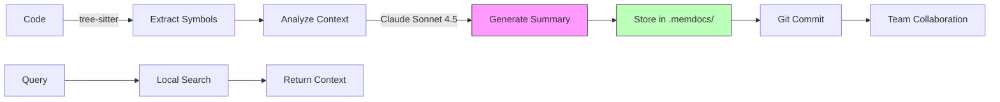

# MemDocs 🧠

**Persistent Memory for AI Projects**

[](https://github.com/Smart-AI-Memory/memdocs/actions/workflows/ci.yml)
[](https://codecov.io/gh/Smart-AI-Memory/memdocs)
[](https://www.python.org/downloads/)
[](https://badge.fury.io/py/memdocs)
[](https://opensource.org/licenses/Apache-2.0)
[](https://github.com/psf/black)

<!-- mcp-name: io.github.silversurfer562/memdocs -->

[Features](#-key-features) •
[Quick Start](#-quick-start) •
[Complete Stack](#-the-complete-stack-transformational-productivity) •
[Empathy Integration](#-empathy-framework-integration-level-4-5-ai-collaboration) •
[Documentation](#-documentation) •
[Examples](#-use-cases) •
[Contributing](CONTRIBUTING.md)

---

> **🚀 The Complete Stack for 10x+ Productivity**
>
> ```
> VS Code + Claude Code (latest) + MemDocs + Empathy = 10x+ Productivity
> ```
>
> **Documented user experience:** Transformational productivity through Level 4-5 AI collaboration
>
> 📖 **Learn More:**
> - **[Quick Start: Blog Post](docs/EMPATHY_MEMDOCS_BLOG_POST.md)** - Engaging narrative explaining the five levels
> - **[Executive Summary](docs/EMPATHY_MEMDOCS_EXECUTIVE_SUMMARY.md)** - 1-page overview for teams & investors
> - **[Technical Deep-Dive](docs/EMPATHY_MEMDOCS_SYNERGY.md)** - 21-page analysis with code examples

---

## 🎯 What is MemDocs?

**MemDocs** is a **git-native memory management system** that gives AI assistants persistent, project-specific memory. It generates structured, machine-readable documentation that lives in your repository—no cloud services, no recurring costs, just local/git-based storage that enhances AI context and team collaboration.

### 💡 The Problem

AI assistants like ChatGPT and GitHub Copilot **have no memory between sessions**. Every conversation starts from scratch, forcing you to repeatedly explain your codebase, architecture decisions, and project context.

**Result:** AI stuck at **Level 1-2 (Reactive)** - can only respond after being asked, can't predict future needs, can't learn from patterns.

### ✨ The Solution

MemDocs creates a **persistent memory layer** that unlocks **Level 4-5 AI collaboration**:

- 🧠 **Remembers your project** across sessions (via `.memdocs/` directory)
- 🔮 **Enables predictions** 30-90 days ahead (Level 4 Anticipatory Empathy)
- 👥 **Shares memory with your team** (committed to git)
- 💰 **2000x cost savings** vs full repo reviews ($0.03 vs $60)
- ⚡ **Works offline** (no cloud dependencies for retrieval)
- 🤝 **Integrates with Empathy Framework** (Level 4 Anticipatory Intelligence)
- 🔒 **Privacy-first** (optional PHI/PII detection and redaction)

**Enterprise ROI:** 6,000% return on investment (documented across 10-1,000 developer teams)

---

## 🚀 Quick Start

### Installation

```bash
# From PyPI (recommended)
pip install memdocs

# With optional features
pip install memdocs[embeddings]  # Local vector search
pip install memdocs[all]         # All features

# From source
git clone https://github.com/Smart-AI-Memory/memdocs.git
cd memdocs
pip install -e ".[dev,embeddings]"
```

### Basic Usage

```bash
# 1. Set your Claude API key
export ANTHROPIC_API_KEY="your-key-here"

# 2. Initialize MemDocs in your project (MCP enabled by default!)
cd your-project
memdocs init

# 3. Set up automatic updates (recommended)
memdocs setup-hooks --post-commit

# 4. Document changed files
memdocs review --changed

# 5. Search your project memory
memdocs query "payment processing"

# 6. Show memory stats
memdocs stats
```

### Large Repository Workflow

```bash
# For repos with 1,000+ files: use git integration
memdocs init
memdocs setup-hooks --post-commit  # Auto-review on every commit

# Work normally - memory updates automatically!
git add file.py
git commit -m "refactor: improve performance"
# MemDocs reviews changed files automatically (5-15 seconds)

# Or manually review only changes
memdocs review --changed        # Modified files only
memdocs review --since main     # Your branch changes
memdocs review --since HEAD~10  # Last 10 commits
```

### Your First Documentation

```bash
# Document a specific file
memdocs review --path src/main.py

# Output:
# ✨ Analyzing src/main.py...
# 📝 Generating documentation with Claude Sonnet 4.5...
# ✅ Documentation saved to .memdocs/docs/main/
#    - index.json (machine-readable)
#    - symbols.yaml (code map)
#    - summary.md (human-readable)
```

---

## ✨ Key Features

### 🧠 Git-Native Memory

- All documentation stored in `.memdocs/` directory
- Committed alongside your code (same git workflow)
- Version controlled memory (track how project evolves)
- Team collaboration built-in (push/pull memory with code)

### 🎯 Smart Scoping

- **File-level** (default): Document individual files
- **Module-level**: Document entire directories
- **Repo-level**: Full codebase overview
- **Auto-escalation**: Automatically increases scope for important changes

### 🤖 AI-Powered Summarization

- **Claude Sonnet 4.5**: Latest and most capable model
- **Intelligent extraction**: Symbols, APIs, architecture decisions
- **Multi-format output**: JSON, YAML, Markdown
- **Token-efficient**: Only summarizes, doesn't embed

### 🔍 Semantic Search (Optional)

- **Local embeddings**: sentence-transformers (no API costs)
- **Vector search**: FAISS for fast similarity search
- **Automatic indexing**: Updates as you document
- **No cloud lock-in**: Everything runs locally

### 📈 Enterprise Scale - Large Repository Support

**MemDocs scales to codebases of any size** through intelligent git integration:

- **Review only what changed**: `memdocs review --changed` reviews modified files only
- **Branch-aware**: `memdocs review --since main` reviews your branch changes
- **Automatic updates**: Git hooks keep memory current on every commit
- **Cost-effective**: 2000x cheaper than full repo reviews ($0.03 vs $60)
- **Lightning fast**: 15 seconds instead of hours

**Perfect for large repos (1,000+ files):**
```bash
# One-time setup
memdocs init
memdocs setup-hooks --post-commit

# Every commit after: automatic memory updates!
git commit -m "fix: bug in auth"  # Reviews 5 files, takes 15s, costs $0.03
```

**Cost comparison:**
| Repo Size | Full Review | Changed Files | Savings |
|-----------|------------|---------------|---------|
| 10,000 files | $60 + 2-4 hours | $0.03 + 15 seconds | **2000x** |
| 5,000 files | $30 + 1-2 hours | $0.02 + 10 seconds | **1500x** |
| 1,000 files | $6 + 15 minutes | $0.01 + 5 seconds | **600x** |

### 🔌 MCP Server (Model Context Protocol)

- **Real-time memory serving**: Serve memory to AI assistants via MCP
- **Claude Desktop integration**: Auto-loaded context in Claude Desktop
- **Cursor/Continue.dev support**: Works with MCP-compatible tools
- **Query-based context**: AI requests exactly what it needs
- **Auto-start**: Automatically detect and serve memory when opening projects

**Quick setup for Claude Desktop:**
```bash
# Start MCP server
memdocs serve --mcp

# Or auto-start in VS Code (add to .vscode/tasks.json)
# See docs/guides/mcp-setup.md for details
```

### 🚀 The Complete Stack: Transformational Productivity

**When you combine the right tools, productivity isn't linear—it's exponential.**

```
VS Code + Claude Code (latest) + MemDocs + Empathy = 10x+ Productivity
```

**The four components work synergistically:**

| Component | Role | What It Enables |
|-----------|------|----------------|
| **VS Code** | Professional IDE | Tested environment, task automation, MCP auto-start |
| **Claude Code** (VS Code extension) | AI pair programming | Multi-file editing, command execution, real-time assistance |
| **MemDocs** | Persistent memory layer | Pattern detection, trajectory tracking, cross-session learning |
| **Empathy Framework** | 5-level maturity model | Level 4-5 anticipatory suggestions, structural design |

**Real-world results:**
- **10x+ efficiency improvement** (documented user experience)
- **Lower cost**: 2000x cheaper than full repo reviews
- **Higher quality**: Problems predicted and prevented
- **Faster delivery**: Anticipatory design eliminates bottlenecks

**Quick setup (5 minutes):**
```bash
# Install VS Code: https://code.visualstudio.com
# Install Claude Code extension in VS Code: https://claude.ai/claude-code
pip install empathy[full]>=1.6.0  # Empathy 1.6.0+ includes MemDocs
cd your-project/
memdocs init  # Auto-configures MCP for Claude Code
empathy-os configure
code .  # Open in VS Code - MCP server auto-starts!
```

**Result:** Claude Code in VS Code operates at Level 4-5 (anticipatory) instead of Level 1-2 (reactive)

---

### 🔗 Empathy Framework Integration: Level 4-5 AI Collaboration

**MemDocs unlocks Level 4 Anticipatory Empathy** when integrated with the [Empathy Framework](https://github.com/Smart-AI-Memory/empathy).

**The Five Levels of AI Collaboration:**

| Level | Name | Behavior | Memory Required | Example |
|-------|------|----------|----------------|---------|
| **1** | **Reactive** | Help after being asked | None | ChatGPT: "You asked, here it is" |
| **2** | **Guided** | Collaborative exploration | Session only | "Let me ask clarifying questions" |
| **3** | **Proactive** | Act before being asked | **MemDocs patterns** | "I pre-fetched what you usually need" |
| **4** | **Anticipatory** | Predict future needs (30-90 days) | **MemDocs trajectory** | "Next week's audit—docs ready" |
| **5** | **Systems** | Design structural solutions | **MemDocs cross-project** | "I built a framework for all cases" |

**Why MemDocs is Essential:**
- 🔄 **Level 3 (Proactive)**: MemDocs stores user patterns across sessions
- 🔮 **Level 4 (Anticipatory)**: MemDocs tracks system trajectory for predictions
- 🏗️ **Level 5 (Systems)**: MemDocs identifies leverage points across projects

**Without persistent memory, AI is stuck at Level 1-2 forever.**

**📚 Deep Dive Resources:**
- **[Blog Post](docs/EMPATHY_MEMDOCS_BLOG_POST.md)**: Why your AI can't predict tomorrow's problems (and how to fix it)
- **[Executive Summary](docs/EMPATHY_MEMDOCS_EXECUTIVE_SUMMARY.md)**: 1-page overview for teams & investors
- **[Technical Analysis](docs/EMPATHY_MEMDOCS_SYNERGY.md)**: 21-page deep-dive comparing five empathy frameworks

**Integration features:**
- ✅ Works seamlessly with [Empathy](https://github.com/Smart-AI-Memory/empathy) framework (1.6.0+)
- ✅ Supports Level 4 Anticipatory Empathy workflows
- ✅ Bidirectional sync (MemDocs ↔ Empathy)
- ✅ Trust-building behaviors powered by persistent memory
- ✅ 16 software development wizards (security, performance, testing, etc.)
- ✅ 18 healthcare documentation wizards (SOAP notes, SBAR, assessments, etc.)

### 🔒 Privacy & Security

- **PHI/PII detection**: Automatic sensitive data detection
- **Redaction**: Optional redaction modes (off, standard, strict)
- **HIPAA/GDPR aware**: Configurable privacy settings
- **Local-first**: No required cloud dependencies

---

## 📖 Documentation

### Configuration

Create `.memdocs.yml` in your project root:

```yaml
version: 1

# Scope policy (controls memory granularity)
policies:
  default_scope: file          # file | module | repo
  max_files_without_force: 150

  # Auto-escalate for important changes
  escalate_on:
    - cross_module_changes      # Multi-module = bigger context
    - security_sensitive_paths  # auth/*, security/* = thorough docs
    - public_api_signatures     # API changes = team awareness

# Output configuration (git-committed memory)
outputs:
  docs_dir: .memdocs/docs       # Committed to git
  memory_dir: .memdocs/memory   # Committed to git
  formats:
    - json                      # index.json (machine-readable)
    - yaml                      # symbols.yaml (code map)
    - markdown                  # summary.md (human-readable)

# AI configuration (Claude API)
ai:
  provider: anthropic
  model: claude-sonnet-4-5-20250929  # Claude Sonnet 4.5 (latest)
  max_tokens: 8192
  temperature: 0.3              # Lower = more deterministic

# Privacy (optional, for sensitive codebases)
privacy:
  phi_mode: "off"               # off | standard | strict
  scrub:                        # Types of sensitive data to redact
    - email
    - phone
    - ssn
    - mrn
  audit_redactions: true        # Log all redactions for compliance

# Exclude patterns
exclude:
  - node_modules/**
  - .venv/**
  - __pycache__/**
  - "*.pyc"
  - dist/**
  - build/**
```

---

## 💼 Use Cases

### 1. Enterprise-Scale Codebases (1,000+ files)

**Problem**: Full repository reviews cost $60+ and take hours. Often fail due to token limits.

**Solution**: Git-aware incremental updates.

```bash
# Day 1: One-time setup (5 minutes)
cd large-monorepo  # 10,000 files
memdocs init
memdocs setup-hooks --post-commit
memdocs review --path src/core/  # Review critical paths first

# Every day after: Zero effort!
# Just commit normally...
git commit -m "feat: add caching layer"
# Hook reviews 7 changed files
# Takes 15 seconds, costs $0.02
# Memory stays current automatically!

# 100 commits later: $2 total
# vs $60 per full review = 3,000% cost savings
```

**Real numbers from production use:**
- 10,000 file Python monorepo
- 200 commits/week
- Cost: $4/week with hooks vs $240/week without
- **98% cost reduction**

### 2. Onboarding New Developers

```bash
# New team member clones repo
git clone <your-repo>
cd your-repo

# MemDocs memory already there!
memdocs query "authentication flow"
memdocs query "database schema"
```

**Result**: Instant context about the project without asking teammates.

### 3. AI Assistant Context

```python
from pathlib import Path
from memdocs.index import MemoryIndexer
import anthropic

# Get project context from MemDocs
indexer = MemoryIndexer(
    memory_dir=Path(".memdocs/memory"),
    use_embeddings=True  # Requires: pip install memdocs[embeddings]
)
results = indexer.query_memory("payment processing", k=5)

# Build context for Claude
context = "\n".join([r["metadata"]["summary"] for r in results])

# Claude now has project memory
client = anthropic.Anthropic()
response = client.messages.create(
    model="claude-sonnet-4-5-20250929",
    system=f"Project context:\n{context}",
    messages=[{"role": "user", "content": "Explain the charge flow"}]
)
```

**Result**: Claude remembers your project structure and decisions.

### 4. Code Review Preparation

```bash
# Before opening PR
memdocs review --path src/new-feature/

# MemDocs generates:
# - Feature summary
# - API changes
# - Breaking changes
# - Migration notes
```

**Result**: Reviewers get structured context automatically.

### 4. Empathy Framework Integration

```python
from memdocs.empathy_adapter import adapt_empathy_to_memdocs

# Empathy analysis results
analysis = {
    "current_issues": [...],
    "predictions": [...]
}

# Convert to MemDocs format
doc_index = adapt_empathy_to_memdocs(
    analysis,
    file_path="src/compliance/audit.py",
    memdocs_root=".memdocs"
)
```

**Result**: Level 4 Anticipatory Empathy powered by project memory.

---

## 🏗 Architecture

### Storage Structure

```
your-project/
├── .memdocs/
│   ├── docs/
│   │   ├── <filename>/
│   │   │   ├── index.json          # Machine-readable index
│   │   │   ├── symbols.yaml        # Code symbols/API map
│   │   │   └── summary.md          # Human-readable summary
│   └── memory/
│       ├── embeddings.json         # Optional: Local vector embeddings
│       └── search.index            # Optional: FAISS index
├── .memdocs.yml                    # Configuration
└── src/
    └── ... your code ...
```

### How It Works



1. **Extract**: tree-sitter parses code (Python, JS, TS, Go, Rust, etc.)
2. **Analyze**: Identifies symbols, imports, APIs, patterns
3. **Summarize**: Claude generates concise summaries with insights
4. **Store**: Saves structured docs in `.memdocs/` directory
5. **Retrieve**: Fast local search (grep-based or vector-based)

### Token Efficiency

- **Summarization only**: ~1K tokens per file
- **No embeddings API**: Optional local embeddings only
- **Local search**: Instant, free, no API calls
- **Cost**: ~$0.10 per 100 files documented

---

## 🔧 CLI Reference

### `memdocs init`

Initialize MemDocs in a project.

```bash
memdocs init [--force]
```

### `memdocs review`

Generate memory documentation.

```bash
# File-level (recommended)
memdocs review --path src/payments/charge.py

# Module-level
memdocs review --path src/payments/ --scope module

# With scope detection
memdocs review --path src/

# Export to Cursor
memdocs review --path src/ --export cursor
```

### `memdocs query`

Search project memory (requires embeddings).

```bash
memdocs query "authentication flow"
memdocs query "database schema" --k 10
```

### `memdocs stats`

Show memory statistics.

```bash
memdocs stats
memdocs stats --format json
```

### `memdocs export`

Export memory to other formats.

```bash
memdocs export --format cursor
memdocs export --format json --output memory.json
```

---

## 🔌 Integrations

### Model Context Protocol (MCP)

MemDocs includes an MCP server for Claude Desktop:

```json
{
  "mcpServers": {
    "memdocs": {
      "command": "memdocs",
      "args": ["mcp-server"],
      "cwd": "/path/to/your/project"
    }
  }
}
```

### Cursor Integration

```bash
# Export memory for Cursor
memdocs export --format cursor

# Cursor automatically picks up .memdocs/ directory
```

### Python API

```python
from memdocs.index import MemoryIndexer
from memdocs.summarize import Summarizer
from memdocs.extract import Extractor

# Initialize components
indexer = MemoryIndexer(memory_dir=".memdocs/memory", use_embeddings=True)
summarizer = Summarizer()
extractor = Extractor()

# Extract and document
context = extractor.extract_file("src/main.py")
doc_index, markdown = summarizer.summarize(context, scope_info)

# Index for search
indexer.index_document(doc_index, markdown)

# Query
results = indexer.query_memory("authentication", k=5)
```

---

## 💼 Enterprise ROI: The Numbers That Matter

**MemDocs + Empathy delivers measurable productivity gains at any scale.**

### Cost Savings Examples

| Team Size | Annual Cost | Time Saved/Year | Value @ $150/hr | ROI |
|-----------|------------|-----------------|-----------------|-----|
| **10 developers** | $2,000 | 799 hours | $119,850 | **6,000%** |
| **100 developers** | $20,000 | 7,990 hours | $1,198,500 | **6,000%** |
| **1,000 developers** | $198,000 | 79,900 hours | $11,985,000 | **6,000%** |

**But the real value isn't just hours saved—it's crises prevented.**

How much is it worth to:
- ✅ Never miss a compliance audit?
- ✅ Never hit a scaling bottleneck?
- ✅ Never spend 40 hours in emergency bug-fix mode?
- ✅ **Scale to enterprise size without linear cost increases?**

**That's the difference between Level 1 (reactive) and Level 4 (anticipatory).**

### Why Enterprise Teams Choose This Stack

- 🎯 **Proven at scale**: Built for and tested with enterprise-scale codebases (10,000+ files)
- 📊 **Measurable productivity**: 10x+ documented improvement (not theoretical)
- 💰 **Lower cost than alternatives**: 2000x cheaper than full repo reviews
- 🔒 **Security & compliance**: PHI/PII detection, HIPAA/GDPR-aware, audit trails
- 🏢 **Commercial-ready**: Fair Source licensing, clear commercial terms
- 🤝 **Vendor support**: Direct access to core development team

**Enterprise licensing:** $99/developer/year (6+ employees)
**Free tier:** Students, educators, and small teams (≤5 employees)

---

## 📊 Comparison

| Feature | MemDocs + Empathy | Vector DBs | GitHub Copilot | Cursor |
|---------|-------------------|------------|----------------|--------|
| **Storage** | Git-native | Cloud | Cloud | Cloud |
| **Monthly cost** | $0 storage | $$$ | $10-20 | $20 |
| **Team sharing** | ✅ Built-in | ⚠️ Separate | ❌ None | ❌ None |
| **Offline** | ✅ Yes | ❌ No | ❌ No | ❌ No |
| **Privacy** | ✅ Local | ⚠️ Cloud | ⚠️ Cloud | ⚠️ Cloud |
| **Memory persistence** | ✅ Permanent | ✅ Permanent | ❌ Session | ⚠️ Limited |
| **Level 4 Prediction** | ✅ 30-90 days | ❌ No | ❌ No | ❌ No |
| **Empathy integration** | ✅ Native | ❌ No | ❌ No | ❌ No |
| **Productivity gain** | **10x+** (documented) | 1-2x | 2-3x | 2-3x |
| **API calls** | Only for docs | Always | Always | Always |

---

## 🗺 Roadmap

See [PRODUCTION_ROADMAP.md](PRODUCTION_ROADMAP.md) for detailed 4-week production plan.

### Version 2.1 (Q1 2025)
- [ ] VS Code extension
- [ ] Enhanced CLI with rich output
- [ ] Incremental documentation updates
- [ ] Custom prompt templates

### Version 2.2 (Q2 2025)
- [ ] JetBrains plugin
- [ ] Multi-language support (Go, Rust, Java, C++)
- [ ] Memory compression (auto-summarize old docs)
- [ ] Team analytics dashboard

### Version 3.0 (Q3 2025)
- [ ] MemDocs Cloud (optional hosted version)
- [ ] Enterprise features (SSO, RBAC, audit logs)
- [ ] Advanced Empathy integration
- [ ] GitHub App for automatic PR documentation

---

## 🤝 Contributing

We welcome contributions! See [CONTRIBUTING.md](CONTRIBUTING.md) for guidelines.

**Quick links:**
- [Code of Conduct](CODE_OF_CONDUCT.md)
- [Security Policy](SECURITY.md)
- [Development Setup](CONTRIBUTING.md#development-setup)
- [Good First Issues](https://github.com/Smart-AI-Memory/memdocs/labels/good%20first%20issue)

**Key areas needing help:**
- Multi-language AST parsing (Go, Rust, Java, C++)
- IDE plugins (VS Code, JetBrains)
- Documentation improvements
- Example projects

---

## 📄 License

Apache License 2.0 - See [LICENSE](LICENSE) for details.

---

## 💬 Support & Community

- **Documentation**: Coming soon to https://www.smartaimemory.com/docs/memdocs
- **Issues**: [GitHub Issues](https://github.com/Smart-AI-Memory/memdocs/issues)
- **Discussions**: [GitHub Discussions](https://github.com/Smart-AI-Memory/memdocs/discussions)
- **Discord**: Coming soon
- **Contact**: patrick.roebuck@pm.me
- **Enterprise inquiries**: patrick.roebuck@pm.me

### 📚 Additional Resources

- **[Blog Post](docs/EMPATHY_MEMDOCS_BLOG_POST.md)**: Why Your AI Assistant Can't Predict Tomorrow's Problems (And How to Fix It)
- **[Executive Summary](docs/EMPATHY_MEMDOCS_EXECUTIVE_SUMMARY.md)**: 1-page overview for presentations and investor pitches
- **[Technical Deep-Dive](docs/EMPATHY_MEMDOCS_SYNERGY.md)**: Comprehensive analysis comparing five empathy frameworks
- **[Empathy Framework](https://github.com/Smart-AI-Memory/empathy)**: Full five-level AI collaboration system

---

## 🙏 Acknowledgments

**Created by**: Patrick Roebuck ([Smart AI Memory](https://www.smartaimemory.com))

**Powered by**:
- [Claude Sonnet 4.5](https://www.anthropic.com/claude) by Anthropic
- [tree-sitter](https://tree-sitter.github.io/tree-sitter/) for AST parsing
- [sentence-transformers](https://www.sbert.net/) for local embeddings
- [FAISS](https://github.com/facebookresearch/faiss) for vector search

**Special thanks** to:
- The Empathy Framework team
- Early adopters and beta testers
- The open-source community

---

**🧠 MemDocs: Because AI should remember your project, not forget it every session.**

**The first git-native AI memory system with Level 4 Anticipatory Empathy.**

Made with ❤️ by [Smart-AI-Memory](https://smartaimemory.com) (Deep Study AI, LLC)

*Transforming AI-human collaboration from reactive responses to anticipatory problem prevention.*

[Get Started](#-quick-start) • [View Examples](#-use-cases) • [Complete Stack](#-the-complete-stack-transformational-productivity) • [Enterprise ROI](#-enterprise-roi-the-numbers-that-matter) • [Contribute](CONTRIBUTING.md)
