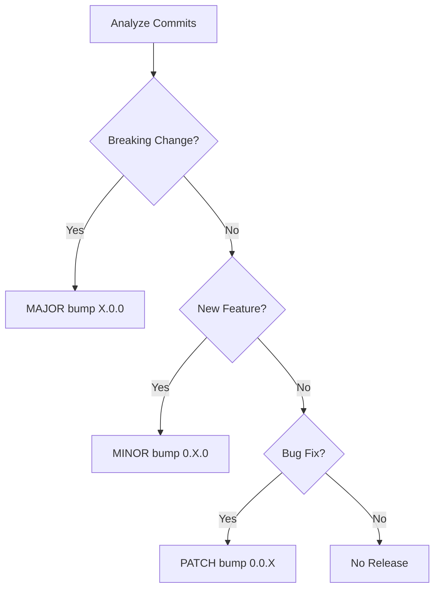

# Automatic Versioning with Conventional Commits

This project uses **Python Semantic Release** for fully automated versioning, changelog generation, and releases based on [Conventional Commits](https://www.conventionalcommits.org/).

## 🎯 How It Works

1. **Write code** with conventional commit messages
2. **Push to main** branch
3. **Automation handles everything**:
   - Analyzes commit messages
   - Determines version bump (major/minor/patch)
   - Updates version in `pyproject.toml` and `__init__.py`
   - Generates/updates `CHANGELOG.md`
   - Creates git tag
   - Triggers full CI/CD pipeline
   - Publishes to PyPI
   - Builds container images
   - Creates GitHub release

## 📝 Conventional Commit Format

```
<type>[optional scope]: <description>

[optional body]

[optional footer(s)]
```

### Commit Types

| Type | Description | Version Bump | Example |
|------|-------------|--------------|---------|
| `feat` | New feature | **MINOR** (0.X.0) | `feat: add weather alerts endpoint` |
| `fix` | Bug fix | **PATCH** (0.0.X) | `fix: handle null temperature values` |
| `perf` | Performance improvement | **PATCH** | `perf: optimize weather data parsing` |
| `docs` | Documentation only | **None** | `docs: update API examples` |
| `style` | Code style/formatting | **None** | `style: format with ruff` |
| `refactor` | Code refactoring | **None** | `refactor: simplify client logic` |
| `test` | Add/update tests | **None** | `test: add forecast endpoint tests` |
| `build` | Build system changes | **None** | `build: update dependencies` |
| `ci` | CI/CD changes | **None** | `ci: add security scan workflow` |
| `chore` | Maintenance tasks | **None** | `chore: update .gitignore` |

### Breaking Changes (MAJOR version)

Add `!` after type or include `BREAKING CHANGE:` in footer:

```bash
# Method 1: Using !
git commit -m "feat!: redesign weather API response format"

# Method 2: Using footer
git commit -m "feat: redesign weather API response

BREAKING CHANGE: Weather response structure has changed.
The 'temp' field is now 'temperature.current'."
```

**Result**: Version bump from `1.2.3` → `2.0.0`

## 🚀 Quick Start Examples

### Add a New Feature (MINOR version bump)

```bash
# Make your changes
vim src/msn_weather_wrapper/client.py

# Commit with feat type
git add .
git commit -m "feat: add 7-day weather forecast support

Adds new forecast() method to WeatherClient that retrieves
extended weather predictions for a given location."

# Push to main
git push origin main
```

**Result**: Version `1.2.3` → `1.3.0` automatically

### Fix a Bug (PATCH version bump)

```bash
# Fix the bug
vim src/msn_weather_wrapper/models.py

# Commit with fix type
git add .
git commit -m "fix: handle missing humidity data gracefully

Previously threw KeyError when humidity was None.
Now returns 0 as default value."

# Push to main
git push origin main
```

**Result**: Version `1.3.0` → `1.3.1` automatically

### Breaking Change (MAJOR version bump)

```bash
# Make breaking changes
vim api.py

# Commit with ! or BREAKING CHANGE
git add .
git commit -m "feat!: change API response format to match v2 spec

BREAKING CHANGE: All API endpoints now return data in a new format.
- Renamed 'temp' to 'temperature'
- Moved location data to 'location' object
- See MIGRATION.md for upgrade guide"

# Push to main
git push origin main
```

**Result**: Version `1.3.1` → `2.0.0` automatically

### Multiple Commits

The highest priority change determines the version:

```bash
# Patch changes
git commit -m "fix: correct temperature conversion"
git commit -m "docs: update README examples"

# Minor change (overrides patch)
git commit -m "feat: add cache expiration setting"

# Push all together
git push origin main
```

**Result**: Version bump is **MINOR** (feature trumps fix)

## 🔄 Release Workflow

When you push to `main`, the following happens automatically:

### 1. Automated Release Workflow
```yaml
# Triggered on: push to main
- Analyzes commits since last release
- Determines version bump type
- Updates version numbers
- Generates changelog
- Creates git tag (e.g., v1.4.0)
- Pushes tag to GitHub
```

### 2. CI/CD Pipeline Triggered
```yaml
# Triggered by: version tag
- Runs full test suite
- Builds Python package
- Publishes to PyPI
- Builds container images
- Pushes to ghcr.io
- Generates SBOM
- Creates GitHub Release
```

### 3. Release Artifacts Created
- PyPI package: `pip install msn-weather-wrapper==1.4.0`
- Container images: `ghcr.io/jim-wyatt/msn-weather-wrapper:1.4.0`
- GitHub Release with:
  - CHANGELOG entry
  - Python package (.whl, .tar.gz)
  - SBOM files
  - Security reports

## 📊 Version Determination Logic



## 🛠️ Advanced Usage

### Force a Specific Release Level

Use workflow dispatch to override automatic detection:

```bash
# Via GitHub UI:
# 1. Go to Actions tab
# 2. Select "Automated Release" workflow
# 3. Click "Run workflow"
# 4. Choose force-level: patch/minor/major

# Via GitHub CLI:
gh workflow run release.yml -f force-level=minor
```

### Skip Release for Specific Commits

Use `[skip release]` or `[skip ci]` in commit message:

```bash
git commit -m "docs: fix typo [skip release]"
```

### View Version Without Releasing

```bash
# Install semantic-release locally
pip install python-semantic-release

# Check what version would be released
semantic-release version --print
```

### Multi-Commit Release

All commits since last release are analyzed together:

```bash
git commit -m "fix: bug 1"
git commit -m "fix: bug 2"
git commit -m "feat: new feature"
git push origin main
# Result: MINOR bump (feat > fix)
```

## 📋 Commit Message Best Practices

### ✅ Good Examples

```bash
# Clear, concise, imperative mood
feat: add weather alerts for severe conditions
fix: prevent crash when API returns 404
perf: cache weather data for 5 minutes
docs: add API authentication examples
refactor: extract parsing logic to separate module

# With scope for clarity
feat(api): add /v2/forecast endpoint
fix(client): handle connection timeout gracefully
test(integration): add Docker deployment tests

# With body for context
feat: add multi-language support

Adds support for weather descriptions in 10 languages.
Users can specify language via 'lang' query parameter.

# Breaking change with migration info
feat!: redesign API response format

BREAKING CHANGE: Response structure has changed.
See docs/MIGRATION_v2.md for upgrade instructions.
```

### ❌ Bad Examples

```bash
# Too vague
git commit -m "update stuff"
git commit -m "fix bug"
git commit -m "changes"

# Wrong type
git commit -m "added new feature"  # Should be: feat: add new feature
git commit -m "fixing the API"     # Should be: fix: correct API behavior

# Missing colon
git commit -m "feat add alerts"    # Should be: feat: add alerts

# Past tense (use imperative)
git commit -m "feat: added alerts" # Should be: feat: add alerts
```

## 🔍 Troubleshooting

### "No release needed" message

**Reason**: No commits with release-worthy types (feat, fix, perf) since last release.

**Solution**: Ensure you're using conventional commit format:
```bash
# Instead of:
git commit -m "add weather alerts"

# Use:
git commit -m "feat: add weather alerts"
```

### Version not updating

**Check**:
1. Did you push to `main` branch?
2. Are commits using conventional format?
3. Check workflow run: [Actions tab](https://github.com/jim-wyatt/msn-weather-wrapper/actions)

### Manual intervention needed

If automation fails, you can manually create a release:

```bash
# Update version manually
vim pyproject.toml  # Change version
vim src/msn_weather_wrapper/__init__.py  # Change __version__

# Commit and tag
git add .
git commit -m "chore: bump version to 1.5.0"
git tag -a v1.5.0 -m "Release 1.5.0"
git push origin main --tags
```

## 📚 Configuration

The semantic release configuration is in `pyproject.toml`:

```toml
[tool.semantic_release]
version_toml = ["pyproject.toml:project.version"]
version_variables = ["src/msn_weather_wrapper/__init__.py:__version__"]
branch = "main"
changelog_file = "CHANGELOG.md"
build_command = "pip install build && python -m build"
dist_path = "dist/"
upload_to_vcs_release = true

[tool.semantic_release.commit_parser_options]
allowed_tags = [
    "build", "chore", "ci", "docs", "feat",
    "fix", "perf", "style", "refactor", "test"
]
major_tags = ["breaking"]
minor_tags = ["feat"]
patch_tags = ["fix", "perf"]
```

## 🎓 Learning Resources

- [Conventional Commits Specification](https://www.conventionalcommits.org/)
- [Python Semantic Release Docs](https://python-semantic-release.readthedocs.io/)
- [Semantic Versioning 2.0.0](https://semver.org/)
- [Keep a Changelog](https://keepachangelog.com/)

## 📈 Version History

View all releases:
- **GitHub**: [Releases page](https://github.com/jim-wyatt/msn-weather-wrapper/releases)
- **PyPI**: [Package history](https://pypi.org/project/msn-weather-wrapper/#history)
- **Changelog**: [CHANGELOG.md](/CHANGELOG.md)

## 🤝 Contributing

When contributing:

1. **Fork the repository**
2. **Create a feature branch**: `git checkout -b feature/my-feature`
3. **Make changes with conventional commits**:
   ```bash
   git commit -m "feat: add my awesome feature"
   ```
4. **Push and create Pull Request**
5. **Maintainer merges to main**
6. **Automatic release happens!** 🎉

## 🔒 Security

Security fixes should use `fix` type with Security footer:

```bash
git commit -m "fix: prevent SQL injection in search endpoint

Security: Addresses CVE-2024-XXXXX by sanitizing user input
before database queries."
```

This triggers:
- **PATCH** version bump (0.0.X)
- Security section in CHANGELOG
- GitHub Security Advisory notification

---

**Need help?** Check the [full versioning guide](VERSIONING.md) or [open an issue](https://github.com/jim-wyatt/msn-weather-wrapper/issues).
