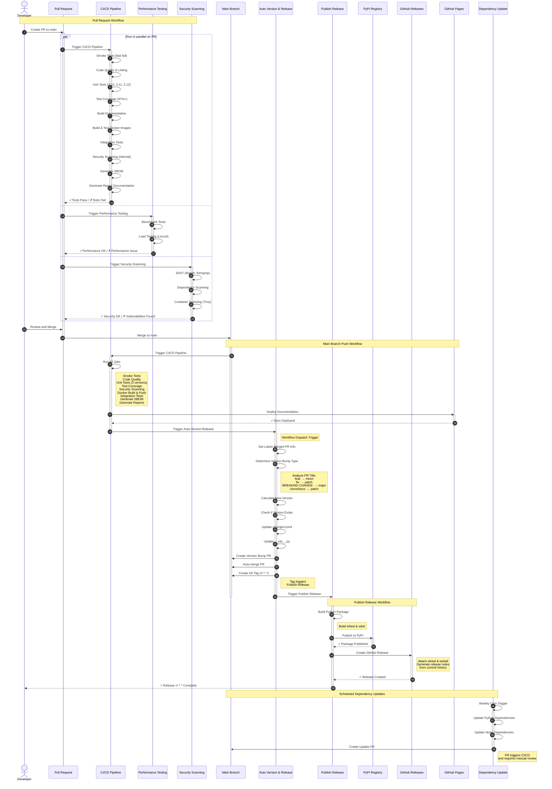
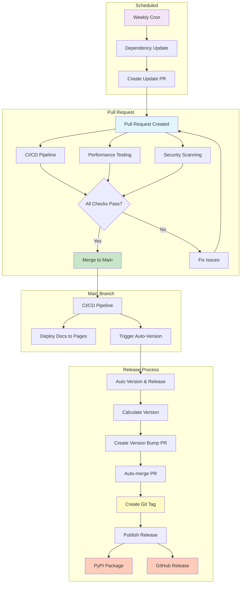

# Workflow Architecture Diagram

This document provides a comprehensive UML diagram showing all GitHub Actions workflows and their interactions.

## Workflow Flow Diagram



## Workflow Descriptions

### 1. **CI/CD Pipeline** (`ci.yml`)
**Triggers:**
- Push to `main` branch
- Pull requests to `main`
- Manual dispatch

**Jobs:**
1. **Smoke Tests** - Fast validation (imports, syntax)
2. **Code Quality & Linting** - Ruff format check, linting, mypy type checking
3. **Unit Tests** - Runs on Python 3.10, 3.11, 3.12
4. **Test Coverage** - Generates coverage reports (target: 97%+)
5. **Security Scanning** - Bandit, pip-audit, license checks
6. **Build Documentation** - MkDocs build validation
7. **Build & Test Docker Images** - Multi-stage container build
8. **Integration Tests** - Tests against containerized API
9. **Generate SBOM** - Software Bill of Materials with Syft
10. **Generate Report Documentation** - Consolidated test/coverage/security reports
11. **Deploy Documentation** - Push to GitHub Pages (main branch only)
12. **Trigger Auto-Version-Release** - Starts versioning workflow (main branch only)

### 2. **Performance Testing** (`performance.yml`)
**Triggers:**
- Pull requests to `main`

**Jobs:**
1. **Benchmark Tests** - Performance baseline measurements
2. **Load Testing** - Locust-based load testing (20 concurrent users, 10 req/s)
   - Health check endpoint testing
   - Weather endpoint testing
   - Rate limiting validation (accepts 429 responses)

### 3. **Security Scanning** (`security-scan.yml`)
**Triggers:**
- Pull requests to `main`
- Manual dispatch

**Jobs:**
1. **SAST** - Bandit and Semgrep static analysis
2. **Dependency Scanning** - pip-audit vulnerability checks
3. **Container Scanning** - Trivy image scanning

### 4. **Auto Version and Release** (`auto-version-release.yml`)
**Triggers:**
- Workflow dispatch from CI/CD Pipeline (after successful main branch build)

**Process:**
1. Analyzes merged PR title to determine version bump type:
   - `feat:` → minor version bump
   - `fix:` → patch version bump
   - `BREAKING CHANGE:` → major version bump
   - `chore:`, `docs:` → patch version bump
2. Calculates new version
3. Updates `pyproject.toml` and `src/msn_weather_wrapper/__init__.py`
4. Creates version bump PR
5. Auto-merges the PR
6. Creates git tag (format: `v*.*.*`)
7. Triggers Publish Release workflow

### 5. **Publish Release** (`publish-release.yml`)
**Triggers:**
- Git tag push (pattern: `v*.*.*`)
- Manual dispatch with tag input

**Jobs:**
1. **Build Package** - Creates wheel and source distribution
2. **Publish to PyPI** - Uploads package to PyPI registry
3. **Create GitHub Release** - Creates release with artifacts and generated notes

### 6. **Dependency Update** (`dependencies.yml`)
**Triggers:**
- Weekly cron schedule
- Manual dispatch

**Process:**
1. Updates Python dependencies in `pyproject.toml`
2. Updates Node.js dependencies in `frontend/package.json`
3. Creates PR with updates
4. PR triggers CI/CD Pipeline for validation

## Workflow Dependencies



## Key Features

### Automatic Version Management
- **Convention-based:** PR titles determine version bump type
- **Semantic Versioning:** Follows semver (MAJOR.MINOR.PATCH)
- **Automated:** No manual version updates required
- **Consistent:** Version synced across all files

### Quality Gates
- **Fast Fail:** Smoke tests run first to catch obvious issues
- **Comprehensive Testing:** Unit, integration, and performance tests
- **Security First:** Multiple security scanning layers
- **Coverage Requirements:** Maintains 97%+ code coverage

### Deployment Pipeline
- **Automated Publishing:** PyPI and GitHub Releases
- **Documentation:** Auto-deployed to GitHub Pages
- **Container Images:** Built and pushed to registry
- **SBOM Generation:** Software Bill of Materials for compliance

### Concurrency Control
- **Cancel in Progress:** Only latest run per PR
- **Resource Efficient:** Prevents duplicate workflow runs
- **Fast Feedback:** Cancels obsolete runs immediately

## Workflow Triggers Summary

| Workflow | PR | Push to Main | Tag Push | Manual | Cron |
|----------|----|-----------------|----------|--------|------|
| CI/CD Pipeline | ✓ | ✓ | ✓ | ✓ | - |
| Performance Testing | ✓ | - | - | - | - |
| Security Scanning | ✓ | - | - | ✓ | - |
| Auto Version & Release | - | ✓ (via workflow_dispatch) | - | ✓ | - |
| Publish Release | - | - | ✓ | ✓ | - |
| Dependency Update | - | - | - | ✓ | ✓ (weekly) |

## Environment Variables

All workflows use consistent environment configuration:

```yaml
env:
  PYTHON_VERSION: '3.12'
  NODE_VERSION: '20'
  REPORTS_DIR: 'docs/reports'
```

## Secrets Required

- `GITHUB_TOKEN` - Automatically provided by GitHub Actions
- `PYPI_API_TOKEN` - PyPI upload authentication (stored in repository secrets)

## Cache Strategy

Workflows leverage GitHub Actions caching for:
- Python dependencies (pip cache)
- Node.js dependencies (npm/yarn cache)
- Docker layer caching
- Build artifacts between jobs
