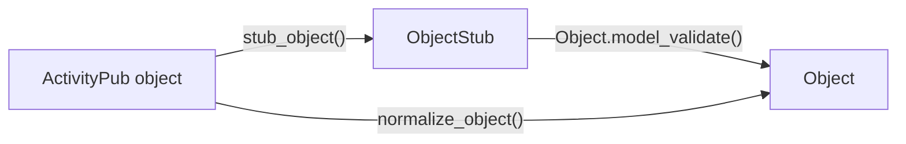

# muck out

This module provides methods to work with objects
encountered in the wild Fediverse. 

## Architecture

The basic structure of processing ActivityPub objects is



An ActivityPub object is assumed to be a dictionary. The result
of this operations are objects that have a predifined form.
In fact, they object [these JSON-schemas](./schemas.md). The difference
between `ObjectStub` and `Object` is that the stub allows null values,
when `Object` requires them, e.g. [Object][muck_out.types.Object] must have an id, 
[ObjectStub][muck_out.types.ObjectStub]
does not.

The complete list of objects and functions is

| object | stub | normalized | transformed | 
| --- | --- | --- | --- |
| [Object][muck_out.types.Object] | [ObjectStub][muck_out.types.ObjectStub] | [normalize_object][muck_out.process.normalize_object]| [object_stub][muck_out.process.object_stub] |
| [Activity][muck_out.types.Activity] | [ActivityStub][muck_out.types.ActivityStub] | [normalize_activity][muck_out.process.normalize_activity]| [activity_stub][muck_out.process.activity_stub] |
| [Actor][muck_out.types.Actor] | [ActorStub][muck_out.types.ActorStub] | [normalize_actor][muck_out.process.normalize_actor]| [actor_stub][muck_out.process.actor_stub] |
| [Collection][muck_out.types.Collection] | [CollectionStub][muck_out.types.CollectionStub] | [normalize_collection][muck_out.process.normalize_collection]| [collection_stub][muck_out.process.collection_stub] |


## Usage

We now discuss the use cases

### Normalizing an object

When receiving
an object `obj`, one can use [normalize_object][muck_out.process.normalize_object]

```python
from muck_out.process import normalize_object

normalize_object(obj)
```

to obtain a normalized version or an Exception is thrown.
The result is of type [Object][muck_out.types.Object].

### Determining what an object is

One can use custom object types in the Fediverse, e.g. one could replace a `Note`
with the type `ChatMessage`. If you fetch an object, you do not know what type
of object it is. To resolve this one can use the [normalize_data][muck_out.normalize_data]
method that returns a [muck_out.NormalizationResult][].

### Default Values

muck_out tries to give sane defaults to values, e.g.

```python
>>> from muck_out.process import object_stub
>>> stub = object_stub({})
>>> print(stub.model_dump_json(indent=2, exclude_none=True))
{
  "tag": [],
  "@context": [
    "https://www.w3.org/ns/activitystreams"
  ],
  "to": [],
  "cc": [],
  "attachment": [],
  "url": []
}

```


### Working with invalid objects

When creating an object, one works with partial objects, e.g. things
that would be invalid, e.g.

```json
{
    "type": "Note",
    "content": "my note content",
    "to": "as:Public"
}
```

This note captures what one would expect somebody to write. Unfortunately,
it is not a valid object, e.g. it is missing the id property. One can
still use the normalization of `muck_out` with the
[ObjectStub][muck_out.types.ObjectStub], e.g.

```python
>>> from muck_out.process import object_stub
>>> data={"type": "Note",
... "content": "my note content",
... "to": "as:Public"}
>>> stub = object_stub(data)
>>> stub
ObjectStub(updated=None, summary=None, name=None, in_reply_to=None, context=None, 
    tag=[], field_context=['https://www.w3.org/ns/activitystreams'], id=None, 
    type='Note', to=['https://www.w3.org/ns/activitystreams#Public'], cc=[], published=None, 
    attributed_to=None, content='my note content', 
    attachment=[], url=[], sensitive=None)

>>> print(stub.model_dump_json(indent=2, exclude_none=True))
{
  "tag": [],
  "@context": [
    "https://www.w3.org/ns/activitystreams"
  ],
  "type": "Note",
  "to": [
    "https://www.w3.org/ns/activitystreams#Public"
  ],
  "cc": [],
  "content": "my note content",
  "attachment": [],
  "url": []
}

```

You see here that the `ObjectStub` class aims to set sensible
defaults for some arguments, e.g. `cc` being an empty list.

### object_stub vs ObjectStub.model_validate

The logic of calling [model_validate][pydantic.BaseModel.model_validate] on [ObjectStub][muck_out.types.ObjectStub]
transforms fields on a field to field basis. This means that the
`content` field is used to fill the `content` field. In particular,
we have the following behavior:

```python
>>> from muck_out.types import ObjectStub
>>> data={"contentMap": {"en": "english"}}
>>> ObjectStub.model_validate(data).model_dump(exclude_none=True)
{'tag': [], '@context': ['https://www.w3.org/ns/activitystreams'],
  'to': [], 'cc': [], 
  'attachment': [],  'url': []}

```

The [object_stub][muck_out.process.object_stub] function fixes this behavior

```python hl_lines="6"
>>> from muck_out.process import object_stub
>>> data={"contentMap": {"en": "english"}}
>>> object_stub(data).model_dump(exclude_none=True)
{'tag': [], '@context': ['https://www.w3.org/ns/activitystreams'],
  'to': [], 'cc': [], 
  'content': 'english',
  'attachment': [], 'url': []}

```

The difference here being that the second option contains
the content property.

## As a cattle_grid transformer extension

By adding

```toml title="config/extension.toml"
[[extensions]]
module = "muck_out.extension"
```

to your cattle_grid installation, the data will contain a new
key `parsed`, which contains the output of [normalize_data][muck_out.normalize_data].
