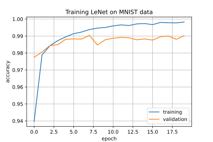

# NetLite

**A small white-box training framework for neural networks for education.**

NetLite provides a light-weight training framework, designed for readability
for learning the basic principles of neural networks in AI classes.

**Performance:**
- On LeNet, this framework achieves 99% accuracy on the MNIST validation data within a few epochs, taking less than 30 seconds per epoch which is roughly on par with PyTorch (on my laptop cpu).
- Optimizations:
  - computation using numpy for most operations
  - just-in-time compilation using numba for convolutions
- Data-loader allows to limit the number of images used, e.g. to train on just 10% of the MNIST data, 
  for even faster training during lab exercises and to get a feeling for over-fitting when not enough data is available.



**Fig. 1:** *Accuracy of LeNet5 trained using NetLite's ADAM optimizer.*

**Exemplary learning tasks for AI classes using this framework:**
- Take a given activation function (e.g. ReLU from layers.py) and use it as a template to create your own activation function (e.g. tanh).
- Implement a robust loss function (e.g. Huber loss) a fit a regression line to noisy data.
- Use debugger to step through optimization, compare with manual calculations.
- Understand and compare different optimizers (SGD, Momentum, ADAM).

## Example 1: Training of a 2-layer model as an XOR classifier

```Python
import numpy as np
import matplotlib.pyplot as plt

import netlite as nl
    
def train(model, optimizer, X_train, y_train, n_epochs=10, batchsize=32):
    log = {}
    log['loss_train'] = []
    log['acc_train'] = []
    for epoch in range(n_epochs):
        loss_sum = 0
        n_correct_sum = 0
        for x_batch, y_batch in nl.batch_handler(X_train, y_train, batchsize=batchsize, shuffle=True):
            loss, metrics = optimizer.step(model, x_batch, y_batch)
            loss_sum += loss
            n_correct_sum += metrics['n_correct']
        
        loss_train_mean = loss_sum / len(y_train)
        log['loss_train'].append(loss_train_mean)
        log['acc_train'].append(n_correct_sum / len(y_train))

        print(f'Epoch {epoch+1:3d} : loss_train {loss_train_mean:7.4f}, acc_train {log["acc_train"][-1]:5.3f}')
    
    return log

### Set-up the model: ###
model = nl.NeuralNetwork([
            nl.FullyConnectedLayer(n_inputs=2, n_outputs=2),
            nl.Sigmoid(),
            nl.FullyConnectedLayer(n_inputs=2, n_outputs=1),
            nl.Sigmoid(),
        ])

# input               x1 x2
X_train = np.array((( 0, 0),
                    ( 1, 0),
                    ( 0, 1),
                    ( 1, 1)))

# desired output: logical XOR
y_train = np.array((1,
                   0,
                   0,
                   1)).reshape((4,1))

optimizer = nl.OptimizerSGD(loss_func=nl.MseLoss(), learning_rate=2)
        
log = train(model, optimizer, X_train, y_train, n_epochs=500, batchsize=4)

plt.plot(log['loss_train'], label='training')
plt.legend(loc='best')
plt.xlabel('epoch')
plt.ylabel('loss')
plt.grid()
plt.show()

plt.plot(log['acc_train'], label='training')
plt.legend(loc='best')
plt.xlabel('epoch')
plt.ylabel('accuracy')
plt.grid()
plt.show()
```

## Example 2: 5-layer LeNET CNN, training on MNIST images

```Python
import numpy as np
import time
import matplotlib.pyplot as plt

import netlite as nl
    
def train(model, optimizer, X_train, y_train, X_valid=(), y_valid=(), n_epochs=10, batchsize=32):
    log = {}
    log['loss_train'] = []
    log['loss_valid'] = []
    log['acc_train']  = []
    log['acc_valid']  = []
    for epoch in range(n_epochs):
        
        ### Training ###
        start_time = time.time()
        loss_sum = 0
        n_correct_sum = 0
        for x_batch, y_batch in nl.batch_handler(X_train, y_train, batchsize=batchsize, shuffle=True):
            loss, metrics = optimizer.step(model, x_batch, y_batch)
            loss_sum += loss
            n_correct_sum += metrics['n_correct']

        end_time = time.time()
        elapsed_time = end_time - start_time
        print(f"runtime: {elapsed_time:.1f} sec")
        
        loss_train_mean = loss_sum / len(y_train)
        log['loss_train'].append(loss_train_mean)
        log['acc_train'].append(n_correct_sum / len(y_train))

        ### Validation ###
        loss_sum = 0
        n_correct_sum = 0
        for x_batch, y_batch in nl.batch_handler(X_valid, y_valid, batchsize=batchsize, shuffle=False):
            loss, metrics = optimizer.step(model, x_batch, y_batch, forward_only=True)
            loss_sum += loss
            n_correct_sum += metrics['n_correct']

        loss_valid_mean = loss_sum / len(y_valid)
        log['loss_valid'].append(loss_valid_mean)
        log['acc_valid'].append(n_correct_sum / len(y_valid))
        print(f'Epoch {epoch+1:3d} : loss_train {loss_train_mean:7.4f}, loss_valid {loss_valid_mean:7.4f}, acc_train {log["acc_train"][-1]:5.3f}, acc_valid {log["acc_valid"][-1]:5.3f}')
    
    return log


X_train, y_train = nl.dataloader_mnist.load_train(num_images = 60000)
X_test,  y_test  = nl.dataloader_mnist.load_valid(num_images = 10000)

# show some numbers
fig, ax = plt.subplots(1, 6, figsize=(6,1), dpi=100)
for axis, idx in zip(fig.axes, np.arange(0, 6)):
    axis.imshow(X_train[idx, :, :, :], cmap='gray')
    axis.axis('off')
plt.show()

model = nl.NeuralNetwork([
            nl.ConvolutionalLayer(5, 1, 6),
            nl.ReLU(),
            nl.AvgPoolingLayer(),
            nl.ConvolutionalLayer(5, 6, 16),
            nl.ReLU(),
            nl.AvgPoolingLayer(),
            nl.Flatten(),
            nl.FullyConnectedLayer(n_inputs=400, n_outputs=120),
            nl.ReLU(),
            nl.FullyConnectedLayer(n_inputs=120, n_outputs=84),
            nl.ReLU(),
            nl.FullyConnectedLayer(n_inputs=84, n_outputs=10),
            nl.Softmax(),
        ])
loss_func = nl.CrossEntropyLoss()

learning_rate = 0.001
n_epochs  =  20 # test acc at ~99% with AvgPooling
batchsize =  32

optimizer = nl.OptimizerADAM(loss_func, learning_rate)

log = train(model, optimizer, X_train, y_train, X_test, y_test, n_epochs, batchsize)

plt.plot(log['loss_train'], label='training')
plt.plot(log['loss_valid'], label='validation')
plt.legend(loc='best')
plt.xlabel('epoch')
plt.ylabel('loss')
plt.tile('Training LeNet on MNIST data')
plt.grid()
plt.show()

plt.plot(log['acc_train'], label='training')
plt.plot(log['acc_valid'], label='validation')
plt.legend(loc='best')
plt.xlabel('epoch')
plt.ylabel('accuracy')
plt.tile('Training LeNet on MNIST data')
plt.grid()
plt.show()
```

## References

[LeNet5](https://github.com/chuanqi305/LeNet5): A plain numpy implementation of LeNet5 with convolutional layers.  
[JB Grabowski](http://www.jbgrabowski.com/notebooks/neural-net/): A Jupyter notebook using ADAM optimization for fully connected layers.