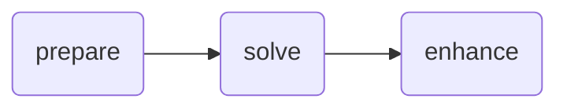

# Getting started

`nextpipe` is a Python framework for modeling and executing decision pipelines.
It allows you to define complex workflows with multiple steps, manage
dependencies between these steps, and integrate with external applications and
solvers.

You can find example workflows among the [community apps][community-apps]. Their
name starts with `python-wf-*` (wf stands for workflow). These examples can be
cloned using the [Nextmv CLI][cli] tool:

```bash
nextmv community clone -a <app-name>
```

## Core Concepts

### Workflows - `FlowSpec`

!!! tip "Reference"

    Find the reference for the `FlowSpec` class [here](../reference/flow.md#nextpipe.flow.FlowSpec).

A Workflow in `nextpipe` represents a complete pipeline or flow. It's defined
as a Python class that extends `FlowSpec`:

```python
from nextpipe import FlowSpec

class Workflow(FlowSpec):
    # Steps defined here
    pass
```

### Steps - `@step`

!!! tip "Reference"

    Find the reference for the `step` decorator [here](../reference/decorators.md#nextpipe.decorators.step).

Steps are the fundamental building blocks of a pipeline. Each step is a
function decorated with `@step`:

```python
@step
def prepare(input: dict):
    """Prepares the data."""
    # Transform input data
    return transformed_data
```

Steps can process data, make API calls, or perform any computation needed in
your pipeline.

### Dependencies - `@needs`

!!! tip "Reference"

    Find the reference for the `needs` decorator [here](../reference/decorators.md#nextpipe.decorators.needs).

Steps can depend on the results of other steps. Use the `@needs` decorator to
specify dependencies:

```python
@needs(predecessors=[prepare])
@step
def process(data: dict):
    """Process prepared data."""
    return processed_data
```

When a step has predecessors, the return values from those predecessors are
automatically passed as parameters to the step function. The parameters must
match the order of the predecessors listed in the `@needs` decorator. For
example:

```python
@step
def step1(input: dict):
    return {"result1": "value1"}

@step
def step2(input: dict):
    return {"result2": "value2"}

@needs(predecessors=[step1, step2])
@step
def process_both(result_from_step1: dict, result_from_step2: dict):
    # result_from_step1 contains {"result1": "value1"}
    # result_from_step2 contains {"result2": "value2"}
    return combined_result
```

### External Applications - `@app`

!!! tip "Reference"

    Find the reference for the `app` decorator [here](../reference/decorators.md#nextpipe.decorators.app).

`nextpipe` can integrate with external Nextmv applications using the `@app`
decorator:

```python
@app(app_id="solver-app")
@needs(predecessors=[prepare])
@step
def solve():
    """Run external solver."""
    pass
```

Note that `@app` steps don't need a function body - the decorator handles
calling the external application.

### Optional Steps - `@optional`

!!! tip "Reference"

    Find the reference for the `optional` decorator [here](../reference/decorators.md#nextpipe.decorators.optional).

The `@optional` decorator allows steps to be conditionally executed based on a
provided condition function:

```python
@optional(condition=lambda step: some_condition)
@step
def conditional_step(data: dict):
    """This step only runs when the condition is True."""
    return processed_data
```

The condition function takes the step as a parameter and should return a boolean
indicating whether the step should be executed.

### Repeated Execution - `@repeat`

!!! tip "Reference"

    Find the reference for the `repeat` decorator [here](../reference/decorators.md#nextpipe.decorators.repeat).

The `@repeat` decorator makes a step execute multiple times:

```python
@repeat(repetitions=3)
@step
def repeated_step(input: dict):
    """This step runs 3 times."""
    return processed_data
```

This is useful when you need to run the same step with different random seeds or
configurations multiple times.

### Parallel Execution - `@foreach`

!!! tip "Reference"

    Find the reference for the `foreach` decorator [here](../reference/decorators.md#nextpipe.decorators.foreach).

The `@foreach` decorator enables dynamic fanout, running a successor step for
each item in a list:

```python
@foreach()
@step
def create_scenarios(data: dict):
    """Create multiple scenarios to solve."""
    return [scenario1, scenario2, scenario3]  # Each will be processed separately
```

### Collecting Results - `@join`

!!! tip "Reference"

    Find the reference for the `join` decorator [here](../reference/decorators.md#nextpipe.decorators.join).

The `@join` decorator collects results from previous steps into a list:

```python
@needs(predecessors=[solve])
@join()
@step
def merge(results: list[dict]):
    """Merge results from multiple executions."""
    return merged_result
```

### Dynamically customizing App Runs

!!! tip "Reference"

    Find the reference for the `AppRunConfig` class [here](../reference/config.md##nextpipe.schema.AppRunConfig).

The `AppRunConfig` class allows you to dynamically customize app runs.
Particularly, when fanning out steps using the `@foreach` decorator, you can
pass a list of `AppRunConfig` objects to specify different configurations for
each run:

```python
from nextpipe.schema import AppRunConfig

@foreach()
@step
def create_scenarios(data: dict):
    """Create multiple scenarios to solve with different configurations."""
    return [
        AppRunConfig(
            name="scenario1",
            input=data,
            options={
                "solve.duration": "5s",
            },
        ),
        AppRunConfig(
            name="scenario2",
            input=data,
            options={
                "solve.duration": "10s",
            },
        ),
    ]

@needs(predecessors=[create_scenarios])
@app(app_id="solver-app")
@step
def solve():
    """Run external solver for each scenario."""
    pass
```

The `AppRunConfig` will be applied to each run of the `solve` step.

## Output & visualization

After running a `nextpipe` program, the output is composed of the following
components:

* `nextpipe` logs detailing the execution of the workflow, and information
  about the workflow diagram. All of this information is printed to `stderr`.
* The actual output of the workflow, printed to `stdout`.

`nextpipe` outputs a Mermaid diagram of the workflow. The diagram is shown as
source and as a link to the rendered diagram.

Consider the following output taken from the [basic example][basic-example]:

```bash
[nextpipe] No application ID or run ID found, uplink is inactive.
[nextpipe] Flow: Workflow
[nextpipe] nextpipe: v0.2.2.dev0
[nextpipe] nextmv: 0.28.0
[nextpipe] Flow graph steps:
[nextpipe] Step:
[nextpipe]   Definition: Step(prepare)
[nextpipe]   Docstring: Prepares the data.
[nextpipe] Step:
[nextpipe]   Definition: Step(solve, StepNeeds(prepare), StepRun(echo, , {}, InputType.JSON, False))
[nextpipe]   Docstring: Runs the model.
[nextpipe] Step:
[nextpipe]   Definition: Step(enhance, StepNeeds(solve))
[nextpipe]   Docstring: Enhances the result.
[nextpipe] Mermaid diagram:
[nextpipe] graph LR
  prepare(prepare)
  prepare --> solve
  solve(solve)
  solve --> enhance
  enhance(enhance)

[nextpipe] Mermaid URL: https://mermaid.ink/svg/Z3JhcGggTFIKICBwcmVwYXJlKHByZXBhcmUpCiAgcHJlcGFyZSAtLT4gc29sdmUKICBzb2x2ZShzb2x2ZSkKICBzb2x2ZSAtLT4gZW5oYW5jZQogIGVuaGFuY2UoZW5oYW5jZSkK?theme=dark
[nextpipe] Running node prepare_0
[nextpipe] Running node solve_0
[nextpipe] Running node enhance_0
{
  "echo": {
    "data": {
      "hello": "world!",
      "prepared": true
    },
    "args": []
  },
  "enhanced": true
}
```

As you can observe from the output, `nextpipe` automatically generates a
Mermaid diagram to visualize the flow structure.



The diagram can be viewed in a browser by following the [link][mermaid-link]
provided in the output. The diagram shows the flow of data between the steps.

[basic-example]: ../examples/basic-chained-workflow.md
[mermaid-link]: https://mermaid.ink/svg/Z3JhcGggTFIKICBwcmVwYXJlKHByZXBhcmUpCiAgcHJlcGFyZSAtLT4gc29sdmUKICBzb2x2ZShzb2x2ZSkKICBzb2x2ZSAtLT4gZW5oYW5jZQogIGVuaGFuY2UoZW5oYW5jZSkK?theme=dark
[community-apps]: https://github.com/nextmv-io/community-apps
[cli]: https://docs.nextmv.io/docs/using-nextmv/setup/install#nextmv-cli
