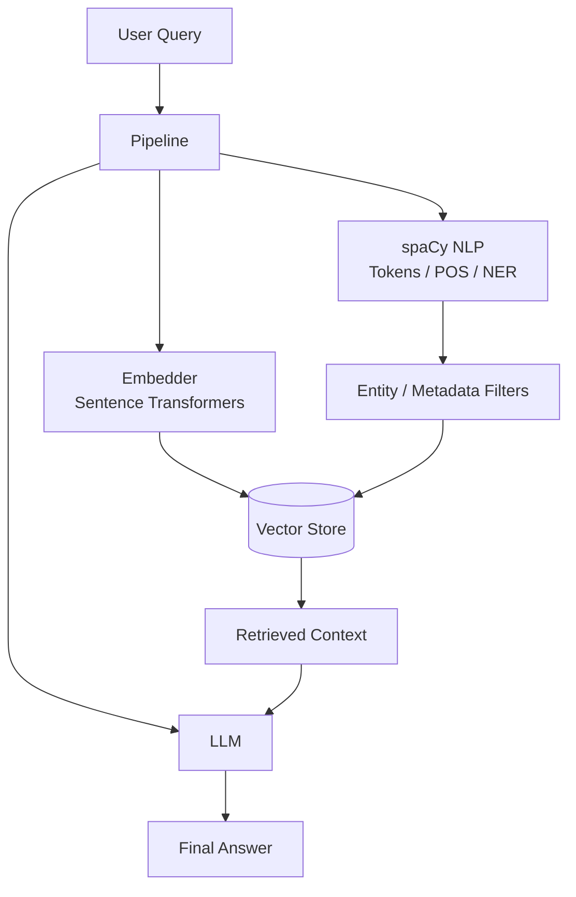

<div align="center">
  
  
  # NLQcat
  
  **Natural Language Question Answering Toolkit**
  
  *Bridging the gap between Linguistic Analysis, Semantic Search, and Generative AI.*

  [](https://pypi.org/project/nlqcat/)
  [](https://opensource.org/licenses/MIT)
  [](https://pypi.org/project/nlqcat/)
  [](https://github.com/psf/black)

</div>

---

## 📖 Overview

**NLQcat** is a production-ready, hybrid NLP + GenAI library designed to unify **classic linguistic analysis** (spaCy) with **modern semantic search** (Vector Databases) and **Large Language Models (LLMs)**. 

Unlike purely generative frameworks, NLQcat offers a grounded approach where linguistic structure (POS tagging, NER) informs and refines semantic retrieval, leading to more accurate and context-aware RAG (Retrieval-Augmented Generation) pipelines.

Whether you are building a local document Q&A bot, a complex semantic search engine, or an intelligent agent, NLQcat provides the modular building blocks to get you there fast.

## ✨ Features

- **🧠 Hybrid Intelligence**: Seamlessly blends symbolic NLP (spaCy) with neural embeddings (SentenceTransformers).
- **🚀 Unified Pipeline**: A single `Pipeline` class to manage ingestion, analysis, retrieval, and generation.
- **🔌 Plug-and-Play Vector Stores**: Integrated support for **ChromaDB**, with extensible interfaces for FAISS and Pinecone.
- **🤖 LLM Agnostic**: Built-in support for **OpenAI** GPT models, with a flexible `LLMBase` for easy integration of HuggingFace or local LLMs.
- **🔍 Deep Linguistic Analysis**: extract entities, linguistic tokens, and POS tags to filter or re-rank semantic search results.
- **🛠️ Production Ready**: Type-hinted, modular architecture designed for scalability and maintainability.

## 📦 Installation

Install NLQcat via pip:

```bash
pip install nlqcat
```

Download the required spaCy model (default):

```bash
python -m spacy download en_core_web_sm
```

## 🚀 Quick Start

Get a RAG pipeline running in 3 lines of code:

```python
from nlqcat.core.pipeline import Pipeline

# 1. Initialize Pipeline with Vector Store (ChromaDB default)
pipe = Pipeline(vector_store_type="chroma")

# 2. Add some knowledge
pipe.add_documents([
    "NLQcat combines linguistic NLP with semantic RAG.",
    "It supports ChromaDB, FAISS, and OpenAI integration."
])

# 3. Ask a question! (Retrieval Only)
result = pipe.query("What does NLQcat support?")
print(result['retrieved_docs'])
```

**Want Generative Answers?** Configure an LLM:

```python
from nlqcat.models.openai_llm import OpenAILLM

# Initialize LLM
llm = OpenAILLM(api_key="your-openai-key")

# Attach to Pipeline
pipe = Pipeline(vector_store_type="chroma", llm=llm)

# Query
answer = pipe.query("Explain NLQcat's architecture.")['answer']
print(answer)
```

## 📚 Full Usage Guide

### 1. The Core Pipeline
The `Pipeline` class is the heart of NLQcat. It orchestrates the flow of data between the NLP analyzer, Vector Store, and LLM.

```python
from nlqcat.core.pipeline import Pipeline

pipe = Pipeline(
    enable_spacy=True,          # Enable linguistic analysis
    vector_store_type="chroma", # 'chroma', 'faiss', 'pinecone' or None
    vector_store_path="./db",   # Persistence path
    llm=my_llm_instance         # Optional LLM instance
)
```

### 2. Working with Vector Stores
NLQcat supports modular vector stores. If you need a specific configuration, instantiate the store directly or let the pipeline handle it.

**Supported Stores:**
- `ChromaStore` (Default, excellent for local dev & prod)
- `FaissStore` (Fast, in-memory)
- `PineconeStore` (Managed cloud vector DB)

```python
# Automatic (Recommended)
pipe = Pipeline(vector_store_type="chroma", vector_store_path="./my_chroma_db")

# Manual
from nlqcat.vector_store.chroma_store import ChromaStore
store = ChromaStore(path="./custom_db")
```

### 3. Linguistic Analysis (NLP)
Access standard spaCy features conveniently through the unified `NLP` class.

```python
# Initialize
pipe = Pipeline(enable_spacy=True)
doc = pipe.nlp.analyze("Apple is looking at buying U.K. startup for $1 billion")

# 1. Tokens & POS Tags
print(doc.tokens)   # ['Apple', 'is', 'looking', ...]
print(doc.pos_tags) # [('Apple', 'PROPN'), ('is', 'AUX'), ...]

# 2. Named Entities (NER)
print(doc.entities) 
# [('Apple', 'ORG'), ('U.K.', 'GPE'), ('$1 billion', 'MONEY')]

# 3. Dependency Parsing
for dep in doc.dependencies:
    print(f"{dep['text']} --[{dep['dep']}]--> {dep['head']}")
```

### 4. Semantic Features & GenAI
NLQcat makes complex semantic operations simple.

#### Embeddings & Similarity
Generate vector embeddings and calculate cosine similarity.

```python
pipe = Pipeline()

# Generate Embeddings
text = "Artificial Intelligence is transforming the world."
emb = pipe.nlp.embed(text)
print(f"Dimensions: {emb.shape}")

# Calculate Similarity
score = pipe.nlp.similarity("I love coding", "Programming is my passion")
print(f"Similarity Score: {score:.4f}") # High score (e.g., 0.85)
```

#### Text Summarization
Built-in abstractive/extractive summarization (defaulting to simple heuristics or configurable models).

```python
long_text = "Deep learning is part of a broader family of machine learning methods..."
summary = pipe.nlp.summarize(long_text)
print(summary)
```

#### Clustering
Cluster sentences based on semantic meaning using K-Means.

```python
sentences = [
    "The cat sits on the mat.", "Dogs are great pets.", # Animals
    "Python is a language.", "Java is verbose."         # Coding
]

clusters = pipe.nlp.cluster(sentences)
# Returns: {0: ['The cat...', 'Dogs...'], 1: ['Python...', 'Java...']}
```

## 🧩 Architecture

The NLQcat architecture follows a clean Layered Pattern:

1.  **Core Layer (`nlqcat.core`)**: Contains the `Pipeline` orchestrator and `RAG` logic.
2.  **Semantic Layer (`nlqcat.semantic`)**: Handles Embeddings (`SentenceTransformers`) and Similarity calculations.
3.  **Vector Store Layer (`nlqcat.vector_store`)**: Adapters for different vector databases.
4.  **Model Layer (`nlqcat.models`)**: Wrappers for LLMs (OpenAI, etc.).



## ⚙️ Configuration

NLQcat respects standard environment variables.

| Variable | Description |
| :--- | :--- |
| `OPENAI_API_KEY` | Required if using `OpenAILLM` without passing key explicitly. |
| `HUGGINGFACE_TOKEN` | Required for some gated HuggingFace models (future support). |

## 🧪 Advanced Concepts

### Custom LLMs
You can plug in *any* LLM by inheriting from `LLMBase`.

```python
from nlqcat.models.llm_base import LLMBase

class MyCustomLLM(LLMBase):
    def generate(self, prompt: str, **kwargs) -> str:
        return "This is a dummy response based on " + prompt

pipe = Pipeline(llm=MyCustomLLM())
```

### Hybrid Filtering (Roadmap)
Future versions will allow using spaCy entities to automatically filter vector search results (e.g., "Show me documents about **Elon Musk**" -> Filter metadata `person="Elon Musk"`).

## ❓ FAQ

**Q: Can I use a different embedding model?**
A: Yes! Modify the `Embedder` class or look out for the upcoming config update allowing custom model names in `Pipeline`.

**Q: Is this thread-safe?**
A: `Pipeline` is generally thread-safe, but be cautious with `ChromaDB`'s SQLite backend in highly concurrent write scenarios.

## 🗺️ Roadmap

- [ ] **v0.2.0**: Integration with LangChain tools.
- [ ] **v0.3.0**: Advanced RAG (HyDE, MMR Re-ranking).
- [ ] **v0.4.0**: Cloud Deployment Blueprints (Docker, AWS Lambda).
- [ ] **Documentation**: Sphinx/MkDocs site generation.

## 🤝 Contributing

We welcome contributions! Please follow these steps:

1.  Fork the repository.
2.  Create a feature branch (`git checkout -b feature/amazing-feature`).
3.  Commit your changes (`git commit -m 'Add amazing feature'`).
4.  Push to the branch (`git push origin feature/amazing-feature`).
5.  Open a Pull Request.

Please ensure you run tests before submitting:
```bash
python -m pytest tests/
```

## 📄 License

Distributed under the **MIT License**. See `LICENSE` for more information.

## 👥 Credits

- **Author**: Anirban Sarkar
- **Maintainer**: AnirbansarkarS

---

<div align="center">
  <sub>Built with ❤️ by Anirban-QuantumCAT.</sub>
</div>
