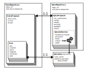

Nx5d API Guide
==============

Although it *does* have some command-line tools to go along
with it, Nx5d in itself is not an application.
It's a framework.
This means that you're intended to write your own code to
incorporate it into your data analysis setup.
To that end, here we impart structural understanding about
Nx5d's primary API elements.

The focus lies on broad strokes about how
"it all comes together". For specific details, see the
[API reference](../api.md) section.
For specific usage examples that you can type along with,
there's an [example section](./examples.md), too.

The main focal points are:

- *where to find* the data: using **Repository** classes.

- *how to load* and sort the data: using **Proposal**, **Scan**
  and **Collection** classes
  
- *how to manage and process* data, respectively spice:
  using recipes and the spice manager.

The following cartoon shows a bird's eye perspective of the
class system that manages the interplay between data and spice.

The most important features, which we'll cover in depth in this section,
are:

- to a certain degree there's a parallel growth between spice and data
  at *repository* level
  
- there is a 1:1 correspondence between spice and data on *proposal*
  level
  
- there is no such correspondence on a scan level; instead, data
  scans have a 1:1 correspondence with dynamically-generated
  spice views.
  
Repositories
------------

This is all about data analysis; and the data has to be *somewhere*.

Defining and/or configuring appropriate **Repository** classes is how
to tell Nx5d where your data and spice
folders are, and how to list the
[proposals](../concepts.md#proposal-collection-of-scans-bound-by-scientific-scope)
therein.
The base class for repositories is `nx5d.repo.base.DataRepositoryBase`.
It is responsible for:

- managing the data URL,

- listing available proposals,

- delegating loading operations to the appropriate [proposal class](#data-proposals).

#### Managing the data URL

To prepare for transparent loading from a variety of sources, Nx5d
preferrably addresses data by means of URLs, e.g.
[file:///home/data/{proposal}/data.h5#{scan}](),
or [s3://data.institute.org/{proposal}/data.zarr/{scan}]().
The repository classes deal with URL formats, not with finished
URLs. Formatting keywords enclosed in {...}-brackets are used to complete
and extract information from URLs or subfolder
listings. Using the keywords `{proposal}` and `{scan}` is part
of the API definition, and most of the correspoding Nx5d code depends
on them: they extract the keys by which the proposals,
respectively their scans are identified on disk.

The base repository class offers the property `.repo_url` to
access the initial URL format.

#### Listing proposals

Nx5d uses two naming schemes for proposals:

- *keys* are the actual string component that's required to
  fully identify the base of a proposal's location (i.e. what
  `{proposal}` will be substituted for). Usually they contain
  numbers and letters, but may also contain any kind of
  special characters (-, /, @, ...)

- *handles* are a beautified version of the same information
  -- i.e. one unique handle for each key. They are required
  to be compatible with Python's naming convention, therefore
  must not contain special characters besides underscore (_),
  and must begin with a letter. Repository keep an internal
  map of handles <-> keys, and they use handles to offer
  comfortable access to proposal instances by means of Python's
  `__dir__()` and `__getitem__()` overloaded operators,
  e.g. automatic discovery and auto-completion in environment
  that support auto-completion (Spyder, IPython, Jupyter, ...)

The repository classes offer API elements to deal with keys and
handles, and to create instances of proposal classes (see below):
the method `.all()` returns a key->handle map (dictionary) to
list all proposals that a repository contains. Similarly,
`.keys()` and `.handles()` return lists of strings containing only
the keys, respectively the handles.

#### Delegating load operations

The repository base class offers the `.proposal()` method.
It is expected to return an instance of an appropriate
[proposal class](#data-proposals),
capable of loading data. To that end
`.proposal()` itself calls the lower-level
`._proposal()` method -- which
needs to be overwritten in custom implementations. The latter
does the *actual* instantiation. They're both defined as part
of the repository API: one for the user to *use*, the other
for the backend developer to *define* repository structure.

#### Available repository classes

Nx5d supports a number of repository implementations out of
the box, possibly more to follow:

- `FsDataRepository` (defined as `nx5d.repo.filesystem.DataRepository`),
  is the most commonly used one. It assumes that repositories
  are folders on a filesystem, and proposals are subfolders or
  files with a proposal-specific name.

- `S3DataRepository` (work in progress) assumes that data
  is saved at an AWS S3 compatible HTTPS location. This is most
  useful for chunked data formats, like Zarr.

- `HttpDataRepository` (planned) wants to access data through
  HTTPS array-like APIs,
  e.g. [Bluesky's Tiled server](https://blueskyproject.io/tiled/).
  
  
#### Dealing with spice

The repository classes are also used for managing spice access.
At its core, spice is data just the same as "real" experimental data.

Although experimental data, and spice data, are often kept
in the same subfolder, Nx5d internally still treats them as
different repositories. There are different environment
variables (`NX5D_DATA_REPO`, respectively `NX5D_SPICE_REPO`)
which govern the location of each.

This is because access to experimental data is strictly
hierarchical (repository -> proposal -> scan -> frame),
while handling of spice diverges at the
proposal level (repository -> proposal -> views and
branches). The main practical difference is that `.proposal()`
methods of a spice repository don't return proposal management
classes; they return classes suitable to spice management instead.

The spice subsystem in `nx5d.spice` therefore spawns its own
repository subclasses, derived from `DataRepositoryBase`:

- `SpiceRepository` the base class for spice work

- `FsSpiceRepository` for loading spice from a folder on a
  filesyste (e.g. [file:///home/data/{proposal}/spice]())

Apart from that, spice repositories are
subject the same considerations as the data repositories. 

Data Proposals
--------------

In analogy to repositories, **Proposal** classes are responsible
for listing available scans and delegating loading to the
the appropriate [scan class](#scans).

### Core responsibilities

Their core API elements of the base class
`nx5d.repo.base.DataProposalBase` are:

- methods for scan listing simliarly to those of a proposal
  (`.all()`, `.keys()`, `.handles()`), subject to the same
  key <-> handle distinction

- `.scan()` a method to return a scan class instance,
  and the corresponding backend abstract method `._scan()`
  to be overwritten by derived classes

- `.recipe()` expected to return a callable (i.e. Python function)
  to cook the data. The default behavior is to look for 
  a spice type "recipes", which is expected to match the
  scan type to a suitable  processing resource, e.g.
  a callable within a user-supplied, locally installed
  Python package.
  
### Available implementations

Although you're free and encouraged to write your own, there are a
number of proposal classes that come pre-packaged with Nx5d.
These are of particular use if your data layout tries to keep
to typical standards and best-practices within your community:

- `FsDataProposal` (a.k.a. `nx5d.repo.filesystem.DataProposal`),
  which tries to locate scans in a subfolder on the local
  filesystem. This is a good starting point e.g. for all
  "do-it-yourself" data formats that store experimental data
  in various ".ini", ".dat", ".numpy" or ".tiff" files
  across the local hard disk.

- `AstorDataProposal` (a.k.a. `nx5d.repo.astor.DataProposal`)
  assumes that data of a complete proposal is stored in an
  array-based backend (e.g. HDF5, Zarr or Tiled) and that
  listing the scans therein is as comfortable as listing
  hierarcy branches of the array.

Scan proposals are fundamentally different and are
[discussed below](#spice-proposals).

Scans
-----

The classes that do the "heavy lifting" in terms of loading and
processing are the **Scans** classes. They are responsible for
obtaining the data from disk, invoking various processing recipes,
and exposing raw and cooked data versions to the user. 
They are also knitting together the experimental data and spice
data of a proposal.

These are the classes the end user (i.e. scientist) is
interacting with most of the time.
To this end the base class `nx5d.repo.base.DataScanBase` is
exposing a number of properties:

- `.type` a string that describes the type of scan,
  unambiguously within the framework of the data
  repository in use; scans of a type have the same
  data and positioners, and are to be analysed/processed
  in the same way. This is essential to determine the
  recipe for data processing.

- `.summary`, a.k.a. "scan metadata": a key-value store
  ("dictionary") of information
  that can be rapidly obtained about the scan. Often building
  the summary is less computing and I/O intensive than doing
  a full-open or full-retrieve of all the scan data.

- `.logbook` a representation of logbook entries associated
  with this particular scan, or point in time during which
  this scan was measured.

- `.raw` the collection of all data that was measured and
  is supposed to remain unchanged; typically, this is in
  some version of "device coordinate system" (angles,
  intensities, distances...). This is an `xarray.Dataset`.

- `.cooked` the cooked data, i.e. result of
  [data cooking](../concepts.md#two-step-processing). This
  is the experimental data transformed into a
  physically more meaningful format as an
  `xarray.Dataset`.

- `.spice` the spice view for this scan. This is typically a
  `nx5d.spice.SpiceView` object.

The scan classes supplied with Nx5d are currently heavily
backend (i.e. beamline) specific. But there appears to be
great uniformization potential, in particular if relying
on an underlying standardized storage format like
[Nexus](https://nexusformat.org/).

To implement a custom scan class on top of the
`DataScanBase` base class (from the `nx5d.repo.base` module),
some crucial methods need to be overridden. Currently
these are:

- `._get_summary()` expected to compile the summary dictionary

- `._get_raw()` expected to load the raw data into an
  `xarray.Dataset`. The dataset needs to hold all data relevant
  for processing, except for spice. It will be passed as-is to
  the processing recipes.
  
- `._get_logentry()` expected to load logbook data. (This is
  currently in a very early planning stage; as of September 2025
  there's no API to programmatically represent log data yet.)

Here some examples of the scan classes currently shipped
with Nx5d out-of-the-box:

- KMC3's `DsFactoryScan` (from the `nx5d.xrd.kmc3` module) relies
  on using an Nx5d data loading abstract, the
  `DatasetFactory`. (This is the closest we currently get to
  a standardized loading interface, there's lot of room for
  improvement)
  
- UDKM's `DataRun` (from the `nx5d.xrd.udkm` module) implements
  a prototype form of a scan for the UDKM group at Uni Potsdam.
  This is soon to be obsolete; however, currently it's still a
  good example of a heavily customized scan API for a local
  and obscure data storage format ;-)

Another scan type, the `StackedDataScan` from the
`nx5d.repo.base` module, deserves in-depth attention.
It started out as a hack to concatenate 
several data scans of the same type into a new, virtual one,
with a type of its own.

This is a useful feature to have when the beamline setup is
systematically broken in a way that can't easily be fixed.
Sometimes what should have been measured and stored in the
raw data as *one* scan over multi-dimensional grid parameters
(e.g. angles, temperature, delay times) is in fact stretched
out over several, manually-triggered scans. Concatenating the
scans into a new one, with a new type, makes it possible to
trigger a different kind of processing recipe.

The puristic and correct answer to such situations would,
of course, be *"fix your darned beamline!"*

But apparently it's... complicated. It turns out that a
disconcerting number of beamlines are "temporarily" broken
this way, including KMC3 at times. This makes it a
*de-facto* normal situation, not an exceptional one -- a
situation that Nx5d aims to offer relief to.
This is why the API contains explicit support for such
an *ad-hoc* data transformation -- and we're using our
own creation, the spice mechanism, to automate this as well
as possible.

Spice Collections And Views
---------------------------

Spice is managed differently.

The entirety of a proposal's spice is a spice **Collection**
Spice is always being introduced, modified, generally *handled*, 
at collection level. This is because one of the major strengths
of the spice concept is the ability to provide useful defaults
-- and this only works at a level *above* individual scans.

Nonetheless, it's for individual scans that spice is required
for processing: we therefore have spice **Views** -- potentially
one for each scan.
The spice view class offers to every scan it's own, customized
access to all of a proposal's spice types: with default data if
not otherwise specified, or with customized values *if* customized
values were stored for this particular (range of) scans.

The responsibility of the `nx5d.spice.SpiceCollection` class
is to hold together an internal representation of the spice tree,
and offer algorithms for traversing, searching and extending the
it:

- `.add()` for registering a new spice entry. This can be a
  seed or an update.
  
- `.view()` generate a view of the proposal's spice tailored
  to a specific viewpoint (i.e. scan).
  
- `.find()`, `.handles()` and `.anchors()` are API elements
  that the typical scientist-user generally won't need;
  nonetheless they are available, and they serve the purpose
  of sifting through the spice tree by various criteria.
  (Note that a "spice handle" is the same as a "spice type".)
  
The `nx5d.spice.SpiceView` class is what every
[data scan class](#scans) receives in order to be able to process
its own raw data. Its API is designed to browse and retrieve
the local spice data:

- `.view_point` returns the view point that was requested in
  the making of this view

- `.data` returns a dicitonary with spice types (or "handles")
  as keys, and the spice data as `BranchView` classes as values

- `.handles()` the spice types (handles) contained in this view,
  this is the same as `.data.keys()`.
  
- the class also overrides `__dir__()` and `__getattr__()` to
  return the corresponding spice branches in a discoverable way.
  
Speaking of which: spice **Branches** are object representation
of a "spice instance", i.e. the data of one spice type for a
specific viewpoint. They are called "branches" because Nx5d's
spice storage backend is an incremental no-delete database:
data is perpetually updated or eventually marked as deleted,
but never removed. Branch views contain the complete history
of a spice type's updates. The typical user doesn't interact
with most of it except in rare cases, e.g. of conflict
management when merging spice updates from different locations.
(This is also a feature of Nx5d: the data is more resilient
to cyberattacks, because accidentally exposing credentials
still doesn't make it possible to destroy data.)

The branch classes offer API for access to:

- spice data, via `.data()` dictionaries or via dynamic
  attributes through `__dir__()` and `__getitem__()` overload,
  
- internal spice metadata like UUIDs and revisions via
  dictionaries supplied in `.meta()`,
  
- additional tasks mostly used by developers of spice management
  systems, e.g. via `.make_update()` for creating spice-update
  objects,
  
- convenient data representaion as Xarray types via `.xr()`.

Spice Proposals
---------------

Spice **Proposals** are fundamentally different from data proposals.
They don't have a designated sub-entity commensurate with
to scans. They aren't even derived from `DataProposalBase`,
but are the starting point of their very own, independent class
hierarchy.

Spice proposals encapsulate **Collection** classes. Both spice
collections and proposals deal with spice at a proposal level.
The difference is that collections deal mostly with *handling*
spice based on its in-memory tree representation, while
proposals encapsulate the main
[spice operations](../concepts.md#editing-spice) on disk
(`.seed()`, `.anchor()`, `.update()` and `.view()`).

In essence, while spice collections are backend-agnostic,
spice *proposals* are inherently backend-dependent.
The spice proposal base class `nx5d.spice.SpiceProposal`
implements the file-format
independent part of the edit operations (though they're
not entirely *backend* agnostic, they still assume a JSON
data structure format!) The actual operations that implement
loading and saving need to be overwritten:

- `.init_collection()` loads the spice data from disk and
  into memory. Users typically never have to access this,
  it's triggered at appropriate times by corresponding layers
  of Nx5d.
  
- `.save()` stores a particular, newly-created spice object
  back into the database.
  
There are some specific implementations:

- `FsSpiceProposal` loads / saves spice into a filesystem-based
  format, as a bunch of JSON files.
  
- `MemorySpiceProposal` has the ability to load "real" spice
  into memory, e.g. from another "template proposal" (for instance
  FsSpiceProposal). But the save operations don't... save.
  Instead, the class just mimics saving spice, while keeping
  the changes in memory only. This is a nice way to test most of
  the spice infrastructure, or to play around with data analysis
  while keeping changes to the spice database local to your Jupyter
  notebook only -- a trick we're using a few times in our tutorials
  ;-) This is also how [slim's](spice-work.md#the-slim-utility)
  "dry-run" mode is implemented.

